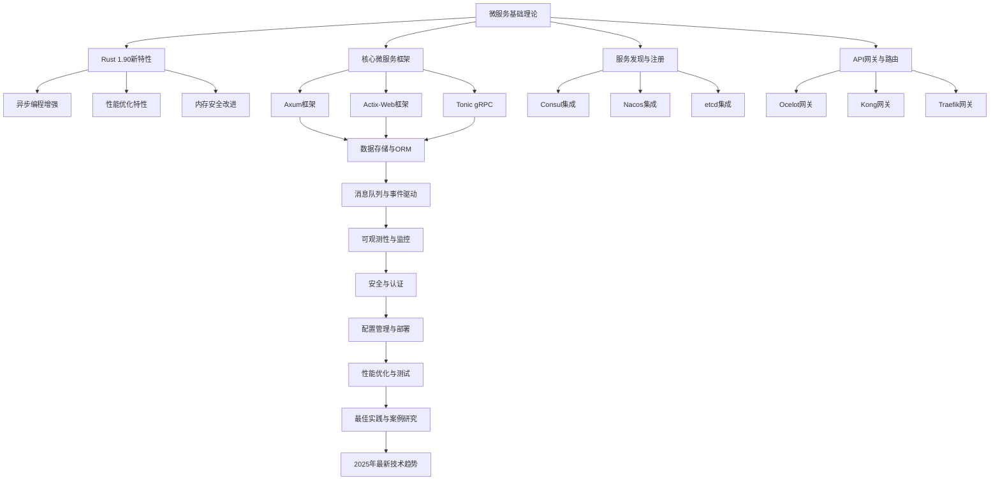
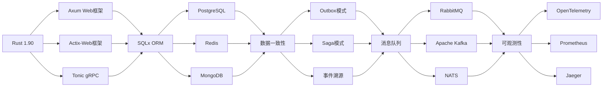
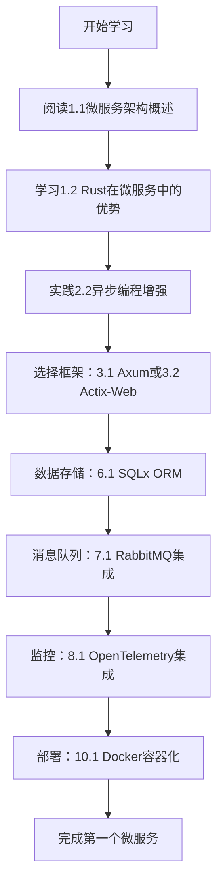
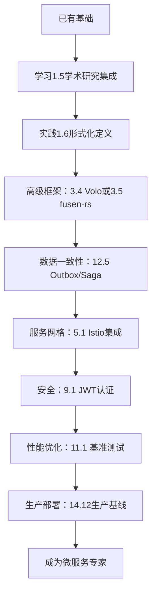
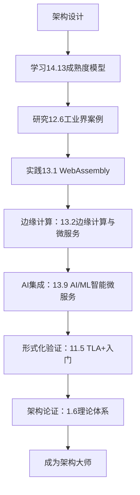

# 14.14 文档交叉引用索引·知识图谱

> 微服务架构文档的完整知识图谱和交叉引用索引

## 📋 目录

- [知识图谱概览](#知识图谱概览)
- [核心概念映射](#核心概念映射)
- [技术栈关联](#技术栈关联)
- [实践路径导航](#实践路径导航)
- [学习路径推荐](#学习路径推荐)
- [快速查找索引](#快速查找索引)

## 知识图谱概览

### 微服务架构知识体系

## 核心概念映射

### 1. 理论基础 → 实践应用

| 理论概念 | 相关文档 | 实践应用 | 代码示例 |
|---------|---------|---------|----------|
| 微服务架构定义 | [1.1 微服务架构概述](./01_微服务基础理论/1.1_微服务架构概述.md) | [12.1 微服务架构设计模式](./12_最佳实践与案例研究/12.1_微服务架构设计模式.md) | `examples/microservice_demo.rs` |
| 服务拆分原则 | [1.3 微服务设计原则](./01_微服务基础理论/1.3_微服务设计原则.md) | [12.6 工业界案例分析](./12_最佳实践与案例研究/12.6_工业界案例分析_Netflix_Uber_Amazon深度剖析.md) | `examples/service_boundary_demo.rs` |
| 数据一致性 | [1.6 微服务架构理论体系](./01_微服务基础理论/1.6_微服务架构理论体系_形式化定义与架构论证.md) | [12.5 数据一致性落地合辑](./12_最佳实践与案例研究/12.5_数据一致性落地合辑_Outbox_Saga_对照.md) | `examples/data_consistency_demo.rs` |
| 容错设计 | [1.5 学术研究集成](./01_微服务基础理论/1.5_学术研究集成_SEI_MIT_Stanford理论.md) | [12.2 错误处理与容错机制](./12_最佳实践与案例研究/12.2_错误处理与容错机制.md) | `examples/circuit_breaker_demo.rs` |

### 2. 技术栈关联图

## 技术栈关联

### 1. 框架选择决策树

| 使用场景 | 推荐框架 | 相关文档 | 性能基准 |
|---------|---------|---------|----------|
| 高并发HTTP API | Axum | [3.1 Axum框架详解](./03_核心微服务框架/3.1_Axum框架详解.md) | `benches/axum_benchmark.rs` |
| 复杂Web应用 | Actix-Web | [3.2 Actix-Web框架详解](./03_核心微服务框架/3.2_Actix_Web框架详解.md) | `benches/actix_benchmark.rs` |
| 高性能gRPC | Tonic | [3.3 Tonic gRPC框架](./03_核心微服务框架/3.3_Tonic_gRPC框架.md) | `benches/grpc_benchmark.rs` |
| 轻量级服务 | Poem | [3.6 Poem框架详解](./03_核心微服务框架/3.6_Poem框架详解.md) | `benches/poem_benchmark.rs` |

### 2. 数据存储选择矩阵

| 数据特性 | 推荐方案 | 相关文档 | 配置示例 |
|---------|---------|---------|----------|
| 关系型数据 | PostgreSQL + SQLx | [6.1 SQLx ORM详解](./06_数据存储与ORM/6.1_SQLx_ORM详解.md) | `examples/sqlx_demo.rs` |
| 缓存数据 | Redis | [6.4 Redis集成](./06_数据存储与ORM/6.4_Redis集成.md) | `examples/redis_demo.rs` |
| 文档数据 | MongoDB | [6.3 MongoDB集成](./06_数据存储与ORM/6.3_MongoDB集成.md) | `examples/mongodb_demo.rs` |
| 时序数据 | InfluxDB | [8.3 指标收集与存储](./08_可观测性与监控/8.3_指标收集与存储.md) | `examples/influxdb_demo.rs` |

## 实践路径导航

### 1. 新手入门路径

### 2. 进阶开发路径

### 3. 架构师路径

## 学习路径推荐

### 1. 按角色分类

#### 开发者路径

1. **基础阶段**（1-2周）
   - [1.1 微服务架构概述](./01_微服务基础理论/1.1_微服务架构概述.md)
   - [2.2 异步编程增强](./02_Rust_1.90_新特性/2.2_异步编程增强.md)
   - [3.1 Axum框架详解](./03_核心微服务框架/3.1_Axum框架详解.md)

2. **实践阶段**（2-4周）
   - [6.1 SQLx ORM详解](./06_数据存储与ORM/6.1_SQLx_ORM详解.md)
   - [7.1 RabbitMQ集成](./07_消息队列与事件驱动/7.1_RabbitMQ集成.md)
   - [8.1 OpenTelemetry集成](./08_可观测性与监控/8.1_OpenTelemetry集成.md)

3. **进阶阶段**（4-8周）
   - [12.5 数据一致性落地合辑](./12_最佳实践与案例研究/12.5_数据一致性落地合辑_Outbox_Saga_对照.md)
   - [11.1 基准测试与性能分析](./11_性能优化与测试/11.1_基准测试与性能分析.md)
   - [14.12 端到端生产基线](./14_参考架构与蓝图/14.12_端到端生产基线_落地索引.md)

#### 架构师路径

1. **理论基础**（2-3周）
   - [1.5 学术研究集成](./01_微服务基础理论/1.5_学术研究集成_SEI_MIT_Stanford理论.md)
   - [1.6 微服务架构理论体系](./01_微服务基础理论/1.6_微服务架构理论体系_形式化定义与架构论证.md)
   - [12.6 工业界案例分析](./12_最佳实践与案例研究/12.6_工业界案例分析_Netflix_Uber_Amazon深度剖析.md)

2. **架构设计**（3-6周）
   - [14.13 微服务成熟度模型](./14_参考架构与蓝图/14.13_微服务成熟度模型_实施路线图.md)
   - [5.1 Istio服务网格](./05_API网关与路由/5.1_Istio服务网格.md)
   - [9.1 JWT认证与授权](./09_安全与认证/9.1_JWT认证与授权.md)

3. **高级实践**（6-12周）
   - [13.1 WebAssembly在微服务中的应用](./13_2025年最新技术趋势/13.1_WebAssembly_在微服务中的应用.md)
   - [11.5 形式化验证TLA+入门](./11_性能优化与测试/11.5_形式化验证_TLA+_入门.md)
   - [14.10 端到端现代微服务蓝图](./14_参考架构与蓝图/14.10_端到端现代微服务蓝图_Rust_1.90.md)

#### 运维工程师路径

1. **基础运维**（1-2周）
   - [10.1 Docker容器化](./10_配置管理与部署/10.1_Docker容器化.md)
   - [10.2 Kubernetes部署](./10_配置管理与部署/10.2_Kubernetes部署.md)
   - [8.2 Prometheus监控](./08_可观测性与监控/8.2_Prometheus监控.md)

2. **高级运维**（2-4周）
   - [8.4 分布式追踪](./08_可观测性与监控/8.4_分布式追踪.md)
   - [10.3 CI/CD流水线](./10_配置管理与部署/10.3_CI_CD流水线.md)
   - [14.11 Gateway API与Istio Ambient](./14_参考架构与蓝图/14.11_Gateway_API_与_Istio_Ambient_落地指南.md)

### 2. 按项目阶段分类

#### 项目启动阶段

- [1.1 微服务架构概述](./01_微服务基础理论/1.1_微服务架构概述.md)
- [1.3 微服务设计原则](./01_微服务基础理论/1.3_微服务设计原则.md)
- [14.13 微服务成熟度模型](./14_参考架构与蓝图/14.13_微服务成熟度模型_实施路线图.md)

#### 技术选型阶段

- [3.1 Axum框架详解](./03_核心微服务框架/3.1_Axum框架详解.md)
- [3.2 Actix-Web框架详解](./03_核心微服务框架/3.2_Actix_Web框架详解.md)
- [6.1 SQLx ORM详解](./06_数据存储与ORM/6.1_SQLx_ORM详解.md)

#### 开发实施阶段

- [7.1 RabbitMQ集成](./07_消息队列与事件驱动/7.1_RabbitMQ集成.md)
- [8.1 OpenTelemetry集成](./08_可观测性与监控/8.1_OpenTelemetry集成.md)
- [9.1 JWT认证与授权](./09_安全与认证/9.1_JWT认证与授权.md)

#### 测试优化阶段

- [11.1 基准测试与性能分析](./11_性能优化与测试/11.1_基准测试与性能分析.md)
- [11.5 形式化验证TLA+入门](./11_性能优化与测试/11.5_形式化验证_TLA+_入门.md)
- [12.5 数据一致性落地合辑](./12_最佳实践与案例研究/12.5_数据一致性落地合辑_Outbox_Saga_对照.md)

#### 部署运维阶段

- [10.1 Docker容器化](./10_配置管理与部署/10.1_Docker容器化.md)
- [10.2 Kubernetes部署](./10_配置管理与部署/10.2_Kubernetes部署.md)
- [14.12 端到端生产基线](./14_参考架构与蓝图/14.12_端到端生产基线_落地索引.md)

## 快速查找索引

### 1. 按技术关键词

| 关键词 | 相关文档 | 代码示例 |
|-------|---------|----------|
| Axum | [3.1 Axum框架详解](./03_核心微服务框架/3.1_Axum框架详解.md) | `examples/axum_demo.rs` |
| Actix-Web | [3.2 Actix-Web框架详解](./03_核心微服务框架/3.2_Actix_Web框架详解.md) | `examples/actix_demo.rs` |
| Tonic | [3.3 Tonic gRPC框架](./03_核心微服务框架/3.3_Tonic_gRPC框架.md) | `examples/tonic_demo.rs` |
| SQLx | [6.1 SQLx ORM详解](./06_数据存储与ORM/6.1_SQLx_ORM详解.md) | `examples/sqlx_demo.rs` |
| Redis | [6.4 Redis集成](./06_数据存储与ORM/6.4_Redis集成.md) | `examples/redis_demo.rs` |
| RabbitMQ | [7.1 RabbitMQ集成](./07_消息队列与事件驱动/7.1_RabbitMQ集成.md) | `examples/rabbitmq_demo.rs` |
| Kafka | [7.2 Apache Kafka集成](./07_消息队列与事件驱动/7.2_Apache_Kafka集成.md) | `examples/kafka_demo.rs` |
| OpenTelemetry | [8.1 OpenTelemetry集成](./08_可观测性与监控/8.1_OpenTelemetry集成.md) | `examples/opentelemetry_demo.rs` |
| Prometheus | [8.2 Prometheus监控](./08_可观测性与监控/8.2_Prometheus监控.md) | `examples/prometheus_demo.rs` |
| JWT | [9.1 JWT认证与授权](./09_安全与认证/9.1_JWT认证与授权.md) | `examples/jwt_demo.rs` |
| Docker | [10.1 Docker容器化](./10_配置管理与部署/10.1_Docker容器化.md) | `docker/` |
| Kubernetes | [10.2 Kubernetes部署](./10_配置管理与部署/10.2_Kubernetes部署.md) | `k8s/` |

### 2. 按问题类型

| 问题类型 | 解决方案文档 | 相关代码 |
|---------|-------------|----------|
| 服务拆分 | [1.3 微服务设计原则](./01_微服务基础理论/1.3_微服务设计原则.md) | `examples/service_boundary_demo.rs` |
| 数据一致性 | [12.5 数据一致性落地合辑](./12_最佳实践与案例研究/12.5_数据一致性落地合辑_Outbox_Saga_对照.md) | `examples/data_consistency_demo.rs` |
| 性能优化 | [11.1 基准测试与性能分析](./11_性能优化与测试/11.1_基准测试与性能分析.md) | `benches/` |
| 容错设计 | [12.2 错误处理与容错机制](./12_最佳实践与案例研究/12.2_错误处理与容错机制.md) | `examples/circuit_breaker_demo.rs` |
| 监控告警 | [8.2 Prometheus监控](./08_可观测性与监控/8.2_Prometheus监控.md) | `examples/monitoring_demo.rs` |
| 安全认证 | [9.1 JWT认证与授权](./09_安全与认证/9.1_JWT认证与授权.md) | `examples/security_demo.rs` |
| 部署运维 | [14.12 端到端生产基线](./14_参考架构与蓝图/14.12_端到端生产基线_落地索引.md) | `scripts/` |

### 3. 按学习目标

| 学习目标 | 推荐文档路径 | 预计时间 |
|---------|-------------|----------|
| 快速上手微服务 | 1.1 → 3.1 → 6.1 → 8.1 | 1-2周 |
| 深入理解架构 | 1.5 → 1.6 → 12.6 → 14.13 | 2-4周 |
| 掌握最佳实践 | 12.1 → 12.5 → 14.12 → 14.10 | 3-6周 |
| 成为架构师 | 1.6 → 11.5 → 13.1 → 14.9 | 6-12周 |
| 运维专家 | 10.1 → 10.2 → 8.2 → 14.11 | 2-4周 |

## 总结

本知识图谱提供了微服务架构文档的完整导航体系：

1. **知识图谱概览**：展示各模块间的关联关系
2. **核心概念映射**：理论到实践的完整映射
3. **技术栈关联**：技术选型的决策支持
4. **实践路径导航**：不同角色的学习路径
5. **学习路径推荐**：按角色和阶段的学习建议
6. **快速查找索引**：按关键词、问题类型、学习目标的快速定位

通过这个知识图谱，读者可以：

- 快速找到所需的技术文档
- 了解技术栈之间的关联关系
- 选择合适的学习路径
- 解决具体的技术问题
- 规划个人技能发展路径

这个知识图谱将随着文档内容的更新而持续完善，为微服务架构的学习和实践提供最佳指导。
