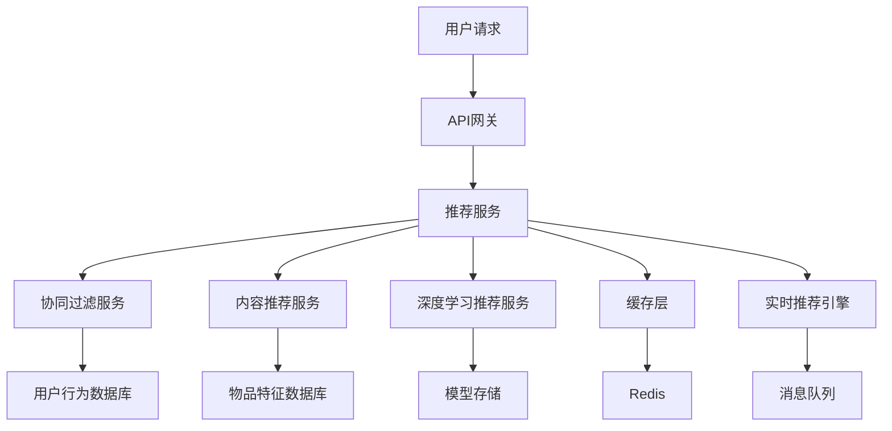

# 推荐系统微服务架构

> 基于Rust 1.90和最新AI技术栈的智能推荐系统开发实践

## 📋 概述

本文档介绍了如何使用Rust构建高性能的推荐系统微服务，包括协同过滤、内容推荐、深度学习推荐等核心算法。结合最新的AI/ML库和微服务架构模式，实现可扩展、高性能的推荐服务。

## 🎯 学习目标

- 理解推荐系统在微服务架构中的应用
- 掌握使用Rust构建推荐服务的核心技术
- 了解推荐算法的实现和优化策略
- 学习推荐系统的性能优化和A/B测试

## 📚 内容大纲

- [推荐系统架构](#推荐系统架构)
- [技术栈选择](#技术栈选择)
- [环境准备](#环境准备)
- [核心推荐算法](#核心推荐算法)
- [协同过滤服务](#协同过滤服务)
- [内容推荐服务](#内容推荐服务)
- [深度学习推荐](#深度学习推荐)
- [实时推荐引擎](#实时推荐引擎)
- [A/B测试框架](#ab测试框架)
- [性能优化](#性能优化)
- [最佳实践](#最佳实践)

## 🔧 基础概念

### 什么是推荐系统

推荐系统是一种信息过滤技术，通过分析用户行为和偏好，为用户推荐可能感兴趣的内容或商品。主要包括：

- **协同过滤**: 基于用户行为相似性的推荐
- **内容推荐**: 基于物品特征相似性的推荐
- **混合推荐**: 结合多种推荐策略
- **深度学习推荐**: 使用神经网络进行推荐
- **实时推荐**: 基于实时用户行为的推荐

### 核心特性

- **个性化**: 为每个用户提供个性化的推荐
- **实时性**: 支持实时推荐和动态更新
- **可扩展**: 支持大规模用户和物品
- **多样性**: 提供多样化的推荐结果
- **可解释性**: 提供推荐理由和解释

## 🛠️ 技术实现

### 推荐系统架构



### 技术栈选择

| 组件 | 技术选择 | 理由 |
|------|----------|------|
| 运行时 | Rust 1.90 | 高性能、内存安全 |
| Web框架 | Axum | 异步、类型安全 |
| ML库 | Candle + Linfa | 纯Rust ML框架 |
| 数据库 | PostgreSQL + ClickHouse | 关系型+时序数据库 |
| 缓存 | Redis | 高速缓存 |
| 消息队列 | RabbitMQ | 异步任务处理 |
| 向量数据库 | Qdrant | 向量相似性搜索 |

### 环境准备

```bash
# 创建项目
cargo new recommendation-system
cd recommendation-system

# 添加核心依赖
cargo add axum = { version = "0.8", features = ["json", "tracing"] }
cargo add candle-core = "0.9"
cargo add candle-nn = "0.9"
cargo add linfa = "0.7"
cargo add linfa-recommendation = "0.7"
cargo add serde = { version = "1.0", features = ["derive"] }
cargo add serde_json = "1.0"
cargo add tokio = { version = "1.0", features = ["full"] }
cargo add tracing = "0.1"
cargo add anyhow = "1.0"
cargo add uuid = { version = "1.0", features = ["v4"] }
cargo add sqlx = { version = "0.8", features = ["postgres", "runtime-tokio-rustls"] }
cargo add redis = { version = "0.32", features = ["tokio-comp", "connection-manager"] }
cargo add lapin = "3.7"
cargo add qdrant-client = "1.0"
```

### 项目结构

```text
recommendation-system/
├── src/
│   ├── main.rs              # 主程序入口
│   ├── recommendation/      # 推荐核心模块
│   │   ├── mod.rs
│   │   ├── collaborative.rs # 协同过滤
│   │   ├── content.rs       # 内容推荐
│   │   ├── deep_learning.rs # 深度学习推荐
│   │   ├── real_time.rs     # 实时推荐
│   │   └── models.rs        # 推荐模型
│   ├── api/                 # API处理模块
│   │   ├── mod.rs
│   │   ├── handlers.rs      # 请求处理器
│   │   └── middleware.rs    # 中间件
│   ├── data/                # 数据处理模块
│   │   ├── mod.rs
│   │   ├── user_behavior.rs # 用户行为数据
│   │   ├── item_features.rs # 物品特征数据
│   │   └── preprocessing.rs # 数据预处理
│   ├── ab_testing/          # A/B测试模块
│   │   ├── mod.rs
│   │   ├── experiment.rs    # 实验管理
│   │   └── metrics.rs       # 指标收集
│   └── utils/               # 工具模块
│       ├── mod.rs
│       └── metrics.rs       # 指标收集
├── models/                  # 预训练模型目录
├── Cargo.toml
└── README.md
```

## 📖 最佳实践

### 1. 推荐算法选择

- **冷启动问题**: 新用户使用内容推荐，新物品使用协同过滤
- **数据稀疏性**: 结合多种算法，使用矩阵分解技术
- **实时性要求**: 实时推荐使用轻量级算法，离线训练复杂模型
- **多样性平衡**: 在准确性和多样性之间找到平衡点

### 2. 性能优化

- **模型缓存**: 将训练好的模型缓存到内存中
- **批量处理**: 批量计算推荐结果，提高吞吐量
- **异步处理**: 使用异步I/O处理大量并发请求
- **向量化计算**: 使用SIMD指令优化数值计算

### 3. A/B测试

- **实验设计**: 设计科学的A/B测试实验
- **指标监控**: 监控点击率、转化率、用户满意度等指标
- **统计显著性**: 确保实验结果具有统计显著性
- **长期影响**: 考虑推荐系统的长期影响

### 4. 数据质量

- **数据清洗**: 清洗异常数据和噪声数据
- **特征工程**: 提取有效的用户和物品特征
- **数据验证**: 验证数据的完整性和一致性
- **隐私保护**: 保护用户隐私数据

## 📊 案例分析

### 案例1: 电商推荐系统

**场景**: 为电商平台构建个性化商品推荐系统。

**实现方案**:
- 使用协同过滤推荐相似用户喜欢的商品
- 使用内容推荐基于商品特征推荐
- 使用深度学习模型学习复杂的用户偏好
- 实现实时推荐和离线推荐

**技术要点**:
- 处理大规模用户和商品数据
- 实时更新用户行为
- 多目标优化（点击率、转化率、多样性）

### 案例2: 内容推荐系统

**场景**: 为内容平台构建个性化内容推荐系统。

**实现方案**:
- 使用内容推荐基于文章特征推荐
- 使用协同过滤推荐相似用户喜欢的内容
- 使用深度学习模型学习用户兴趣
- 实现多轮对话推荐

**技术要点**:
- 处理文本内容和用户行为
- 实时更新用户兴趣
- 内容质量评估

## 🔚 总结与展望

### 总结

- **技术优势**: Rust提供了高性能、内存安全的推荐系统实现
- **架构优势**: 微服务架构支持独立扩展和部署
- **算法完整**: 涵盖了协同过滤、内容推荐、深度学习等核心算法
- **生产就绪**: 包含完整的A/B测试、监控等生产环境必需的功能

### 展望

- **深度学习**: 集成更多深度学习模型，提高推荐准确性
- **多模态推荐**: 支持文本、图像、视频等多模态内容推荐
- **联邦学习**: 实现隐私保护的分布式推荐学习
- **可解释性**: 提供推荐理由和解释

## 📚 参考资料

- [Linfa官方文档](https://rust-ml.github.io/linfa/)
- [Candle官方文档](https://github.com/huggingface/candle)
- [推荐系统实践](https://www.oreilly.com/library/view/programming-collective-intelligence/9780596529321/)
- [深度学习推荐系统](https://www.oreilly.com/library/view/deep-learning-for/9781492043436/)

---

**文档版本**: v1.0  
**创建时间**: 2025-09-27  
**更新时间**: 2025-09-27
