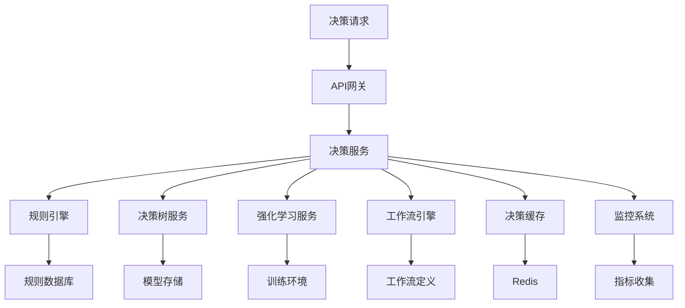

# 智能决策与自动化

> 基于Rust 1.90和最新AI技术栈的智能决策系统开发实践

## 📋 概述

本文档介绍了如何使用Rust构建高性能的智能决策与自动化微服务，包括规则引擎、决策树、强化学习、工作流自动化等核心功能。结合最新的AI/ML库和微服务架构模式，实现可扩展、高性能的智能决策系统。

## 🎯 学习目标

- 理解智能决策系统在微服务架构中的应用
- 掌握使用Rust构建决策服务的核心技术
- 了解决策算法的实现和优化策略
- 学习自动化工作流的设计和实现

## 📚 内容大纲

- [智能决策与自动化](#智能决策与自动化)
  - [📋 概述](#-概述)
  - [🎯 学习目标](#-学习目标)
  - [📚 内容大纲](#-内容大纲)
  - [🔧 基础概念](#-基础概念)
    - [什么是智能决策系统](#什么是智能决策系统)
    - [核心特性](#核心特性)
  - [🛠️ 技术实现](#️-技术实现)
    - [智能决策系统架构](#智能决策系统架构)
    - [技术栈选择](#技术栈选择)
    - [环境准备](#环境准备)
    - [项目结构](#项目结构)
  - [📖 最佳实践](#-最佳实践)
    - [1. 决策算法选择](#1-决策算法选择)
    - [2. 性能优化](#2-性能优化)
    - [3. 工作流设计](#3-工作流设计)
    - [4. 数据质量](#4-数据质量)
  - [📊 案例分析](#-案例分析)
    - [案例1: 智能风控系统](#案例1-智能风控系统)
    - [案例2: 智能调度系统](#案例2-智能调度系统)
  - [🔚 总结与展望](#-总结与展望)
    - [总结](#总结)
    - [展望](#展望)
  - [📚 参考资料](#-参考资料)

## 🔧 基础概念

### 什么是智能决策系统

智能决策系统是一种基于数据和算法的自动化决策系统，能够根据输入数据自动做出最优决策。主要包括：

- **规则引擎**: 基于预定义规则的决策系统
- **决策树**: 基于树状结构的决策模型
- **强化学习**: 基于奖励机制的智能决策
- **工作流自动化**: 自动化业务流程执行
- **智能调度**: 基于优化算法的资源调度

### 核心特性

- **智能化**: 基于AI/ML算法的智能决策
- **自动化**: 减少人工干预，提高效率
- **实时性**: 支持实时决策和响应
- **可扩展**: 支持复杂业务场景的扩展
- **可解释性**: 提供决策理由和解释

## 🛠️ 技术实现

### 智能决策系统架构



### 技术栈选择

| 组件 | 技术选择 | 理由 |
|------|----------|------|
| 运行时 | Rust 1.90 | 高性能、内存安全 |
| Web框架 | Axum | 异步、类型安全 |
| ML库 | Candle + Linfa | 纯Rust ML框架 |
| 规则引擎 | Drools Rust | 规则引擎实现 |
| 数据库 | PostgreSQL | 关系型数据存储 |
| 缓存 | Redis | 高速缓存 |
| 消息队列 | RabbitMQ | 异步任务处理 |
| 工作流引擎 | Temporal | 工作流编排 |

### 环境准备

```bash
# 创建项目
cargo new intelligent-decision-system
cd intelligent-decision-system

# 添加核心依赖
cargo add axum = { version = "0.8", features = ["json", "tracing"] }
cargo add candle-core = "0.9"
cargo add candle-nn = "0.9"
cargo add linfa = "0.7"
cargo add linfa-tree = "0.7"
cargo add serde = { version = "1.0", features = ["derive"] }
cargo add serde_json = "1.0"
cargo add tokio = { version = "1.0", features = ["full"] }
cargo add tracing = "0.1"
cargo add anyhow = "1.0"
cargo add uuid = { version = "1.0", features = ["v4"] }
cargo add sqlx = { version = "0.8", features = ["postgres", "runtime-tokio-rustls"] }
cargo add redis = { version = "0.32", features = ["tokio-comp", "connection-manager"] }
cargo add lapin = "3.7"
cargo add temporal-sdk = "0.1"
```

### 项目结构

```text
intelligent-decision-system/
├── src/
│   ├── main.rs              # 主程序入口
│   ├── decision/            # 决策核心模块
│   │   ├── mod.rs
│   │   ├── rule_engine.rs   # 规则引擎
│   │   ├── decision_tree.rs # 决策树
│   │   ├── reinforcement.rs # 强化学习
│   │   └── models.rs        # 决策模型
│   ├── workflow/            # 工作流模块
│   │   ├── mod.rs
│   │   ├── engine.rs        # 工作流引擎
│   │   ├── activities.rs    # 活动定义
│   │   └── scheduler.rs     # 调度器
│   ├── api/                 # API处理模块
│   │   ├── mod.rs
│   │   ├── handlers.rs      # 请求处理器
│   │   └── middleware.rs    # 中间件
│   └── utils/               # 工具模块
│       ├── mod.rs
│       └── metrics.rs       # 指标收集
├── workflows/               # 工作流定义目录
├── rules/                   # 规则定义目录
├── Cargo.toml
└── README.md
```

## 📖 最佳实践

### 1. 决策算法选择

- **规则引擎**: 适用于明确的业务规则和逻辑
- **决策树**: 适用于分类和回归问题
- **强化学习**: 适用于动态环境和长期优化
- **混合决策**: 结合多种算法提高决策质量

### 2. 性能优化

- **决策缓存**: 缓存常用决策结果，减少计算开销
- **批量处理**: 批量处理决策请求，提高吞吐量
- **异步处理**: 使用异步I/O处理大量并发请求
- **模型优化**: 优化决策模型，提高推理速度

### 3. 工作流设计

- **模块化**: 将复杂业务流程分解为独立模块
- **可配置**: 支持动态配置和调整工作流
- **错误处理**: 实现完善的错误处理和恢复机制
- **监控告警**: 监控工作流执行状态和性能

### 4. 数据质量

- **数据验证**: 验证输入数据的完整性和准确性
- **特征工程**: 提取有效的决策特征
- **数据清洗**: 清洗异常数据和噪声数据
- **隐私保护**: 保护敏感数据隐私

## 📊 案例分析

### 案例1: 智能风控系统

**场景**: 为金融平台构建智能风控决策系统。

**实现方案**:

- 使用规则引擎实现基础风控规则
- 使用决策树模型评估用户信用风险
- 使用强化学习优化风控策略
- 实现实时风控决策和自动化处理

**技术要点**:

- 处理大规模用户数据
- 实时风险评估
- 多维度风险分析

### 案例2: 智能调度系统

**场景**: 为物流平台构建智能调度决策系统。

**实现方案**:

- 使用规则引擎实现基础调度规则
- 使用优化算法优化路径规划
- 使用强化学习学习调度策略
- 实现自动化调度和资源分配

**技术要点**:

- 处理复杂的约束条件
- 实时调度决策
- 多目标优化

## 🔚 总结与展望

### 总结

- **技术优势**: Rust提供了高性能、内存安全的智能决策系统实现
- **架构优势**: 微服务架构支持独立扩展和部署
- **算法完整**: 涵盖了规则引擎、决策树、强化学习等核心算法
- **生产就绪**: 包含完整的工作流自动化、监控等生产环境必需的功能

### 展望

- **深度学习**: 集成更多深度学习模型，提高决策准确性
- **多模态决策**: 支持文本、图像、视频等多模态数据决策
- **联邦学习**: 实现隐私保护的分布式决策学习
- **可解释性**: 提供决策理由和解释

## 📚 参考资料

- [Linfa官方文档](https://rust-ml.github.io/linfa/)
- [Candle官方文档](https://github.com/huggingface/candle)
- [Temporal官方文档](https://docs.temporal.io/)
- [强化学习实践](https://spinningup.openai.com/)

---

**文档版本**: v1.0  
**创建时间**: 2025-09-27  
**更新时间**: 2025-09-27
