# 24.1 分布式追踪与告警系统

## 概述

本指南详细介绍如何在Rust微服务中实现高级监控体系，包括分布式追踪、告警系统和可观测性最佳实践。我们将使用OpenTelemetry、Jaeger、Prometheus和Grafana构建完整的监控解决方案。

## 学习目标

- 掌握分布式追踪系统的设计和实现
- 了解告警系统的架构和配置
- 学习可观测性最佳实践
- 实现自动化监控和告警

## 分布式追踪架构

```mermaid
graph TB
    A[微服务A] --> B[OpenTelemetry SDK]
    C[微服务B] --> D[OpenTelemetry SDK]
    E[微服务C] --> F[OpenTelemetry SDK]
    
    B --> G[OTel Collector]
    D --> G
    F --> G
    
    G --> H[Jaeger]
    G --> I[Prometheus]
    
    H --> J[Grafana Dashboard]
    I --> J
    
    J --> K[AlertManager]
    K --> L[Slack/Email/PagerDuty]
    
    style A fill:#e1f5fe
    style C fill:#e1f5fe
    style E fill:#e1f5fe
    style G fill:#f3e5f5
    style H fill:#e8f5e8
    style I fill:#e8f5e8
    style J fill:#fff3e0
    style K fill:#ffebee
```



## 核心组件

### 1. OpenTelemetry SDK

- 分布式追踪数据收集
- 指标和日志集成
- 自动和手动埋点

### 2. Jaeger

- 分布式追踪存储和查询
- 服务依赖分析
- 性能瓶颈识别

### 3. Prometheus

- 指标收集和存储
- 告警规则定义
- 时间序列数据查询

### 4. Grafana

- 可视化仪表板
- 告警通知管理
- 多数据源集成

## 技术实现

### 环境准备

```bash
# 创建监控目录
mkdir -p monitoring/{jaeger,prometheus,grafana,otel-collector}

# 启动监控服务
docker-compose -f docker-compose.monitoring.yml up -d
```

### 依赖配置

```toml
[dependencies]
opentelemetry = "0.21"
opentelemetry-jaeger = "0.20"
opentelemetry-prometheus = "0.12"
opentelemetry-semantic-conventions = "0.13"
tracing = "0.1"
tracing-opentelemetry = "0.21"
tracing-subscriber = "0.3"
prometheus = "0.13"
tokio = { version = "1.0", features = ["full"] }
axum = "0.7"
```

### 分布式追踪实现

```rust
// src/monitoring/tracing.rs
use opentelemetry::{
    global,
    trace::{TraceContextExt, Tracer},
    KeyValue,
};
use opentelemetry_jaeger::new_agent_pipeline;
use opentelemetry_semantic_conventions::resource;
use tracing::{info, instrument, warn};
use tracing_opentelemetry::OpenTelemetrySpanExt;
use tracing_subscriber::{layer::SubscriberExt, util::SubscriberInitExt};

pub struct TracingConfig {
    pub service_name: String,
    pub jaeger_endpoint: String,
    pub environment: String,
}

impl TracingConfig {
    pub fn new(service_name: String, jaeger_endpoint: String, environment: String) -> Self {
        Self {
            service_name,
            jaeger_endpoint,
            environment,
        }
    }
}

pub async fn init_tracing(config: TracingConfig) -> Result<(), Box<dyn std::error::Error>> {
    // 创建Jaeger tracer
    let tracer = new_agent_pipeline()
        .with_service_name(&config.service_name)
        .with_endpoint(&config.jaeger_endpoint)
        .with_trace_config(
            opentelemetry::trace::config()
                .with_resource(opentelemetry::sdk::Resource::new(vec![
                    KeyValue::new(resource::SERVICE_NAME, config.service_name.clone()),
                    KeyValue::new(resource::SERVICE_VERSION, env!("CARGO_PKG_VERSION")),
                    KeyValue::new(resource::DEPLOYMENT_ENVIRONMENT, config.environment),
                ]))
        )
        .install_simple()?;

    // 设置全局tracer
    global::set_tracer_provider(tracer.provider().unwrap());

    // 初始化tracing subscriber
    tracing_subscriber::registry()
        .with(
            tracing_subscriber::EnvFilter::try_from_default_env()
                .unwrap_or_else(|_| "info".into()),
        )
        .with(tracing_opentelemetry::layer().with_tracer(tracer))
        .init();

    info!("Tracing initialized for service: {}", config.service_name);
    Ok(())
}

#[instrument(skip_all)]
pub async fn trace_http_request<F, Fut, T>(
    method: &str,
    path: &str,
    handler: F,
) -> Result<T, Box<dyn std::error::Error>>
where
    F: FnOnce() -> Fut,
    Fut: std::future::Future<Output = Result<T, Box<dyn std::error::Error>>>,
{
    let span = tracing::info_span!(
        "http_request",
        http.method = method,
        http.url = path,
        http.status_code = tracing::field::Empty
    );
    
    let _enter = span.enter();
    
    match handler().await {
        Ok(result) => {
            span.record("http.status_code", 200);
            Ok(result)
        }
        Err(e) => {
            span.record("http.status_code", 500);
            warn!("Request failed: {}", e);
            Err(e)
        }
    }
}

#[instrument(skip_all)]
pub async fn trace_database_query<F, Fut, T>(
    query: &str,
    handler: F,
) -> Result<T, Box<dyn std::error::Error>>
where
    F: FnOnce() -> Fut,
    Fut: std::future::Future<Output = Result<T, Box<dyn std::error::Error>>>,
{
    let span = tracing::info_span!(
        "database_query",
        db.statement = query,
        db.operation = tracing::field::Empty
    );
    
    let _enter = span.enter();
    
    match handler().await {
        Ok(result) => {
            span.record("db.operation", "SELECT");
            Ok(result)
        }
        Err(e) => {
            span.record("db.operation", "ERROR");
            warn!("Database query failed: {}", e);
            Err(e)
        }
    }
}
```

### 指标收集实现

```rust
// src/monitoring/metrics.rs
use prometheus::{
    Counter, CounterVec, Gauge, GaugeVec, Histogram, HistogramVec, 
    Opts, Registry, TextEncoder,
};
use std::collections::HashMap;
use std::sync::Arc;
use tokio::sync::RwLock;

pub struct MetricsCollector {
    registry: Registry,
    http_requests_total: CounterVec,
    http_request_duration: HistogramVec,
    active_connections: Gauge,
    database_connections: GaugeVec,
    cache_hits: CounterVec,
    cache_misses: CounterVec,
    business_metrics: Arc<RwLock<HashMap<String, Gauge>>>,
}

impl MetricsCollector {
    pub fn new() -> Result<Self, Box<dyn std::error::Error>> {
        let registry = Registry::new();
        
        // HTTP请求指标
        let http_requests_total = CounterVec::new(
            Opts::new("http_requests_total", "Total HTTP requests"),
            &["method", "endpoint", "status"]
        )?;
        
        let http_request_duration = HistogramVec::new(
            Histogram::with_opts(Opts::new("http_request_duration_seconds", "HTTP request duration"))
                .buckets(vec![0.001, 0.005, 0.01, 0.05, 0.1, 0.5, 1.0, 5.0]),
            &["method", "endpoint"]
        )?;
        
        // 连接指标
        let active_connections = Gauge::new("active_connections", "Active connections")?;
        
        let database_connections = GaugeVec::new(
            Opts::new("database_connections", "Database connections"),
            &["database", "status"]
        )?;
        
        // 缓存指标
        let cache_hits = CounterVec::new(
            Opts::new("cache_hits_total", "Cache hits"),
            &["cache_type", "key_pattern"]
        )?;
        
        let cache_misses = CounterVec::new(
            Opts::new("cache_misses_total", "Cache misses"),
            &["cache_type", "key_pattern"]
        )?;
        
        // 注册指标
        registry.register(Box::new(http_requests_total.clone()))?;
        registry.register(Box::new(http_request_duration.clone()))?;
        registry.register(Box::new(active_connections.clone()))?;
        registry.register(Box::new(database_connections.clone()))?;
        registry.register(Box::new(cache_hits.clone()))?;
        registry.register(Box::new(cache_misses.clone()))?;
        
        Ok(Self {
            registry,
            http_requests_total,
            http_request_duration,
            active_connections,
            database_connections,
            cache_hits,
            cache_misses,
            business_metrics: Arc::new(RwLock::new(HashMap::new())),
        })
    }
    
    pub fn record_http_request(&self, method: &str, endpoint: &str, status: u16, duration: f64) {
        self.http_requests_total
            .with_label_values(&[method, endpoint, &status.to_string()])
            .inc();
        
        self.http_request_duration
            .with_label_values(&[method, endpoint])
            .observe(duration);
    }
    
    pub fn update_active_connections(&self, count: i64) {
        self.active_connections.set(count as f64);
    }
    
    pub fn update_database_connections(&self, database: &str, status: &str, count: i64) {
        self.database_connections
            .with_label_values(&[database, status])
            .set(count as f64);
    }
    
    pub fn record_cache_hit(&self, cache_type: &str, key_pattern: &str) {
        self.cache_hits
            .with_label_values(&[cache_type, key_pattern])
            .inc();
    }
    
    pub fn record_cache_miss(&self, cache_type: &str, key_pattern: &str) {
        self.cache_misses
            .with_label_values(&[cache_type, key_pattern])
            .inc();
    }
    
    pub async fn set_business_metric(&self, name: &str, value: f64) {
        let mut metrics = self.business_metrics.write().await;
        if !metrics.contains_key(name) {
            let gauge = Gauge::new(name, &format!("Business metric: {}", name)).unwrap();
            self.registry.register(Box::new(gauge.clone())).unwrap();
            metrics.insert(name.to_string(), gauge);
        }
        if let Some(gauge) = metrics.get(name) {
            gauge.set(value);
        }
    }
    
    pub fn get_metrics(&self) -> Result<String, Box<dyn std::error::Error>> {
        let encoder = TextEncoder::new();
        let metric_families = self.registry.gather();
        Ok(encoder.encode_to_string(&metric_families)?)
    }
}

impl Clone for MetricsCollector {
    fn clone(&self) -> Self {
        Self {
            registry: self.registry.clone(),
            http_requests_total: self.http_requests_total.clone(),
            http_request_duration: self.http_request_duration.clone(),
            active_connections: self.active_connections.clone(),
            database_connections: self.database_connections.clone(),
            cache_hits: self.cache_hits.clone(),
            cache_misses: self.cache_misses.clone(),
            business_metrics: self.business_metrics.clone(),
        }
    }
}
```

### 告警系统实现

```rust
// src/monitoring/alerts.rs
use serde::{Deserialize, Serialize};
use std::collections::HashMap;
use tokio::time::{Duration, Instant};
use tracing::{error, info, warn};

#[derive(Debug, Clone, Serialize, Deserialize)]
pub struct AlertRule {
    pub name: String,
    pub condition: String,
    pub threshold: f64,
    pub duration: Duration,
    pub severity: AlertSeverity,
    pub notification_channels: Vec<String>,
}

#[derive(Debug, Clone, Serialize, Deserialize)]
pub enum AlertSeverity {
    Critical,
    Warning,
    Info,
}

#[derive(Debug, Clone)]
pub struct Alert {
    pub rule_name: String,
    pub message: String,
    pub severity: AlertSeverity,
    pub timestamp: Instant,
    pub metadata: HashMap<String, String>,
}

pub struct AlertManager {
    rules: Vec<AlertRule>,
    active_alerts: HashMap<String, Alert>,
    notification_channels: HashMap<String, Box<dyn NotificationChannel>>,
}

impl AlertManager {
    pub fn new() -> Self {
        Self {
            rules: Vec::new(),
            active_alerts: HashMap::new(),
            notification_channels: HashMap::new(),
        }
    }
    
    pub fn add_rule(&mut self, rule: AlertRule) {
        self.rules.push(rule);
    }
    
    pub fn add_notification_channel(&mut self, name: String, channel: Box<dyn NotificationChannel>) {
        self.notification_channels.insert(name, channel);
    }
    
    pub async fn evaluate_rules(&mut self, metrics: &HashMap<String, f64>) {
        for rule in &self.rules {
            if let Some(value) = metrics.get(&rule.condition) {
                if *value > rule.threshold {
                    self.trigger_alert(rule, *value).await;
                } else {
                    self.resolve_alert(&rule.name).await;
                }
            }
        }
    }
    
    async fn trigger_alert(&mut self, rule: &AlertRule, value: f64) {
        let alert_key = rule.name.clone();
        
        if !self.active_alerts.contains_key(&alert_key) {
            let alert = Alert {
                rule_name: rule.name.clone(),
                message: format!("Alert triggered: {} = {:.2} (threshold: {:.2})", 
                    rule.condition, value, rule.threshold),
                severity: rule.severity.clone(),
                timestamp: Instant::now(),
                metadata: HashMap::new(),
            };
            
            self.active_alerts.insert(alert_key.clone(), alert.clone());
            
            // 发送通知
            for channel_name in &rule.notification_channels {
                if let Some(channel) = self.notification_channels.get(channel_name) {
                    if let Err(e) = channel.send_notification(&alert).await {
                        error!("Failed to send notification via {}: {}", channel_name, e);
                    }
                }
            }
            
            info!("Alert triggered: {}", alert.message);
        }
    }
    
    async fn resolve_alert(&mut self, rule_name: &str) {
        if let Some(alert) = self.active_alerts.remove(rule_name) {
            info!("Alert resolved: {}", alert.message);
        }
    }
}

#[async_trait::async_trait]
pub trait NotificationChannel: Send + Sync {
    async fn send_notification(&self, alert: &Alert) -> Result<(), Box<dyn std::error::Error>>;
}

pub struct SlackNotificationChannel {
    webhook_url: String,
    channel: String,
}

impl SlackNotificationChannel {
    pub fn new(webhook_url: String, channel: String) -> Self {
        Self { webhook_url, channel }
    }
}

#[async_trait::async_trait]
impl NotificationChannel for SlackNotificationChannel {
    async fn send_notification(&self, alert: &Alert) -> Result<(), Box<dyn std::error::Error>> {
        let payload = serde_json::json!({
            "channel": self.channel,
            "text": format!("🚨 {} Alert: {}", 
                match alert.severity {
                    AlertSeverity::Critical => "CRITICAL",
                    AlertSeverity::Warning => "WARNING",
                    AlertSeverity::Info => "INFO",
                },
                alert.message
            ),
            "attachments": [{
                "color": match alert.severity {
                    AlertSeverity::Critical => "danger",
                    AlertSeverity::Warning => "warning",
                    AlertSeverity::Info => "good",
                },
                "fields": [
                    {
                        "title": "Rule",
                        "value": alert.rule_name,
                        "short": true
                    },
                    {
                        "title": "Timestamp",
                        "value": alert.timestamp.elapsed().as_secs().to_string(),
                        "short": true
                    }
                ]
            }]
        });
        
        let client = reqwest::Client::new();
        let response = client
            .post(&self.webhook_url)
            .json(&payload)
            .send()
            .await?;
        
        if !response.status().is_success() {
            return Err(format!("Slack API error: {}", response.status()).into());
        }
        
        Ok(())
    }
}

pub struct EmailNotificationChannel {
    smtp_server: String,
    username: String,
    password: String,
    from: String,
    to: Vec<String>,
}

impl EmailNotificationChannel {
    pub fn new(smtp_server: String, username: String, password: String, from: String, to: Vec<String>) -> Self {
        Self { smtp_server, username, password, from, to }
    }
}

#[async_trait::async_trait]
impl NotificationChannel for EmailNotificationChannel {
    async fn send_notification(&self, alert: &Alert) -> Result<(), Box<dyn std::error::Error>> {
        // 实现邮件发送逻辑
        // 这里可以使用lettre或其他邮件库
        info!("Sending email notification for alert: {}", alert.message);
        Ok(())
    }
}
```

### 监控中间件

```rust
// src/monitoring/middleware.rs
use axum::{
    extract::Request,
    http::{Method, StatusCode},
    middleware::Next,
    response::Response,
};
use std::time::Instant;
use tracing::{info, warn};

pub async fn monitoring_middleware(
    mut request: Request,
    next: Next,
) -> Result<Response, StatusCode> {
    let start_time = Instant::now();
    let method = request.method().clone();
    let path = request.uri().path().to_string();
    
    // 添加请求ID到headers
    let request_id = uuid::Uuid::new_v4().to_string();
    request.headers_mut().insert(
        "x-request-id",
        request_id.parse().unwrap(),
    );
    
    let response = next.run(request).await;
    let duration = start_time.elapsed();
    let status = response.status();
    
    // 记录请求指标
    if status.is_success() {
        info!(
            "HTTP {} {} - {}ms - {}",
            method,
            path,
            duration.as_millis(),
            status
        );
    } else {
        warn!(
            "HTTP {} {} - {}ms - {}",
            method,
            path,
            duration.as_millis(),
            status
        );
    }
    
    Ok(response)
}
```

## 最佳实践

### 1. 监控策略

- **分层监控**: 基础设施、应用、业务三层监控
- **关键指标**: 延迟、吞吐量、错误率、可用性
- **告警规则**: 基于SLA的告警阈值设置

### 2. 性能优化

- **采样策略**: 根据流量调整采样率
- **数据压缩**: 减少网络传输开销
- **缓存策略**: 合理使用缓存减少重复计算

### 3. 安全考虑

- **数据脱敏**: 敏感信息不记录到日志
- **访问控制**: 监控数据访问权限管理
- **加密传输**: 监控数据传输加密

### 4. 运维管理

- **自动化部署**: 监控配置自动化部署
- **版本管理**: 监控规则版本控制
- **故障恢复**: 监控系统故障恢复机制

## 部署配置

### Docker Compose配置

```yaml
# docker-compose.monitoring.yml
version: '3.8'

services:
  jaeger:
    image: jaegertracing/all-in-one:1.50
    ports:
      - "16686:16686"
      - "14268:14268"
    environment:
      - COLLECTOR_OTLP_ENABLED=true
    networks:
      - monitoring

  prometheus:
    image: prom/prometheus:latest
    ports:
      - "9090:9090"
    volumes:
      - ./prometheus.yml:/etc/prometheus/prometheus.yml
    command:
      - '--config.file=/etc/prometheus/prometheus.yml'
      - '--storage.tsdb.path=/prometheus'
      - '--web.console.libraries=/etc/prometheus/console_libraries'
      - '--web.console.templates=/etc/prometheus/consoles'
      - '--web.enable-lifecycle'
    networks:
      - monitoring

  grafana:
    image: grafana/grafana:latest
    ports:
      - "3000:3000"
    environment:
      - GF_SECURITY_ADMIN_PASSWORD=admin
    volumes:
      - grafana-storage:/var/lib/grafana
      - ./grafana/provisioning:/etc/grafana/provisioning
    networks:
      - monitoring

  alertmanager:
    image: prom/alertmanager:latest
    ports:
      - "9093:9093"
    volumes:
      - ./alertmanager.yml:/etc/alertmanager/alertmanager.yml
    networks:
      - monitoring

  otel-collector:
    image: otel/opentelemetry-collector-contrib:latest
    ports:
      - "4317:4317"
      - "4318:4318"
    volumes:
      - ./otel-collector-config.yml:/etc/otelcol-contrib/otel-collector-config.yml
    command: ["--config=/etc/otelcol-contrib/otel-collector-config.yml"]
    networks:
      - monitoring

volumes:
  grafana-storage:

networks:
  monitoring:
    driver: bridge
```

### Prometheus配置

```yaml
# prometheus.yml
global:
  scrape_interval: 15s
  evaluation_interval: 15s

rule_files:
  - "alert_rules.yml"

alerting:
  alertmanagers:
    - static_configs:
        - targets:
          - alertmanager:9093

scrape_configs:
  - job_name: 'microservices'
    static_configs:
      - targets: ['microservice:8080']
    metrics_path: '/metrics'
    scrape_interval: 5s

  - job_name: 'jaeger'
    static_configs:
      - targets: ['jaeger:14269']
    metrics_path: '/metrics'
    scrape_interval: 15s
```

### 告警规则配置

```yaml
# alert_rules.yml
groups:
  - name: microservices
    rules:
      - alert: HighErrorRate
        expr: rate(http_requests_total{status=~"5.."}[5m]) > 0.1
        for: 2m
        labels:
          severity: critical
        annotations:
          summary: "High error rate detected"
          description: "Error rate is {{ $value }} errors per second"

      - alert: HighLatency
        expr: histogram_quantile(0.95, rate(http_request_duration_seconds_bucket[5m])) > 1
        for: 5m
        labels:
          severity: warning
        annotations:
          summary: "High latency detected"
          description: "95th percentile latency is {{ $value }} seconds"

      - alert: ServiceDown
        expr: up == 0
        for: 1m
        labels:
          severity: critical
        annotations:
          summary: "Service is down"
          description: "Service {{ $labels.instance }} is down"
```

## 性能测试

### 监控性能测试

```rust
// benches/monitoring_benchmark.rs
use criterion::{black_box, criterion_group, criterion_main, Criterion};
use microservice::monitoring::{MetricsCollector, TracingConfig, init_tracing};

fn benchmark_metrics_collection(c: &mut Criterion) {
    let metrics_collector = MetricsCollector::new().unwrap();
    
    c.bench_function("metrics_collection", |b| {
        b.iter(|| {
            metrics_collector.record_http_request(
                black_box("GET"),
                black_box("/api/users"),
                black_box(200),
                black_box(0.1),
            );
        })
    });
}

fn benchmark_tracing_overhead(c: &mut Criterion) {
    let rt = tokio::runtime::Runtime::new().unwrap();
    let config = TracingConfig::new(
        "benchmark".to_string(),
        "http://localhost:14268/api/traces".to_string(),
        "test".to_string(),
    );
    
    rt.block_on(init_tracing(config)).unwrap();
    
    c.bench_function("tracing_overhead", |b| {
        b.iter(|| {
            let _span = tracing::info_span!("benchmark_span");
            let _enter = _span.enter();
            black_box(42)
        })
    });
}

criterion_group!(benches, benchmark_metrics_collection, benchmark_tracing_overhead);
criterion_main!(benches);
```

## 总结

本指南详细介绍了如何在Rust微服务中实现高级监控体系，包括：

1. **分布式追踪**: 使用OpenTelemetry和Jaeger实现完整的请求链路追踪
2. **指标收集**: 使用Prometheus收集和存储各种性能指标
3. **告警系统**: 实现基于规则的告警和多种通知渠道
4. **可视化**: 使用Grafana创建监控仪表板
5. **最佳实践**: 监控策略、性能优化、安全考虑和运维管理

通过这套完整的监控体系，可以实现对微服务系统的全面可观测性，及时发现和解决性能问题，确保系统的高可用性和稳定性。
