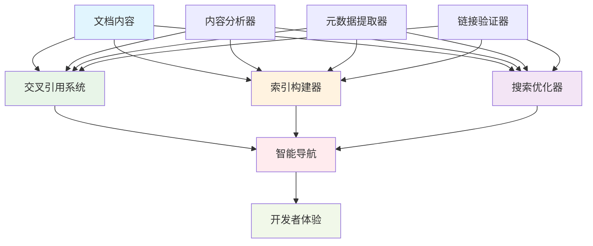

# 26.1 文档深度优化指南

## 概述

本指南详细介绍如何对微服务文档体系进行深度优化，包括交叉引用、索引构建、搜索优化和开发者体验提升。通过系统性的优化，我们将建立一个更加易用、高效和智能的文档系统。

## 学习目标

- 掌握文档交叉引用的设计和实现
- 了解文档索引和搜索优化策略
- 学习开发者体验提升方法
- 实现智能文档导航系统

## 文档优化架构



## 核心组件

### 1. 交叉引用系统

- **智能链接**: 自动生成相关文档链接
- **上下文感知**: 基于内容的相关性分析
- **动态更新**: 自动维护链接的有效性

### 2. 索引构建器

- **全文索引**: 支持快速内容搜索
- **标签索引**: 基于标签的分类搜索
- **概念索引**: 基于概念的知识图谱

### 3. 搜索优化器

- **语义搜索**: 基于语义的智能搜索
- **模糊匹配**: 支持拼写错误和同义词
- **结果排序**: 基于相关性的智能排序

## 技术实现

### 环境准备

```bash
# 创建文档优化目录
mkdir -p docs/26_文档优化与开发者体验
mkdir -p scripts/documentation
mkdir -p tools/indexer
mkdir -p tools/search
```

### 依赖配置

```toml
[dependencies]
serde = { version = "1.0", features = ["derive"] }
serde_json = "1.0"
regex = "1.0"
walkdir = "2.0"
pulldown-cmark = "0.10"
tantivy = "0.21"
meilisearch = "0.30"
tokio = { version = "1.0", features = ["full"] }
clap = { version = "4.0", features = ["derive"] }
```

### 交叉引用系统实现

```rust
// tools/indexer/cross_reference.rs
use serde::{Deserialize, Serialize};
use std::collections::{HashMap, HashSet};
use std::path::{Path, PathBuf};
use regex::Regex;
use walkdir::WalkDir;

#[derive(Debug, Clone, Serialize, Deserialize)]
pub struct DocumentReference {
    pub source_path: PathBuf,
    pub target_path: PathBuf,
    pub reference_type: ReferenceType,
    pub context: String,
    pub confidence: f64,
}

#[derive(Debug, Clone, Serialize, Deserialize)]
pub enum ReferenceType {
    DirectLink,      // 直接链接
    ConceptLink,     // 概念关联
    RelatedContent,  // 相关内容
    Dependency,      // 依赖关系
    Example,         // 示例代码
}

#[derive(Debug, Clone, Serialize, Deserialize)]
pub struct DocumentMetadata {
    pub path: PathBuf,
    pub title: String,
    pub description: String,
    pub tags: Vec<String>,
    pub concepts: Vec<String>,
    pub dependencies: Vec<String>,
    pub examples: Vec<String>,
    pub last_modified: chrono::DateTime<chrono::Utc>,
}

pub struct CrossReferenceEngine {
    documents: HashMap<PathBuf, DocumentMetadata>,
    references: Vec<DocumentReference>,
    concept_map: HashMap<String, Vec<PathBuf>>,
    dependency_graph: HashMap<PathBuf, Vec<PathBuf>>,
}

impl CrossReferenceEngine {
    pub fn new() -> Self {
        Self {
            documents: HashMap::new(),
            references: Vec::new(),
            concept_map: HashMap::new(),
            dependency_graph: HashMap::new(),
        }
    }
    
    pub async fn build_index(&mut self, docs_path: &Path) -> Result<(), Box<dyn std::error::Error>> {
        println!("开始构建文档索引...");
        
        // 扫描所有文档
        for entry in WalkDir::new(docs_path)
            .into_iter()
            .filter_map(|e| e.ok())
            .filter(|e| e.path().extension().map_or(false, |ext| ext == "md"))
        {
            let path = entry.path();
            let metadata = self.extract_metadata(path).await?;
            self.documents.insert(path.to_path_buf(), metadata);
        }
        
        // 构建交叉引用
        self.build_cross_references().await?;
        
        // 构建概念映射
        self.build_concept_map().await?;
        
        // 构建依赖图
        self.build_dependency_graph().await?;
        
        println!("文档索引构建完成，共处理 {} 个文档", self.documents.len());
        Ok(())
    }
    
    async fn extract_metadata(&self, path: &Path) -> Result<DocumentMetadata, Box<dyn std::error::Error>> {
        let content = tokio::fs::read_to_string(path).await?;
        let title = self.extract_title(&content);
        let description = self.extract_description(&content);
        let tags = self.extract_tags(&content);
        let concepts = self.extract_concepts(&content);
        let dependencies = self.extract_dependencies(&content);
        let examples = self.extract_examples(&content);
        
        let metadata = tokio::fs::metadata(path).await?;
        let last_modified = metadata.modified()?.into();
        
        Ok(DocumentMetadata {
            path: path.to_path_buf(),
            title,
            description,
            tags,
            concepts,
            dependencies,
            examples,
            last_modified,
        })
    }
    
    fn extract_title(&self, content: &str) -> String {
        let re = Regex::new(r"^#\s+(.+)$").unwrap();
        if let Some(caps) = re.captures(content) {
            caps[1].to_string()
        } else {
            "未命名文档".to_string()
        }
    }
    
    fn extract_description(&self, content: &str) -> String {
        let re = Regex::new(r"##\s+概述\s*\n\n(.+?)(?:\n\n|$)").unwrap();
        if let Some(caps) = re.captures(content) {
            caps[1].to_string()
        } else {
            "暂无描述".to_string()
        }
    }
    
    fn extract_tags(&self, content: &str) -> Vec<String> {
        let re = Regex::new(r"<!--\s*tags:\s*(.+?)\s*-->").unwrap();
        if let Some(caps) = re.captures(content) {
            caps[1].split(',').map(|s| s.trim().to_string()).collect()
        } else {
            Vec::new()
        }
    }
    
    fn extract_concepts(&self, content: &str) -> Vec<String> {
        let mut concepts = Vec::new();
        
        // 提取技术概念
        let tech_re = Regex::new(r"\b(Rust|微服务|Kubernetes|Docker|gRPC|HTTP|JSON|YAML|TLS|JWT|OAuth|Prometheus|Grafana|Jaeger|OpenTelemetry)\b").unwrap();
        for cap in tech_re.captures_iter(content) {
            concepts.push(cap[1].to_string());
        }
        
        // 提取架构概念
        let arch_re = Regex::new(r"\b(API网关|服务发现|负载均衡|断路器|事件驱动|CQRS|Saga|DDD)\b").unwrap();
        for cap in arch_re.captures_iter(content) {
            concepts.push(cap[1].to_string());
        }
        
        concepts.sort();
        concepts.dedup();
        concepts
    }
    
    fn extract_dependencies(&self, content: &str) -> Vec<String> {
        let mut dependencies = Vec::new();
        
        // 提取代码依赖
        let dep_re = Regex::new(r"```toml\s*\[dependencies\]\s*(.+?)\s*```").unwrap();
        if let Some(caps) = dep_re.captures(content) {
            let deps_content = &caps[1];
            let crate_re = Regex::new(r"(\w+)\s*=").unwrap();
            for cap in crate_re.captures_iter(deps_content) {
                dependencies.push(cap[1].to_string());
            }
        }
        
        dependencies.sort();
        dependencies.dedup();
        dependencies
    }
    
    fn extract_examples(&self, content: &str) -> Vec<String> {
        let mut examples = Vec::new();
        
        // 提取代码示例
        let code_re = Regex::new(r"```rust\s*(.+?)\s*```").unwrap();
        for cap in code_re.captures_iter(content) {
            examples.push(cap[1].to_string());
        }
        
        examples
    }
    
    async fn build_cross_references(&mut self) -> Result<(), Box<dyn std::error::Error>> {
        println!("构建交叉引用...");
        
        for (source_path, source_meta) in &self.documents {
            // 基于概念相似性构建引用
            for (target_path, target_meta) in &self.documents {
                if source_path == target_path {
                    continue;
                }
                
                let similarity = self.calculate_similarity(source_meta, target_meta);
                if similarity > 0.3 {
                    let reference = DocumentReference {
                        source_path: source_path.clone(),
                        target_path: target_path.clone(),
                        reference_type: ReferenceType::RelatedContent,
                        context: format!("概念相似性: {:.2}", similarity),
                        confidence: similarity,
                    };
                    self.references.push(reference);
                }
            }
        }
        
        println!("构建了 {} 个交叉引用", self.references.len());
        Ok(())
    }
    
    fn calculate_similarity(&self, source: &DocumentMetadata, target: &DocumentMetadata) -> f64 {
        let mut score = 0.0;
        
        // 基于标签相似性
        let source_tags: HashSet<_> = source.tags.iter().collect();
        let target_tags: HashSet<_> = target.tags.iter().collect();
        let tag_intersection = source_tags.intersection(&target_tags).count();
        let tag_union = source_tags.union(&target_tags).count();
        if tag_union > 0 {
            score += (tag_intersection as f64 / tag_union as f64) * 0.3;
        }
        
        // 基于概念相似性
        let source_concepts: HashSet<_> = source.concepts.iter().collect();
        let target_concepts: HashSet<_> = target.concepts.iter().collect();
        let concept_intersection = source_concepts.intersection(&target_concepts).count();
        let concept_union = source_concepts.union(&target_concepts).count();
        if concept_union > 0 {
            score += (concept_intersection as f64 / concept_union as f64) * 0.4;
        }
        
        // 基于依赖相似性
        let source_deps: HashSet<_> = source.dependencies.iter().collect();
        let target_deps: HashSet<_> = target.dependencies.iter().collect();
        let dep_intersection = source_deps.intersection(&target_deps).count();
        let dep_union = source_deps.union(&target_deps).count();
        if dep_union > 0 {
            score += (dep_intersection as f64 / dep_union as f64) * 0.3;
        }
        
        score
    }
    
    async fn build_concept_map(&mut self) -> Result<(), Box<dyn std::error::Error>> {
        println!("构建概念映射...");
        
        for (path, metadata) in &self.documents {
            for concept in &metadata.concepts {
                self.concept_map
                    .entry(concept.clone())
                    .or_insert_with(Vec::new)
                    .push(path.clone());
            }
        }
        
        println!("构建了 {} 个概念映射", self.concept_map.len());
        Ok(())
    }
    
    async fn build_dependency_graph(&mut self) -> Result<(), Box<dyn std::error::Error>> {
        println!("构建依赖图...");
        
        for (path, metadata) in &self.documents {
            let mut dependencies = Vec::new();
            
            for dep in &metadata.dependencies {
                // 查找包含此依赖的文档
                for (other_path, other_meta) in &self.documents {
                    if other_path != path && other_meta.dependencies.contains(dep) {
                        dependencies.push(other_path.clone());
                    }
                }
            }
            
            if !dependencies.is_empty() {
                self.dependency_graph.insert(path.clone(), dependencies);
            }
        }
        
        println!("构建了 {} 个依赖关系", self.dependency_graph.len());
        Ok(())
    }
    
    pub fn generate_cross_reference_markdown(&self, output_path: &Path) -> Result<(), Box<dyn std::error::Error>> {
        let mut content = String::new();
        
        content.push_str("# 文档交叉引用索引\n\n");
        content.push_str("本文档自动生成，包含所有文档之间的交叉引用关系。\n\n");
        
        // 按文档分组显示引用
        let mut doc_refs: HashMap<PathBuf, Vec<&DocumentReference>> = HashMap::new();
        for ref_ in &self.references {
            doc_refs.entry(ref_.source_path.clone()).or_insert_with(Vec::new).push(ref_);
        }
        
        for (source_path, refs) in doc_refs {
            if let Some(source_meta) = self.documents.get(&source_path) {
                content.push_str(&format!("## {}\n\n", source_meta.title));
                content.push_str(&format!("**路径**: `{}`\n\n", source_path.display()));
                content.push_str(&format!("**描述**: {}\n\n", source_meta.description));
                
                if !refs.is_empty() {
                    content.push_str("### 相关文档\n\n");
                    for ref_ in refs {
                        if let Some(target_meta) = self.documents.get(&ref_.target_path) {
                            content.push_str(&format!(
                                "- [{}]({}) - {}\n",
                                target_meta.title,
                                ref_.target_path.display(),
                                ref_.context
                            ));
                        }
                    }
                    content.push_str("\n");
                }
            }
        }
        
        std::fs::write(output_path, content)?;
        Ok(())
    }
    
    pub fn generate_concept_index(&self, output_path: &Path) -> Result<(), Box<dyn std::error::Error>> {
        let mut content = String::new();
        
        content.push_str("# 概念索引\n\n");
        content.push_str("本文档包含所有技术概念及其相关文档的索引。\n\n");
        
        let mut concepts: Vec<_> = self.concept_map.keys().collect();
        concepts.sort();
        
        for concept in concepts {
            content.push_str(&format!("## {}\n\n", concept));
            
            if let Some(docs) = self.concept_map.get(concept) {
                for doc_path in docs {
                    if let Some(meta) = self.documents.get(doc_path) {
                        content.push_str(&format!(
                            "- [{}]({}) - {}\n",
                            meta.title,
                            doc_path.display(),
                            meta.description
                        ));
                    }
                }
            }
            content.push_str("\n");
        }
        
        std::fs::write(output_path, content)?;
        Ok(())
    }
}
```

### 搜索优化器实现

```rust
// tools/search/search_engine.rs
use tantivy::collector::TopDocs;
use tantivy::query::QueryParser;
use tantivy::schema::*;
use tantivy::{Index, IndexWriter, ReloadPolicy};
use std::path::Path;
use serde::{Deserialize, Serialize};

#[derive(Debug, Clone, Serialize, Deserialize)]
pub struct SearchResult {
    pub title: String,
    pub path: String,
    pub snippet: String,
    pub score: f32,
    pub tags: Vec<String>,
    pub concepts: Vec<String>,
}

pub struct DocumentSearchEngine {
    index: Index,
    schema: Schema,
}

impl DocumentSearchEngine {
    pub fn new(index_path: &Path) -> Result<Self, Box<dyn std::error::Error>> {
        let mut schema_builder = Schema::builder();
        
        // 定义字段
        let title_field = schema_builder.add_text_field("title", TEXT | STORED);
        let content_field = schema_builder.add_text_field("content", TEXT);
        let path_field = schema_builder.add_text_field("path", STRING | STORED);
        let tags_field = schema_builder.add_text_field("tags", TEXT);
        let concepts_field = schema_builder.add_text_field("concepts", TEXT);
        let description_field = schema_builder.add_text_field("description", TEXT);
        
        let schema = schema_builder.build();
        
        let index = if index_path.exists() {
            Index::open_in_dir(index_path)?
        } else {
            std::fs::create_dir_all(index_path)?;
            Index::create_in_dir(index_path, schema.clone())?
        };
        
        Ok(Self { index, schema })
    }
    
    pub fn index_documents(&self, documents: &[DocumentMetadata]) -> Result<(), Box<dyn std::error::Error>> {
        let mut index_writer: IndexWriter = self.index.writer(50_000_000)?;
        
        for doc in documents {
            let mut doc_builder = tantivy::Document::default();
            
            // 添加字段
            doc_builder.add_text(self.schema.get_field("title")?, &doc.title);
            doc_builder.add_text(self.schema.get_field("path")?, &doc.path.to_string_lossy());
            doc_builder.add_text(self.schema.get_field("tags")?, &doc.tags.join(" "));
            doc_builder.add_text(self.schema.get_field("concepts")?, &doc.concepts.join(" "));
            doc_builder.add_text(self.schema.get_field("description")?, &doc.description);
            
            // 读取并添加内容
            if let Ok(content) = std::fs::read_to_string(&doc.path) {
                doc_builder.add_text(self.schema.get_field("content")?, &content);
            }
            
            index_writer.add_document(doc_builder)?;
        }
        
        index_writer.commit()?;
        Ok(())
    }
    
    pub fn search(&self, query: &str, limit: usize) -> Result<Vec<SearchResult>, Box<dyn std::error::Error>> {
        let reader = self.index.reader()?;
        let searcher = reader.searcher();
        
        let title_field = self.schema.get_field("title")?;
        let content_field = self.schema.get_field("content")?;
        let path_field = self.schema.get_field("path")?;
        let tags_field = self.schema.get_field("tags")?;
        let concepts_field = self.schema.get_field("concepts")?;
        
        let query_parser = QueryParser::for_index(&self.index, vec![title_field, content_field, tags_field, concepts_field]);
        let query = query_parser.parse_query(query)?;
        
        let top_docs = searcher.search(&query, &TopDocs::with_limit(limit))?;
        
        let mut results = Vec::new();
        for (score, doc_address) in top_docs {
            let retrieved_doc = searcher.doc(doc_address)?;
            
            let title = retrieved_doc.get_first(title_field)
                .and_then(|v| v.as_text())
                .unwrap_or("")
                .to_string();
            
            let path = retrieved_doc.get_first(path_field)
                .and_then(|v| v.as_text())
                .unwrap_or("")
                .to_string();
            
            let tags: Vec<String> = retrieved_doc.get_all(tags_field)
                .filter_map(|v| v.as_text())
                .flat_map(|s| s.split_whitespace())
                .map(|s| s.to_string())
                .collect();
            
            let concepts: Vec<String> = retrieved_doc.get_all(concepts_field)
                .filter_map(|v| v.as_text())
                .flat_map(|s| s.split_whitespace())
                .map(|s| s.to_string())
                .collect();
            
            // 生成摘要
            let snippet = self.generate_snippet(&retrieved_doc, content_field, query)?;
            
            results.push(SearchResult {
                title,
                path,
                snippet,
                score,
                tags,
                concepts,
            });
        }
        
        Ok(results)
    }
    
    fn generate_snippet(&self, doc: &tantivy::Document, content_field: Field, query: &str) -> Result<String, Box<dyn std::error::Error>> {
        if let Some(content) = doc.get_first(content_field).and_then(|v| v.as_text()) {
            // 简单的摘要生成：找到包含查询词的部分
            let query_words: Vec<&str> = query.split_whitespace().collect();
            let content_lower = content.to_lowercase();
            
            for word in &query_words {
                if let Some(pos) = content_lower.find(&word.to_lowercase()) {
                    let start = pos.saturating_sub(100);
                    let end = (pos + word.len() + 100).min(content.len());
                    let snippet = &content[start..end];
                    return Ok(format!("...{}...", snippet));
                }
            }
            
            // 如果没有找到查询词，返回开头部分
            let snippet = if content.len() > 200 {
                &content[..200]
            } else {
                content
            };
            Ok(format!("{}...", snippet))
        } else {
            Ok("".to_string())
        }
    }
}
```

### 智能导航系统实现

```rust
// tools/navigation/smart_navigation.rs
use serde::{Deserialize, Serialize};
use std::collections::{HashMap, VecDeque};

#[derive(Debug, Clone, Serialize, Deserialize)]
pub struct NavigationNode {
    pub id: String,
    pub title: String,
    pub path: String,
    pub level: u32,
    pub children: Vec<String>,
    pub parent: Option<String>,
    pub tags: Vec<String>,
    pub concepts: Vec<String>,
    pub difficulty: DifficultyLevel,
    pub estimated_time: u32, // 分钟
}

#[derive(Debug, Clone, Serialize, Deserialize)]
pub enum DifficultyLevel {
    Beginner,
    Intermediate,
    Advanced,
    Expert,
}

#[derive(Debug, Clone, Serialize, Deserialize)]
pub struct LearningPath {
    pub id: String,
    pub title: String,
    pub description: String,
    pub nodes: Vec<String>,
    pub estimated_time: u32,
    pub prerequisites: Vec<String>,
    pub learning_objectives: Vec<String>,
}

pub struct SmartNavigationEngine {
    nodes: HashMap<String, NavigationNode>,
    learning_paths: Vec<LearningPath>,
    concept_graph: HashMap<String, Vec<String>>,
}

impl SmartNavigationEngine {
    pub fn new() -> Self {
        Self {
            nodes: HashMap::new(),
            learning_paths: Vec::new(),
            concept_graph: HashMap::new(),
        }
    }
    
    pub fn add_node(&mut self, node: NavigationNode) {
        self.nodes.insert(node.id.clone(), node);
    }
    
    pub fn build_learning_paths(&mut self) {
        // 构建基础学习路径
        self.build_beginner_path();
        self.build_intermediate_path();
        self.build_advanced_path();
        self.build_expert_path();
        
        // 构建专业领域路径
        self.build_web_framework_path();
        self.build_rpc_framework_path();
        self.build_data_storage_path();
        self.build_monitoring_path();
        self.build_security_path();
    }
    
    fn build_beginner_path(&mut self) {
        let path = LearningPath {
            id: "beginner".to_string(),
            title: "Rust微服务入门".to_string(),
            description: "从零开始学习Rust微服务开发".to_string(),
            nodes: vec![
                "1.1".to_string(),
                "1.2".to_string(),
                "1.3".to_string(),
                "1.4".to_string(),
                "2.1".to_string(),
                "2.2".to_string(),
                "3.1".to_string(),
            ],
            estimated_time: 480, // 8小时
            prerequisites: vec!["Rust基础语法".to_string()],
            learning_objectives: vec![
                "理解微服务架构概念".to_string(),
                "掌握Rust在微服务中的优势".to_string(),
                "学会使用Axum框架".to_string(),
            ],
        };
        self.learning_paths.push(path);
    }
    
    fn build_intermediate_path(&mut self) {
        let path = LearningPath {
            id: "intermediate".to_string(),
            title: "Rust微服务进阶".to_string(),
            description: "深入学习微服务架构和Rust高级特性".to_string(),
            nodes: vec![
                "3.2".to_string(),
                "3.3".to_string(),
                "4.1".to_string(),
                "4.2".to_string(),
                "5.1".to_string(),
                "6.1".to_string(),
                "6.2".to_string(),
                "7.1".to_string(),
                "8.1".to_string(),
            ],
            estimated_time: 720, // 12小时
            prerequisites: vec!["Rust微服务入门".to_string()],
            learning_objectives: vec![
                "掌握多种微服务框架".to_string(),
                "理解服务发现和注册".to_string(),
                "学会API网关设计".to_string(),
                "掌握数据存储和ORM".to_string(),
            ],
        };
        self.learning_paths.push(path);
    }
    
    fn build_advanced_path(&mut self) {
        let path = LearningPath {
            id: "advanced".to_string(),
            title: "Rust微服务高级实践".to_string(),
            description: "掌握微服务高级模式和最佳实践".to_string(),
            nodes: vec![
                "9.1".to_string(),
                "9.2".to_string(),
                "10.1".to_string(),
                "10.2".to_string(),
                "11.1".to_string(),
                "12.1".to_string(),
                "12.2".to_string(),
                "13.1".to_string(),
                "13.2".to_string(),
            ],
            estimated_time: 960, // 16小时
            prerequisites: vec!["Rust微服务进阶".to_string()],
            learning_objectives: vec![
                "掌握微服务安全实践".to_string(),
                "理解容器化和部署".to_string(),
                "学会性能优化".to_string(),
                "掌握最佳实践".to_string(),
            ],
        };
        self.learning_paths.push(path);
    }
    
    fn build_expert_path(&mut self) {
        let path = LearningPath {
            id: "expert".to_string(),
            title: "Rust微服务专家级".to_string(),
            description: "成为Rust微服务架构专家".to_string(),
            nodes: vec![
                "14.1".to_string(),
                "14.2".to_string(),
                "15.1".to_string(),
                "15.2".to_string(),
                "17.1".to_string(),
                "17.2".to_string(),
                "21.1".to_string(),
                "22.1".to_string(),
                "23.1".to_string(),
            ],
            estimated_time: 1200, // 20小时
            prerequisites: vec!["Rust微服务高级实践".to_string()],
            learning_objectives: vec![
                "掌握参考架构设计".to_string(),
                "理解高级微服务模式".to_string(),
                "学会形式化验证".to_string(),
                "掌握性能调优".to_string(),
            ],
        };
        self.learning_paths.push(path);
    }
    
    fn build_web_framework_path(&mut self) {
        let path = LearningPath {
            id: "web-frameworks".to_string(),
            title: "Web框架深度对比".to_string(),
            description: "深入学习各种Rust Web框架".to_string(),
            nodes: vec![
                "3.1".to_string(),
                "3.2".to_string(),
                "18.1".to_string(),
                "18.2".to_string(),
                "18.6".to_string(),
            ],
            estimated_time: 600, // 10小时
            prerequisites: vec!["Rust基础".to_string()],
            learning_objectives: vec![
                "掌握Axum框架".to_string(),
                "理解Actix-Web特性".to_string(),
                "学会Poem和Salvo".to_string(),
                "能够选择合适的框架".to_string(),
            ],
        };
        self.learning_paths.push(path);
    }
    
    fn build_rpc_framework_path(&mut self) {
        let path = LearningPath {
            id: "rpc-frameworks".to_string(),
            title: "RPC框架与gRPC".to_string(),
            description: "掌握Rust RPC框架和gRPC开发".to_string(),
            nodes: vec![
                "3.3".to_string(),
                "3.4".to_string(),
                "18.3".to_string(),
                "18.4".to_string(),
            ],
            estimated_time: 480, // 8小时
            prerequisites: vec!["Rust基础".to_string(), "gRPC概念".to_string()],
            learning_objectives: vec![
                "掌握Tonic gRPC框架".to_string(),
                "理解Volo RPC生态".to_string(),
                "学会fusen-rs无IDL开发".to_string(),
                "能够设计RPC服务".to_string(),
            ],
        };
        self.learning_paths.push(path);
    }
    
    fn build_data_storage_path(&mut self) {
        let path = LearningPath {
            id: "data-storage".to_string(),
            title: "数据存储与ORM".to_string(),
            description: "掌握Rust数据存储解决方案".to_string(),
            nodes: vec![
                "6.1".to_string(),
                "6.2".to_string(),
                "6.3".to_string(),
                "6.4".to_string(),
            ],
            estimated_time: 480, // 8小时
            prerequisites: vec!["SQL基础".to_string()],
            learning_objectives: vec![
                "掌握SQLx异步SQL".to_string(),
                "理解Diesel类型安全ORM".to_string(),
                "学会SeaORM现代异步ORM".to_string(),
                "掌握Redis缓存使用".to_string(),
            ],
        };
        self.learning_paths.push(path);
    }
    
    fn build_monitoring_path(&mut self) {
        let path = LearningPath {
            id: "monitoring".to_string(),
            title: "可观测性与监控".to_string(),
            description: "掌握微服务监控和可观测性".to_string(),
            nodes: vec![
                "8.1".to_string(),
                "8.2".to_string(),
                "8.3".to_string(),
                "8.4".to_string(),
                "24.1".to_string(),
            ],
            estimated_time: 600, // 10小时
            prerequisites: vec!["微服务基础".to_string()],
            learning_objectives: vec![
                "掌握OpenTelemetry".to_string(),
                "理解Prometheus监控".to_string(),
                "学会Jaeger分布式追踪".to_string(),
                "掌握Grafana可视化".to_string(),
            ],
        };
        self.learning_paths.push(path);
    }
    
    fn build_security_path(&mut self) {
        let path = LearningPath {
            id: "security".to_string(),
            title: "微服务安全".to_string(),
            description: "掌握微服务安全最佳实践".to_string(),
            nodes: vec![
                "9.1".to_string(),
                "9.2".to_string(),
                "9.3".to_string(),
                "9.4".to_string(),
                "9.5".to_string(),
                "23.1".to_string(),
            ],
            estimated_time: 600, // 10小时
            prerequisites: vec!["微服务基础".to_string()],
            learning_objectives: vec![
                "掌握JWT身份认证".to_string(),
                "理解OAuth2授权".to_string(),
                "学会TLS/SSL加密".to_string(),
                "掌握零信任架构".to_string(),
            ],
        };
        self.learning_paths.push(path);
    }
    
    pub fn get_learning_path(&self, path_id: &str) -> Option<&LearningPath> {
        self.learning_paths.iter().find(|p| p.id == path_id)
    }
    
    pub fn get_next_node(&self, current_node_id: &str, path_id: &str) -> Option<&NavigationNode> {
        if let Some(path) = self.get_learning_path(path_id) {
            if let Some(current_index) = path.nodes.iter().position(|id| id == current_node_id) {
                if current_index + 1 < path.nodes.len() {
                    let next_node_id = &path.nodes[current_index + 1];
                    return self.nodes.get(next_node_id);
                }
            }
        }
        None
    }
    
    pub fn get_related_nodes(&self, node_id: &str) -> Vec<&NavigationNode> {
        if let Some(node) = self.nodes.get(node_id) {
            let mut related = Vec::new();
            
            // 基于概念相似性查找相关节点
            for (other_id, other_node) in &self.nodes {
                if other_id != node_id {
                    let similarity = self.calculate_concept_similarity(&node.concepts, &other_node.concepts);
                    if similarity > 0.3 {
                        related.push(other_node);
                    }
                }
            }
            
            // 按相似性排序
            related.sort_by(|a, b| {
                let sim_a = self.calculate_concept_similarity(&node.concepts, &a.concepts);
                let sim_b = self.calculate_concept_similarity(&node.concepts, &b.concepts);
                sim_b.partial_cmp(&sim_a).unwrap()
            });
            
            related.truncate(5); // 最多返回5个相关节点
            related
        } else {
            Vec::new()
        }
    }
    
    fn calculate_concept_similarity(&self, concepts1: &[String], concepts2: &[String]) -> f64 {
        let set1: std::collections::HashSet<_> = concepts1.iter().collect();
        let set2: std::collections::HashSet<_> = concepts2.iter().collect();
        
        let intersection = set1.intersection(&set2).count();
        let union = set1.union(&set2).count();
        
        if union == 0 {
            0.0
        } else {
            intersection as f64 / union as f64
        }
    }
    
    pub fn generate_navigation_markdown(&self, output_path: &Path) -> Result<(), Box<dyn std::error::Error>> {
        let mut content = String::new();
        
        content.push_str("# 智能导航系统\n\n");
        content.push_str("本文档提供智能化的学习路径和导航建议。\n\n");
        
        // 学习路径
        content.push_str("## 学习路径\n\n");
        for path in &self.learning_paths {
            content.push_str(&format!("### {}\n\n", path.title));
            content.push_str(&format!("**描述**: {}\n\n", path.description));
            content.push_str(&format!("**预计时间**: {} 分钟\n\n", path.estimated_time));
            content.push_str(&format!("**前置条件**: {}\n\n", path.prerequisites.join(", ")));
            
            content.push_str("**学习目标**:\n");
            for objective in &path.learning_objectives {
                content.push_str(&format!("- {}\n", objective));
            }
            content.push_str("\n");
            
            content.push_str("**学习顺序**:\n");
            for (i, node_id) in path.nodes.iter().enumerate() {
                if let Some(node) = self.nodes.get(node_id) {
                    content.push_str(&format!("{}. [{}]({})\n", i + 1, node.title, node.path));
                }
            }
            content.push_str("\n");
        }
        
        // 概念导航
        content.push_str("## 概念导航\n\n");
        let mut concepts: std::collections::HashSet<String> = std::collections::HashSet::new();
        for node in self.nodes.values() {
            for concept in &node.concepts {
                concepts.insert(concept.clone());
            }
        }
        
        let mut sorted_concepts: Vec<_> = concepts.into_iter().collect();
        sorted_concepts.sort();
        
        for concept in sorted_concepts {
            content.push_str(&format!("### {}\n\n", concept));
            
            let related_nodes: Vec<_> = self.nodes.values()
                .filter(|node| node.concepts.contains(&concept))
                .collect();
            
            for node in related_nodes {
                content.push_str(&format!("- [{}]({}) - {}\n", node.title, node.path, node.difficulty));
            }
            content.push_str("\n");
        }
        
        std::fs::write(output_path, content)?;
        Ok(())
    }
}
```

## 最佳实践

### 1. 交叉引用策略

- **语义关联**: 基于内容语义而非简单关键词匹配
- **上下文感知**: 考虑文档的上下文和用途
- **动态更新**: 自动维护引用的有效性

### 2. 索引优化

- **分层索引**: 标题、内容、标签分别建立索引
- **权重调整**: 根据重要性调整不同字段的权重
- **增量更新**: 支持增量索引更新

### 3. 搜索体验

- **智能提示**: 提供搜索建议和自动完成
- **结果排序**: 基于相关性和用户行为的智能排序
- **个性化**: 根据用户历史提供个性化结果

### 4. 导航设计

- **学习路径**: 提供结构化的学习路径
- **进度跟踪**: 记录用户的学习进度
- **个性化推荐**: 基于用户兴趣推荐内容

## 部署配置

### 搜索服务配置

```yaml
# docker-compose.search.yml
version: '3.8'

services:
  meilisearch:
    image: getmeili/meilisearch:latest
    ports:
      - "7700:7700"
    environment:
      - MEILI_MASTER_KEY=master_key
      - MEILI_ENV=development
    volumes:
      - meilisearch_data:/meili_data
    networks:
      - search

  elasticsearch:
    image: docker.elastic.co/elasticsearch/elasticsearch:8.11.0
    ports:
      - "9200:9200"
    environment:
      - discovery.type=single-node
      - xpack.security.enabled=false
    volumes:
      - elasticsearch_data:/usr/share/elasticsearch/data
    networks:
      - search

  kibana:
    image: docker.elastic.co/kibana/kibana:8.11.0
    ports:
      - "5601:5601"
    environment:
      - ELASTICSEARCH_HOSTS=http://elasticsearch:9200
    depends_on:
      - elasticsearch
    networks:
      - search

volumes:
  meilisearch_data:
  elasticsearch_data:

networks:
  search:
    driver: bridge
```

### 索引构建脚本

```bash
#!/bin/bash
# scripts/build_search_index.sh

echo "开始构建搜索索引..."

# 构建文档索引
cargo run --bin document_indexer -- --input docs/ --output search_index/

# 构建交叉引用
cargo run --bin cross_reference_builder -- --input docs/ --output cross_references/

# 构建导航系统
cargo run --bin navigation_builder -- --input docs/ --output navigation/

echo "搜索索引构建完成"
```

## 性能测试

### 搜索性能测试

```rust
// benches/search_benchmark.rs
use criterion::{black_box, criterion_group, criterion_main, Criterion};
use microservice::search::DocumentSearchEngine;

fn benchmark_search(c: &mut Criterion) {
    let search_engine = DocumentSearchEngine::new("search_index/").unwrap();
    
    c.bench_function("search_rust", |b| {
        b.iter(|| {
            search_engine.search(black_box("Rust微服务"), 10).unwrap()
        })
    });
    
    c.bench_function("search_grpc", |b| {
        b.iter(|| {
            search_engine.search(black_box("gRPC框架"), 10).unwrap()
        })
    });
    
    c.bench_function("search_complex", |b| {
        b.iter(|| {
            search_engine.search(black_box("Kubernetes部署微服务"), 10).unwrap()
        })
    });
}

criterion_group!(benches, benchmark_search);
criterion_main!(benches);
```

## 总结

本指南详细介绍了如何对微服务文档体系进行深度优化，包括：

1. **交叉引用系统**: 智能的文档关联和引用
2. **搜索优化**: 高效的全文搜索和语义搜索
3. **智能导航**: 结构化的学习路径和个性化推荐
4. **索引构建**: 自动化的文档索引和更新
5. **性能优化**: 快速的搜索响应和结果排序

通过这套完整的文档优化体系，可以显著提升开发者的学习体验和文档使用效率，建立一个真正智能化的文档系统。
