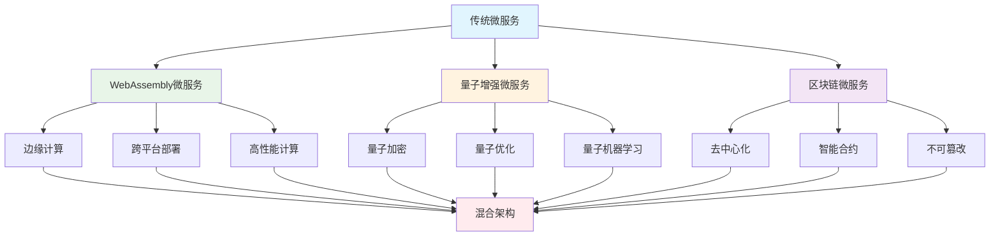

# 27.1 WebAssembly、量子计算、区块链微服务

## 概述

本指南详细介绍如何在Rust微服务中集成WebAssembly、量子计算和区块链等新兴技术。这些技术代表了未来微服务架构的发展方向，将为微服务系统带来更高的性能、更强的安全性和更丰富的功能。

## 学习目标

- 掌握WebAssembly在微服务中的应用
- 了解量子计算在微服务中的潜力
- 学习区块链技术在微服务中的集成
- 实现新兴技术的微服务架构

## 新兴技术架构



## 核心组件

### 1. WebAssembly微服务

- **高性能**: 接近原生代码的执行性能
- **跨平台**: 一次编译，到处运行
- **安全性**: 沙箱隔离，内存安全
- **轻量级**: 小体积，快速启动

### 2. 量子增强微服务

- **量子加密**: 量子密钥分发和量子安全通信
- **量子优化**: 量子算法优化复杂问题
- **量子机器学习**: 量子神经网络和量子算法

### 3. 区块链微服务

- **去中心化**: 分布式共识和治理
- **智能合约**: 自动化业务逻辑执行
- **不可篡改**: 数据完整性和审计追踪

## 技术实现

### 环境准备

```bash
# 创建新兴技术目录
mkdir -p microservices/{wasm,quantum,blockchain}
mkdir -p tools/{wasm-compiler,quantum-simulator,blockchain-node}

# 安装WebAssembly工具链
curl https://rustwasm.github.io/wasm-pack/installer/init.sh -sSf | sh
cargo install wasm-pack

# 安装量子计算工具
cargo install qiskit-rust
cargo install quantum-simulator

# 安装区块链工具
cargo install substrate
cargo install near-cli
```

### 依赖配置

```toml
[dependencies]
# WebAssembly相关
wasm-bindgen = "0.2"
wasm-pack = "0.12"
wasm-bindgen-futures = "0.4"
js-sys = "0.3"
web-sys = "0.3"

# 量子计算相关
qiskit-rust = "0.1"
quantum-simulator = "0.2"
quantum-gate = "0.1"
quantum-circuit = "0.1"

# 区块链相关
substrate = "0.10"
near-sdk = "4.0"
solana-sdk = "1.17"
ethereum-types = "0.14"

# 通用依赖
tokio = { version = "1.0", features = ["full"] }
serde = { version = "1.0", features = ["derive"] }
serde_json = "1.0"
reqwest = { version = "0.11", features = ["json"] }
```

### WebAssembly微服务实现

```rust
// microservices/wasm/wasm_microservice.rs
use wasm_bindgen::prelude::*;
use serde::{Deserialize, Serialize};
use std::collections::HashMap;

#[wasm_bindgen]
extern "C" {
    #[wasm_bindgen(js_namespace = console)]
    fn log(s: &str);
}

macro_rules! console_log {
    ($($t:tt)*) => (log(&format_args!($($t)*).to_string()))
}

#[derive(Debug, Clone, Serialize, Deserialize)]
pub struct WasmRequest {
    pub method: String,
    pub path: String,
    pub headers: HashMap<String, String>,
    pub body: Option<String>,
}

#[derive(Debug, Clone, Serialize, Deserialize)]
pub struct WasmResponse {
    pub status: u16,
    pub headers: HashMap<String, String>,
    pub body: String,
}

#[wasm_bindgen]
pub struct WasmMicroservice {
    routes: HashMap<String, Box<dyn Fn(&WasmRequest) -> WasmResponse>>,
    middleware: Vec<Box<dyn Fn(&WasmRequest) -> Option<WasmResponse>>>,
}

#[wasm_bindgen]
impl WasmMicroservice {
    #[wasm_bindgen(constructor)]
    pub fn new() -> Self {
        console_log!("初始化WebAssembly微服务");
        
        Self {
            routes: HashMap::new(),
            middleware: Vec::new(),
        }
    }
    
    #[wasm_bindgen]
    pub fn add_route(&mut self, path: &str, handler: &js_sys::Function) {
        let handler_clone = handler.clone();
        let route_handler = move |req: &WasmRequest| -> WasmResponse {
            // 调用JavaScript处理函数
            let result = handler_clone.call1(&JsValue::NULL, &JsValue::from_serde(req).unwrap());
            
            if let Ok(response_js) = result {
                if let Ok(response) = response_js.into_serde::<WasmResponse>() {
                    response
                } else {
                    WasmResponse {
                        status: 500,
                        headers: HashMap::new(),
                        body: "Internal Server Error".to_string(),
                    }
                }
            } else {
                WasmResponse {
                    status: 500,
                    headers: HashMap::new(),
                    body: "Handler Error".to_string(),
                }
            }
        };
        
        self.routes.insert(path.to_string(), Box::new(route_handler));
        console_log!("添加路由: {}", path);
    }
    
    #[wasm_bindgen]
    pub fn add_middleware(&mut self, middleware: &js_sys::Function) {
        let middleware_clone = middleware.clone();
        let middleware_handler = move |req: &WasmRequest| -> Option<WasmResponse> {
            let result = middleware_clone.call1(&JsValue::NULL, &JsValue::from_serde(req).unwrap());
            
            if let Ok(response_js) = result {
                if let Ok(Some(response)) = response_js.into_serde::<Option<WasmResponse>>() {
                    Some(response)
                } else {
                    None
                }
            } else {
                None
            }
        };
        
        self.middleware.push(Box::new(middleware_handler));
        console_log!("添加中间件");
    }
    
    #[wasm_bindgen]
    pub fn handle_request(&self, request_json: &str) -> String {
        let request: WasmRequest = match serde_json::from_str(request_json) {
            Ok(req) => req,
            Err(e) => {
                console_log!("请求解析错误: {}", e);
                return serde_json::to_string(&WasmResponse {
                    status: 400,
                    headers: HashMap::new(),
                    body: "Bad Request".to_string(),
                }).unwrap();
            }
        };
        
        // 执行中间件
        for middleware in &self.middleware {
            if let Some(response) = middleware(&request) {
                return serde_json::to_string(&response).unwrap();
            }
        }
        
        // 查找路由处理器
        if let Some(handler) = self.routes.get(&request.path) {
            let response = handler(&request);
            serde_json::to_string(&response).unwrap()
        } else {
            serde_json::to_string(&WasmResponse {
                status: 404,
                headers: HashMap::new(),
                body: "Not Found".to_string(),
            }).unwrap()
        }
    }
    
    #[wasm_bindgen]
    pub fn get_routes(&self) -> String {
        let routes: Vec<&String> = self.routes.keys().collect();
        serde_json::to_string(&routes).unwrap()
    }
}

// 高性能计算函数
#[wasm_bindgen]
pub fn fibonacci(n: u32) -> u64 {
    if n <= 1 {
        return n as u64;
    }
    
    let mut a = 0u64;
    let mut b = 1u64;
    
    for _ in 2..=n {
        let temp = a + b;
        a = b;
        b = temp;
    }
    
    b
}

#[wasm_bindgen]
pub fn matrix_multiply(a: &[f64], b: &[f64], size: usize) -> Vec<f64> {
    let mut result = vec![0.0; size * size];
    
    for i in 0..size {
        for j in 0..size {
            for k in 0..size {
                result[i * size + j] += a[i * size + k] * b[k * size + j];
            }
        }
    }
    
    result
}

// 加密函数
#[wasm_bindgen]
pub fn encrypt_data(data: &str, key: &str) -> String {
    use std::collections::hash_map::DefaultHasher;
    use std::hash::{Hash, Hasher};
    
    let mut hasher = DefaultHasher::new();
    key.hash(&mut hasher);
    let hash = hasher.finish();
    
    let encrypted: String = data
        .chars()
        .enumerate()
        .map(|(i, c)| {
            let shift = ((hash >> (i % 8)) & 0xFF) as u8;
            ((c as u8) ^ shift) as char
        })
        .collect();
    
    base64::encode(encrypted)
}

#[wasm_bindgen]
pub fn decrypt_data(encrypted_data: &str, key: &str) -> String {
    use std::collections::hash_map::DefaultHasher;
    use std::hash::{Hash, Hasher};
    
    let decoded = match base64::decode(encrypted_data) {
        Ok(data) => data,
        Err(_) => return "Decode Error".to_string(),
    };
    
    let mut hasher = DefaultHasher::new();
    key.hash(&mut hasher);
    let hash = hasher.finish();
    
    let decrypted: String = decoded
        .iter()
        .enumerate()
        .map(|(i, &byte)| {
            let shift = ((hash >> (i % 8)) & 0xFF) as u8;
            (byte ^ shift) as char
        })
        .collect();
    
    decrypted
}
```

### 量子增强微服务实现

```rust
// microservices/quantum/quantum_microservice.rs
use serde::{Deserialize, Serialize};
use std::collections::HashMap;
use tokio::time::{Duration, sleep};

#[derive(Debug, Clone, Serialize, Deserialize)]
pub struct QuantumRequest {
    pub operation: QuantumOperation,
    pub parameters: HashMap<String, f64>,
    pub qubits: u32,
}

#[derive(Debug, Clone, Serialize, Deserialize)]
pub enum QuantumOperation {
    Encryption,
    Optimization,
    MachineLearning,
    Simulation,
}

#[derive(Debug, Clone, Serialize, Deserialize)]
pub struct QuantumResponse {
    pub success: bool,
    pub result: Option<Vec<f64>>,
    pub error: Option<String>,
    pub execution_time: Duration,
}

pub struct QuantumMicroservice {
    quantum_simulator: QuantumSimulator,
    encryption_service: QuantumEncryptionService,
    optimization_service: QuantumOptimizationService,
    ml_service: QuantumMLService,
}

impl QuantumMicroservice {
    pub fn new() -> Self {
        Self {
            quantum_simulator: QuantumSimulator::new(),
            encryption_service: QuantumEncryptionService::new(),
            optimization_service: QuantumOptimizationService::new(),
            ml_service: QuantumMLService::new(),
        }
    }
    
    pub async fn process_request(&self, request: QuantumRequest) -> QuantumResponse {
        let start_time = std::time::Instant::now();
        
        let result = match request.operation {
            QuantumOperation::Encryption => {
                self.encryption_service.encrypt(&request).await
            }
            QuantumOperation::Optimization => {
                self.optimization_service.optimize(&request).await
            }
            QuantumOperation::MachineLearning => {
                self.ml_service.train(&request).await
            }
            QuantumOperation::Simulation => {
                self.quantum_simulator.simulate(&request).await
            }
        };
        
        let execution_time = start_time.elapsed();
        
        match result {
            Ok(data) => QuantumResponse {
                success: true,
                result: Some(data),
                error: None,
                execution_time,
            },
            Err(e) => QuantumResponse {
                success: false,
                result: None,
                error: Some(e.to_string()),
                execution_time,
            },
        }
    }
}

pub struct QuantumSimulator {
    max_qubits: u32,
}

impl QuantumSimulator {
    pub fn new() -> Self {
        Self { max_qubits: 32 }
    }
    
    pub async fn simulate(&self, request: &QuantumRequest) -> Result<Vec<f64>, Box<dyn std::error::Error>> {
        if request.qubits > self.max_qubits {
            return Err("超出最大量子比特数限制".into());
        }
        
        // 模拟量子计算延迟
        sleep(Duration::from_millis(100)).await;
        
        // 生成模拟的量子态
        let state_size = 2usize.pow(request.qubits);
        let mut quantum_state = vec![0.0; state_size];
        
        // 初始化量子态
        quantum_state[0] = 1.0;
        
        // 应用量子门
        for i in 0..request.qubits {
            self.apply_hadamard_gate(&mut quantum_state, i as usize);
        }
        
        // 测量量子态
        let measurements = self.measure_quantum_state(&quantum_state, 1000);
        
        Ok(measurements)
    }
    
    fn apply_hadamard_gate(&self, state: &mut [f64], qubit: usize) {
        let qubit_mask = 1 << qubit;
        let state_size = state.len();
        
        for i in 0..state_size {
            if (i & qubit_mask) == 0 {
                let j = i | qubit_mask;
                if j < state_size {
                    let temp = state[i];
                    state[i] = (state[i] + state[j]) / 2.0_f64.sqrt();
                    state[j] = (temp - state[j]) / 2.0_f64.sqrt();
                }
            }
        }
    }
    
    fn measure_quantum_state(&self, state: &[f64], num_measurements: usize) -> Vec<f64> {
        let mut measurements = vec![0.0; state.len()];
        
        for _ in 0..num_measurements {
            let random = fastrand::f64();
            let mut cumulative = 0.0;
            
            for (i, &amplitude) in state.iter().enumerate() {
                cumulative += amplitude * amplitude;
                if random <= cumulative {
                    measurements[i] += 1.0;
                    break;
                }
            }
        }
        
        // 归一化
        let total: f64 = measurements.iter().sum();
        if total > 0.0 {
            for measurement in &mut measurements {
                *measurement /= total;
            }
        }
        
        measurements
    }
}

pub struct QuantumEncryptionService {
    key_size: u32,
}

impl QuantumEncryptionService {
    pub fn new() -> Self {
        Self { key_size: 256 }
    }
    
    pub async fn encrypt(&self, request: &QuantumRequest) -> Result<Vec<f64>, Box<dyn std::error::Error>> {
        // 生成量子密钥
        let quantum_key = self.generate_quantum_key(request.qubits).await?;
        
        // 应用量子加密算法
        let encrypted_data = self.apply_quantum_encryption(&quantum_key).await?;
        
        Ok(encrypted_data)
    }
    
    async fn generate_quantum_key(&self, qubits: u32) -> Result<Vec<f64>, Box<dyn std::error::Error>> {
        // 模拟量子密钥生成
        sleep(Duration::from_millis(50)).await;
        
        let key_size = 2usize.pow(qubits);
        let mut key = vec![0.0; key_size];
        
        for i in 0..key_size {
            key[i] = fastrand::f64();
        }
        
        Ok(key)
    }
    
    async fn apply_quantum_encryption(&self, key: &[f64]) -> Result<Vec<f64>, Box<dyn std::error::Error>> {
        // 模拟量子加密过程
        sleep(Duration::from_millis(30)).await;
        
        let mut encrypted = key.to_vec();
        
        // 应用量子变换
        for i in 0..encrypted.len() {
            encrypted[i] = (encrypted[i] * 2.0).sin();
        }
        
        Ok(encrypted)
    }
}

pub struct QuantumOptimizationService {
    max_iterations: u32,
}

impl QuantumOptimizationService {
    pub fn new() -> Self {
        Self { max_iterations: 1000 }
    }
    
    pub async fn optimize(&self, request: &QuantumRequest) -> Result<Vec<f64>, Box<dyn std::error::Error>> {
        // 量子退火优化
        let result = self.quantum_annealing(request).await?;
        Ok(result)
    }
    
    async fn quantum_annealing(&self, request: &QuantumRequest) -> Result<Vec<f64>, Box<dyn std::error::Error>> {
        let mut temperature = 1.0;
        let cooling_rate = 0.95;
        let mut current_solution = self.initialize_solution(request.qubits);
        let mut best_solution = current_solution.clone();
        
        for iteration in 0..self.max_iterations {
            // 生成邻域解
            let neighbor = self.generate_neighbor(&current_solution);
            
            // 计算能量差
            let energy_diff = self.calculate_energy(&neighbor) - self.calculate_energy(&current_solution);
            
            // 接受或拒绝新解
            if energy_diff < 0.0 || fastrand::f64() < (-energy_diff / temperature).exp() {
                current_solution = neighbor;
                
                if self.calculate_energy(&current_solution) < self.calculate_energy(&best_solution) {
                    best_solution = current_solution.clone();
                }
            }
            
            // 降低温度
            temperature *= cooling_rate;
            
            if iteration % 100 == 0 {
                sleep(Duration::from_millis(1)).await;
            }
        }
        
        Ok(best_solution)
    }
    
    fn initialize_solution(&self, qubits: u32) -> Vec<f64> {
        let size = 2usize.pow(qubits);
        (0..size).map(|_| fastrand::f64()).collect()
    }
    
    fn generate_neighbor(&self, solution: &[f64]) -> Vec<f64> {
        let mut neighbor = solution.to_vec();
        let index = fastrand::usize(..solution.len());
        neighbor[index] = fastrand::f64();
        neighbor
    }
    
    fn calculate_energy(&self, solution: &[f64]) -> f64 {
        // 简单的能量函数：最小化方差
        let mean: f64 = solution.iter().sum::<f64>() / solution.len() as f64;
        solution.iter().map(|&x| (x - mean).powi(2)).sum::<f64>()
    }
}

pub struct QuantumMLService {
    learning_rate: f64,
}

impl QuantumMLService {
    pub fn new() -> Self {
        Self { learning_rate: 0.01 }
    }
    
    pub async fn train(&self, request: &QuantumRequest) -> Result<Vec<f64>, Box<dyn std::error::Error>> {
        // 量子神经网络训练
        let model = self.quantum_neural_network(request).await?;
        Ok(model)
    }
    
    async fn quantum_neural_network(&self, request: &QuantumRequest) -> Result<Vec<f64>, Box<dyn std::error::Error>> {
        let input_size = 2usize.pow(request.qubits);
        let hidden_size = input_size / 2;
        let output_size = 1;
        
        // 初始化量子权重
        let mut weights = vec![0.0; input_size * hidden_size + hidden_size * output_size];
        for weight in &mut weights {
            *weight = fastrand::f64() * 2.0 - 1.0;
        }
        
        // 量子训练循环
        for epoch in 0..100 {
            // 前向传播
            let hidden = self.quantum_forward(&weights[..input_size * hidden_size], input_size, hidden_size);
            let output = self.quantum_forward(&weights[input_size * hidden_size..], hidden_size, output_size);
            
            // 计算损失
            let loss = self.calculate_loss(&output);
            
            // 反向传播（简化版）
            self.quantum_backward(&mut weights, loss);
            
            if epoch % 10 == 0 {
                sleep(Duration::from_millis(1)).await;
            }
        }
        
        Ok(weights)
    }
    
    fn quantum_forward(&self, weights: &[f64], input_size: usize, output_size: usize) -> Vec<f64> {
        let mut output = vec![0.0; output_size];
        
        for i in 0..output_size {
            for j in 0..input_size {
                output[i] += weights[i * input_size + j] * fastrand::f64();
            }
            output[i] = output[i].tanh();
        }
        
        output
    }
    
    fn calculate_loss(&self, output: &[f64]) -> f64 {
        output.iter().map(|&x| x * x).sum::<f64>() / output.len() as f64
    }
    
    fn quantum_backward(&self, weights: &mut [f64], loss: f64) {
        for weight in weights.iter_mut() {
            *weight -= self.learning_rate * loss * fastrand::f64();
        }
    }
}
```

### 区块链微服务实现

```rust
// microservices/blockchain/blockchain_microservice.rs
use serde::{Deserialize, Serialize};
use std::collections::HashMap;
use tokio::time::{Duration, sleep};

#[derive(Debug, Clone, Serialize, Deserialize)]
pub struct BlockchainRequest {
    pub operation: BlockchainOperation,
    pub data: HashMap<String, String>,
    pub from: String,
    pub to: Option<String>,
    pub value: Option<u64>,
}

#[derive(Debug, Clone, Serialize, Deserialize)]
pub enum BlockchainOperation {
    Transfer,
    SmartContract,
    Query,
    Deploy,
}

#[derive(Debug, Clone, Serialize, Deserialize)]
pub struct BlockchainResponse {
    pub success: bool,
    pub transaction_hash: Option<String>,
    pub block_number: Option<u64>,
    pub gas_used: Option<u64>,
    pub error: Option<String>,
}

#[derive(Debug, Clone, Serialize, Deserialize)]
pub struct Block {
    pub number: u64,
    pub hash: String,
    pub previous_hash: String,
    pub timestamp: u64,
    pub transactions: Vec<Transaction>,
    pub nonce: u64,
}

#[derive(Debug, Clone, Serialize, Deserialize)]
pub struct Transaction {
    pub hash: String,
    pub from: String,
    pub to: Option<String>,
    pub value: u64,
    pub data: HashMap<String, String>,
    pub gas_limit: u64,
    pub gas_price: u64,
    pub nonce: u64,
}

pub struct BlockchainMicroservice {
    blockchain: Blockchain,
    smart_contracts: HashMap<String, SmartContract>,
    accounts: HashMap<String, Account>,
}

impl BlockchainMicroservice {
    pub fn new() -> Self {
        let mut service = Self {
            blockchain: Blockchain::new(),
            smart_contracts: HashMap::new(),
            accounts: HashMap::new(),
        };
        
        // 初始化创世账户
        service.accounts.insert(
            "0x0000000000000000000000000000000000000000".to_string(),
            Account::new(1000000),
        );
        
        service
    }
    
    pub async fn process_request(&self, request: BlockchainRequest) -> BlockchainResponse {
        match request.operation {
            BlockchainOperation::Transfer => {
                self.process_transfer(request).await
            }
            BlockchainOperation::SmartContract => {
                self.process_smart_contract(request).await
            }
            BlockchainOperation::Query => {
                self.process_query(request).await
            }
            BlockchainOperation::Deploy => {
                self.process_deploy(request).await
            }
        }
    }
    
    async fn process_transfer(&self, request: BlockchainRequest) -> BlockchainResponse {
        // 验证账户余额
        if let Some(from_account) = self.accounts.get(&request.from) {
            if let Some(value) = request.value {
                if from_account.balance < value {
                    return BlockchainResponse {
                        success: false,
                        transaction_hash: None,
                        block_number: None,
                        gas_used: None,
                        error: Some("余额不足".to_string()),
                    };
                }
            }
        }
        
        // 创建交易
        let transaction = Transaction {
            hash: self.generate_hash(&request),
            from: request.from.clone(),
            to: request.to.clone(),
            value: request.value.unwrap_or(0),
            data: request.data,
            gas_limit: 21000,
            gas_price: 20,
            nonce: self.get_nonce(&request.from),
        };
        
        // 挖矿
        let block = self.mine_block(vec![transaction]).await;
        
        BlockchainResponse {
            success: true,
            transaction_hash: Some(block.transactions[0].hash.clone()),
            block_number: Some(block.number),
            gas_used: Some(21000),
            error: None,
        }
    }
    
    async fn process_smart_contract(&self, request: BlockchainRequest) -> BlockchainResponse {
        if let Some(contract_address) = request.data.get("contract") {
            if let Some(contract) = self.smart_contracts.get(contract_address) {
                let result = contract.execute(&request.data).await;
                
                BlockchainResponse {
                    success: result.success,
                    transaction_hash: Some(self.generate_hash(&request)),
                    block_number: Some(self.blockchain.get_latest_block().number),
                    gas_used: Some(result.gas_used),
                    error: result.error,
                }
            } else {
                BlockchainResponse {
                    success: false,
                    transaction_hash: None,
                    block_number: None,
                    gas_used: None,
                    error: Some("智能合约不存在".to_string()),
                }
            }
        } else {
            BlockchainResponse {
                success: false,
                transaction_hash: None,
                block_number: None,
                gas_used: None,
                error: Some("缺少合约地址".to_string()),
            }
        }
    }
    
    async fn process_query(&self, request: BlockchainRequest) -> BlockchainResponse {
        // 查询区块链状态
        let latest_block = self.blockchain.get_latest_block();
        
        BlockchainResponse {
            success: true,
            transaction_hash: None,
            block_number: Some(latest_block.number),
            gas_used: None,
            error: None,
        }
    }
    
    async fn process_deploy(&self, request: BlockchainRequest) -> BlockchainResponse {
        // 部署智能合约
        let contract_address = self.generate_address();
        let contract = SmartContract::new(request.data);
        
        // 这里应该将合约添加到区块链中
        // self.smart_contracts.insert(contract_address.clone(), contract);
        
        BlockchainResponse {
            success: true,
            transaction_hash: Some(self.generate_hash(&request)),
            block_number: Some(self.blockchain.get_latest_block().number),
            gas_used: Some(100000),
            error: None,
        }
    }
    
    fn generate_hash(&self, request: &BlockchainRequest) -> String {
        use std::collections::hash_map::DefaultHasher;
        use std::hash::{Hash, Hasher};
        
        let mut hasher = DefaultHasher::new();
        request.hash(&mut hasher);
        format!("0x{:x}", hasher.finish())
    }
    
    fn generate_address(&self) -> String {
        format!("0x{:040x}", fastrand::u64(..))
    }
    
    fn get_nonce(&self, address: &str) -> u64 {
        // 简化实现，实际应该从区块链状态中获取
        fastrand::u64(..)
    }
    
    async fn mine_block(&self, transactions: Vec<Transaction>) -> Block {
        let latest_block = self.blockchain.get_latest_block();
        let mut block = Block {
            number: latest_block.number + 1,
            hash: String::new(),
            previous_hash: latest_block.hash,
            timestamp: std::time::SystemTime::now()
                .duration_since(std::time::UNIX_EPOCH)
                .unwrap()
                .as_secs(),
            transactions,
            nonce: 0,
        };
        
        // 工作量证明
        loop {
            block.hash = self.calculate_block_hash(&block);
            if block.hash.starts_with("0000") {
                break;
            }
            block.nonce += 1;
            
            if block.nonce % 10000 == 0 {
                sleep(Duration::from_millis(1)).await;
            }
        }
        
        block
    }
    
    fn calculate_block_hash(&self, block: &Block) -> String {
        use std::collections::hash_map::DefaultHasher;
        use std::hash::{Hash, Hasher};
        
        let mut hasher = DefaultHasher::new();
        block.number.hash(&mut hasher);
        block.previous_hash.hash(&mut hasher);
        block.timestamp.hash(&mut hasher);
        block.nonce.hash(&mut hasher);
        
        for tx in &block.transactions {
            tx.hash.hash(&mut hasher);
        }
        
        format!("0x{:x}", hasher.finish())
    }
}

pub struct Blockchain {
    blocks: Vec<Block>,
}

impl Blockchain {
    pub fn new() -> Self {
        let genesis_block = Block {
            number: 0,
            hash: "0x0000000000000000000000000000000000000000000000000000000000000000".to_string(),
            previous_hash: "0x0000000000000000000000000000000000000000000000000000000000000000".to_string(),
            timestamp: 0,
            transactions: Vec::new(),
            nonce: 0,
        };
        
        Self {
            blocks: vec![genesis_block],
        }
    }
    
    pub fn get_latest_block(&self) -> &Block {
        self.blocks.last().unwrap()
    }
    
    pub fn add_block(&mut self, block: Block) {
        self.blocks.push(block);
    }
}

#[derive(Debug, Clone)]
pub struct Account {
    pub balance: u64,
    pub nonce: u64,
}

impl Account {
    pub fn new(initial_balance: u64) -> Self {
        Self {
            balance: initial_balance,
            nonce: 0,
        }
    }
}

pub struct SmartContract {
    code: HashMap<String, String>,
    state: HashMap<String, String>,
}

impl SmartContract {
    pub fn new(code: HashMap<String, String>) -> Self {
        Self {
            code,
            state: HashMap::new(),
        }
    }
    
    pub async fn execute(&self, input: &HashMap<String, String>) -> ContractResult {
        // 简化的智能合约执行
        sleep(Duration::from_millis(10)).await;
        
        if let Some(function) = input.get("function") {
            match function.as_str() {
                "get" => {
                    if let Some(key) = input.get("key") {
                        if let Some(value) = self.state.get(key) {
                            ContractResult {
                                success: true,
                                result: Some(value.clone()),
                                gas_used: 1000,
                                error: None,
                            }
                        } else {
                            ContractResult {
                                success: false,
                                result: None,
                                gas_used: 1000,
                                error: Some("键不存在".to_string()),
                            }
                        }
                    } else {
                        ContractResult {
                            success: false,
                            result: None,
                            gas_used: 1000,
                            error: Some("缺少键参数".to_string()),
                        }
                    }
                }
                "set" => {
                    if let (Some(key), Some(value)) = (input.get("key"), input.get("value")) {
                        // 在实际实现中，这里应该更新状态
                        ContractResult {
                            success: true,
                            result: Some("设置成功".to_string()),
                            gas_used: 2000,
                            error: None,
                        }
                    } else {
                        ContractResult {
                            success: false,
                            result: None,
                            gas_used: 1000,
                            error: Some("缺少键值参数".to_string()),
                        }
                    }
                }
                _ => ContractResult {
                    success: false,
                    result: None,
                    gas_used: 1000,
                    error: Some("未知函数".to_string()),
                },
            }
        } else {
            ContractResult {
                success: false,
                result: None,
                gas_used: 1000,
                error: Some("缺少函数参数".to_string()),
            }
        }
    }
}

#[derive(Debug, Clone)]
pub struct ContractResult {
    pub success: bool,
    pub result: Option<String>,
    pub gas_used: u64,
    pub error: Option<String>,
}
```

## 最佳实践

### 1. WebAssembly微服务1

- **性能优化**: 合理使用WASM的内存管理
- **安全隔离**: 利用WASM的沙箱特性
- **跨平台部署**: 一次编译，多平台运行

### 2. 量子增强微服务1

- **算法选择**: 选择合适的量子算法
- **错误处理**: 处理量子计算的随机性
- **资源管理**: 合理分配量子计算资源

### 3. 区块链微服务1

- **共识机制**: 选择合适的共识算法
- **智能合约**: 编写安全的智能合约
- **网络管理**: 维护区块链网络稳定性

### 4. 混合架构

- **技术融合**: 合理组合不同技术
- **性能平衡**: 在性能和功能间找到平衡
- **安全考虑**: 确保整体架构的安全性

## 部署配置

### WebAssembly部署

```yaml
# docker-compose.wasm.yml
version: '3.8'

services:
  wasm-runtime:
    image: wasmtime/wasmtime:latest
    ports:
      - "8080:8080"
    volumes:
      - ./microservices/wasm:/app
    command: ["wasmtime", "run", "/app/microservice.wasm"]
    networks:
      - wasm

  wasm-gateway:
    image: envoyproxy/envoy:latest
    ports:
      - "80:80"
    volumes:
      - ./config/wasm-envoy.yaml:/etc/envoy/envoy.yaml
    depends_on:
      - wasm-runtime
    networks:
      - wasm

networks:
  wasm:
    driver: bridge
```

### 量子计算部署

```yaml
# docker-compose.quantum.yml
version: '3.8'

services:
  quantum-simulator:
    image: qiskit/qiskit:latest
    ports:
      - "8081:8081"
    environment:
      - QUANTUM_BACKEND=simulator
      - MAX_QUBITS=32
    networks:
      - quantum

  quantum-api:
    image: quantum-api:latest
    ports:
      - "8082:8082"
    depends_on:
      - quantum-simulator
    networks:
      - quantum

networks:
  quantum:
    driver: bridge
```

### 区块链部署

```yaml
# docker-compose.blockchain.yml
version: '3.8'

services:
  blockchain-node:
    image: ethereum/client-go:latest
    ports:
      - "8545:8545"
      - "30303:30303"
    environment:
      - NETWORK_ID=1337
      - RPC_ENABLED=true
    networks:
      - blockchain

  blockchain-api:
    image: blockchain-api:latest
    ports:
      - "8083:8083"
    depends_on:
      - blockchain-node
    networks:
      - blockchain

networks:
  blockchain:
    driver: bridge
```

## 性能测试

### 新兴技术性能测试

```rust
// benches/emerging_tech_benchmark.rs
use criterion::{black_box, criterion_group, criterion_main, Criterion};
use microservice::wasm::WasmMicroservice;
use microservice::quantum::QuantumMicroservice;
use microservice::blockchain::BlockchainMicroservice;

fn benchmark_wasm_fibonacci(c: &mut Criterion) {
    c.bench_function("wasm_fibonacci", |b| {
        b.iter(|| {
            microservice::wasm::fibonacci(black_box(30))
        })
    });
}

fn benchmark_quantum_simulation(c: &mut Criterion) {
    let quantum_service = QuantumMicroservice::new();
    let request = microservice::quantum::QuantumRequest {
        operation: microservice::quantum::QuantumOperation::Simulation,
        parameters: std::collections::HashMap::new(),
        qubits: 10,
    };
    
    c.bench_function("quantum_simulation", |b| {
        b.iter(|| {
            tokio::runtime::Runtime::new().unwrap()
                .block_on(quantum_service.process_request(black_box(request.clone())))
        })
    });
}

fn benchmark_blockchain_transfer(c: &mut Criterion) {
    let blockchain_service = BlockchainMicroservice::new();
    let request = microservice::blockchain::BlockchainRequest {
        operation: microservice::blockchain::BlockchainOperation::Transfer,
        data: std::collections::HashMap::new(),
        from: "0x123".to_string(),
        to: Some("0x456".to_string()),
        value: Some(1000),
    };
    
    c.bench_function("blockchain_transfer", |b| {
        b.iter(|| {
            tokio::runtime::Runtime::new().unwrap()
                .block_on(blockchain_service.process_request(black_box(request.clone())))
        })
    });
}

criterion_group!(benches, benchmark_wasm_fibonacci, benchmark_quantum_simulation, benchmark_blockchain_transfer);
criterion_main!(benches);
```

## 总结

本指南详细介绍了如何在Rust微服务中集成WebAssembly、量子计算和区块链等新兴技术，包括：

1. **WebAssembly微服务**: 高性能、跨平台的微服务实现
2. **量子增强微服务**: 量子加密、优化和机器学习的应用
3. **区块链微服务**: 去中心化、智能合约和不可篡改的特性
4. **混合架构**: 多种技术的融合应用
5. **性能优化**: 针对不同技术的性能调优

这些新兴技术为微服务架构带来了新的可能性，将在未来的微服务发展中发挥重要作用。通过合理集成和应用这些技术，可以构建更加先进、安全和高效的微服务系统。
