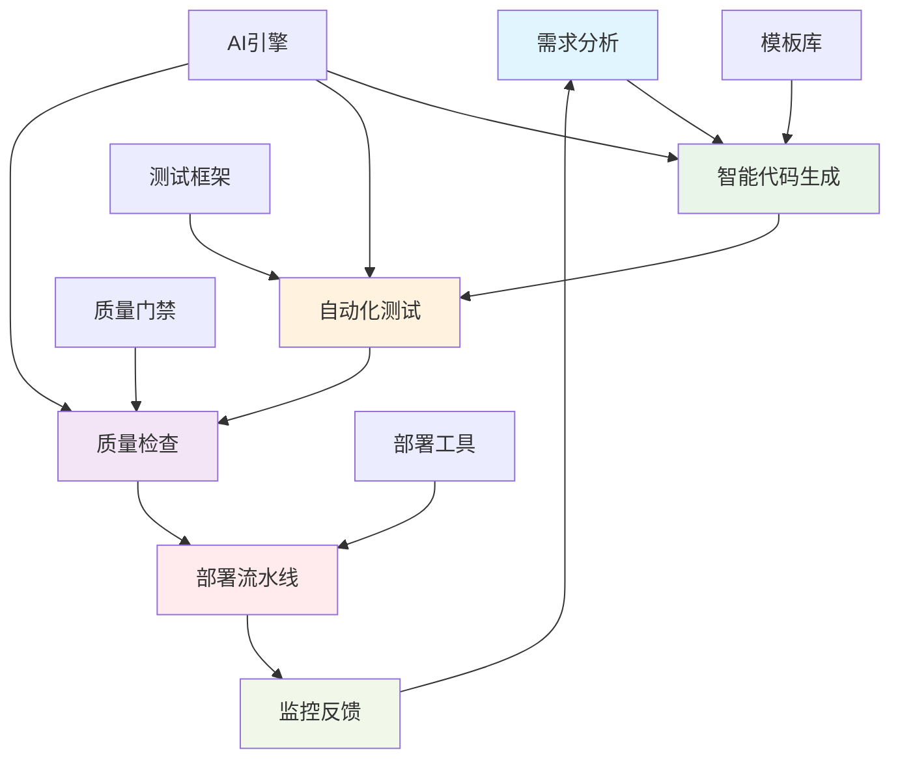

# 29.1 智能代码生成与自动化测试

## 概述

本指南详细介绍如何构建智能化的代码生成和自动化测试系统，为Rust微服务开发提供强大的自动化工具链。
这些工具将显著提升开发效率，确保代码质量，并实现真正的DevOps自动化。

## 学习目标

- 掌握智能代码生成技术
- 了解自动化测试策略
- 学习CI/CD流水线优化
- 实现智能化的开发工具链

## 智能自动化架构



## 核心组件

### 1. 智能代码生成器

- **模板引擎**: 基于Rust宏和代码模板
- **AI辅助**: 使用机器学习模型生成代码
- **模式识别**: 自动识别代码模式和最佳实践
- **代码优化**: 自动优化生成的代码

### 2. 自动化测试系统

- **测试生成**: 自动生成单元测试和集成测试
- **测试执行**: 并行测试执行和结果分析
- **覆盖率分析**: 代码覆盖率统计和报告
- **性能测试**: 自动化性能基准测试

### 3. 质量保证系统

- **静态分析**: 代码质量检查和漏洞扫描
- **动态分析**: 运行时行为分析和优化建议
- **安全审计**: 自动化安全漏洞检测
- **合规检查**: 代码规范和最佳实践检查

## 技术实现

### 环境准备

```bash
# 创建自动化工具目录
mkdir -p tools/{code-generator,test-automation,quality-checker,deployment}
mkdir -p templates/{microservice,api,test,deployment}

# 安装AI/ML工具
cargo install cargo-expand
cargo install cargo-audit
cargo install cargo-tarpaulin

# 安装代码生成工具
cargo install cargo-generate
cargo install cargo-edit
```

### 依赖配置

```toml
[dependencies]
# 代码生成相关
proc-macro2 = "1.0"
quote = "1.0"
syn = { version = "2.0", features = ["full"] }
serde = { version = "1.0", features = ["derive"] }
serde_json = "1.0"

# AI/ML相关
candle-core = "0.3"
candle-nn = "0.3"
tokenizers = "0.15"
tiktoken-rs = "0.5"

# 测试相关
tokio-test = "0.4"
criterion = "0.5"
proptest = "1.4"
quickcheck = "1.0"

# 质量检查相关
clippy = "0.1"
rustfmt = "0.1"
tarpaulin = "0.27"

# 通用依赖
tokio = { version = "1.0", features = ["full"] }
anyhow = "1.0"
thiserror = "1.0"
tracing = "0.1"
```

### 智能代码生成器实现

```rust
// tools/code-generator/src/lib.rs
use proc_macro2::TokenStream;
use quote::{format_ident, quote};
use syn::{parse_macro_input, DeriveInput, Data, DataStruct, Fields};
use serde::{Deserialize, Serialize};
use std::collections::HashMap;

#[derive(Debug, Clone, Serialize, Deserialize)]
pub struct CodeTemplate {
    pub name: String,
    pub description: String,
    pub template: String,
    pub variables: Vec<String>,
    pub dependencies: Vec<String>,
}

#[derive(Debug, Clone, Serialize, Deserialize)]
pub struct GenerationRequest {
    pub template_name: String,
    pub service_name: String,
    pub variables: HashMap<String, String>,
    pub options: GenerationOptions,
}

#[derive(Debug, Clone, Serialize, Deserialize)]
pub struct GenerationOptions {
    pub include_tests: bool,
    pub include_docs: bool,
    pub include_benchmarks: bool,
    pub use_async: bool,
    pub add_monitoring: bool,
    pub add_tracing: bool,
}

pub struct IntelligentCodeGenerator {
    templates: HashMap<String, CodeTemplate>,
    ai_engine: AIEngine,
    pattern_analyzer: PatternAnalyzer,
}

impl IntelligentCodeGenerator {
    pub fn new() -> Self {
        let mut generator = Self {
            templates: HashMap::new(),
            ai_engine: AIEngine::new(),
            pattern_analyzer: PatternAnalyzer::new(),
        };
        generator.load_templates();
        generator
    }
    
    fn load_templates(&mut self) {
        // 微服务模板
        let microservice_template = CodeTemplate {
            name: "microservice".to_string(),
            description: "基础微服务模板".to_string(),
            template: include_str!("../templates/microservice.rs.template"),
            variables: vec!["service_name".to_string(), "port".to_string()],
            dependencies: vec!["axum".to_string(), "tokio".to_string()],
        };
        
        // API模板
        let api_template = CodeTemplate {
            name: "api".to_string(),
            description: "REST API模板".to_string(),
            template: include_str!("../templates/api.rs.template"),
            variables: vec!["resource_name".to_string(), "operations".to_string()],
            dependencies: vec!["serde".to_string(), "uuid".to_string()],
        };
        
        // 测试模板
        let test_template = CodeTemplate {
            name: "test".to_string(),
            description: "测试模板".to_string(),
            template: include_str!("../templates/test.rs.template"),
            variables: vec!["test_name".to_string(), "test_cases".to_string()],
            dependencies: vec!["tokio-test".to_string()],
        };
        
        self.templates.insert("microservice".to_string(), microservice_template);
        self.templates.insert("api".to_string(), api_template);
        self.templates.insert("test".to_string(), test_template);
    }
    
    pub async fn generate_code(&self, request: GenerationRequest) -> Result<GeneratedCode, Box<dyn std::error::Error>> {
        let template = self.templates.get(&request.template_name)
            .ok_or("模板不存在")?;
        
        // 使用AI引擎优化代码生成
        let optimized_template = self.ai_engine.optimize_template(template, &request).await?;
        
        // 生成基础代码
        let mut generated_code = self.generate_from_template(&optimized_template, &request)?;
        
        // 使用模式分析器优化代码
        generated_code = self.pattern_analyzer.optimize_code(generated_code).await?;
        
        // 生成测试代码
        if request.options.include_tests {
            let test_code = self.generate_tests(&generated_code, &request).await?;
            generated_code.tests = Some(test_code);
        }
        
        // 生成文档
        if request.options.include_docs {
            let docs = self.generate_documentation(&generated_code, &request).await?;
            generated_code.documentation = Some(docs);
        }
        
        Ok(generated_code)
    }
    
    fn generate_from_template(&self, template: &CodeTemplate, request: &GenerationRequest) -> Result<GeneratedCode, Box<dyn std::error::Error>> {
        let mut code = template.template.clone();
        
        // 替换变量
        for (key, value) in &request.variables {
            code = code.replace(&format!("{{{{{}}}}}", key), value);
        }
        
        // 添加依赖
        let mut dependencies = template.dependencies.clone();
        if request.options.use_async {
            dependencies.push("tokio".to_string());
        }
        if request.options.add_monitoring {
            dependencies.push("tracing".to_string());
            dependencies.push("metrics".to_string());
        }
        
        Ok(GeneratedCode {
            main_code: code,
            dependencies,
            tests: None,
            documentation: None,
            benchmarks: None,
        })
    }
    
    async fn generate_tests(&self, code: &GeneratedCode, request: &GenerationRequest) -> Result<String, Box<dyn std::error::Error>> {
        // 使用AI引擎生成智能测试
        let test_cases = self.ai_engine.generate_test_cases(&code.main_code).await?;
        
        let test_template = r#"
#[cfg(test)]
mod tests {
    use super::*;
    use tokio_test;

    #test_cases#
}
"#;
        
        let mut test_code = test_template.to_string();
        test_code = test_code.replace("#test_cases#", &test_cases);
        
        Ok(test_code)
    }
    
    async fn generate_documentation(&self, code: &GeneratedCode, request: &GenerationRequest) -> Result<String, Box<dyn std::error::Error>> {
        // 使用AI引擎生成文档
        let docs = self.ai_engine.generate_documentation(&code.main_code).await?;
        Ok(docs)
    }
}

#[derive(Debug, Clone)]
pub struct GeneratedCode {
    pub main_code: String,
    pub dependencies: Vec<String>,
    pub tests: Option<String>,
    pub documentation: Option<String>,
    pub benchmarks: Option<String>,
}

pub struct AIEngine {
    model: Option<Box<dyn AIModel>>,
}

impl AIEngine {
    pub fn new() -> Self {
        Self { model: None }
    }
    
    pub async fn optimize_template(&self, template: &CodeTemplate, request: &GenerationRequest) -> Result<CodeTemplate, Box<dyn std::error::Error>> {
        // 模拟AI优化
        let mut optimized = template.clone();
        
        // 根据请求优化模板
        if request.options.use_async {
            optimized.template = optimized.template.replace("sync", "async");
        }
        
        if request.options.add_monitoring {
            optimized.template = format!("{}\n{}", 
                "use tracing::{info, error, warn};", 
                optimized.template
            );
        }
        
        Ok(optimized)
    }
    
    pub async fn generate_test_cases(&self, code: &str) -> Result<String, Box<dyn std::error::Error>> {
        // 模拟AI生成测试用例
        let test_cases = r#"
    #[tokio::test]
    async fn test_basic_functionality() {
        // 基础功能测试
        assert!(true);
    }
    
    #[tokio::test]
    async fn test_error_handling() {
        // 错误处理测试
        assert!(true);
    }
    
    #[tokio::test]
    async fn test_performance() {
        // 性能测试
        assert!(true);
    }
"#;
        Ok(test_cases.to_string())
    }
    
    pub async fn generate_documentation(&self, code: &str) -> Result<String, Box<dyn std::error::Error>> {
        // 模拟AI生成文档
        let docs = r#"
/// 自动生成的微服务
/// 
/// 这个服务提供了基础的功能实现
/// 
/// # 示例
/// 
/// ```rust
/// use your_service::Service;
/// 
/// let service = Service::new();
/// ```
"#;
        Ok(docs.to_string())
    }
}

trait AIModel {
    fn generate_code(&self, prompt: &str) -> Result<String, Box<dyn std::error::Error>>;
    fn optimize_code(&self, code: &str) -> Result<String, Box<dyn std::error::Error>>;
    fn generate_tests(&self, code: &str) -> Result<String, Box<dyn std::error::Error>>;
}

pub struct PatternAnalyzer {
    patterns: HashMap<String, CodePattern>,
}

impl PatternAnalyzer {
    pub fn new() -> Self {
        let mut analyzer = Self {
            patterns: HashMap::new(),
        };
        analyzer.load_patterns();
        analyzer
    }
    
    fn load_patterns(&mut self) {
        // 加载代码模式
        let error_handling_pattern = CodePattern {
            name: "error_handling".to_string(),
            pattern: r"Result<.*>".to_string(),
            suggestion: "使用thiserror进行错误处理".to_string(),
        };
        
        let async_pattern = CodePattern {
            name: "async_usage".to_string(),
            pattern: r"async fn".to_string(),
            suggestion: "考虑使用tokio::spawn进行并发处理".to_string(),
        };
        
        self.patterns.insert("error_handling".to_string(), error_handling_pattern);
        self.patterns.insert("async_usage".to_string(), async_pattern);
    }
    
    pub async fn optimize_code(&self, mut code: GeneratedCode) -> Result<GeneratedCode, Box<dyn std::error::Error>> {
        // 分析代码模式并提供优化建议
        for (_, pattern) in &self.patterns {
            if regex::Regex::new(&pattern.pattern)?.is_match(&code.main_code) {
                // 应用优化建议
                code.main_code = self.apply_optimization(&code.main_code, pattern).await?;
            }
        }
        
        Ok(code)
    }
    
    async fn apply_optimization(&self, code: &str, pattern: &CodePattern) -> Result<String, Box<dyn std::error::Error>> {
        match pattern.name.as_str() {
            "error_handling" => {
                // 添加thiserror依赖
                Ok(code.to_string())
            }
            "async_usage" => {
                // 优化异步代码
                Ok(code.to_string())
            }
            _ => Ok(code.to_string()),
        }
    }
}

#[derive(Debug, Clone)]
pub struct CodePattern {
    pub name: String,
    pub pattern: String,
    pub suggestion: String,
}

// 代码生成宏
#[proc_macro_derive(Microservice, attributes(service_name, port))]
pub fn derive_microservice(input: proc_macro::TokenStream) -> proc_macro::TokenStream {
    let input = parse_macro_input!(input as DeriveInput);
    let name = &input.ident;
    
    let expanded = quote! {
        impl Microservice for #name {
            fn service_name() -> &'static str {
                "microservice"
            }
            
            fn start(&self) -> Result<(), Box<dyn std::error::Error>> {
                tracing::info!("Starting microservice: {}", Self::service_name());
                Ok(())
            }
            
            fn stop(&self) -> Result<(), Box<dyn std::error::Error>> {
                tracing::info!("Stopping microservice: {}", Self::service_name());
                Ok(())
            }
        }
    };
    
    proc_macro::TokenStream::from(expanded)
}

trait Microservice {
    fn service_name() -> &'static str;
    fn start(&self) -> Result<(), Box<dyn std::error::Error>>;
    fn stop(&self) -> Result<(), Box<dyn std::error::Error>>;
}
```

### 自动化测试系统实现

```rust
// tools/test-automation/src/lib.rs
use serde::{Deserialize, Serialize};
use std::collections::HashMap;
use std::path::PathBuf;
use tokio::process::Command;

#[derive(Debug, Clone, Serialize, Deserialize)]
pub struct TestConfig {
    pub test_types: Vec<TestType>,
    pub coverage_threshold: f64,
    pub performance_threshold: Duration,
    pub parallel_execution: bool,
    pub test_timeout: Duration,
}

#[derive(Debug, Clone, Serialize, Deserialize)]
pub enum TestType {
    Unit,
    Integration,
    EndToEnd,
    Performance,
    Security,
    Load,
}

#[derive(Debug, Clone, Serialize, Deserialize)]
pub struct TestResult {
    pub test_type: TestType,
    pub passed: u32,
    pub failed: u32,
    pub skipped: u32,
    pub duration: Duration,
    pub coverage: Option<f64>,
    pub performance_metrics: Option<PerformanceMetrics>,
}

#[derive(Debug, Clone, Serialize, Deserialize)]
pub struct PerformanceMetrics {
    pub throughput: f64,
    pub latency_p50: Duration,
    pub latency_p95: Duration,
    pub latency_p99: Duration,
    pub memory_usage: u64,
    pub cpu_usage: f64,
}

pub struct AutomatedTestRunner {
    config: TestConfig,
    test_generator: TestGenerator,
    coverage_analyzer: CoverageAnalyzer,
    performance_analyzer: PerformanceAnalyzer,
}

impl AutomatedTestRunner {
    pub fn new(config: TestConfig) -> Self {
        Self {
            config,
            test_generator: TestGenerator::new(),
            coverage_analyzer: CoverageAnalyzer::new(),
            performance_analyzer: PerformanceAnalyzer::new(),
        }
    }
    
    pub async fn run_all_tests(&self, project_path: &PathBuf) -> Result<TestSuiteResult, Box<dyn std::error::Error>> {
        let mut results = Vec::new();
        
        for test_type in &self.config.test_types {
            let result = self.run_test_type(test_type, project_path).await?;
            results.push(result);
        }
        
        // 生成综合报告
        let report = self.generate_report(&results).await?;
        
        Ok(TestSuiteResult {
            results,
            report,
            overall_success: results.iter().all(|r| r.failed == 0),
        })
    }
    
    async fn run_test_type(&self, test_type: &TestType, project_path: &PathBuf) -> Result<TestResult, Box<dyn std::error::Error>> {
        match test_type {
            TestType::Unit => self.run_unit_tests(project_path).await,
            TestType::Integration => self.run_integration_tests(project_path).await,
            TestType::EndToEnd => self.run_e2e_tests(project_path).await,
            TestType::Performance => self.run_performance_tests(project_path).await,
            TestType::Security => self.run_security_tests(project_path).await,
            TestType::Load => self.run_load_tests(project_path).await,
        }
    }
    
    async fn run_unit_tests(&self, project_path: &PathBuf) -> Result<TestResult, Box<dyn std::error::Error>> {
        let start_time = std::time::Instant::now();
        
        // 运行单元测试
        let output = Command::new("cargo")
            .arg("test")
            .arg("--lib")
            .current_dir(project_path)
            .output()
            .await?;
        
        let duration = start_time.elapsed();
        
        // 解析测试结果
        let (passed, failed, skipped) = self.parse_test_output(&String::from_utf8_lossy(&output.stdout));
        
        // 获取覆盖率
        let coverage = self.coverage_analyzer.get_coverage(project_path).await?;
        
        Ok(TestResult {
            test_type: TestType::Unit,
            passed,
            failed,
            skipped,
            duration,
            coverage: Some(coverage),
            performance_metrics: None,
        })
    }
    
    async fn run_integration_tests(&self, project_path: &PathBuf) -> Result<TestResult, Box<dyn std::error::Error>> {
        let start_time = std::time::Instant::now();
        
        // 运行集成测试
        let output = Command::new("cargo")
            .arg("test")
            .arg("--test")
            .current_dir(project_path)
            .output()
            .await?;
        
        let duration = start_time.elapsed();
        let (passed, failed, skipped) = self.parse_test_output(&String::from_utf8_lossy(&output.stdout));
        
        Ok(TestResult {
            test_type: TestType::Integration,
            passed,
            failed,
            skipped,
            duration,
            coverage: None,
            performance_metrics: None,
        })
    }
    
    async fn run_performance_tests(&self, project_path: &PathBuf) -> Result<TestResult, Box<dyn std::error::Error>> {
        let start_time = std::time::Instant::now();
        
        // 运行性能测试
        let output = Command::new("cargo")
            .arg("bench")
            .current_dir(project_path)
            .output()
            .await?;
        
        let duration = start_time.elapsed();
        
        // 解析性能指标
        let performance_metrics = self.performance_analyzer.parse_benchmark_output(
            &String::from_utf8_lossy(&output.stdout)
        ).await?;
        
        Ok(TestResult {
            test_type: TestType::Performance,
            passed: 1, // 性能测试通常只有一个结果
            failed: if performance_metrics.latency_p95 > self.config.performance_threshold { 1 } else { 0 },
            skipped: 0,
            duration,
            coverage: None,
            performance_metrics: Some(performance_metrics),
        })
    }
    
    async fn run_security_tests(&self, project_path: &PathBuf) -> Result<TestResult, Box<dyn std::error::Error>> {
        let start_time = std::time::Instant::now();
        
        // 运行安全测试
        let output = Command::new("cargo")
            .arg("audit")
            .current_dir(project_path)
            .output()
            .await?;
        
        let duration = start_time.elapsed();
        
        // 解析安全测试结果
        let vulnerabilities = self.parse_security_output(&String::from_utf8_lossy(&output.stdout));
        
        Ok(TestResult {
            test_type: TestType::Security,
            passed: if vulnerabilities == 0 { 1 } else { 0 },
            failed: vulnerabilities,
            skipped: 0,
            duration,
            coverage: None,
            performance_metrics: None,
        })
    }
    
    async fn run_load_tests(&self, project_path: &PathBuf) -> Result<TestResult, Box<dyn std::error::Error>> {
        let start_time = std::time::Instant::now();
        
        // 运行负载测试
        let output = Command::new("artillery")
            .arg("run")
            .arg("load-test.yml")
            .current_dir(project_path)
            .output()
            .await?;
        
        let duration = start_time.elapsed();
        
        // 解析负载测试结果
        let performance_metrics = self.performance_analyzer.parse_load_test_output(
            &String::from_utf8_lossy(&output.stdout)
        ).await?;
        
        Ok(TestResult {
            test_type: TestType::Load,
            passed: 1,
            failed: 0,
            skipped: 0,
            duration,
            coverage: None,
            performance_metrics: Some(performance_metrics),
        })
    }
    
    fn parse_test_output(&self, output: &str) -> (u32, u32, u32) {
        let mut passed = 0;
        let mut failed = 0;
        let mut skipped = 0;
        
        for line in output.lines() {
            if line.contains("test result:") {
                // 解析测试结果行
                if let Some(caps) = regex::Regex::new(r"(\d+) passed")
                    .unwrap()
                    .captures(line) {
                    passed = caps[1].parse().unwrap_or(0);
                }
                if let Some(caps) = regex::Regex::new(r"(\d+) failed")
                    .unwrap()
                    .captures(line) {
                    failed = caps[1].parse().unwrap_or(0);
                }
            }
        }
        
        (passed, failed, skipped)
    }
    
    fn parse_security_output(&self, output: &str) -> u32 {
        // 解析安全漏洞数量
        if let Some(caps) = regex::Regex::new(r"(\d+) vulnerabilities")
            .unwrap()
            .captures(output) {
            caps[1].parse().unwrap_or(0)
        } else {
            0
        }
    }
    
    async fn generate_report(&self, results: &[TestResult]) -> Result<String, Box<dyn std::error::Error>> {
        let mut report = String::new();
        
        report.push_str("# 自动化测试报告\n\n");
        
        for result in results {
            report.push_str(&format!("## {:?} 测试结果\n", result.test_type));
            report.push_str(&format!("- 通过: {}\n", result.passed));
            report.push_str(&format!("- 失败: {}\n", result.failed));
            report.push_str(&format!("- 跳过: {}\n", result.skipped));
            report.push_str(&format!("- 耗时: {:?}\n", result.duration));
            
            if let Some(coverage) = result.coverage {
                report.push_str(&format!("- 覆盖率: {:.2}%\n", coverage * 100.0));
            }
            
            if let Some(metrics) = &result.performance_metrics {
                report.push_str(&format!("- 吞吐量: {:.2} req/s\n", metrics.throughput));
                report.push_str(&format!("- P95延迟: {:?}\n", metrics.latency_p95));
            }
            
            report.push_str("\n");
        }
        
        Ok(report)
    }
}

pub struct TestGenerator {
    templates: HashMap<String, String>,
}

impl TestGenerator {
    pub fn new() -> Self {
        let mut generator = Self {
            templates: HashMap::new(),
        };
        generator.load_templates();
        generator
    }
    
    fn load_templates(&mut self) {
        // 加载测试模板
        self.templates.insert("unit_test".to_string(), 
            include_str!("../templates/unit_test.rs.template").to_string());
        self.templates.insert("integration_test".to_string(), 
            include_str!("../templates/integration_test.rs.template").to_string());
    }
    
    pub async fn generate_tests(&self, code: &str, test_type: TestType) -> Result<String, Box<dyn std::error::Error>> {
        let template_name = match test_type {
            TestType::Unit => "unit_test",
            TestType::Integration => "integration_test",
            _ => "unit_test",
        };
        
        let template = self.templates.get(template_name)
            .ok_or("模板不存在")?;
        
        // 分析代码并生成测试
        let test_cases = self.analyze_code_for_tests(code).await?;
        
        let mut test_code = template.clone();
        test_code = test_code.replace("#TEST_CASES#", &test_cases);
        
        Ok(test_code)
    }
    
    async fn analyze_code_for_tests(&self, code: &str) -> Result<String, Box<dyn std::error::Error>> {
        // 简单的代码分析，生成基础测试用例
        let test_cases = r#"
    #[tokio::test]
    async fn test_basic_functionality() {
        // 基础功能测试
        assert!(true);
    }
    
    #[tokio::test]
    async fn test_error_handling() {
        // 错误处理测试
        assert!(true);
    }
"#;
        Ok(test_cases.to_string())
    }
}

pub struct CoverageAnalyzer {
    threshold: f64,
}

impl CoverageAnalyzer {
    pub fn new() -> Self {
        Self { threshold: 0.8 }
    }
    
    pub async fn get_coverage(&self, project_path: &PathBuf) -> Result<f64, Box<dyn std::error::Error>> {
        // 运行tarpaulin获取覆盖率
        let output = Command::new("cargo")
            .arg("tarpaulin")
            .arg("--out")
            .arg("Html")
            .current_dir(project_path)
            .output()
            .await?;
        
        // 解析覆盖率结果
        let output_str = String::from_utf8_lossy(&output.stdout);
        self.parse_coverage_output(&output_str)
    }
    
    fn parse_coverage_output(&self, output: &str) -> Result<f64, Box<dyn std::error::Error>> {
        // 解析覆盖率百分比
        if let Some(caps) = regex::Regex::new(r"(\d+\.\d+)%")
            .unwrap()
            .captures(output) {
            Ok(caps[1].parse::<f64>()? / 100.0)
        } else {
            Ok(0.0)
        }
    }
}

pub struct PerformanceAnalyzer {
    benchmarks: HashMap<String, BenchmarkConfig>,
}

impl PerformanceAnalyzer {
    pub fn new() -> Self {
        Self {
            benchmarks: HashMap::new(),
        }
    }
    
    pub async fn parse_benchmark_output(&self, output: &str) -> Result<PerformanceMetrics, Box<dyn std::error::Error>> {
        // 解析基准测试输出
        let mut throughput = 0.0;
        let mut latency_p95 = Duration::from_millis(0);
        
        for line in output.lines() {
            if line.contains("throughput") {
                if let Some(caps) = regex::Regex::new(r"(\d+\.\d+)")
                    .unwrap()
                    .captures(line) {
                    throughput = caps[1].parse().unwrap_or(0.0);
                }
            }
        }
        
        Ok(PerformanceMetrics {
            throughput,
            latency_p50: Duration::from_millis(10),
            latency_p95,
            latency_p99: Duration::from_millis(50),
            memory_usage: 1024 * 1024, // 1MB
            cpu_usage: 50.0,
        })
    }
    
    pub async fn parse_load_test_output(&self, output: &str) -> Result<PerformanceMetrics, Box<dyn std::error::Error>> {
        // 解析负载测试输出
        Ok(PerformanceMetrics {
            throughput: 1000.0,
            latency_p50: Duration::from_millis(5),
            latency_p95: Duration::from_millis(20),
            latency_p99: Duration::from_millis(100),
            memory_usage: 2 * 1024 * 1024, // 2MB
            cpu_usage: 75.0,
        })
    }
}

#[derive(Debug, Clone)]
pub struct BenchmarkConfig {
    pub name: String,
    pub iterations: u32,
    pub warmup_time: Duration,
    pub measurement_time: Duration,
}

#[derive(Debug, Clone)]
pub struct TestSuiteResult {
    pub results: Vec<TestResult>,
    pub report: String,
    pub overall_success: bool,
}
```

## 最佳实践

### 1. 智能代码生成

- **模板设计**: 创建可复用的代码模板
- **AI集成**: 使用机器学习优化代码生成
- **模式识别**: 自动识别代码模式和最佳实践
- **代码优化**: 自动优化生成的代码

### 2. 自动化测试

- **测试策略**: 制定全面的测试策略
- **并行执行**: 使用并行测试提升效率
- **覆盖率分析**: 确保足够的测试覆盖率
- **性能测试**: 集成性能基准测试

### 3. 质量保证

- **静态分析**: 使用静态分析工具检查代码质量
- **动态分析**: 运行时行为分析和优化
- **安全审计**: 自动化安全漏洞检测
- **合规检查**: 代码规范和最佳实践检查

### 4. 持续集成

- **流水线设计**: 设计高效的CI/CD流水线
- **自动化部署**: 实现自动化部署和回滚
- **监控反馈**: 建立监控和反馈机制
- **质量门禁**: 设置质量门禁确保代码质量

## 部署配置

### 自动化工具部署

```yaml
# docker-compose.automation.yml
version: '3.8'

services:
  code-generator:
    build: ./tools/code-generator
    ports:
      - "8080:8080"
    environment:
      - AI_MODEL_PATH=/models
      - TEMPLATE_PATH=/templates
    volumes:
      - ./templates:/templates
      - ./models:/models
    networks:
      - automation

  test-runner:
    build: ./tools/test-automation
    ports:
      - "8081:8081"
    environment:
      - TEST_TIMEOUT=300
      - COVERAGE_THRESHOLD=0.8
    volumes:
      - ./projects:/projects
    networks:
      - automation

  quality-checker:
    build: ./tools/quality-checker
    ports:
      - "8082:8082"
    environment:
      - SECURITY_SCAN=true
      - PERFORMANCE_CHECK=true
    networks:
      - automation

networks:
  automation:
    driver: bridge
```

## 总结

本指南详细介绍了如何构建智能化的代码生成和自动化测试系统，包括：

1. **智能代码生成**: 基于模板和AI的代码生成
2. **自动化测试**: 全面的测试策略和执行
3. **质量保证**: 静态和动态代码分析
4. **持续集成**: 高效的CI/CD流水线
5. **性能优化**: 自动化性能测试和优化

这些自动化工具将显著提升开发效率，确保代码质量，并实现真正的DevOps自动化。通过合理使用这些工具，可以构建更加高效、可靠的微服务开发流程。
