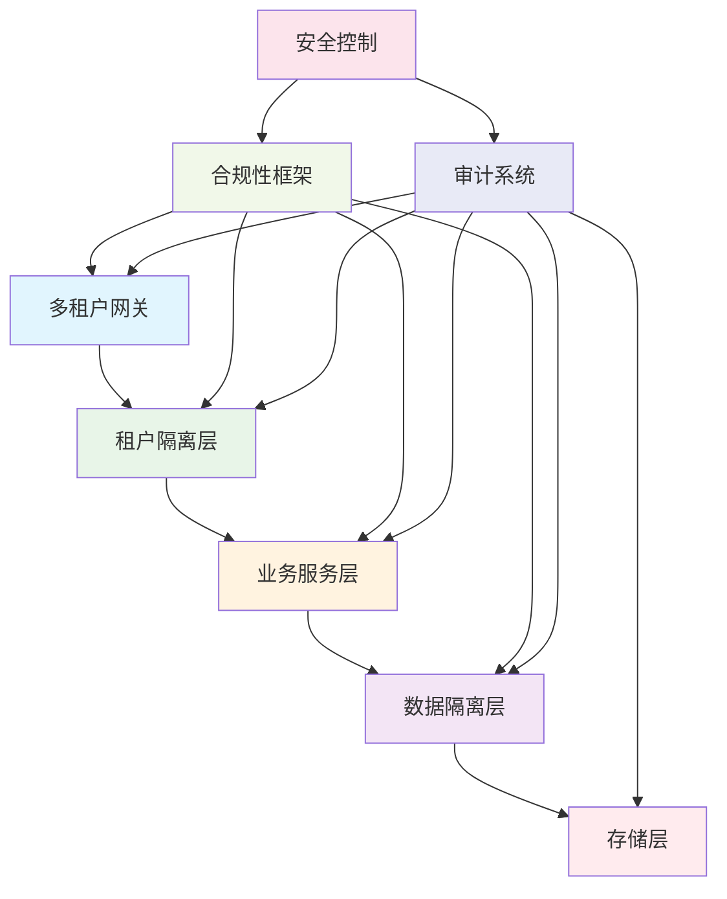

# 30.1 多租户架构与合规性框架

## 概述

本指南详细介绍如何构建企业级的多租户微服务架构和合规性框架。这些功能是企业级微服务系统的核心要求，确保系统能够支持多租户隔离、满足各种合规性要求，并提供完整的审计追踪能力。

## 学习目标

- 掌握多租户架构设计原则
- 了解合规性框架实现
- 学习审计系统构建
- 实现企业级安全控制

## 企业级架构



## 核心组件

### 1. 多租户架构

- **租户隔离**: 数据、计算、网络层面的隔离
- **资源管理**: 租户资源配额和限制
- **计费系统**: 基于使用量的计费模型
- **配置管理**: 租户特定的配置管理

### 2. 合规性框架

- **数据保护**: GDPR、CCPA等数据保护法规
- **安全标准**: SOC2、ISO27001等安全标准
- **行业规范**: HIPAA、PCI-DSS等行业特定规范
- **审计要求**: 完整的审计日志和报告

### 3. 审计系统

- **操作审计**: 用户操作和系统变更记录
- **数据审计**: 数据访问和修改追踪
- **安全审计**: 安全事件和威胁检测
- **合规审计**: 合规性检查和报告

## 技术实现

### 环境准备

```bash
# 创建企业级目录
mkdir -p enterprise/{multi-tenant,compliance,audit,security}
mkdir -p config/{tenant,compliance,audit}

# 安装企业级工具
cargo install cargo-audit
cargo install cargo-deny
cargo install cargo-geiger
```

### 依赖配置

```toml
[dependencies]
# 多租户相关
uuid = { version = "1.0", features = ["v4", "serde"] }
dashmap = "5.5"
parking_lot = "0.12"

# 合规性相关
chrono = { version = "0.4", features = ["serde"] }
serde = { version = "1.0", features = ["derive"] }
serde_json = "1.0"

# 审计相关
tracing = "0.1"
tracing-subscriber = { version = "0.3", features = ["json"] }
opentelemetry = "0.21"
opentelemetry-jaeger = "0.20"

# 安全相关
ring = "0.17"
rustls = "0.21"
jsonwebtoken = "9.2"

# 数据库相关
sqlx = { version = "0.7", features = ["runtime-tokio-rustls", "postgres", "chrono", "uuid"] }
redis = { version = "0.24", features = ["tokio-comp"] }

# 通用依赖
tokio = { version = "1.0", features = ["full"] }
anyhow = "1.0"
thiserror = "1.0"
```

### 多租户架构实现

```rust
// enterprise/multi-tenant/src/lib.rs
use serde::{Deserialize, Serialize};
use std::collections::HashMap;
use uuid::Uuid;
use chrono::{DateTime, Utc};
use dashmap::DashMap;
use parking_lot::RwLock;

#[derive(Debug, Clone, Serialize, Deserialize)]
pub struct Tenant {
    pub id: Uuid,
    pub name: String,
    pub domain: String,
    pub plan: TenantPlan,
    pub status: TenantStatus,
    pub created_at: DateTime<Utc>,
    pub updated_at: DateTime<Utc>,
    pub metadata: HashMap<String, String>,
}

#[derive(Debug, Clone, Serialize, Deserialize)]
pub enum TenantPlan {
    Free,
    Basic,
    Professional,
    Enterprise,
}

#[derive(Debug, Clone, Serialize, Deserialize)]
pub enum TenantStatus {
    Active,
    Suspended,
    Deleted,
    Pending,
}

#[derive(Debug, Clone, Serialize, Deserialize)]
pub struct TenantQuota {
    pub max_users: u32,
    pub max_storage: u64,
    pub max_api_calls: u64,
    pub max_bandwidth: u64,
    pub features: Vec<String>,
}

#[derive(Debug, Clone, Serialize, Deserialize)]
pub struct TenantUsage {
    pub current_users: u32,
    pub current_storage: u64,
    pub current_api_calls: u64,
    pub current_bandwidth: u64,
    pub last_reset: DateTime<Utc>,
}

pub struct MultiTenantManager {
    tenants: DashMap<Uuid, Tenant>,
    quotas: DashMap<Uuid, TenantQuota>,
    usage: DashMap<Uuid, TenantUsage>,
    tenant_cache: DashMap<String, Uuid>, // domain -> tenant_id
    isolation_config: IsolationConfig,
}

impl MultiTenantManager {
    pub fn new(isolation_config: IsolationConfig) -> Self {
        Self {
            tenants: DashMap::new(),
            quotas: DashMap::new(),
            usage: DashMap::new(),
            tenant_cache: DashMap::new(),
            isolation_config,
        }
    }
    
    pub async fn create_tenant(&self, name: String, domain: String, plan: TenantPlan) -> Result<Tenant, Box<dyn std::error::Error>> {
        let tenant_id = Uuid::new_v4();
        let now = Utc::now();
        
        let tenant = Tenant {
            id: tenant_id,
            name: name.clone(),
            domain: domain.clone(),
            plan: plan.clone(),
            status: TenantStatus::Pending,
            created_at: now,
            updated_at: now,
            metadata: HashMap::new(),
        };
        
        // 设置租户配额
        let quota = self.get_quota_for_plan(&plan);
        
        // 初始化使用量
        let usage = TenantUsage {
            current_users: 0,
            current_storage: 0,
            current_api_calls: 0,
            current_bandwidth: 0,
            last_reset: now,
        };
        
        // 存储租户信息
        self.tenants.insert(tenant_id, tenant.clone());
        self.quotas.insert(tenant_id, quota);
        self.usage.insert(tenant_id, usage);
        self.tenant_cache.insert(domain, tenant_id);
        
        // 创建租户隔离资源
        self.create_tenant_isolation(&tenant_id).await?;
        
        Ok(tenant)
    }
    
    pub fn get_tenant_by_domain(&self, domain: &str) -> Option<Tenant> {
        if let Some(tenant_id) = self.tenant_cache.get(domain) {
            self.tenants.get(tenant_id.value()).map(|t| t.clone())
        } else {
            None
        }
    }
    
    pub fn get_tenant_by_id(&self, tenant_id: &Uuid) -> Option<Tenant> {
        self.tenants.get(tenant_id).map(|t| t.clone())
    }
    
    pub async fn update_tenant_usage(&self, tenant_id: &Uuid, usage_delta: UsageDelta) -> Result<(), Box<dyn std::error::Error>> {
        if let Some(mut usage) = self.usage.get_mut(tenant_id) {
            usage.current_users = usage.current_users.saturating_add_signed(usage_delta.users);
            usage.current_storage = usage.current_storage.saturating_add_signed(usage_delta.storage);
            usage.current_api_calls = usage.current_api_calls.saturating_add_signed(usage_delta.api_calls);
            usage.current_bandwidth = usage.current_bandwidth.saturating_add_signed(usage_delta.bandwidth);
            
            // 检查是否超出配额
            if let Some(quota) = self.quotas.get(tenant_id) {
                if self.is_quota_exceeded(&usage, &quota) {
                    self.handle_quota_exceeded(tenant_id).await?;
                }
            }
        }
        
        Ok(())
    }
    
    pub async fn check_tenant_access(&self, tenant_id: &Uuid, resource: &str, action: &str) -> Result<bool, Box<dyn std::error::Error>> {
        if let Some(tenant) = self.tenants.get(tenant_id) {
            if tenant.status != TenantStatus::Active {
                return Ok(false);
            }
            
            // 检查配额
            if let (Some(usage), Some(quota)) = (self.usage.get(tenant_id), self.quotas.get(tenant_id)) {
                if self.is_quota_exceeded(&usage, &quota) {
                    return Ok(false);
                }
            }
            
            // 检查功能权限
            if let Some(quota) = self.quotas.get(tenant_id) {
                return Ok(quota.features.contains(&resource.to_string()));
            }
        }
        
        Ok(false)
    }
    
    fn get_quota_for_plan(&self, plan: &TenantPlan) -> TenantQuota {
        match plan {
            TenantPlan::Free => TenantQuota {
                max_users: 10,
                max_storage: 1024 * 1024 * 1024, // 1GB
                max_api_calls: 10000,
                max_bandwidth: 1024 * 1024 * 1024, // 1GB
                features: vec!["basic_api".to_string()],
            },
            TenantPlan::Basic => TenantQuota {
                max_users: 100,
                max_storage: 10 * 1024 * 1024 * 1024, // 10GB
                max_api_calls: 100000,
                max_bandwidth: 10 * 1024 * 1024 * 1024, // 10GB
                features: vec!["basic_api".to_string(), "advanced_api".to_string()],
            },
            TenantPlan::Professional => TenantQuota {
                max_users: 1000,
                max_storage: 100 * 1024 * 1024 * 1024, // 100GB
                max_api_calls: 1000000,
                max_bandwidth: 100 * 1024 * 1024 * 1024, // 100GB
                features: vec!["basic_api".to_string(), "advanced_api".to_string(), "premium_api".to_string()],
            },
            TenantPlan::Enterprise => TenantQuota {
                max_users: u32::MAX,
                max_storage: u64::MAX,
                max_api_calls: u64::MAX,
                max_bandwidth: u64::MAX,
                features: vec!["basic_api".to_string(), "advanced_api".to_string(), "premium_api".to_string(), "enterprise_api".to_string()],
            },
        }
    }
    
    fn is_quota_exceeded(&self, usage: &TenantUsage, quota: &TenantQuota) -> bool {
        usage.current_users > quota.max_users ||
        usage.current_storage > quota.max_storage ||
        usage.current_api_calls > quota.max_api_calls ||
        usage.current_bandwidth > quota.max_bandwidth
    }
    
    async fn handle_quota_exceeded(&self, tenant_id: &Uuid) -> Result<(), Box<dyn std::error::Error>> {
        // 记录配额超出事件
        tracing::warn!("Tenant {} exceeded quota", tenant_id);
        
        // 可以发送通知、暂停服务等
        // 这里简化处理
        Ok(())
    }
    
    async fn create_tenant_isolation(&self, tenant_id: &Uuid) -> Result<(), Box<dyn std::error::Error>> {
        match self.isolation_config.isolation_type {
            IsolationType::Database => {
                // 创建租户专用数据库
                self.create_tenant_database(tenant_id).await?;
            }
            IsolationType::Schema => {
                // 创建租户专用schema
                self.create_tenant_schema(tenant_id).await?;
            }
            IsolationType::Row => {
                // 使用行级安全
                self.setup_row_level_security(tenant_id).await?;
            }
        }
        
        Ok(())
    }
    
    async fn create_tenant_database(&self, tenant_id: &Uuid) -> Result<(), Box<dyn std::error::Error>> {
        // 创建租户专用数据库
        tracing::info!("Creating database for tenant: {}", tenant_id);
        Ok(())
    }
    
    async fn create_tenant_schema(&self, tenant_id: &Uuid) -> Result<(), Box<dyn std::error::Error>> {
        // 创建租户专用schema
        tracing::info!("Creating schema for tenant: {}", tenant_id);
        Ok(())
    }
    
    async fn setup_row_level_security(&self, tenant_id: &Uuid) -> Result<(), Box<dyn std::error::Error>> {
        // 设置行级安全
        tracing::info!("Setting up row level security for tenant: {}", tenant_id);
        Ok(())
    }
}

#[derive(Debug, Clone)]
pub struct UsageDelta {
    pub users: i32,
    pub storage: i64,
    pub api_calls: i64,
    pub bandwidth: i64,
}

#[derive(Debug, Clone)]
pub struct IsolationConfig {
    pub isolation_type: IsolationType,
    pub encryption_enabled: bool,
    pub backup_enabled: bool,
    pub monitoring_enabled: bool,
}

#[derive(Debug, Clone)]
pub enum IsolationType {
    Database, // 数据库级隔离
    Schema,   // Schema级隔离
    Row,      // 行级隔离
}

// 租户上下文中间件
pub struct TenantContext {
    pub tenant_id: Uuid,
    pub user_id: Option<Uuid>,
    pub permissions: Vec<String>,
    pub metadata: HashMap<String, String>,
}

pub struct TenantMiddleware {
    tenant_manager: MultiTenantManager,
}

impl TenantMiddleware {
    pub fn new(tenant_manager: MultiTenantManager) -> Self {
        Self { tenant_manager }
    }
    
    pub async fn extract_tenant_context(&self, request: &axum::http::Request<axum::body::Body>) -> Result<TenantContext, Box<dyn std::error::Error>> {
        // 从请求中提取租户信息
        let tenant_id = self.extract_tenant_id(request)?;
        let user_id = self.extract_user_id(request)?;
        let permissions = self.get_user_permissions(&tenant_id, &user_id).await?;
        
        Ok(TenantContext {
            tenant_id,
            user_id,
            permissions,
            metadata: HashMap::new(),
        })
    }
    
    fn extract_tenant_id(&self, request: &axum::http::Request<axum::body::Body>) -> Result<Uuid, Box<dyn std::error::Error>> {
        // 从域名、子域名或头部提取租户ID
        if let Some(host) = request.headers().get("host") {
            let host_str = host.to_str()?;
            if let Some(tenant) = self.tenant_manager.get_tenant_by_domain(host_str) {
                return Ok(tenant.id);
            }
        }
        
        // 从子域名提取
        if let Some(host) = request.headers().get("host") {
            let host_str = host.to_str()?;
            let parts: Vec<&str> = host_str.split('.').collect();
            if parts.len() > 2 {
                let subdomain = parts[0];
                if let Some(tenant) = self.tenant_manager.get_tenant_by_domain(subdomain) {
                    return Ok(tenant.id);
                }
            }
        }
        
        Err("无法确定租户ID".into())
    }
    
    fn extract_user_id(&self, request: &axum::http::Request<axum::body::Body>) -> Result<Option<Uuid>, Box<dyn std::error::Error>> {
        // 从JWT token或session中提取用户ID
        if let Some(auth_header) = request.headers().get("authorization") {
            let auth_str = auth_header.to_str()?;
            if auth_str.starts_with("Bearer ") {
                let token = &auth_str[7..];
                // 解析JWT token获取用户ID
                // 这里简化处理
                return Ok(Some(Uuid::new_v4()));
            }
        }
        
        Ok(None)
    }
    
    async fn get_user_permissions(&self, tenant_id: &Uuid, user_id: &Option<Uuid>) -> Result<Vec<String>, Box<dyn std::error::Error>> {
        // 获取用户权限
        // 这里简化处理，返回基础权限
        Ok(vec!["read".to_string(), "write".to_string()])
    }
}
```

### 合规性框架实现

```rust
// enterprise/compliance/src/lib.rs
use serde::{Deserialize, Serialize};
use std::collections::HashMap;
use chrono::{DateTime, Utc};
use uuid::Uuid;

#[derive(Debug, Clone, Serialize, Deserialize)]
pub struct ComplianceFramework {
    pub id: Uuid,
    pub name: String,
    pub version: String,
    pub standard: ComplianceStandard,
    pub requirements: Vec<ComplianceRequirement>,
    pub controls: Vec<ComplianceControl>,
    pub created_at: DateTime<Utc>,
    pub updated_at: DateTime<Utc>,
}

#[derive(Debug, Clone, Serialize, Deserialize)]
pub enum ComplianceStandard {
    GDPR,
    CCPA,
    SOC2,
    ISO27001,
    HIPAA,
    PCIDSS,
    Custom(String),
}

#[derive(Debug, Clone, Serialize, Deserialize)]
pub struct ComplianceRequirement {
    pub id: String,
    pub title: String,
    pub description: String,
    pub category: ComplianceCategory,
    pub priority: Priority,
    pub controls: Vec<String>,
    pub evidence_required: Vec<String>,
}

#[derive(Debug, Clone, Serialize, Deserialize)]
pub enum ComplianceCategory {
    DataProtection,
    AccessControl,
    Encryption,
    Monitoring,
    IncidentResponse,
    BusinessContinuity,
    RiskManagement,
}

#[derive(Debug, Clone, Serialize, Deserialize)]
pub enum Priority {
    Critical,
    High,
    Medium,
    Low,
}

#[derive(Debug, Clone, Serialize, Deserialize)]
pub struct ComplianceControl {
    pub id: String,
    pub name: String,
    pub description: String,
    pub implementation: ControlImplementation,
    pub testing_procedure: String,
    pub evidence_type: EvidenceType,
    pub frequency: TestingFrequency,
}

#[derive(Debug, Clone, Serialize, Deserialize)]
pub enum ControlImplementation {
    Technical,
    Administrative,
    Physical,
    Hybrid,
}

#[derive(Debug, Clone, Serialize, Deserialize)]
pub enum EvidenceType {
    Logs,
    Reports,
    Screenshots,
    Documentation,
    TestResults,
    Certificates,
}

#[derive(Debug, Clone, Serialize, Deserialize)]
pub enum TestingFrequency {
    Continuous,
    Daily,
    Weekly,
    Monthly,
    Quarterly,
    Annually,
}

pub struct ComplianceManager {
    frameworks: HashMap<Uuid, ComplianceFramework>,
    assessments: HashMap<Uuid, ComplianceAssessment>,
    controls: HashMap<String, ComplianceControl>,
}

impl ComplianceManager {
    pub fn new() -> Self {
        let mut manager = Self {
            frameworks: HashMap::new(),
            assessments: HashMap::new(),
            controls: HashMap::new(),
        };
        manager.load_default_frameworks();
        manager.load_default_controls();
        manager
    }
    
    fn load_default_frameworks(&mut self) {
        // 加载GDPR框架
        let gdpr_framework = ComplianceFramework {
            id: Uuid::new_v4(),
            name: "GDPR Compliance Framework".to_string(),
            version: "1.0".to_string(),
            standard: ComplianceStandard::GDPR,
            requirements: vec![
                ComplianceRequirement {
                    id: "GDPR-001".to_string(),
                    title: "Data Processing Lawfulness".to_string(),
                    description: "Ensure all data processing has a lawful basis".to_string(),
                    category: ComplianceCategory::DataProtection,
                    priority: Priority::Critical,
                    controls: vec!["CTRL-001".to_string(), "CTRL-002".to_string()],
                    evidence_required: vec!["Data Processing Records".to_string()],
                },
                ComplianceRequirement {
                    id: "GDPR-002".to_string(),
                    title: "Data Subject Rights".to_string(),
                    description: "Implement mechanisms for data subject rights".to_string(),
                    category: ComplianceCategory::DataProtection,
                    priority: Priority::High,
                    controls: vec!["CTRL-003".to_string()],
                    evidence_required: vec!["Data Subject Request Logs".to_string()],
                },
            ],
            controls: vec![],
            created_at: Utc::now(),
            updated_at: Utc::now(),
        };
        
        self.frameworks.insert(gdpr_framework.id, gdpr_framework);
    }
    
    fn load_default_controls(&mut self) {
        // 加载默认控制措施
        let access_control = ComplianceControl {
            id: "CTRL-001".to_string(),
            name: "Access Control Implementation".to_string(),
            description: "Implement role-based access control".to_string(),
            implementation: ControlImplementation::Technical,
            testing_procedure: "Verify user permissions and access logs".to_string(),
            evidence_type: EvidenceType::Logs,
            frequency: TestingFrequency::Continuous,
        };
        
        let encryption_control = ComplianceControl {
            id: "CTRL-002".to_string(),
            name: "Data Encryption".to_string(),
            description: "Encrypt sensitive data at rest and in transit".to_string(),
            implementation: ControlImplementation::Technical,
            testing_procedure: "Verify encryption implementation and key management".to_string(),
            evidence_type: EvidenceType::TestResults,
            frequency: TestingFrequency::Monthly,
        };
        
        self.controls.insert("CTRL-001".to_string(), access_control);
        self.controls.insert("CTRL-002".to_string(), encryption_control);
    }
    
    pub async fn create_assessment(&mut self, framework_id: Uuid, tenant_id: Uuid) -> Result<ComplianceAssessment, Box<dyn std::error::Error>> {
        let framework = self.frameworks.get(&framework_id)
            .ok_or("框架不存在")?;
        
        let assessment = ComplianceAssessment {
            id: Uuid::new_v4(),
            framework_id,
            tenant_id,
            status: AssessmentStatus::InProgress,
            start_date: Utc::now(),
            end_date: None,
            results: HashMap::new(),
            overall_score: None,
            created_at: Utc::now(),
            updated_at: Utc::now(),
        };
        
        self.assessments.insert(assessment.id, assessment.clone());
        Ok(assessment)
    }
    
    pub async fn assess_requirement(&mut self, assessment_id: Uuid, requirement_id: String, evidence: AssessmentEvidence) -> Result<RequirementResult, Box<dyn std::error::Error>> {
        let assessment = self.assessments.get_mut(&assessment_id)
            .ok_or("评估不存在")?;
        
        let framework = self.frameworks.get(&assessment.framework_id)
            .ok_or("框架不存在")?;
        
        let requirement = framework.requirements.iter()
            .find(|r| r.id == requirement_id)
            .ok_or("要求不存在")?;
        
        // 评估要求合规性
        let result = self.evaluate_requirement(requirement, &evidence).await?;
        
        // 更新评估结果
        assessment.results.insert(requirement_id.clone(), result.clone());
        assessment.updated_at = Utc::now();
        
        // 重新计算总体分数
        assessment.overall_score = Some(self.calculate_overall_score(&assessment.results));
        
        Ok(result)
    }
    
    async fn evaluate_requirement(&self, requirement: &ComplianceRequirement, evidence: &AssessmentEvidence) -> Result<RequirementResult, Box<dyn std::error::Error>> {
        let mut score = 0.0;
        let mut findings = Vec::new();
        
        // 评估每个控制措施
        for control_id in &requirement.controls {
            if let Some(control) = self.controls.get(control_id) {
                let control_result = self.evaluate_control(control, evidence).await?;
                score += control_result.score;
                findings.extend(control_result.findings);
            }
        }
        
        // 计算平均分数
        let average_score = score / requirement.controls.len() as f64;
        
        let status = match average_score {
            s if s >= 0.9 => ComplianceStatus::Compliant,
            s if s >= 0.7 => ComplianceStatus::PartiallyCompliant,
            s if s >= 0.5 => ComplianceStatus::NonCompliant,
            _ => ComplianceStatus::CriticalNonCompliant,
        };
        
        Ok(RequirementResult {
            requirement_id: requirement.id.clone(),
            score: average_score,
            status,
            findings,
            evidence_provided: evidence.evidence_type.clone(),
            assessed_at: Utc::now(),
        })
    }
    
    async fn evaluate_control(&self, control: &ComplianceControl, evidence: &AssessmentEvidence) -> Result<ControlResult, Box<dyn std::error::Error>> {
        let mut score = 0.0;
        let mut findings = Vec::new();
        
        // 根据控制类型和证据进行评估
        match control.implementation {
            ControlImplementation::Technical => {
                // 技术控制评估
                if evidence.technical_evidence.is_some() {
                    score = 1.0;
                    findings.push("技术控制已实施".to_string());
                } else {
                    findings.push("缺少技术控制证据".to_string());
                }
            }
            ControlImplementation::Administrative => {
                // 管理控制评估
                if evidence.administrative_evidence.is_some() {
                    score = 1.0;
                    findings.push("管理控制已实施".to_string());
                } else {
                    findings.push("缺少管理控制证据".to_string());
                }
            }
            _ => {
                // 其他控制类型
                score = 0.5;
                findings.push("控制类型需要进一步评估".to_string());
            }
        }
        
        Ok(ControlResult {
            control_id: control.id.clone(),
            score,
            findings,
        })
    }
    
    fn calculate_overall_score(&self, results: &HashMap<String, RequirementResult>) -> f64 {
        if results.is_empty() {
            return 0.0;
        }
        
        let total_score: f64 = results.values().map(|r| r.score).sum();
        total_score / results.len() as f64
    }
    
    pub async fn generate_compliance_report(&self, assessment_id: Uuid) -> Result<ComplianceReport, Box<dyn std::error::Error>> {
        let assessment = self.assessments.get(&assessment_id)
            .ok_or("评估不存在")?;
        
        let framework = self.frameworks.get(&assessment.framework_id)
            .ok_or("框架不存在")?;
        
        let mut report = ComplianceReport {
            assessment_id,
            framework_name: framework.name.clone(),
            tenant_id: assessment.tenant_id,
            overall_score: assessment.overall_score.unwrap_or(0.0),
            compliance_status: self.determine_overall_status(assessment.overall_score.unwrap_or(0.0)),
            requirement_results: assessment.results.clone(),
            recommendations: Vec::new(),
            generated_at: Utc::now(),
        };
        
        // 生成建议
        report.recommendations = self.generate_recommendations(&assessment.results);
        
        Ok(report)
    }
    
    fn determine_overall_status(&self, score: f64) -> ComplianceStatus {
        match score {
            s if s >= 0.9 => ComplianceStatus::Compliant,
            s if s >= 0.7 => ComplianceStatus::PartiallyCompliant,
            s if s >= 0.5 => ComplianceStatus::NonCompliant,
            _ => ComplianceStatus::CriticalNonCompliant,
        }
    }
    
    fn generate_recommendations(&self, results: &HashMap<String, RequirementResult>) -> Vec<String> {
        let mut recommendations = Vec::new();
        
        for result in results.values() {
            if result.status == ComplianceStatus::NonCompliant || 
               result.status == ComplianceStatus::CriticalNonCompliant {
                recommendations.push(format!("改进要求 {} 的合规性", result.requirement_id));
            }
        }
        
        recommendations
    }
}

#[derive(Debug, Clone, Serialize, Deserialize)]
pub struct ComplianceAssessment {
    pub id: Uuid,
    pub framework_id: Uuid,
    pub tenant_id: Uuid,
    pub status: AssessmentStatus,
    pub start_date: DateTime<Utc>,
    pub end_date: Option<DateTime<Utc>>,
    pub results: HashMap<String, RequirementResult>,
    pub overall_score: Option<f64>,
    pub created_at: DateTime<Utc>,
    pub updated_at: DateTime<Utc>,
}

#[derive(Debug, Clone, Serialize, Deserialize)]
pub enum AssessmentStatus {
    InProgress,
    Completed,
    Failed,
    Cancelled,
}

#[derive(Debug, Clone, Serialize, Deserialize)]
pub struct AssessmentEvidence {
    pub evidence_type: EvidenceType,
    pub technical_evidence: Option<String>,
    pub administrative_evidence: Option<String>,
    pub physical_evidence: Option<String>,
    pub documentation: Option<String>,
    pub test_results: Option<String>,
}

#[derive(Debug, Clone, Serialize, Deserialize)]
pub struct RequirementResult {
    pub requirement_id: String,
    pub score: f64,
    pub status: ComplianceStatus,
    pub findings: Vec<String>,
    pub evidence_provided: EvidenceType,
    pub assessed_at: DateTime<Utc>,
}

#[derive(Debug, Clone, Serialize, Deserialize)]
pub struct ControlResult {
    pub control_id: String,
    pub score: f64,
    pub findings: Vec<String>,
}

#[derive(Debug, Clone, Serialize, Deserialize)]
pub enum ComplianceStatus {
    Compliant,
    PartiallyCompliant,
    NonCompliant,
    CriticalNonCompliant,
}

#[derive(Debug, Clone, Serialize, Deserialize)]
pub struct ComplianceReport {
    pub assessment_id: Uuid,
    pub framework_name: String,
    pub tenant_id: Uuid,
    pub overall_score: f64,
    pub compliance_status: ComplianceStatus,
    pub requirement_results: HashMap<String, RequirementResult>,
    pub recommendations: Vec<String>,
    pub generated_at: DateTime<Utc>,
}
```

## 最佳实践

### 1. 多租户架构1

- **隔离策略**: 选择合适的隔离级别
- **资源管理**: 实施有效的资源配额和限制
- **性能优化**: 优化多租户环境下的性能
- **安全控制**: 确保租户间的安全隔离

### 2. 合规性框架1

- **标准选择**: 选择适合的合规性标准
- **控制实施**: 实施有效的控制措施
- **持续监控**: 建立持续合规性监控
- **证据管理**: 维护合规性证据

### 3. 审计系统1

- **日志记录**: 记录所有重要操作
- **数据保护**: 保护审计数据的完整性
- **访问控制**: 控制审计数据的访问
- **报告生成**: 生成定期审计报告

### 4. 企业级安全

- **身份认证**: 实施强身份认证
- **授权控制**: 基于角色的访问控制
- **数据加密**: 加密敏感数据
- **威胁检测**: 实时威胁检测和响应

## 部署配置

### 企业级部署

```yaml
# docker-compose.enterprise.yml
version: '3.8'

services:
  multi-tenant-gateway:
    build: ./enterprise/multi-tenant
    ports:
      - "8080:8080"
    environment:
      - TENANT_ISOLATION_TYPE=database
      - ENCRYPTION_ENABLED=true
    volumes:
      - ./config/tenant:/config
    networks:
      - enterprise

  compliance-engine:
    build: ./enterprise/compliance
    ports:
      - "8081:8081"
    environment:
      - COMPLIANCE_FRAMEWORKS=GDPR,SOC2,ISO27001
      - ASSESSMENT_FREQUENCY=monthly
    networks:
      - enterprise

  audit-system:
    build: ./enterprise/audit
    ports:
      - "8082:8082"
    environment:
      - AUDIT_RETENTION_DAYS=2555
      - AUDIT_ENCRYPTION=true
    volumes:
      - audit_data:/data
    networks:
      - enterprise

  security-monitor:
    build: ./enterprise/security
    ports:
      - "8083:8083"
    environment:
      - THREAT_DETECTION=true
      - INCIDENT_RESPONSE=true
    networks:
      - enterprise

volumes:
  audit_data:

networks:
  enterprise:
    driver: bridge
```

## 总结

本指南详细介绍了如何构建企业级的多租户架构和合规性框架，包括：

1. **多租户架构**: 租户隔离、资源管理、计费系统
2. **合规性框架**: 多种合规性标准的支持
3. **审计系统**: 完整的操作和数据审计
4. **安全控制**: 企业级安全措施
5. **部署配置**: 企业级部署方案

这些功能为企业级微服务系统提供了必要的多租户支持、合规性保障和审计能力，确保系统能够满足企业级应用的各种要求。
