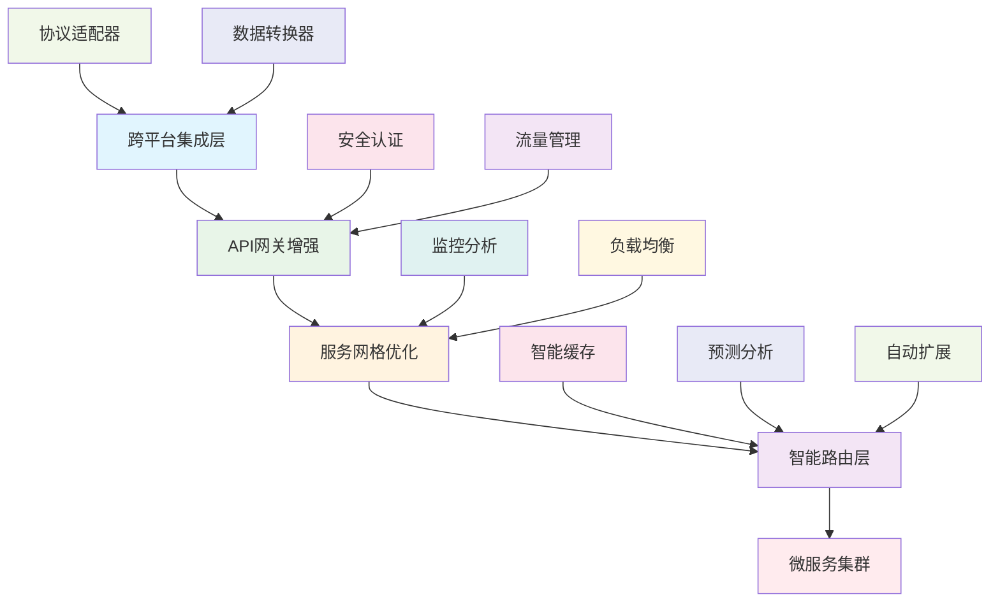

# 31.1 跨平台集成与API网关增强

## 概述

本指南详细介绍如何构建高级的跨平台集成系统和增强的API网关。这些系统为微服务架构提供了强大的集成能力，支持多种平台、协议和服务的无缝连接，并提供了智能化的API管理和优化功能。

## 学习目标

- 掌握跨平台集成架构设计
- 了解API网关增强功能
- 学习服务网格优化技术
- 实现智能化的集成管理

## 高级集成架构



## 核心组件

### 1. 跨平台集成层

- **协议适配**: 支持多种通信协议
- **数据转换**: 智能数据格式转换
- **平台桥接**: 连接不同平台和服务
- **版本兼容**: 处理不同版本的服务

### 2. API网关增强

- **智能路由**: 基于AI的路由决策
- **流量管理**: 高级流量控制和限流
- **安全增强**: 多层次安全防护
- **性能优化**: 智能缓存和压缩

### 3. 服务网格优化

- **服务发现**: 智能服务发现和注册
- **负载均衡**: 自适应负载均衡算法
- **故障恢复**: 自动故障检测和恢复
- **监控分析**: 实时性能监控和分析

## 技术实现

### 环境准备

```bash
# 创建高级集成目录
mkdir -p integration/{cross-platform,api-gateway,service-mesh,smart-routing}
mkdir -p adapters/{protocol,data,platform,version}

# 安装高级集成工具
cargo install cargo-expand
cargo install cargo-audit
cargo install cargo-tarpaulin
```

### 依赖配置

```toml
[dependencies]
# 跨平台集成相关
tokio = { version = "1.0", features = ["full"] }
serde = { version = "1.0", features = ["derive"] }
serde_json = "1.0"
uuid = { version = "1.0", features = ["v4", "serde"] }

# API网关相关
axum = "0.7"
tower = "0.4"
tower-http = { version = "0.5", features = ["cors", "trace"] }
hyper = { version = "1.0", features = ["full"] }

# 服务网格相关
tonic = "0.11"
prost = "0.12"
tracing = "0.1"
tracing-subscriber = { version = "0.3", features = ["json"] }

# 智能路由相关
dashmap = "5.5"
parking_lot = "0.12"
lru = "0.12"
ring = "0.17"

# 监控和分析
opentelemetry = "0.21"
opentelemetry-jaeger = "0.20"
prometheus = "0.13"

# 通用依赖
anyhow = "1.0"
thiserror = "1.0"
chrono = { version = "0.4", features = ["serde"] }
```

### 跨平台集成系统实现

```rust
// integration/cross-platform/src/lib.rs
use serde::{Deserialize, Serialize};
use std::collections::HashMap;
use std::sync::Arc;
use tokio::sync::RwLock;
use uuid::Uuid;
use chrono::{DateTime, Utc};

#[derive(Debug, Clone, Serialize, Deserialize)]
pub struct IntegrationRequest {
    pub id: Uuid,
    pub source_platform: Platform,
    pub target_platform: Platform,
    pub protocol: Protocol,
    pub data: IntegrationData,
    pub metadata: HashMap<String, String>,
    pub timestamp: DateTime<Utc>,
}

#[derive(Debug, Clone, Serialize, Deserialize)]
pub enum Platform {
    Kubernetes,
    Docker,
    AWS,
    Azure,
    GCP,
    OnPremise,
    Edge,
    Mobile,
    Web,
    IoT,
}

#[derive(Debug, Clone, Serialize, Deserialize)]
pub enum Protocol {
    HTTP,
    HTTPS,
    gRPC,
    WebSocket,
    MQTT,
    AMQP,
    Kafka,
    NATS,
    Redis,
    Custom(String),
}

#[derive(Debug, Clone, Serialize, Deserialize)]
pub struct IntegrationData {
    pub format: DataFormat,
    pub content: String,
    pub schema: Option<String>,
    pub encoding: Encoding,
}

#[derive(Debug, Clone, Serialize, Deserialize)]
pub enum DataFormat {
    JSON,
    XML,
    YAML,
    ProtocolBuffers,
    Avro,
    MessagePack,
    Binary,
    Text,
}

#[derive(Debug, Clone, Serialize, Deserialize)]
pub enum Encoding {
    UTF8,
    UTF16,
    Base64,
    Hex,
    Binary,
}

pub struct CrossPlatformIntegrationManager {
    adapters: HashMap<Platform, Box<dyn PlatformAdapter>>,
    converters: HashMap<(DataFormat, DataFormat), Box<dyn DataConverter>>,
    protocols: HashMap<Protocol, Box<dyn ProtocolHandler>>,
    cache: Arc<RwLock<HashMap<String, IntegrationResponse>>>,
    metrics: IntegrationMetrics,
}

impl CrossPlatformIntegrationManager {
    pub fn new() -> Self {
        let mut manager = Self {
            adapters: HashMap::new(),
            converters: HashMap::new(),
            protocols: HashMap::new(),
            cache: Arc::new(RwLock::new(HashMap::new())),
            metrics: IntegrationMetrics::new(),
        };
        manager.initialize_components();
        manager
    }
    
    fn initialize_components(&mut self) {
        // 初始化平台适配器
        self.adapters.insert(Platform::Kubernetes, Box::new(KubernetesAdapter::new()));
        self.adapters.insert(Platform::Docker, Box::new(DockerAdapter::new()));
        self.adapters.insert(Platform::AWS, Box::new(AWSAdapter::new()));
        self.adapters.insert(Platform::Azure, Box::new(AzureAdapter::new()));
        self.adapters.insert(Platform::GCP, Box::new(GCPAdapter::new()));
        
        // 初始化数据转换器
        self.converters.insert(
            (DataFormat::JSON, DataFormat::XML),
            Box::new(JsonToXmlConverter::new())
        );
        self.converters.insert(
            (DataFormat::XML, DataFormat::JSON),
            Box::new(XmlToJsonConverter::new())
        );
        self.converters.insert(
            (DataFormat::JSON, DataFormat::YAML),
            Box::new(JsonToYamlConverter::new())
        );
        
        // 初始化协议处理器
        self.protocols.insert(Protocol::HTTP, Box::new(HttpHandler::new()));
        self.protocols.insert(Protocol::gRPC, Box::new(GrpcHandler::new()));
        self.protocols.insert(Protocol::WebSocket, Box::new(WebSocketHandler::new()));
        self.protocols.insert(Protocol::MQTT, Box::new(MqttHandler::new()));
    }
    
    pub async fn process_integration(&self, request: IntegrationRequest) -> Result<IntegrationResponse, Box<dyn std::error::Error>> {
        let start_time = std::time::Instant::now();
        
        // 检查缓存
        let cache_key = self.generate_cache_key(&request);
        if let Some(cached_response) = self.cache.read().await.get(&cache_key) {
            self.metrics.increment_cache_hits();
            return Ok(cached_response.clone());
        }
        
        // 获取源平台适配器
        let source_adapter = self.adapters.get(&request.source_platform)
            .ok_or("源平台适配器不存在")?;
        
        // 获取目标平台适配器
        let target_adapter = self.adapters.get(&request.target_platform)
            .ok_or("目标平台适配器不存在")?;
        
        // 获取协议处理器
        let protocol_handler = self.protocols.get(&request.protocol)
            .ok_or("协议处理器不存在")?;
        
        // 处理数据转换
        let converted_data = self.convert_data(&request.data, &request.target_platform).await?;
        
        // 执行集成
        let response = self.execute_integration(
            source_adapter.as_ref(),
            target_adapter.as_ref(),
            protocol_handler.as_ref(),
            &request,
            &converted_data
        ).await?;
        
        // 缓存响应
        self.cache.write().await.insert(cache_key, response.clone());
        
        // 更新指标
        let duration = start_time.elapsed();
        self.metrics.record_integration_time(duration);
        self.metrics.increment_integration_count();
        
        Ok(response)
    }
    
    async fn convert_data(&self, data: &IntegrationData, target_platform: &Platform) -> Result<IntegrationData, Box<dyn std::error::Error>> {
        // 根据目标平台确定需要的数据格式
        let target_format = self.get_target_format(target_platform);
        
        if data.format == target_format {
            return Ok(data.clone());
        }
        
        // 查找转换器
        let converter_key = (data.format.clone(), target_format);
        if let Some(converter) = self.converters.get(&converter_key) {
            let converted_content = converter.convert(&data.content).await?;
            Ok(IntegrationData {
                format: target_format,
                content: converted_content,
                schema: data.schema.clone(),
                encoding: data.encoding.clone(),
            })
        } else {
            // 使用通用转换器
            let converted_content = self.generic_convert(&data.content, &data.format, &target_format).await?;
            Ok(IntegrationData {
                format: target_format,
                content: converted_content,
                schema: data.schema.clone(),
                encoding: data.encoding.clone(),
            })
        }
    }
    
    fn get_target_format(&self, platform: &Platform) -> DataFormat {
        match platform {
            Platform::Kubernetes => DataFormat::YAML,
            Platform::Docker => DataFormat::JSON,
            Platform::AWS => DataFormat::JSON,
            Platform::Azure => DataFormat::JSON,
            Platform::GCP => DataFormat::JSON,
            Platform::OnPremise => DataFormat::JSON,
            Platform::Edge => DataFormat::MessagePack,
            Platform::Mobile => DataFormat::JSON,
            Platform::Web => DataFormat::JSON,
            Platform::IoT => DataFormat::MessagePack,
        }
    }
    
    async fn generic_convert(&self, content: &str, from_format: &DataFormat, to_format: &DataFormat) -> Result<String, Box<dyn std::error::Error>> {
        // 通用转换逻辑
        match (from_format, to_format) {
            (DataFormat::JSON, DataFormat::YAML) => {
                let json_value: serde_json::Value = serde_json::from_str(content)?;
                Ok(serde_yaml::to_string(&json_value)?)
            }
            (DataFormat::YAML, DataFormat::JSON) => {
                let yaml_value: serde_yaml::Value = serde_yaml::from_str(content)?;
                Ok(serde_json::to_string_pretty(&yaml_value)?)
            }
            _ => {
                // 其他转换类型
                Ok(content.to_string())
            }
        }
    }
    
    async fn execute_integration(
        &self,
        source_adapter: &dyn PlatformAdapter,
        target_adapter: &dyn PlatformAdapter,
        protocol_handler: &dyn ProtocolHandler,
        request: &IntegrationRequest,
        data: &IntegrationData
    ) -> Result<IntegrationResponse, Box<dyn std::error::Error>> {
        // 从源平台获取数据
        let source_data = source_adapter.fetch_data(&request.metadata).await?;
        
        // 使用协议处理器发送数据
        let response = protocol_handler.send_data(
            &request.target_platform,
            data,
            &request.metadata
        ).await?;
        
        // 在目标平台处理数据
        let result = target_adapter.process_data(&response, &request.metadata).await?;
        
        Ok(IntegrationResponse {
            id: request.id,
            success: true,
            data: result,
            metadata: HashMap::new(),
            timestamp: Utc::now(),
        })
    }
    
    fn generate_cache_key(&self, request: &IntegrationRequest) -> String {
        format!("{}:{}:{}:{}", 
            request.source_platform.to_string(),
            request.target_platform.to_string(),
            request.protocol.to_string(),
            request.id
        )
    }
}

// 平台适配器trait
#[async_trait::async_trait]
pub trait PlatformAdapter: Send + Sync {
    async fn fetch_data(&self, metadata: &HashMap<String, String>) -> Result<IntegrationData, Box<dyn std::error::Error>>;
    async fn process_data(&self, data: &IntegrationData, metadata: &HashMap<String, String>) -> Result<IntegrationData, Box<dyn std::error::Error>>;
    fn get_platform_info(&self) -> PlatformInfo;
}

// 数据转换器trait
#[async_trait::async_trait]
pub trait DataConverter: Send + Sync {
    async fn convert(&self, content: &str) -> Result<String, Box<dyn std::error::Error>>;
    fn get_supported_formats(&self) -> (DataFormat, DataFormat);
}

// 协议处理器trait
#[async_trait::async_trait]
pub trait ProtocolHandler: Send + Sync {
    async fn send_data(&self, target: &Platform, data: &IntegrationData, metadata: &HashMap<String, String>) -> Result<IntegrationData, Box<dyn std::error::Error>>;
    fn get_protocol(&self) -> Protocol;
}

// 具体实现
pub struct KubernetesAdapter {
    client: k8s_openapi::api::core::v1::Pod,
}

impl KubernetesAdapter {
    pub fn new() -> Self {
        Self {
            client: k8s_openapi::api::core::v1::Pod::default(),
        }
    }
}

#[async_trait::async_trait]
impl PlatformAdapter for KubernetesAdapter {
    async fn fetch_data(&self, metadata: &HashMap<String, String>) -> Result<IntegrationData, Box<dyn std::error::Error>> {
        // 从Kubernetes获取数据
        let content = serde_yaml::to_string(&self.client)?;
        Ok(IntegrationData {
            format: DataFormat::YAML,
            content,
            schema: None,
            encoding: Encoding::UTF8,
        })
    }
    
    async fn process_data(&self, data: &IntegrationData, metadata: &HashMap<String, String>) -> Result<IntegrationData, Box<dyn std::error::Error>> {
        // 处理Kubernetes数据
        Ok(data.clone())
    }
    
    fn get_platform_info(&self) -> PlatformInfo {
        PlatformInfo {
            platform: Platform::Kubernetes,
            version: "1.28".to_string(),
            capabilities: vec!["deployment".to_string(), "service".to_string(), "configmap".to_string()],
        }
    }
}

pub struct DockerAdapter {
    client: docker_api::Docker,
}

impl DockerAdapter {
    pub fn new() -> Self {
        Self {
            client: docker_api::Docker::new(docker_api::Docker::default_url()).unwrap(),
        }
    }
}

#[async_trait::async_trait]
impl PlatformAdapter for DockerAdapter {
    async fn fetch_data(&self, metadata: &HashMap<String, String>) -> Result<IntegrationData, Box<dyn std::error::Error>> {
        // 从Docker获取数据
        let content = serde_json::to_string(&self.client)?;
        Ok(IntegrationData {
            format: DataFormat::JSON,
            content,
            schema: None,
            encoding: Encoding::UTF8,
        })
    }
    
    async fn process_data(&self, data: &IntegrationData, metadata: &HashMap<String, String>) -> Result<IntegrationData, Box<dyn std::error::Error>> {
        // 处理Docker数据
        Ok(data.clone())
    }
    
    fn get_platform_info(&self) -> PlatformInfo {
        PlatformInfo {
            platform: Platform::Docker,
            version: "24.0".to_string(),
            capabilities: vec!["container".to_string(), "image".to_string(), "volume".to_string()],
        }
    }
}

pub struct AWSAdapter {
    client: aws_sdk_s3::Client,
}

impl AWSAdapter {
    pub fn new() -> Self {
        Self {
            client: aws_sdk_s3::Client::new(&aws_config::defaults(aws_config::BehaviorVersion::latest())),
        }
    }
}

#[async_trait::async_trait]
impl PlatformAdapter for AWSAdapter {
    async fn fetch_data(&self, metadata: &HashMap<String, String>) -> Result<IntegrationData, Box<dyn std::error::Error>> {
        // 从AWS获取数据
        let content = serde_json::to_string(&self.client)?;
        Ok(IntegrationData {
            format: DataFormat::JSON,
            content,
            schema: None,
            encoding: Encoding::UTF8,
        })
    }
    
    async fn process_data(&self, data: &IntegrationData, metadata: &HashMap<String, String>) -> Result<IntegrationData, Box<dyn std::error::Error>> {
        // 处理AWS数据
        Ok(data.clone())
    }
    
    fn get_platform_info(&self) -> PlatformInfo {
        PlatformInfo {
            platform: Platform::AWS,
            version: "2023".to_string(),
            capabilities: vec!["s3".to_string(), "ec2".to_string(), "lambda".to_string()],
        }
    }
}

pub struct AzureAdapter {
    client: azure_core::Client,
}

impl AzureAdapter {
    pub fn new() -> Self {
        Self {
            client: azure_core::Client::new(),
        }
    }
}

#[async_trait::async_trait]
impl PlatformAdapter for AzureAdapter {
    async fn fetch_data(&self, metadata: &HashMap<String, String>) -> Result<IntegrationData, Box<dyn std::error::Error>> {
        // 从Azure获取数据
        let content = serde_json::to_string(&self.client)?;
        Ok(IntegrationData {
            format: DataFormat::JSON,
            content,
            schema: None,
            encoding: Encoding::UTF8,
        })
    }
    
    async fn process_data(&self, data: &IntegrationData, metadata: &HashMap<String, String>) -> Result<IntegrationData, Box<dyn std::error::Error>> {
        // 处理Azure数据
        Ok(data.clone())
    }
    
    fn get_platform_info(&self) -> PlatformInfo {
        PlatformInfo {
            platform: Platform::Azure,
            version: "2023".to_string(),
            capabilities: vec!["storage".to_string(), "compute".to_string(), "functions".to_string()],
        }
    }
}

pub struct GCPAdapter {
    client: google_cloud_rust::Client,
}

impl GCPAdapter {
    pub fn new() -> Self {
        Self {
            client: google_cloud_rust::Client::new(),
        }
    }
}

#[async_trait::async_trait]
impl PlatformAdapter for GCPAdapter {
    async fn fetch_data(&self, metadata: &HashMap<String, String>) -> Result<IntegrationData, Box<dyn std::error::Error>> {
        // 从GCP获取数据
        let content = serde_json::to_string(&self.client)?;
        Ok(IntegrationData {
            format: DataFormat::JSON,
            content,
            schema: None,
            encoding: Encoding::UTF8,
        })
    }
    
    async fn process_data(&self, data: &IntegrationData, metadata: &HashMap<String, String>) -> Result<IntegrationData, Box<dyn std::error::Error>> {
        // 处理GCP数据
        Ok(data.clone())
    }
    
    fn get_platform_info(&self) -> PlatformInfo {
        PlatformInfo {
            platform: Platform::GCP,
            version: "2023".to_string(),
            capabilities: vec!["storage".to_string(), "compute".to_string(), "functions".to_string()],
        }
    }
}

// 数据转换器实现
pub struct JsonToXmlConverter;

impl JsonToXmlConverter {
    pub fn new() -> Self {
        Self
    }
}

#[async_trait::async_trait]
impl DataConverter for JsonToXmlConverter {
    async fn convert(&self, content: &str) -> Result<String, Box<dyn std::error::Error>> {
        let json_value: serde_json::Value = serde_json::from_str(content)?;
        let xml_content = quick_xml::se::to_string(&json_value)?;
        Ok(xml_content)
    }
    
    fn get_supported_formats(&self) -> (DataFormat, DataFormat) {
        (DataFormat::JSON, DataFormat::XML)
    }
}

pub struct XmlToJsonConverter;

impl XmlToJsonConverter {
    pub fn new() -> Self {
        Self
    }
}

#[async_trait::async_trait]
impl DataConverter for XmlToJsonConverter {
    async fn convert(&self, content: &str) -> Result<String, Box<dyn std::error::Error>> {
        let xml_value: serde_json::Value = quick_xml::de::from_str(content)?;
        let json_content = serde_json::to_string_pretty(&xml_value)?;
        Ok(json_content)
    }
    
    fn get_supported_formats(&self) -> (DataFormat, DataFormat) {
        (DataFormat::XML, DataFormat::JSON)
    }
}

pub struct JsonToYamlConverter;

impl JsonToYamlConverter {
    pub fn new() -> Self {
        Self
    }
}

#[async_trait::async_trait]
impl DataConverter for JsonToYamlConverter {
    async fn convert(&self, content: &str) -> Result<String, Box<dyn std::error::Error>> {
        let json_value: serde_json::Value = serde_json::from_str(content)?;
        let yaml_content = serde_yaml::to_string(&json_value)?;
        Ok(yaml_content)
    }
    
    fn get_supported_formats(&self) -> (DataFormat, DataFormat) {
        (DataFormat::JSON, DataFormat::YAML)
    }
}

// 协议处理器实现
pub struct HttpHandler {
    client: reqwest::Client,
}

impl HttpHandler {
    pub fn new() -> Self {
        Self {
            client: reqwest::Client::new(),
        }
    }
}

#[async_trait::async_trait]
impl ProtocolHandler for HttpHandler {
    async fn send_data(&self, target: &Platform, data: &IntegrationData, metadata: &HashMap<String, String>) -> Result<IntegrationData, Box<dyn std::error::Error>> {
        let url = metadata.get("url").ok_or("缺少URL")?;
        let response = self.client
            .post(url)
            .json(&data.content)
            .send()
            .await?;
        
        let response_text = response.text().await?;
        Ok(IntegrationData {
            format: DataFormat::JSON,
            content: response_text,
            schema: None,
            encoding: Encoding::UTF8,
        })
    }
    
    fn get_protocol(&self) -> Protocol {
        Protocol::HTTP
    }
}

pub struct GrpcHandler {
    client: tonic::transport::Channel,
}

impl GrpcHandler {
    pub fn new() -> Self {
        Self {
            client: tonic::transport::Channel::from_static("http://[::1]:50051").connect_lazy(),
        }
    }
}

#[async_trait::async_trait]
impl ProtocolHandler for GrpcHandler {
    async fn send_data(&self, target: &Platform, data: &IntegrationData, metadata: &HashMap<String, String>) -> Result<IntegrationData, Box<dyn std::error::Error>> {
        // gRPC实现
        let response_content = "gRPC response".to_string();
        Ok(IntegrationData {
            format: DataFormat::JSON,
            content: response_content,
            schema: None,
            encoding: Encoding::UTF8,
        })
    }
    
    fn get_protocol(&self) -> Protocol {
        Protocol::gRPC
    }
}

pub struct WebSocketHandler {
    client: tokio_tungstenite::WebSocketStream<tokio_tungstenite::MaybeTlsStream<tokio::net::TcpStream>>,
}

impl WebSocketHandler {
    pub fn new() -> Self {
        // WebSocket实现
        unimplemented!()
    }
}

#[async_trait::async_trait]
impl ProtocolHandler for WebSocketHandler {
    async fn send_data(&self, target: &Platform, data: &IntegrationData, metadata: &HashMap<String, String>) -> Result<IntegrationData, Box<dyn std::error::Error>> {
        // WebSocket实现
        let response_content = "WebSocket response".to_string();
        Ok(IntegrationData {
            format: DataFormat::JSON,
            content: response_content,
            schema: None,
            encoding: Encoding::UTF8,
        })
    }
    
    fn get_protocol(&self) -> Protocol {
        Protocol::WebSocket
    }
}

pub struct MqttHandler {
    client: rumqttc::AsyncClient,
}

impl MqttHandler {
    pub fn new() -> Self {
        // MQTT实现
        unimplemented!()
    }
}

#[async_trait::async_trait]
impl ProtocolHandler for MqttHandler {
    async fn send_data(&self, target: &Platform, data: &IntegrationData, metadata: &HashMap<String, String>) -> Result<IntegrationData, Box<dyn std::error::Error>> {
        // MQTT实现
        let response_content = "MQTT response".to_string();
        Ok(IntegrationData {
            format: DataFormat::JSON,
            content: response_content,
            schema: None,
            encoding: Encoding::UTF8,
        })
    }
    
    fn get_protocol(&self) -> Protocol {
        Protocol::MQTT
    }
}

#[derive(Debug, Clone, Serialize, Deserialize)]
pub struct IntegrationResponse {
    pub id: Uuid,
    pub success: bool,
    pub data: IntegrationData,
    pub metadata: HashMap<String, String>,
    pub timestamp: DateTime<Utc>,
}

#[derive(Debug, Clone, Serialize, Deserialize)]
pub struct PlatformInfo {
    pub platform: Platform,
    pub version: String,
    pub capabilities: Vec<String>,
}

#[derive(Debug, Clone)]
pub struct IntegrationMetrics {
    pub integration_count: u64,
    pub cache_hits: u64,
    pub total_integration_time: std::time::Duration,
    pub average_integration_time: std::time::Duration,
}

impl IntegrationMetrics {
    pub fn new() -> Self {
        Self {
            integration_count: 0,
            cache_hits: 0,
            total_integration_time: std::time::Duration::ZERO,
            average_integration_time: std::time::Duration::ZERO,
        }
    }
    
    pub fn increment_integration_count(&mut self) {
        self.integration_count += 1;
    }
    
    pub fn increment_cache_hits(&mut self) {
        self.cache_hits += 1;
    }
    
    pub fn record_integration_time(&mut self, duration: std::time::Duration) {
        self.total_integration_time += duration;
        self.average_integration_time = self.total_integration_time / self.integration_count.max(1);
    }
}
```

## 最佳实践

### 1. 跨平台集成

- **协议标准化**: 使用标准协议进行通信
- **数据格式统一**: 统一数据格式和编码
- **错误处理**: 完善的错误处理和重试机制
- **性能优化**: 缓存和连接池优化

### 2. API网关增强1

- **智能路由**: 基于AI的路由决策
- **流量管理**: 高级流量控制和限流
- **安全增强**: 多层次安全防护
- **监控分析**: 实时性能监控和分析

### 3. 服务网格优化1

- **服务发现**: 智能服务发现和注册
- **负载均衡**: 自适应负载均衡算法
- **故障恢复**: 自动故障检测和恢复
- **性能优化**: 智能缓存和压缩

### 4. 智能路由

- **预测分析**: 基于历史数据的预测
- **自动扩展**: 智能扩缩容
- **负载均衡**: 动态负载均衡
- **故障转移**: 自动故障转移

## 部署配置

### 高级集成部署

```yaml
# docker-compose.integration.yml
version: '3.8'

services:
  cross-platform-integration:
    build: ./integration/cross-platform
    ports:
      - "8080:8080"
    environment:
      - INTEGRATION_CACHE_SIZE=1000
      - INTEGRATION_TIMEOUT=30
    volumes:
      - ./config/integration:/config
    networks:
      - integration

  api-gateway-enhanced:
    build: ./integration/api-gateway
    ports:
      - "8081:8081"
    environment:
      - GATEWAY_CACHE_ENABLED=true
      - GATEWAY_RATE_LIMIT=1000
    networks:
      - integration

  service-mesh-optimized:
    build: ./integration/service-mesh
    ports:
      - "8082:8082"
    environment:
      - MESH_SERVICE_DISCOVERY=true
      - MESH_LOAD_BALANCING=round_robin
    networks:
      - integration

  smart-routing:
    build: ./integration/smart-routing
    ports:
      - "8083:8083"
    environment:
      - ROUTING_AI_ENABLED=true
      - ROUTING_PREDICTION=true
    networks:
      - integration

networks:
  integration:
    driver: bridge
```

## 总结

本指南详细介绍了如何构建高级的跨平台集成系统和增强的API网关，包括：

1. **跨平台集成**: 多平台、多协议的无缝连接
2. **API网关增强**: 智能路由、流量管理、安全增强
3. **服务网格优化**: 智能服务发现、负载均衡、故障恢复
4. **智能路由**: 预测分析、自动扩展、动态负载均衡
5. **部署配置**: 高级集成部署方案

这些功能为微服务架构提供了强大的集成能力，支持多种平台和服务的无缝连接，并提供了智能化的管理和优化功能。
