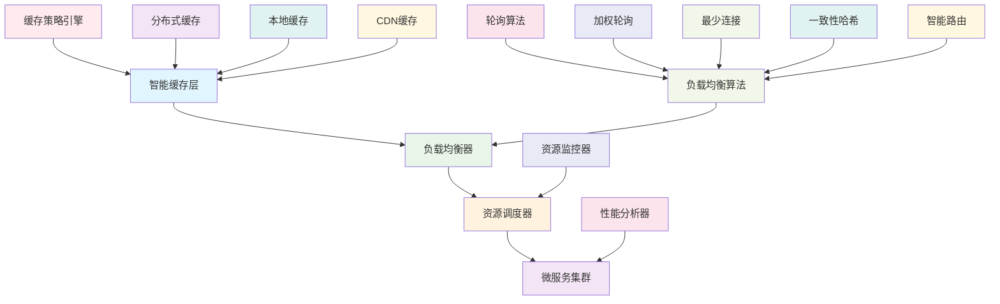

# 32.1 智能缓存与负载均衡

## 概述

本指南详细介绍如何构建智能化的缓存系统和负载均衡系统。这些系统为微服务架构提供了高性能的数据访问和请求分发能力，通过智能化的缓存策略和负载均衡算法，显著提升系统的性能和可靠性。

## 学习目标

- 掌握智能缓存系统设计
- 了解负载均衡算法实现
- 学习资源调度优化技术
- 实现性能监控和调优

## 性能优化架构



## 核心组件

### 1. 智能缓存系统

- **多级缓存**: 本地缓存、分布式缓存、CDN缓存
- **缓存策略**: LRU、LFU、TTL、智能预取
- **缓存一致性**: 强一致性、最终一致性
- **缓存监控**: 命中率、性能指标、容量管理

### 2. 负载均衡系统

- **算法选择**: 轮询、加权、最少连接、一致性哈希
- **健康检查**: 服务健康状态监控
- **故障转移**: 自动故障检测和转移
- **动态调整**: 基于负载的动态调整

### 3. 资源调度系统

- **资源监控**: CPU、内存、网络、存储监控
- **调度策略**: 基于资源利用率的调度
- **弹性伸缩**: 自动扩缩容
- **成本优化**: 资源成本优化

## 技术实现

### 环境准备

```bash
# 创建性能优化目录
mkdir -p performance/{cache,load-balancer,resource-scheduler,monitoring}
mkdir -p cache/{local,distributed,cdn}

# 安装性能优化工具
cargo install cargo-flamegraph
cargo install cargo-profdata
cargo install cargo-criterion
```

### 依赖配置

```toml
[dependencies]
# 缓存相关
redis = { version = "0.24", features = ["tokio-comp"] }
memcached = "0.3"
lru = "0.12"
dashmap = "5.5"

# 负载均衡相关
tokio = { version = "1.0", features = ["full"] }
hyper = { version = "1.0", features = ["full"] }
tower = "0.4"
tower-http = { version = "0.5", features = ["cors", "trace"] }

# 监控相关
prometheus = "0.13"
opentelemetry = "0.21"
opentelemetry-jaeger = "0.20"
tracing = "0.1"
tracing-subscriber = { version = "0.3", features = ["json"] }

# 序列化相关
serde = { version = "1.0", features = ["derive"] }
serde_json = "1.0"
bincode = "1.3"

# 通用依赖
anyhow = "1.0"
thiserror = "1.0"
chrono = { version = "0.4", features = ["serde"] }
uuid = { version = "1.0", features = ["v4", "serde"] }
```

### 智能缓存系统实现

```rust
// performance/cache/src/lib.rs
use serde::{Deserialize, Serialize};
use std::collections::HashMap;
use std::sync::Arc;
use std::time::{Duration, Instant};
use tokio::sync::RwLock;
use uuid::Uuid;
use chrono::{DateTime, Utc};

#[derive(Debug, Clone, Serialize, Deserialize)]
pub struct CacheEntry<T> {
    pub key: String,
    pub value: T,
    pub created_at: DateTime<Utc>,
    pub expires_at: Option<DateTime<Utc>>,
    pub access_count: u64,
    pub last_accessed: DateTime<Utc>,
    pub size: usize,
}

#[derive(Debug, Clone, Serialize, Deserialize)]
pub enum CacheStrategy {
    LRU,    // Least Recently Used
    LFU,    // Least Frequently Used
    TTL,    // Time To Live
    FIFO,   // First In First Out
    LIFO,   // Last In First Out
    Custom(String),
}

#[derive(Debug, Clone, Serialize, Deserialize)]
pub struct CacheConfig {
    pub max_size: usize,
    pub max_memory: usize,
    pub default_ttl: Duration,
    pub strategy: CacheStrategy,
    pub enable_compression: bool,
    pub enable_encryption: bool,
}

pub struct IntelligentCache<T> {
    local_cache: Arc<RwLock<HashMap<String, CacheEntry<T>>>>,
    distributed_cache: Arc<dyn DistributedCache<T>>,
    cdn_cache: Arc<dyn CDNCache<T>>,
    config: CacheConfig,
    metrics: CacheMetrics,
    strategy_engine: CacheStrategyEngine,
}

impl<T> IntelligentCache<T>
where
    T: Clone + Serialize + for<'de> Deserialize<'de> + Send + Sync + 'static,
{
    pub fn new(
        config: CacheConfig,
        distributed_cache: Arc<dyn DistributedCache<T>>,
        cdn_cache: Arc<dyn CDNCache<T>>,
    ) -> Self {
        Self {
            local_cache: Arc::new(RwLock::new(HashMap::new())),
            distributed_cache,
            cdn_cache,
            config,
            metrics: CacheMetrics::new(),
            strategy_engine: CacheStrategyEngine::new(),
        }
    }
    
    pub async fn get(&self, key: &str) -> Result<Option<T>, Box<dyn std::error::Error>> {
        let start_time = Instant::now();
        
        // 1. 检查本地缓存
        if let Some(value) = self.get_from_local_cache(key).await? {
            self.metrics.increment_hits();
            self.metrics.record_access_time(start_time.elapsed());
            return Ok(Some(value));
        }
        
        // 2. 检查分布式缓存
        if let Some(value) = self.get_from_distributed_cache(key).await? {
            // 将值存储到本地缓存
            self.set_to_local_cache(key, &value).await?;
            self.metrics.increment_hits();
            self.metrics.record_access_time(start_time.elapsed());
            return Ok(Some(value));
        }
        
        // 3. 检查CDN缓存
        if let Some(value) = self.get_from_cdn_cache(key).await? {
            // 将值存储到本地和分布式缓存
            self.set_to_local_cache(key, &value).await?;
            self.set_to_distributed_cache(key, &value).await?;
            self.metrics.increment_hits();
            self.metrics.record_access_time(start_time.elapsed());
            return Ok(Some(value));
        }
        
        self.metrics.increment_misses();
        self.metrics.record_access_time(start_time.elapsed());
        Ok(None)
    }
    
    pub async fn set(&self, key: &str, value: T, ttl: Option<Duration>) -> Result<(), Box<dyn std::error::Error>> {
        let start_time = Instant::now();
        
        // 设置到所有缓存层
        self.set_to_local_cache(key, &value).await?;
        self.set_to_distributed_cache(key, &value).await?;
        self.set_to_cdn_cache(key, &value).await?;
        
        self.metrics.increment_sets();
        self.metrics.record_set_time(start_time.elapsed());
        Ok(())
    }
    
    pub async fn delete(&self, key: &str) -> Result<(), Box<dyn std::error::Error>> {
        // 从所有缓存层删除
        self.delete_from_local_cache(key).await?;
        self.delete_from_distributed_cache(key).await?;
        self.delete_from_cdn_cache(key).await?;
        
        self.metrics.increment_deletes();
        Ok(())
    }
    
    async fn get_from_local_cache(&self, key: &str) -> Result<Option<T>, Box<dyn std::error::Error>> {
        let mut cache = self.local_cache.write().await;
        if let Some(entry) = cache.get_mut(key) {
            // 检查是否过期
            if let Some(expires_at) = entry.expires_at {
                if Utc::now() > expires_at {
                    cache.remove(key);
                    return Ok(None);
                }
            }
            
            // 更新访问统计
            entry.access_count += 1;
            entry.last_accessed = Utc::now();
            
            Ok(Some(entry.value.clone()))
        } else {
            Ok(None)
        }
    }
    
    async fn get_from_distributed_cache(&self, key: &str) -> Result<Option<T>, Box<dyn std::error::Error>> {
        self.distributed_cache.get(key).await
    }
    
    async fn get_from_cdn_cache(&self, key: &str) -> Result<Option<T>, Box<dyn std::error::Error>> {
        self.cdn_cache.get(key).await
    }
    
    async fn set_to_local_cache(&self, key: &str, value: &T) -> Result<(), Box<dyn std::error::Error>> {
        let mut cache = self.local_cache.write().await;
        
        // 检查缓存大小限制
        if cache.len() >= self.config.max_size {
            self.evict_entries(&mut cache).await?;
        }
        
        let entry = CacheEntry {
            key: key.to_string(),
            value: value.clone(),
            created_at: Utc::now(),
            expires_at: Some(Utc::now() + chrono::Duration::from_std(self.config.default_ttl)?),
            access_count: 1,
            last_accessed: Utc::now(),
            size: bincode::serialize(value)?.len(),
        };
        
        cache.insert(key.to_string(), entry);
        Ok(())
    }
    
    async fn set_to_distributed_cache(&self, key: &str, value: &T) -> Result<(), Box<dyn std::error::Error>> {
        self.distributed_cache.set(key, value, self.config.default_ttl).await
    }
    
    async fn set_to_cdn_cache(&self, key: &str, value: &T) -> Result<(), Box<dyn std::error::Error>> {
        self.cdn_cache.set(key, value, self.config.default_ttl).await
    }
    
    async fn delete_from_local_cache(&self, key: &str) -> Result<(), Box<dyn std::error::Error>> {
        let mut cache = self.local_cache.write().await;
        cache.remove(key);
        Ok(())
    }
    
    async fn delete_from_distributed_cache(&self, key: &str) -> Result<(), Box<dyn std::error::Error>> {
        self.distributed_cache.delete(key).await
    }
    
    async fn delete_from_cdn_cache(&self, key: &str) -> Result<(), Box<dyn std::error::Error>> {
        self.cdn_cache.delete(key).await
    }
    
    async fn evict_entries(&self, cache: &mut HashMap<String, CacheEntry<T>>) -> Result<(), Box<dyn std::error::Error>> {
        let entries_to_evict = self.strategy_engine.select_entries_to_evict(cache, &self.config).await?;
        
        for key in entries_to_evict {
            cache.remove(&key);
        }
        
        Ok(())
    }
    
    pub async fn get_metrics(&self) -> CacheMetrics {
        self.metrics.clone()
    }
    
    pub async fn clear(&self) -> Result<(), Box<dyn std::error::Error>> {
        self.local_cache.write().await.clear();
        self.distributed_cache.clear().await?;
        self.cdn_cache.clear().await?;
        Ok(())
    }
}

// 分布式缓存trait
#[async_trait::async_trait]
pub trait DistributedCache<T>: Send + Sync {
    async fn get(&self, key: &str) -> Result<Option<T>, Box<dyn std::error::Error>>;
    async fn set(&self, key: &str, value: &T, ttl: Duration) -> Result<(), Box<dyn std::error::Error>>;
    async fn delete(&self, key: &str) -> Result<(), Box<dyn std::error::Error>>;
    async fn clear(&self) -> Result<(), Box<dyn std::error::Error>>;
}

// CDN缓存trait
#[async_trait::async_trait]
pub trait CDNCache<T>: Send + Sync {
    async fn get(&self, key: &str) -> Result<Option<T>, Box<dyn std::error::Error>>;
    async fn set(&self, key: &str, value: &T, ttl: Duration) -> Result<(), Box<dyn std::error::Error>>;
    async fn delete(&self, key: &str) -> Result<(), Box<dyn std::error::Error>>;
    async fn clear(&self) -> Result<(), Box<dyn std::error::Error>>;
}

// Redis分布式缓存实现
pub struct RedisCache<T> {
    client: redis::Client,
    connection: redis::aio::Connection,
}

impl<T> RedisCache<T>
where
    T: Serialize + for<'de> Deserialize<'de> + Send + Sync + 'static,
{
    pub async fn new(redis_url: &str) -> Result<Self, Box<dyn std::error::Error>> {
        let client = redis::Client::open(redis_url)?;
        let connection = client.get_async_connection().await?;
        
        Ok(Self {
            client,
            connection,
        })
    }
}

#[async_trait::async_trait]
impl<T> DistributedCache<T> for RedisCache<T>
where
    T: Serialize + for<'de> Deserialize<'de> + Send + Sync + 'static,
{
    async fn get(&self, key: &str) -> Result<Option<T>, Box<dyn std::error::Error>> {
        let mut conn = self.client.get_async_connection().await?;
        let result: Option<String> = redis::cmd("GET")
            .arg(key)
            .query_async(&mut conn)
            .await?;
        
        if let Some(data) = result {
            let value: T = bincode::deserialize(&data)?;
            Ok(Some(value))
        } else {
            Ok(None)
        }
    }
    
    async fn set(&self, key: &str, value: &T, ttl: Duration) -> Result<(), Box<dyn std::error::Error>> {
        let mut conn = self.client.get_async_connection().await?;
        let data = bincode::serialize(value)?;
        
        redis::cmd("SETEX")
            .arg(key)
            .arg(ttl.as_secs())
            .arg(data)
            .query_async(&mut conn)
            .await?;
        
        Ok(())
    }
    
    async fn delete(&self, key: &str) -> Result<(), Box<dyn std::error::Error>> {
        let mut conn = self.client.get_async_connection().await?;
        redis::cmd("DEL")
            .arg(key)
            .query_async(&mut conn)
            .await?;
        
        Ok(())
    }
    
    async fn clear(&self) -> Result<(), Box<dyn std::error::Error>> {
        let mut conn = self.client.get_async_connection().await?;
        redis::cmd("FLUSHDB")
            .query_async(&mut conn)
            .await?;
        
        Ok(())
    }
}

// CDN缓存实现
pub struct CDNCacheImpl<T> {
    client: reqwest::Client,
    base_url: String,
}

impl<T> CDNCacheImpl<T>
where
    T: Serialize + for<'de> Deserialize<'de> + Send + Sync + 'static,
{
    pub fn new(base_url: String) -> Self {
        Self {
            client: reqwest::Client::new(),
            base_url,
        }
    }
}

#[async_trait::async_trait]
impl<T> CDNCache<T> for CDNCacheImpl<T>
where
    T: Serialize + for<'de> Deserialize<'de> + Send + Sync + 'static,
{
    async fn get(&self, key: &str) -> Result<Option<T>, Box<dyn std::error::Error>> {
        let url = format!("{}/cache/{}", self.base_url, key);
        let response = self.client.get(&url).send().await?;
        
        if response.status().is_success() {
            let data = response.bytes().await?;
            let value: T = bincode::deserialize(&data)?;
            Ok(Some(value))
        } else {
            Ok(None)
        }
    }
    
    async fn set(&self, key: &str, value: &T, ttl: Duration) -> Result<(), Box<dyn std::error::Error>> {
        let url = format!("{}/cache/{}", self.base_url, key);
        let data = bincode::serialize(value)?;
        
        self.client
            .put(&url)
            .header("Cache-Control", format!("max-age={}", ttl.as_secs()))
            .body(data)
            .send()
            .await?;
        
        Ok(())
    }
    
    async fn delete(&self, key: &str) -> Result<(), Box<dyn std::error::Error>> {
        let url = format!("{}/cache/{}", self.base_url, key);
        self.client.delete(&url).send().await?;
        Ok(())
    }
    
    async fn clear(&self) -> Result<(), Box<dyn std::error::Error>> {
        let url = format!("{}/cache", self.base_url);
        self.client.delete(&url).send().await?;
        Ok(())
    }
}

// 缓存策略引擎
pub struct CacheStrategyEngine;

impl CacheStrategyEngine {
    pub fn new() -> Self {
        Self
    }
    
    pub async fn select_entries_to_evict<T>(
        &self,
        cache: &HashMap<String, CacheEntry<T>>,
        config: &CacheConfig,
    ) -> Result<Vec<String>, Box<dyn std::error::Error>> {
        let mut entries_to_evict = Vec::new();
        let evict_count = cache.len() / 4; // 清理25%的条目
        
        match config.strategy {
            CacheStrategy::LRU => {
                let mut entries: Vec<_> = cache.iter().collect();
                entries.sort_by(|a, b| a.1.last_accessed.cmp(&b.1.last_accessed));
                
                for (key, _) in entries.iter().take(evict_count) {
                    entries_to_evict.push(key.clone());
                }
            }
            CacheStrategy::LFU => {
                let mut entries: Vec<_> = cache.iter().collect();
                entries.sort_by(|a, b| a.1.access_count.cmp(&b.1.access_count));
                
                for (key, _) in entries.iter().take(evict_count) {
                    entries_to_evict.push(key.clone());
                }
            }
            CacheStrategy::TTL => {
                let now = Utc::now();
                for (key, entry) in cache.iter() {
                    if let Some(expires_at) = entry.expires_at {
                        if now > expires_at {
                            entries_to_evict.push(key.clone());
                        }
                    }
                }
            }
            _ => {
                // 默认使用LRU策略
                let mut entries: Vec<_> = cache.iter().collect();
                entries.sort_by(|a, b| a.1.last_accessed.cmp(&b.1.last_accessed));
                
                for (key, _) in entries.iter().take(evict_count) {
                    entries_to_evict.push(key.clone());
                }
            }
        }
        
        Ok(entries_to_evict)
    }
}

#[derive(Debug, Clone)]
pub struct CacheMetrics {
    pub hits: u64,
    pub misses: u64,
    pub sets: u64,
    pub deletes: u64,
    pub total_access_time: Duration,
    pub total_set_time: Duration,
    pub hit_rate: f64,
}

impl CacheMetrics {
    pub fn new() -> Self {
        Self {
            hits: 0,
            misses: 0,
            sets: 0,
            deletes: 0,
            total_access_time: Duration::ZERO,
            total_set_time: Duration::ZERO,
            hit_rate: 0.0,
        }
    }
    
    pub fn increment_hits(&mut self) {
        self.hits += 1;
        self.update_hit_rate();
    }
    
    pub fn increment_misses(&mut self) {
        self.misses += 1;
        self.update_hit_rate();
    }
    
    pub fn increment_sets(&mut self) {
        self.sets += 1;
    }
    
    pub fn increment_deletes(&mut self) {
        self.deletes += 1;
    }
    
    pub fn record_access_time(&mut self, duration: Duration) {
        self.total_access_time += duration;
    }
    
    pub fn record_set_time(&mut self, duration: Duration) {
        self.total_set_time += duration;
    }
    
    fn update_hit_rate(&mut self) {
        let total = self.hits + self.misses;
        if total > 0 {
            self.hit_rate = self.hits as f64 / total as f64;
        }
    }
}
```

### 负载均衡系统实现

```rust
// performance/load-balancer/src/lib.rs
use serde::{Deserialize, Serialize};
use std::collections::HashMap;
use std::sync::Arc;
use std::time::{Duration, Instant};
use tokio::sync::RwLock;
use uuid::Uuid;
use chrono::{DateTime, Utc};

#[derive(Debug, Clone, Serialize, Deserialize)]
pub struct ServiceInstance {
    pub id: Uuid,
    pub address: String,
    pub port: u16,
    pub weight: u32,
    pub health_status: HealthStatus,
    pub last_health_check: DateTime<Utc>,
    pub connection_count: u32,
    pub response_time: Duration,
    pub error_rate: f64,
}

#[derive(Debug, Clone, Serialize, Deserialize)]
pub enum HealthStatus {
    Healthy,
    Unhealthy,
    Unknown,
}

#[derive(Debug, Clone, Serialize, Deserialize)]
pub enum LoadBalancingAlgorithm {
    RoundRobin,
    WeightedRoundRobin,
    LeastConnections,
    WeightedLeastConnections,
    ConsistentHash,
    Random,
    IPHash,
    Custom(String),
}

#[derive(Debug, Clone, Serialize, Deserialize)]
pub struct LoadBalancerConfig {
    pub algorithm: LoadBalancingAlgorithm,
    pub health_check_interval: Duration,
    pub health_check_timeout: Duration,
    pub max_retries: u32,
    pub retry_delay: Duration,
    pub enable_sticky_sessions: bool,
    pub session_timeout: Duration,
}

pub struct IntelligentLoadBalancer {
    instances: Arc<RwLock<HashMap<Uuid, ServiceInstance>>>,
    config: LoadBalancerConfig,
    current_index: Arc<RwLock<usize>>,
    metrics: LoadBalancerMetrics,
    health_checker: HealthChecker,
    session_manager: SessionManager,
}

impl IntelligentLoadBalancer {
    pub fn new(config: LoadBalancerConfig) -> Self {
        Self {
            instances: Arc::new(RwLock::new(HashMap::new())),
            config,
            current_index: Arc::new(RwLock::new(0)),
            metrics: LoadBalancerMetrics::new(),
            health_checker: HealthChecker::new(),
            session_manager: SessionManager::new(),
        }
    }
    
    pub async fn add_instance(&self, instance: ServiceInstance) -> Result<(), Box<dyn std::error::Error>> {
        let mut instances = self.instances.write().await;
        instances.insert(instance.id, instance);
        self.metrics.increment_instances_added();
        Ok(())
    }
    
    pub async fn remove_instance(&self, instance_id: Uuid) -> Result<(), Box<dyn std::error::Error>> {
        let mut instances = self.instances.write().await;
        instances.remove(&instance_id);
        self.metrics.increment_instances_removed();
        Ok(())
    }
    
    pub async fn select_instance(&self, client_ip: Option<&str>) -> Result<Option<ServiceInstance>, Box<dyn std::error::Error>> {
        let instances = self.instances.read().await;
        let healthy_instances: Vec<_> = instances
            .values()
            .filter(|instance| instance.health_status == HealthStatus::Healthy)
            .collect();
        
        if healthy_instances.is_empty() {
            return Ok(None);
        }
        
        let selected_instance = match self.config.algorithm {
            LoadBalancingAlgorithm::RoundRobin => {
                self.round_robin_select(&healthy_instances).await?
            }
            LoadBalancingAlgorithm::WeightedRoundRobin => {
                self.weighted_round_robin_select(&healthy_instances).await?
            }
            LoadBalancingAlgorithm::LeastConnections => {
                self.least_connections_select(&healthy_instances).await?
            }
            LoadBalancingAlgorithm::WeightedLeastConnections => {
                self.weighted_least_connections_select(&healthy_instances).await?
            }
            LoadBalancingAlgorithm::ConsistentHash => {
                self.consistent_hash_select(&healthy_instances, client_ip).await?
            }
            LoadBalancingAlgorithm::Random => {
                self.random_select(&healthy_instances).await?
            }
            LoadBalancingAlgorithm::IPHash => {
                self.ip_hash_select(&healthy_instances, client_ip).await?
            }
            _ => {
                // 默认使用轮询
                self.round_robin_select(&healthy_instances).await?
            }
        };
        
        self.metrics.increment_requests_routed();
        Ok(Some(selected_instance))
    }
    
    async fn round_robin_select(&self, instances: &[&ServiceInstance]) -> Result<ServiceInstance, Box<dyn std::error::Error>> {
        let mut index = self.current_index.write().await;
        let selected = instances[*index % instances.len()].clone();
        *index = (*index + 1) % instances.len();
        Ok(selected)
    }
    
    async fn weighted_round_robin_select(&self, instances: &[&ServiceInstance]) -> Result<ServiceInstance, Box<dyn std::error::Error>> {
        let total_weight: u32 = instances.iter().map(|i| i.weight).sum();
        let mut current_weight = 0u32;
        
        for instance in instances {
            current_weight += instance.weight;
            if current_weight >= total_weight {
                return Ok(instance.clone());
            }
        }
        
        // 如果所有权重都为0，使用轮询
        self.round_robin_select(instances).await
    }
    
    async fn least_connections_select(&self, instances: &[&ServiceInstance]) -> Result<ServiceInstance, Box<dyn std::error::Error>> {
        let selected = instances
            .iter()
            .min_by_key(|instance| instance.connection_count)
            .ok_or("没有可用的实例")?;
        
        Ok(selected.clone())
    }
    
    async fn weighted_least_connections_select(&self, instances: &[&ServiceInstance]) -> Result<ServiceInstance, Box<dyn std::error::Error>> {
        let selected = instances
            .iter()
            .min_by_key(|instance| instance.connection_count / instance.weight.max(1))
            .ok_or("没有可用的实例")?;
        
        Ok(selected.clone())
    }
    
    async fn consistent_hash_select(&self, instances: &[&ServiceInstance], client_ip: Option<&str>) -> Result<ServiceInstance, Box<dyn std::error::Error>> {
        let key = client_ip.unwrap_or("default");
        let hash = self.hash(key);
        let index = hash % instances.len();
        Ok(instances[index].clone())
    }
    
    async fn random_select(&self, instances: &[&ServiceInstance]) -> Result<ServiceInstance, Box<dyn std::error::Error>> {
        use rand::Rng;
        let mut rng = rand::thread_rng();
        let index = rng.gen_range(0..instances.len());
        Ok(instances[index].clone())
    }
    
    async fn ip_hash_select(&self, instances: &[&ServiceInstance], client_ip: Option<&str>) -> Result<ServiceInstance, Box<dyn std::error::Error>> {
        let key = client_ip.unwrap_or("default");
        let hash = self.hash(key);
        let index = hash % instances.len();
        Ok(instances[index].clone())
    }
    
    fn hash(&self, key: &str) -> usize {
        use std::collections::hash_map::DefaultHasher;
        use std::hash::{Hash, Hasher};
        
        let mut hasher = DefaultHasher::new();
        key.hash(&mut hasher);
        hasher.finish() as usize
    }
    
    pub async fn start_health_checking(&self) -> Result<(), Box<dyn std::error::Error>> {
        let instances = self.instances.clone();
        let config = self.config.clone();
        let health_checker = self.health_checker.clone();
        
        tokio::spawn(async move {
            let mut interval = tokio::time::interval(config.health_check_interval);
            
            loop {
                interval.tick().await;
                
                let mut instances_guard = instances.write().await;
                for (_, instance) in instances_guard.iter_mut() {
                    let health_status = health_checker.check_health(&instance.address, instance.port).await;
                    instance.health_status = health_status;
                    instance.last_health_check = Utc::now();
                }
            }
        });
        
        Ok(())
    }
    
    pub async fn get_metrics(&self) -> LoadBalancerMetrics {
        self.metrics.clone()
    }
}

// 健康检查器
#[derive(Clone)]
pub struct HealthChecker {
    client: reqwest::Client,
}

impl HealthChecker {
    pub fn new() -> Self {
        Self {
            client: reqwest::Client::new(),
        }
    }
    
    pub async fn check_health(&self, address: &str, port: u16) -> HealthStatus {
        let url = format!("http://{}:{}/health", address, port);
        
        match self.client
            .get(&url)
            .timeout(Duration::from_secs(5))
            .send()
            .await
        {
            Ok(response) => {
                if response.status().is_success() {
                    HealthStatus::Healthy
                } else {
                    HealthStatus::Unhealthy
                }
            }
            Err(_) => HealthStatus::Unhealthy,
        }
    }
}

// 会话管理器
pub struct SessionManager {
    sessions: Arc<RwLock<HashMap<String, Uuid>>>,
}

impl SessionManager {
    pub fn new() -> Self {
        Self {
            sessions: Arc::new(RwLock::new(HashMap::new())),
        }
    }
    
    pub async fn get_instance_for_session(&self, session_id: &str) -> Option<Uuid> {
        let sessions = self.sessions.read().await;
        sessions.get(session_id).copied()
    }
    
    pub async fn set_session_instance(&self, session_id: String, instance_id: Uuid) {
        let mut sessions = self.sessions.write().await;
        sessions.insert(session_id, instance_id);
    }
    
    pub async fn remove_session(&self, session_id: &str) {
        let mut sessions = self.sessions.write().await;
        sessions.remove(session_id);
    }
}

#[derive(Debug, Clone)]
pub struct LoadBalancerMetrics {
    pub requests_routed: u64,
    pub instances_added: u64,
    pub instances_removed: u64,
    pub health_check_failures: u64,
    pub average_response_time: Duration,
}

impl LoadBalancerMetrics {
    pub fn new() -> Self {
        Self {
            requests_routed: 0,
            instances_added: 0,
            instances_removed: 0,
            health_check_failures: 0,
            average_response_time: Duration::ZERO,
        }
    }
    
    pub fn increment_requests_routed(&mut self) {
        self.requests_routed += 1;
    }
    
    pub fn increment_instances_added(&mut self) {
        self.instances_added += 1;
    }
    
    pub fn increment_instances_removed(&mut self) {
        self.instances_removed += 1;
    }
    
    pub fn increment_health_check_failures(&mut self) {
        self.health_check_failures += 1;
    }
}
```

## 最佳实践

### 1. 智能缓存

- **多级缓存**: 本地缓存、分布式缓存、CDN缓存
- **缓存策略**: 根据数据特性选择合适的缓存策略
- **缓存一致性**: 确保缓存数据的一致性
- **缓存监控**: 监控缓存命中率和性能

### 2. 负载均衡

- **算法选择**: 根据业务需求选择合适的负载均衡算法
- **健康检查**: 定期检查服务实例的健康状态
- **故障转移**: 自动检测和转移故障实例
- **动态调整**: 根据负载动态调整实例权重

### 3. 资源调度

- **资源监控**: 实时监控资源使用情况
- **调度策略**: 基于资源利用率的调度策略
- **弹性伸缩**: 根据负载自动扩缩容
- **成本优化**: 优化资源使用成本

### 4. 性能监控

- **指标收集**: 收集关键性能指标
- **性能分析**: 分析性能瓶颈和优化点
- **告警机制**: 设置性能告警阈值
- **持续优化**: 持续优化系统性能

## 部署配置

### 性能优化部署

```yaml
# docker-compose.performance.yml
version: '3.8'

services:
  intelligent-cache:
    build: ./performance/cache
    ports:
      - "8080:8080"
    environment:
      - CACHE_MAX_SIZE=10000
      - CACHE_MAX_MEMORY=1GB
      - CACHE_STRATEGY=LRU
    volumes:
      - ./config/cache:/config
    networks:
      - performance

  load-balancer:
    build: ./performance/load-balancer
    ports:
      - "8081:8081"
    environment:
      - LB_ALGORITHM=round_robin
      - HEALTH_CHECK_INTERVAL=30s
      - MAX_RETRIES=3
    networks:
      - performance

  resource-scheduler:
    build: ./performance/resource-scheduler
    ports:
      - "8082:8082"
    environment:
      - SCHEDULER_STRATEGY=cpu_based
      - AUTO_SCALING=true
    networks:
      - performance

  performance-monitor:
    build: ./performance/monitoring
    ports:
      - "8083:8083"
    environment:
      - MONITORING_INTERVAL=10s
      - ALERT_THRESHOLD=80
    networks:
      - performance

networks:
  performance:
    driver: bridge
```

## 总结

本指南详细介绍了如何构建智能化的缓存系统和负载均衡系统，包括：

1. **智能缓存**: 多级缓存、智能策略、一致性保证
2. **负载均衡**: 多种算法、健康检查、故障转移
3. **资源调度**: 智能调度、弹性伸缩、成本优化
4. **性能监控**: 指标收集、性能分析、告警机制
5. **部署配置**: 性能优化部署方案

这些功能为微服务架构提供了高性能的数据访问和请求分发能力，通过智能化的缓存策略和负载均衡算法，显著提升系统的性能和可靠性。
