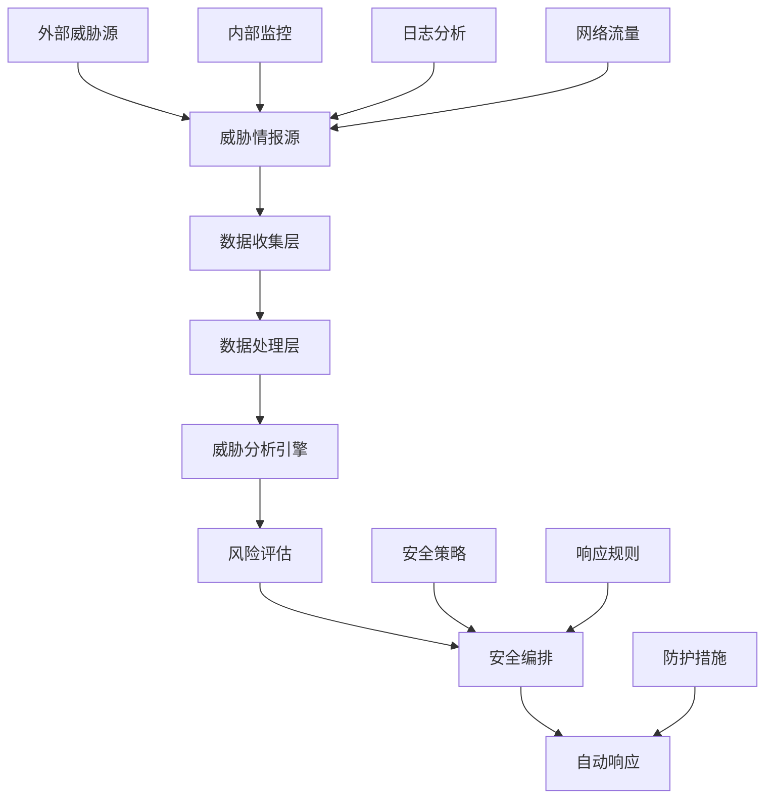

# 威胁情报与安全编排

## 概述

本文档详细介绍了Rust微服务中的威胁情报收集、分析和安全编排系统，帮助构建智能化的安全防护体系。

## 学习目标

- 掌握威胁情报收集和分析技术
- 了解安全编排和自动化响应机制
- 学习零信任网络架构设计
- 实现智能安全监控和防护系统

## 威胁情报系统架构



## 核心组件

### 1. 威胁情报收集

```rust
// 威胁情报收集器
use serde::{Deserialize, Serialize};
use tokio::time::{interval, Duration};
use std::collections::HashMap;

#[derive(Debug, Serialize, Deserialize)]
pub struct ThreatIntelligence {
    pub id: String,
    pub source: String,
    pub threat_type: ThreatType,
    pub severity: Severity,
    pub indicators: Vec<Indicator>,
    pub timestamp: chrono::DateTime<chrono::Utc>,
    pub confidence: f32,
}

#[derive(Debug, Serialize, Deserialize)]
pub enum ThreatType {
    Malware,
    Phishing,
    DDoS,
    DataBreach,
    InsiderThreat,
    APT,
}

#[derive(Debug, Serialize, Deserialize)]
pub enum Severity {
    Low,
    Medium,
    High,
    Critical,
}

#[derive(Debug, Serialize, Deserialize)]
pub struct Indicator {
    pub ioc_type: IoCType,
    pub value: String,
    pub context: Option<String>,
}

#[derive(Debug, Serialize, Deserialize)]
pub enum IoCType {
    IP,
    Domain,
    URL,
    Hash,
    Email,
    File,
}

pub struct ThreatIntelligenceCollector {
    sources: Vec<Box<dyn ThreatSource>>,
    storage: Box<dyn ThreatStorage>,
}

impl ThreatIntelligenceCollector {
    pub async fn collect_threats(&self) -> Result<Vec<ThreatIntelligence>, Box<dyn std::error::Error>> {
        let mut all_threats = Vec::new();
        
        for source in &self.sources {
            let threats = source.fetch_threats().await?;
            all_threats.extend(threats);
        }
        
        // 去重和验证
        let unique_threats = self.deduplicate_threats(all_threats);
        
        // 存储威胁情报
        for threat in &unique_threats {
            self.storage.store_threat(threat).await?;
        }
        
        Ok(unique_threats)
    }
    
    fn deduplicate_threats(&self, threats: Vec<ThreatIntelligence>) -> Vec<ThreatIntelligence> {
        let mut unique_threats = HashMap::new();
        
        for threat in threats {
            let key = format!("{}-{}", threat.source, threat.id);
            if !unique_threats.contains_key(&key) {
                unique_threats.insert(key, threat);
            }
        }
        
        unique_threats.into_values().collect()
    }
}
```

### 2. 威胁分析引擎

```rust
// 威胁分析引擎
use crate::threat_intelligence::*;
use std::sync::Arc;

pub struct ThreatAnalysisEngine {
    rules: Vec<Box<dyn AnalysisRule>>,
    ml_model: Option<Box<dyn MLModel>>,
    context: AnalysisContext,
}

impl ThreatAnalysisEngine {
    pub async fn analyze_threat(&self, threat: &ThreatIntelligence) -> AnalysisResult {
        let mut result = AnalysisResult {
            threat_id: threat.id.clone(),
            risk_score: 0.0,
            recommendations: Vec::new(),
            confidence: 0.0,
        };
        
        // 规则引擎分析
        for rule in &self.rules {
            if let Some(rule_result) = rule.analyze(threat, &self.context).await {
                result.risk_score += rule_result.risk_contribution;
                result.recommendations.extend(rule_result.recommendations);
            }
        }
        
        // 机器学习分析
        if let Some(model) = &self.ml_model {
            let ml_result = model.predict(threat).await;
            result.risk_score = (result.risk_score + ml_result.risk_score) / 2.0;
            result.confidence = ml_result.confidence;
        }
        
        // 归一化风险评分
        result.risk_score = result.risk_score.min(1.0);
        
        result
    }
}

#[derive(Debug)]
pub struct AnalysisResult {
    pub threat_id: String,
    pub risk_score: f32,
    pub recommendations: Vec<String>,
    pub confidence: f32,
}

pub struct AnalysisContext {
    pub network_topology: NetworkTopology,
    pub security_policies: Vec<SecurityPolicy>,
    pub historical_data: HistoricalData,
}

// 分析规则接口
pub trait AnalysisRule: Send + Sync {
    async fn analyze(&self, threat: &ThreatIntelligence, context: &AnalysisContext) -> Option<RuleResult>;
}

pub struct RuleResult {
    pub risk_contribution: f32,
    pub recommendations: Vec<String>,
}

// 示例规则：IP信誉检查
pub struct IPReputationRule {
    reputation_service: Arc<dyn ReputationService>,
}

impl AnalysisRule for IPReputationRule {
    async fn analyze(&self, threat: &ThreatIntelligence, _context: &AnalysisContext) -> Option<RuleResult> {
        let mut risk_contribution = 0.0;
        let mut recommendations = Vec::new();
        
        for indicator in &threat.indicators {
            if let IoCType::IP = indicator.ioc_type {
                if let Ok(reputation) = self.reputation_service.check_ip(&indicator.value).await {
                    match reputation.score {
                        score if score > 0.8 => {
                            risk_contribution += 0.3;
                            recommendations.push(format!("Block IP {} - High risk reputation", indicator.value));
                        }
                        score if score > 0.5 => {
                            risk_contribution += 0.2;
                            recommendations.push(format!("Monitor IP {} - Medium risk reputation", indicator.value));
                        }
                        _ => {}
                    }
                }
            }
        }
        
        if risk_contribution > 0.0 {
            Some(RuleResult {
                risk_contribution,
                recommendations,
            })
        } else {
            None
        }
    }
}
```

### 3. 安全编排系统

```rust
// 安全编排系统
use serde::{Deserialize, Serialize};
use std::collections::HashMap;

#[derive(Debug, Serialize, Deserialize)]
pub struct SecurityOrchestration {
    pub workflows: Vec<SecurityWorkflow>,
    pub playbooks: HashMap<String, SecurityPlaybook>,
    pub automation_rules: Vec<AutomationRule>,
}

#[derive(Debug, Serialize, Deserialize)]
pub struct SecurityWorkflow {
    pub id: String,
    pub name: String,
    pub triggers: Vec<WorkflowTrigger>,
    pub steps: Vec<WorkflowStep>,
    pub conditions: Vec<WorkflowCondition>,
}

#[derive(Debug, Serialize, Deserialize)]
pub enum WorkflowTrigger {
    ThreatDetected(ThreatType),
    RiskThresholdExceeded(f32),
    SecurityEvent(String),
    Scheduled(String),
}

#[derive(Debug, Serialize, Deserialize)]
pub struct WorkflowStep {
    pub id: String,
    pub action: WorkflowAction,
    pub parameters: HashMap<String, String>,
    pub timeout: Option<Duration>,
    pub retry_count: Option<u32>,
}

#[derive(Debug, Serialize, Deserialize)]
pub enum WorkflowAction {
    BlockIP(String),
    QuarantineFile(String),
    NotifySecurityTeam(String),
    UpdateFirewallRules(Vec<String>),
    IsolateEndpoint(String),
    CollectForensics(String),
    UpdateThreatIntelligence(String),
}

pub struct SecurityOrchestrator {
    workflows: Vec<SecurityWorkflow>,
    playbooks: HashMap<String, SecurityPlaybook>,
    automation_engine: AutomationEngine,
}

impl SecurityOrchestrator {
    pub async fn execute_workflow(&self, trigger: &WorkflowTrigger, context: &ExecutionContext) -> Result<WorkflowResult, Box<dyn std::error::Error>> {
        let matching_workflows = self.find_matching_workflows(trigger);
        
        for workflow in matching_workflows {
            if self.evaluate_conditions(&workflow.conditions, context).await? {
                let result = self.execute_workflow_steps(&workflow, context).await?;
                if result.success {
                    return Ok(result);
                }
            }
        }
        
        Err("No matching workflow found or conditions not met".into())
    }
    
    async fn execute_workflow_steps(&self, workflow: &SecurityWorkflow, context: &ExecutionContext) -> Result<WorkflowResult, Box<dyn std::error::Error>> {
        let mut results = Vec::new();
        
        for step in &workflow.steps {
            let step_result = self.execute_step(step, context).await?;
            results.push(step_result);
            
            // 如果步骤失败且不允许重试，则停止执行
            if !step_result.success && step.retry_count.is_none() {
                break;
            }
        }
        
        Ok(WorkflowResult {
            workflow_id: workflow.id.clone(),
            success: results.iter().all(|r| r.success),
            step_results: results,
            execution_time: Duration::from_secs(0), // 实际计算
        })
    }
    
    async fn execute_step(&self, step: &WorkflowStep, context: &ExecutionContext) -> Result<StepResult, Box<dyn std::error::Error>> {
        match &step.action {
            WorkflowAction::BlockIP(ip) => {
                self.automation_engine.block_ip(ip).await?;
                Ok(StepResult {
                    step_id: step.id.clone(),
                    success: true,
                    message: format!("Successfully blocked IP: {}", ip),
                })
            }
            WorkflowAction::NotifySecurityTeam(message) => {
                self.automation_engine.send_notification(message).await?;
                Ok(StepResult {
                    step_id: step.id.clone(),
                    success: true,
                    message: "Security team notified".to_string(),
                })
            }
            WorkflowAction::IsolateEndpoint(endpoint) => {
                self.automation_engine.isolate_endpoint(endpoint).await?;
                Ok(StepResult {
                    step_id: step.id.clone(),
                    success: true,
                    message: format!("Endpoint isolated: {}", endpoint),
                })
            }
            _ => {
                // 其他动作的实现
                Ok(StepResult {
                    step_id: step.id.clone(),
                    success: true,
                    message: "Action executed".to_string(),
                })
            }
        }
    }
}
```

### 4. 零信任网络架构

```rust
// 零信任网络架构
use std::collections::HashMap;
use serde::{Deserialize, Serialize};

#[derive(Debug, Serialize, Deserialize)]
pub struct ZeroTrustNetwork {
    pub identity_provider: IdentityProvider,
    pub policy_engine: PolicyEngine,
    pub network_segments: Vec<NetworkSegment>,
    pub access_controls: Vec<AccessControl>,
}

#[derive(Debug, Serialize, Deserialize)]
pub struct NetworkSegment {
    pub id: String,
    pub name: String,
    pub trust_level: TrustLevel,
    pub resources: Vec<Resource>,
    pub policies: Vec<SegmentPolicy>,
}

#[derive(Debug, Serialize, Deserialize)]
pub enum TrustLevel {
    Untrusted,
    Low,
    Medium,
    High,
    Critical,
}

#[derive(Debug, Serialize, Deserialize)]
pub struct Resource {
    pub id: String,
    pub name: String,
    pub resource_type: ResourceType,
    pub location: String,
    pub metadata: HashMap<String, String>,
}

#[derive(Debug, Serialize, Deserialize)]
pub enum ResourceType {
    Service,
    Database,
    File,
    API,
    Network,
}

pub struct ZeroTrustController {
    network: ZeroTrustNetwork,
    policy_engine: PolicyEngine,
    access_controller: AccessController,
}

impl ZeroTrustController {
    pub async fn authorize_access(&self, request: &AccessRequest) -> Result<AccessDecision, Box<dyn std::error::Error>> {
        // 身份验证
        let identity = self.verify_identity(&request.identity).await?;
        
        // 设备验证
        let device = self.verify_device(&request.device).await?;
        
        // 上下文评估
        let context = self.evaluate_context(request).await?;
        
        // 策略决策
        let decision = self.policy_engine.evaluate_policy(&identity, &device, &context, &request.resource).await?;
        
        // 记录访问决策
        self.log_access_decision(&decision).await?;
        
        Ok(decision)
    }
    
    async fn verify_identity(&self, identity: &Identity) -> Result<VerifiedIdentity, Box<dyn std::error::Error>> {
        // 多因素认证
        let mfa_result = self.identity_provider.verify_mfa(identity).await?;
        
        // 风险评估
        let risk_score = self.assess_identity_risk(identity).await?;
        
        Ok(VerifiedIdentity {
            identity: identity.clone(),
            mfa_verified: mfa_result.success,
            risk_score,
            trust_level: self.calculate_trust_level(&mfa_result, risk_score),
        })
    }
    
    async fn verify_device(&self, device: &Device) -> Result<VerifiedDevice, Box<dyn std::error::Error>> {
        // 设备指纹验证
        let fingerprint = self.generate_device_fingerprint(device).await?;
        
        // 设备合规性检查
        let compliance = self.check_device_compliance(device).await?;
        
        // 设备风险评估
        let risk_score = self.assess_device_risk(device).await?;
        
        Ok(VerifiedDevice {
            device: device.clone(),
            fingerprint,
            compliance_status: compliance,
            risk_score,
            trust_level: self.calculate_device_trust_level(&compliance, risk_score),
        })
    }
}
```

## 最佳实践

### 1. 威胁情报管理

- **数据质量**: 确保威胁情报的准确性和时效性
- **来源多样性**: 整合多个威胁情报源
- **自动化处理**: 实现威胁情报的自动化收集和处理
- **持续更新**: 定期更新威胁情报数据库
- **隐私保护**: 保护敏感信息的隐私

### 2. 安全编排设计

- **模块化设计**: 设计可重用的安全组件
- **灵活配置**: 支持动态配置和调整
- **错误处理**: 实现完善的错误处理和恢复机制
- **性能优化**: 优化编排系统的性能
- **监控告警**: 实现全面的监控和告警

### 3. 零信任实施

- **渐进式部署**: 分阶段实施零信任架构
- **用户培训**: 提供充分的用户培训和支持
- **策略优化**: 持续优化安全策略
- **性能平衡**: 平衡安全性和性能
- **合规性**: 确保符合相关法规要求

### 4. 自动化响应

- **快速响应**: 实现快速的安全事件响应
- **误报处理**: 减少误报和漏报
- **人工干预**: 在必要时提供人工干预机制
- **学习优化**: 基于历史数据优化响应策略
- **审计跟踪**: 记录所有自动化响应活动

## 部署配置

```yaml
# 威胁情报系统配置
threat_intelligence:
  sources:
    - type: "external_api"
      url: "https://api.threatintel.com"
      api_key: "${THREAT_INTEL_API_KEY}"
    - type: "internal_logs"
      log_path: "/var/log/security"
  collection_interval: "5m"
  storage:
    type: "redis"
    url: "redis://localhost:6379"
    ttl: "24h"

# 安全编排配置
security_orchestration:
  workflows:
    - name: "high_risk_threat_response"
      triggers:
        - type: "threat_detected"
          severity: "high"
      steps:
        - action: "block_ip"
          timeout: "30s"
        - action: "notify_security_team"
          message: "High risk threat detected"
        - action: "collect_forensics"
          target: "affected_endpoints"

# 零信任网络配置
zero_trust:
  identity_provider:
    type: "ldap"
    url: "ldap://company.com"
  policy_engine:
    rules_path: "/etc/security/policies"
    evaluation_interval: "1m"
  network_segments:
    - name: "dmz"
      trust_level: "low"
    - name: "internal"
      trust_level: "high"
    - name: "critical"
      trust_level: "critical"
```

## 使用指南

### 1. 威胁情报收集1

```bash
# 启动威胁情报收集器
cargo run --bin threat-intelligence-collector

# 查看收集的威胁情报
cargo run --bin threat-intelligence-viewer --list

# 分析特定威胁
cargo run --bin threat-analyzer --threat-id "threat-123"
```

### 2. 安全编排执行

```bash
# 创建安全编排工作流
cargo run --bin security-orchestrator --create-workflow --config workflow.yaml

# 执行安全编排
cargo run --bin security-orchestrator --execute --workflow-id "workflow-123"

# 查看执行结果
cargo run --bin security-orchestrator --status --workflow-id "workflow-123"
```

### 3. 零信任网络管理

```bash
# 配置零信任网络
cargo run --bin zero-trust-controller --configure --config zero-trust.yaml

# 授权访问请求
cargo run --bin zero-trust-controller --authorize --request access-request.json

# 查看访问日志
cargo run --bin zero-trust-controller --logs --user "user123"
```

---

**文档版本**: v1.0  
**最后更新**: 2025-01-XX  
**维护者**: 安全团队
