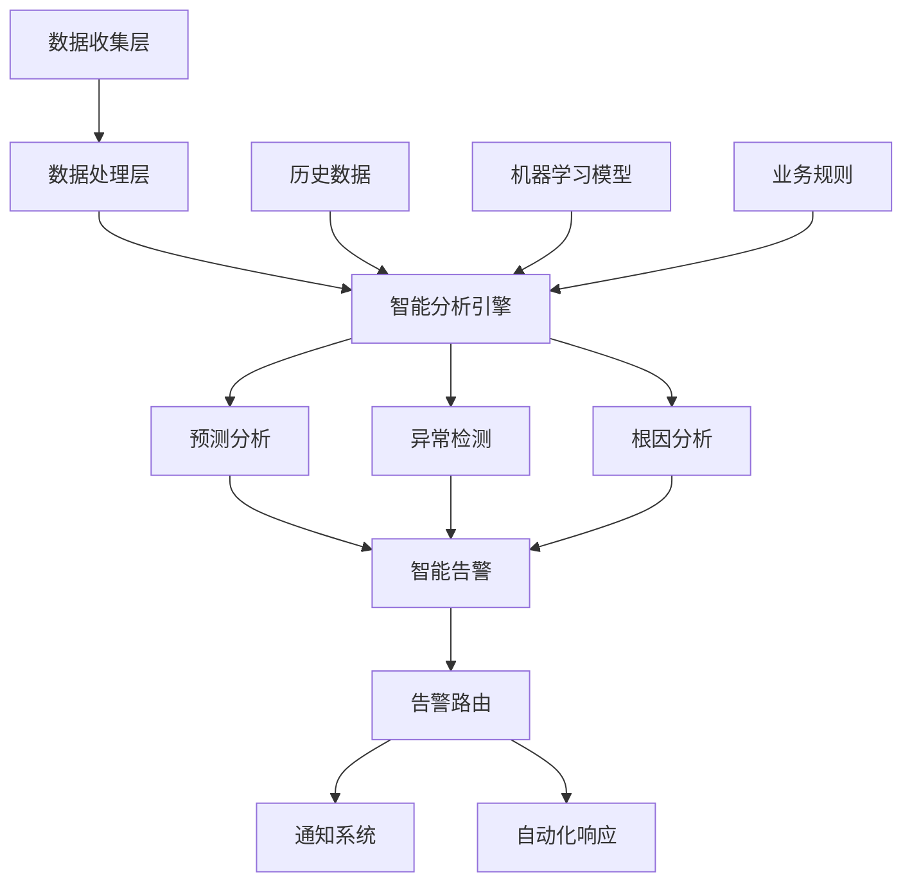

# 智能告警与预测分析

## 概述

本文档详细介绍了Rust微服务中的智能告警系统和预测分析技术，帮助构建智能化的监控和运维体系。

## 学习目标

- 掌握智能告警系统的设计和实现
- 了解预测分析算法和应用场景
- 学习根因分析技术
- 实现智能化的监控和运维系统

## 智能监控系统架构



## 核心组件

### 1. 智能告警系统

```rust
// 智能告警系统
use serde::{Deserialize, Serialize};
use std::collections::HashMap;
use tokio::time::{interval, Duration};

#[derive(Debug, Serialize, Deserialize)]
pub struct Alert {
    pub id: String,
    pub title: String,
    pub description: String,
    pub severity: AlertSeverity,
    pub source: String,
    pub timestamp: chrono::DateTime<chrono::Utc>,
    pub status: AlertStatus,
    pub tags: HashMap<String, String>,
    pub context: AlertContext,
}

#[derive(Debug, Serialize, Deserialize)]
pub enum AlertSeverity {
    Info,
    Warning,
    Error,
    Critical,
}

#[derive(Debug, Serialize, Deserialize)]
pub enum AlertStatus {
    Active,
    Acknowledged,
    Resolved,
    Suppressed,
}

#[derive(Debug, Serialize, Deserialize)]
pub struct AlertContext {
    pub service: String,
    pub environment: String,
    pub region: String,
    pub metrics: HashMap<String, f64>,
    pub logs: Vec<String>,
    pub traces: Vec<String>,
}

pub struct IntelligentAlertingSystem {
    rules: Vec<AlertRule>,
    ml_models: HashMap<String, Box<dyn MLModel>>,
    notification_channels: Vec<Box<dyn NotificationChannel>>,
    alert_storage: Box<dyn AlertStorage>,
}

impl IntelligentAlertingSystem {
    pub async fn process_metrics(&self, metrics: &[Metric]) -> Result<Vec<Alert>, Box<dyn std::error::Error>> {
        let mut alerts = Vec::new();
        
        for metric in metrics {
            // 规则引擎检查
            let rule_alerts = self.check_rules(metric).await?;
            alerts.extend(rule_alerts);
            
            // 机器学习异常检测
            let ml_alerts = self.detect_anomalies(metric).await?;
            alerts.extend(ml_alerts);
        }
        
        // 智能去重和聚合
        let deduplicated_alerts = self.deduplicate_alerts(alerts).await?;
        
        // 发送告警
        for alert in &deduplicated_alerts {
            self.send_alert(alert).await?;
        }
        
        Ok(deduplicated_alerts)
    }
    
    async fn check_rules(&self, metric: &Metric) -> Result<Vec<Alert>, Box<dyn std::error::Error>> {
        let mut alerts = Vec::new();
        
        for rule in &self.rules {
            if rule.matches(metric) {
                let alert = Alert {
                    id: uuid::Uuid::new_v4().to_string(),
                    title: rule.title.clone(),
                    description: rule.generate_description(metric),
                    severity: rule.severity.clone(),
                    source: "rule_engine".to_string(),
                    timestamp: chrono::Utc::now(),
                    status: AlertStatus::Active,
                    tags: rule.tags.clone(),
                    context: AlertContext {
                        service: metric.service.clone(),
                        environment: metric.environment.clone(),
                        region: metric.region.clone(),
                        metrics: HashMap::from([(metric.name.clone(), metric.value)]),
                        logs: Vec::new(),
                        traces: Vec::new(),
                    },
                };
                alerts.push(alert);
            }
        }
        
        Ok(alerts)
    }
    
    async fn detect_anomalies(&self, metric: &Metric) -> Result<Vec<Alert>, Box<dyn std::error::Error>> {
        let mut alerts = Vec::new();
        
        if let Some(model) = self.ml_models.get(&metric.name) {
            let anomaly_score = model.predict_anomaly(metric).await?;
            
            if anomaly_score > 0.8 {
                let alert = Alert {
                    id: uuid::Uuid::new_v4().to_string(),
                    title: format!("Anomaly detected in {}", metric.name),
                    description: format!("Unusual pattern detected with score: {:.2}", anomaly_score),
                    severity: AlertSeverity::Warning,
                    source: "ml_anomaly_detection".to_string(),
                    timestamp: chrono::Utc::now(),
                    status: AlertStatus::Active,
                    tags: HashMap::from([
                        ("anomaly_score".to_string(), anomaly_score.to_string()),
                        ("metric_name".to_string(), metric.name.clone()),
                    ]),
                    context: AlertContext {
                        service: metric.service.clone(),
                        environment: metric.environment.clone(),
                        region: metric.region.clone(),
                        metrics: HashMap::from([(metric.name.clone(), metric.value)]),
                        logs: Vec::new(),
                        traces: Vec::new(),
                    },
                };
                alerts.push(alert);
            }
        }
        
        Ok(alerts)
    }
    
    async fn deduplicate_alerts(&self, alerts: Vec<Alert>) -> Result<Vec<Alert>, Box<dyn std::error::Error>> {
        let mut deduplicated = HashMap::new();
        
        for alert in alerts {
            let key = format!("{}-{}-{}", alert.title, alert.context.service, alert.context.environment);
            
            if let Some(existing) = deduplicated.get_mut(&key) {
                // 更新现有告警的时间戳和严重程度
                if alert.severity > existing.severity {
                    existing.severity = alert.severity;
                }
                existing.timestamp = alert.timestamp;
            } else {
                deduplicated.insert(key, alert);
            }
        }
        
        Ok(deduplicated.into_values().collect())
    }
    
    async fn send_alert(&self, alert: &Alert) -> Result<(), Box<dyn std::error::Error>> {
        // 存储告警
        self.alert_storage.store_alert(alert).await?;
        
        // 发送通知
        for channel in &self.notification_channels {
            if channel.should_send(alert) {
                channel.send_notification(alert).await?;
            }
        }
        
        Ok(())
    }
}
```

### 2. 预测分析引擎

```rust
// 预测分析引擎
use crate::monitoring::*;
use std::collections::VecDeque;

pub struct PredictiveAnalysisEngine {
    models: HashMap<String, Box<dyn PredictiveModel>>,
    historical_data: Box<dyn HistoricalDataStore>,
    prediction_cache: HashMap<String, PredictionResult>,
}

impl PredictiveAnalysisEngine {
    pub async fn predict_metrics(&self, metric_name: &str, horizon: Duration) -> Result<PredictionResult, Box<dyn std::error::Error>> {
        // 检查缓存
        let cache_key = format!("{}-{}", metric_name, horizon.as_secs());
        if let Some(cached) = self.prediction_cache.get(&cache_key) {
            return Ok(cached.clone());
        }
        
        // 获取历史数据
        let historical_data = self.historical_data.get_metric_data(metric_name, Duration::from_secs(3600)).await?;
        
        // 选择预测模型
        let model = self.select_model(metric_name, &historical_data)?;
        
        // 执行预测
        let prediction = model.predict(&historical_data, horizon).await?;
        
        // 缓存结果
        self.prediction_cache.insert(cache_key, prediction.clone());
        
        Ok(prediction)
    }
    
    pub async fn predict_capacity(&self, service: &str) -> Result<CapacityPrediction, Box<dyn std::error::Error>> {
        let metrics = vec!["cpu_usage", "memory_usage", "request_rate", "response_time"];
        let mut predictions = HashMap::new();
        
        for metric in metrics {
            let prediction = self.predict_metrics(metric, Duration::from_secs(3600)).await?;
            predictions.insert(metric.to_string(), prediction);
        }
        
        // 分析容量趋势
        let capacity_trend = self.analyze_capacity_trend(&predictions).await?;
        
        // 预测容量需求
        let capacity_requirement = self.predict_capacity_requirement(&capacity_trend).await?;
        
        Ok(CapacityPrediction {
            service: service.to_string(),
            current_capacity: capacity_trend.current,
            predicted_capacity: capacity_requirement,
            confidence: capacity_trend.confidence,
            recommendations: self.generate_capacity_recommendations(&capacity_requirement),
        })
    }
    
    fn select_model(&self, metric_name: &str, data: &[MetricData]) -> Result<&Box<dyn PredictiveModel>, Box<dyn std::error::Error>> {
        // 根据数据特征选择最适合的模型
        let data_characteristics = self.analyze_data_characteristics(data);
        
        match data_characteristics.pattern_type {
            PatternType::Linear => self.models.get("linear_regression").ok_or("Linear model not found")?,
            PatternType::Seasonal => self.models.get("seasonal_arima").ok_or("Seasonal model not found")?,
            PatternType::Cyclical => self.models.get("lstm").ok_or("LSTM model not found")?,
            PatternType::Random => self.models.get("random_forest").ok_or("Random forest model not found")?,
        }
    }
}

// 预测模型接口
pub trait PredictiveModel: Send + Sync {
    async fn predict(&self, data: &[MetricData], horizon: Duration) -> Result<PredictionResult, Box<dyn std::error::Error>>;
    fn get_model_type(&self) -> ModelType;
}

// LSTM预测模型
pub struct LSTMPredictiveModel {
    model_path: String,
    sequence_length: usize,
}

impl PredictiveModel for LSTMPredictiveModel {
    async fn predict(&self, data: &[MetricData], horizon: Duration) -> Result<PredictionResult, Box<dyn std::error::Error>> {
        // 准备输入序列
        let input_sequence = self.prepare_input_sequence(data)?;
        
        // 加载模型并执行预测
        let predictions = self.run_lstm_prediction(&input_sequence, horizon).await?;
        
        // 计算置信区间
        let confidence_intervals = self.calculate_confidence_intervals(&predictions).await?;
        
        Ok(PredictionResult {
            predictions,
            confidence_intervals,
            model_type: self.get_model_type(),
            accuracy: self.calculate_accuracy(data).await?,
        })
    }
    
    fn get_model_type(&self) -> ModelType {
        ModelType::LSTM
    }
}

impl LSTMPredictiveModel {
    fn prepare_input_sequence(&self, data: &[MetricData]) -> Result<Vec<f64>, Box<dyn std::error::Error>> {
        let mut sequence = Vec::new();
        
        for i in 0..data.len().saturating_sub(self.sequence_length - 1) {
            let window = &data[i..i + self.sequence_length];
            for point in window {
                sequence.push(point.value);
            }
        }
        
        Ok(sequence)
    }
    
    async fn run_lstm_prediction(&self, input: &[f64], horizon: Duration) -> Result<Vec<f64>, Box<dyn std::error::Error>> {
        // 这里应该调用实际的LSTM模型
        // 为了示例，我们使用简单的线性外推
        let mut predictions = Vec::new();
        let steps = (horizon.as_secs() / 60) as usize; // 假设每分钟一个数据点
        
        if input.len() >= 2 {
            let trend = (input[input.len() - 1] - input[input.len() - 2]) / 60.0; // 每分钟的变化率
            
            for i in 1..=steps {
                let prediction = input[input.len() - 1] + trend * i as f64;
                predictions.push(prediction);
            }
        }
        
        Ok(predictions)
    }
}
```

### 3. 根因分析系统

```rust
// 根因分析系统
use std::collections::{HashMap, HashSet};
use petgraph::{Graph, Directed, NodeIndex};
use petgraph::algo::dijkstra;

pub struct RootCauseAnalysisEngine {
    dependency_graph: Graph<ServiceNode, DependencyEdge, Directed>,
    anomaly_detector: Box<dyn AnomalyDetector>,
    correlation_analyzer: Box<dyn CorrelationAnalyzer>,
}

impl RootCauseAnalysisEngine {
    pub async fn analyze_root_cause(&self, incident: &Incident) -> Result<RootCauseAnalysis, Box<dyn std::error::Error>> {
        // 1. 识别异常服务
        let anomalous_services = self.identify_anomalous_services(incident).await?;
        
        // 2. 分析服务依赖关系
        let dependency_analysis = self.analyze_dependencies(&anomalous_services).await?;
        
        // 3. 时间序列相关性分析
        let correlation_analysis = self.analyze_correlations(incident).await?;
        
        // 4. 构建因果图
        let causal_graph = self.build_causal_graph(&anomalous_services, &correlation_analysis).await?;
        
        // 5. 识别根因
        let root_causes = self.identify_root_causes(&causal_graph).await?;
        
        // 6. 生成分析报告
        let analysis = RootCauseAnalysis {
            incident_id: incident.id.clone(),
            anomalous_services,
            dependency_analysis,
            correlation_analysis,
            root_causes,
            confidence: self.calculate_confidence(&root_causes),
            recommendations: self.generate_recommendations(&root_causes),
        };
        
        Ok(analysis)
    }
    
    async fn identify_anomalous_services(&self, incident: &Incident) -> Result<Vec<AnomalousService>, Box<dyn std::error::Error>> {
        let mut anomalous_services = Vec::new();
        
        for service in &incident.affected_services {
            let metrics = self.get_service_metrics(service, &incident.time_range).await?;
            
            for metric in metrics {
                let anomaly_score = self.anomaly_detector.detect_anomaly(&metric).await?;
                
                if anomaly_score > 0.7 {
                    anomalous_services.push(AnomalousService {
                        service: service.clone(),
                        metric: metric.name,
                        anomaly_score,
                        deviation: self.calculate_deviation(&metric),
                        timestamp: metric.timestamp,
                    });
                }
            }
        }
        
        // 按异常分数排序
        anomalous_services.sort_by(|a, b| b.anomaly_score.partial_cmp(&a.anomaly_score).unwrap());
        
        Ok(anomalous_services)
    }
    
    async fn analyze_dependencies(&self, services: &[AnomalousService]) -> Result<DependencyAnalysis, Box<dyn std::error::Error>> {
        let mut analysis = DependencyAnalysis {
            upstream_services: Vec::new(),
            downstream_services: Vec::new(),
            critical_paths: Vec::new(),
        };
        
        for service in services {
            // 分析上游依赖
            let upstream = self.find_upstream_services(&service.service).await?;
            analysis.upstream_services.extend(upstream);
            
            // 分析下游依赖
            let downstream = self.find_downstream_services(&service.service).await?;
            analysis.downstream_services.extend(downstream);
            
            // 查找关键路径
            let critical_paths = self.find_critical_paths(&service.service).await?;
            analysis.critical_paths.extend(critical_paths);
        }
        
        Ok(analysis)
    }
    
    async fn analyze_correlations(&self, incident: &Incident) -> Result<CorrelationAnalysis, Box<dyn std::error::Error>> {
        let mut correlations = HashMap::new();
        
        // 获取所有相关服务的指标
        let all_metrics = self.get_all_service_metrics(&incident.affected_services, &incident.time_range).await?;
        
        // 计算指标间的相关性
        for (i, metric1) in all_metrics.iter().enumerate() {
            for metric2 in &all_metrics[i + 1..] {
                let correlation = self.correlation_analyzer.calculate_correlation(metric1, metric2).await?;
                
                if correlation.abs() > 0.7 {
                    correlations.insert(
                        (metric1.name.clone(), metric2.name.clone()),
                        correlation
                    );
                }
            }
        }
        
        // 识别时间序列模式
        let patterns = self.identify_temporal_patterns(&all_metrics).await?;
        
        Ok(CorrelationAnalysis {
            correlations,
            patterns,
            strongest_correlations: self.find_strongest_correlations(&correlations),
        })
    }
    
    async fn build_causal_graph(&self, services: &[AnomalousService], correlation: &CorrelationAnalysis) -> Result<CausalGraph, Box<dyn std::error::Error>> {
        let mut graph = Graph::new();
        let mut node_indices = HashMap::new();
        
        // 添加服务节点
        for service in services {
            let node_idx = graph.add_node(ServiceNode {
                name: service.service.clone(),
                anomaly_score: service.anomaly_score,
                timestamp: service.timestamp,
            });
            node_indices.insert(service.service.clone(), node_idx);
        }
        
        // 添加因果关系边
        for ((metric1, metric2), correlation) in &correlation.correlations {
            if let (Some(idx1), Some(idx2)) = (
                node_indices.get(&self.extract_service_name(metric1)),
                node_indices.get(&self.extract_service_name(metric2))
            ) {
                // 根据时间戳确定因果关系方向
                let edge_weight = correlation.abs();
                let edge = DependencyEdge {
                    correlation: *correlation,
                    weight: edge_weight,
                    relationship_type: self.determine_relationship_type(metric1, metric2, correlation),
                };
                
                graph.add_edge(*idx1, *idx2, edge);
            }
        }
        
        Ok(CausalGraph { graph, node_indices })
    }
    
    async fn identify_root_causes(&self, causal_graph: &CausalGraph) -> Result<Vec<RootCause>, Box<dyn std::error::Error>> {
        let mut root_causes = Vec::new();
        
        // 使用图算法识别根因
        for node_idx in causal_graph.graph.node_indices() {
            let node = &causal_graph.graph[node_idx];
            
            // 计算节点的影响力分数
            let influence_score = self.calculate_influence_score(causal_graph, node_idx).await?;
            
            // 计算异常时间优先级
            let temporal_priority = self.calculate_temporal_priority(node).await?;
            
            // 综合评分
            let root_cause_score = influence_score * 0.6 + temporal_priority * 0.4;
            
            if root_cause_score > 0.8 {
                root_causes.push(RootCause {
                    service: node.name.clone(),
                    score: root_cause_score,
                    evidence: self.collect_evidence(causal_graph, node_idx).await?,
                    impact_analysis: self.analyze_impact(causal_graph, node_idx).await?,
                });
            }
        }
        
        // 按分数排序
        root_causes.sort_by(|a, b| b.score.partial_cmp(&a.score).unwrap());
        
        Ok(root_causes)
    }
}
```

## 最佳实践

### 1. 智能告警设计

- **阈值优化**: 基于历史数据动态调整告警阈值
- **告警聚合**: 避免告警风暴，实现智能聚合
- **上下文丰富**: 提供丰富的告警上下文信息
- **分级处理**: 根据严重程度分级处理告警
- **反馈循环**: 建立告警效果反馈机制

### 2. 预测分析实施

- **数据质量**: 确保输入数据的质量和完整性
- **模型选择**: 根据数据特征选择合适的预测模型
- **模型更新**: 定期更新和重新训练模型
- **准确性评估**: 持续评估预测准确性
- **业务理解**: 结合业务知识解释预测结果

### 3. 根因分析优化

- **依赖建模**: 准确建模服务依赖关系
- **时间窗口**: 合理设置分析时间窗口
- **多维度分析**: 从多个维度分析问题
- **人工验证**: 结合专家知识验证分析结果
- **持续改进**: 基于历史案例改进分析算法

### 4. 系统集成

- **数据标准化**: 统一数据格式和接口
- **实时处理**: 实现近实时的分析和告警
- **可扩展性**: 设计可扩展的架构
- **容错性**: 实现系统的容错和恢复
- **性能优化**: 优化系统性能和处理能力

## 部署配置

```yaml
# 智能告警系统配置
intelligent_alerting:
  rules:
    - name: "high_cpu_usage"
      condition: "cpu_usage > 80"
      severity: "warning"
      duration: "5m"
    - name: "memory_leak"
      condition: "memory_usage > 90"
      severity: "critical"
      duration: "2m"
  
  ml_models:
    - name: "cpu_usage"
      type: "lstm"
      model_path: "/models/cpu_lstm.onnx"
    - name: "memory_usage"
      type: "isolation_forest"
      model_path: "/models/memory_if.pkl"
  
  notification_channels:
    - type: "slack"
      webhook_url: "${SLACK_WEBHOOK_URL}"
      channels: ["#alerts"]
    - type: "email"
      smtp_server: "${SMTP_SERVER}"
      recipients: ["ops@company.com"]

# 预测分析配置
predictive_analysis:
  models:
    - name: "linear_regression"
      type: "linear"
      parameters:
        learning_rate: 0.01
    - name: "lstm"
      type: "lstm"
      parameters:
        sequence_length: 60
        hidden_size: 128
    - name: "seasonal_arima"
      type: "arima"
      parameters:
        order: [1, 1, 1]
        seasonal_order: [1, 1, 1, 12]
  
  prediction_horizons:
    - duration: "1h"
      interval: "5m"
    - duration: "24h"
      interval: "1h"
    - duration: "7d"
      interval: "1d"

# 根因分析配置
root_cause_analysis:
  dependency_graph:
    source: "service_mesh"
    update_interval: "1m"
  
  anomaly_detection:
    algorithm: "isolation_forest"
    contamination: 0.1
    threshold: 0.7
  
  correlation_analysis:
    window_size: "10m"
    min_correlation: 0.7
    max_lag: "5m"
```

## 使用指南

### 1. 智能告警配置

```bash
# 创建告警规则
cargo run --bin alert-manager --create-rule --config alert-rule.yaml

# 查看告警状态
cargo run --bin alert-manager --status --service "user-service"

# 测试告警
cargo run --bin alert-manager --test --rule-id "high_cpu_usage"
```

### 2. 预测分析执行

```bash
# 执行容量预测
cargo run --bin predictive-engine --predict-capacity --service "user-service"

# 查看预测结果
cargo run --bin predictive-engine --results --service "user-service"

# 更新预测模型
cargo run --bin predictive-engine --update-model --model-name "lstm"
```

### 3. 根因分析

```bash
# 分析事件根因
cargo run --bin root-cause-analyzer --analyze --incident-id "incident-123"

# 查看分析报告
cargo run --bin root-cause-analyzer --report --incident-id "incident-123"

# 更新依赖图
cargo run --bin root-cause-analyzer --update-dependencies
```

---

**文档版本**: v1.0  
**最后更新**: 2025-01-XX  
**维护者**: 监控团队
