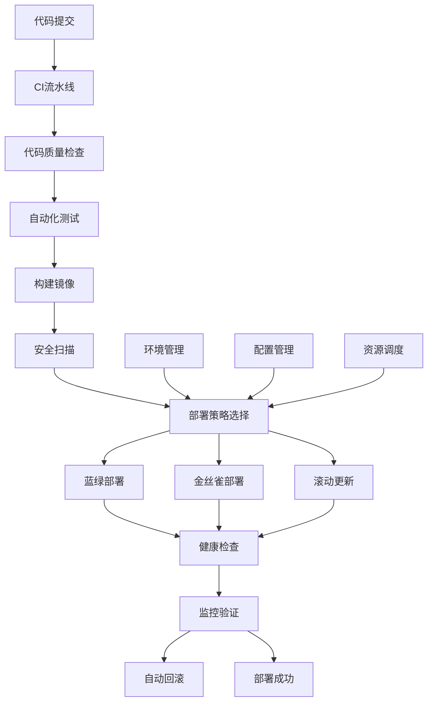

# 智能部署与自动回滚

## 概述

本文档详细介绍了Rust微服务中的智能部署系统和自动回滚机制，帮助构建高效、可靠的DevOps自动化体系。

## 学习目标

- 掌握智能部署系统的设计和实现
- 了解自动回滚机制和策略
- 学习环境管理和配置自动化
- 实现智能化的CI/CD流水线

## 智能部署系统架构



## 核心组件

### 1. 智能部署引擎

```rust
// 智能部署引擎
use serde::{Deserialize, Serialize};
use std::collections::HashMap;
use tokio::time::{timeout, Duration};

#[derive(Debug, Serialize, Deserialize)]
pub struct DeploymentRequest {
    pub service_name: String,
    pub version: String,
    pub environment: String,
    pub deployment_strategy: DeploymentStrategy,
    pub configuration: DeploymentConfiguration,
    pub rollback_config: RollbackConfiguration,
}

#[derive(Debug, Serialize, Deserialize)]
pub enum DeploymentStrategy {
    BlueGreen,
    Canary,
    Rolling,
    Recreate,
}

#[derive(Debug, Serialize, Deserialize)]
pub struct DeploymentConfiguration {
    pub replicas: u32,
    pub resources: ResourceRequirements,
    pub health_checks: HealthCheckConfiguration,
    pub environment_variables: HashMap<String, String>,
    pub secrets: Vec<String>,
}

#[derive(Debug, Serialize, Deserialize)]
pub struct RollbackConfiguration {
    pub auto_rollback_enabled: bool,
    pub rollback_triggers: Vec<RollbackTrigger>,
    pub rollback_timeout: Duration,
    pub max_rollback_attempts: u32,
}

#[derive(Debug, Serialize, Deserialize)]
pub enum RollbackTrigger {
    HealthCheckFailure,
    ErrorRateThreshold(f32),
    ResponseTimeThreshold(Duration),
    CustomMetric(String, f64),
}

pub struct IntelligentDeploymentEngine {
    deployment_strategies: HashMap<DeploymentStrategy, Box<dyn DeploymentStrategy>>,
    health_checker: Box<dyn HealthChecker>,
    rollback_manager: Box<dyn RollbackManager>,
    environment_manager: Box<dyn EnvironmentManager>,
    configuration_manager: Box<dyn ConfigurationManager>,
}

impl IntelligentDeploymentEngine {
    pub async fn deploy(&self, request: &DeploymentRequest) -> Result<DeploymentResult, Box<dyn std::error::Error>> {
        // 1. 验证部署请求
        self.validate_deployment_request(request).await?;
        
        // 2. 准备部署环境
        let environment = self.environment_manager.prepare_environment(&request.environment).await?;
        
        // 3. 选择部署策略
        let strategy = self.select_deployment_strategy(request).await?;
        
        // 4. 执行部署
        let deployment_result = strategy.deploy(request, &environment).await?;
        
        // 5. 健康检查
        let health_status = self.health_checker.check_health(&deployment_result).await?;
        
        // 6. 监控验证
        if health_status.is_healthy {
            self.monitor_deployment(&deployment_result).await?;
        } else {
            // 触发自动回滚
            self.rollback_manager.trigger_rollback(&deployment_result, &request.rollback_config).await?;
        }
        
        Ok(deployment_result)
    }
    
    async fn select_deployment_strategy(&self, request: &DeploymentRequest) -> Result<&Box<dyn DeploymentStrategy>, Box<dyn std::error::Error>> {
        // 根据服务特征和环境选择最佳部署策略
        let service_characteristics = self.analyze_service_characteristics(request).await?;
        let environment_constraints = self.analyze_environment_constraints(&request.environment).await?;
        
        let strategy = match (service_characteristics.criticality, environment_constraints.availability_requirement) {
            (Criticality::Critical, AvailabilityRequirement::High) => DeploymentStrategy::BlueGreen,
            (Criticality::High, AvailabilityRequirement::Medium) => DeploymentStrategy::Canary,
            (Criticality::Medium, AvailabilityRequirement::Low) => DeploymentStrategy::Rolling,
            _ => DeploymentStrategy::Recreate,
        };
        
        self.deployment_strategies.get(&strategy)
            .ok_or_else(|| format!("Deployment strategy {:?} not found", strategy).into())
    }
    
    async fn monitor_deployment(&self, deployment: &DeploymentResult) -> Result<(), Box<dyn std::error::Error>> {
        let monitoring_duration = Duration::from_secs(300); // 5分钟监控期
        let check_interval = Duration::from_secs(30);
        
        let start_time = std::time::Instant::now();
        
        while start_time.elapsed() < monitoring_duration {
            let health_status = self.health_checker.check_health(deployment).await?;
            
            if !health_status.is_healthy {
                return Err("Deployment health check failed during monitoring".into());
            }
            
            // 检查性能指标
            let performance_metrics = self.collect_performance_metrics(deployment).await?;
            if self.is_performance_degraded(&performance_metrics) {
                return Err("Performance degradation detected during monitoring".into());
            }
            
            tokio::time::sleep(check_interval).await;
        }
        
        Ok(())
    }
}

// 部署策略接口
pub trait DeploymentStrategy: Send + Sync {
    async fn deploy(&self, request: &DeploymentRequest, environment: &Environment) -> Result<DeploymentResult, Box<dyn std::error::Error>>;
    async fn rollback(&self, deployment: &DeploymentResult) -> Result<(), Box<dyn std::error::Error>>;
}

// 蓝绿部署策略
pub struct BlueGreenDeploymentStrategy {
    kubernetes_client: Box<dyn KubernetesClient>,
    load_balancer: Box<dyn LoadBalancer>,
}

impl DeploymentStrategy for BlueGreenDeploymentStrategy {
    async fn deploy(&self, request: &DeploymentRequest, environment: &Environment) -> Result<DeploymentResult, Box<dyn std::error::Error>> {
        // 1. 确定当前活跃环境（蓝或绿）
        let current_color = self.determine_current_color(&request.service_name).await?;
        let new_color = self.get_opposite_color(current_color);
        
        // 2. 部署到非活跃环境
        let deployment_result = self.deploy_to_environment(request, &new_color, environment).await?;
        
        // 3. 健康检查
        let health_status = self.health_checker.check_health(&deployment_result).await?;
        if !health_status.is_healthy {
            return Err("Health check failed for new deployment".into());
        }
        
        // 4. 切换流量
        self.load_balancer.switch_traffic(&request.service_name, &new_color).await?;
        
        // 5. 清理旧环境
        self.cleanup_old_environment(&request.service_name, &current_color).await?;
        
        Ok(deployment_result)
    }
    
    async fn rollback(&self, deployment: &DeploymentResult) -> Result<(), Box<dyn std::error::Error>> {
        // 蓝绿部署的回滚就是切换回之前的颜色
        let current_color = self.determine_current_color(&deployment.service_name).await?;
        let previous_color = self.get_opposite_color(current_color);
        
        self.load_balancer.switch_traffic(&deployment.service_name, &previous_color).await?;
        
        Ok(())
    }
}

// 金丝雀部署策略
pub struct CanaryDeploymentStrategy {
    kubernetes_client: Box<dyn KubernetesClient>,
    traffic_manager: Box<dyn TrafficManager>,
}

impl DeploymentStrategy for CanaryDeploymentStrategy {
    async fn deploy(&self, request: &DeploymentRequest, environment: &Environment) -> Result<DeploymentResult, Box<dyn std::error::Error>> {
        // 1. 部署金丝雀版本（小比例流量）
        let canary_deployment = self.deploy_canary_version(request, environment).await?;
        
        // 2. 逐步增加流量
        let traffic_percentages = vec![5, 10, 25, 50, 75, 100];
        
        for percentage in traffic_percentages {
            // 设置流量比例
            self.traffic_manager.set_traffic_percentage(&request.service_name, percentage).await?;
            
            // 等待并监控
            tokio::time::sleep(Duration::from_secs(60)).await;
            
            // 检查健康状态和性能指标
            let health_status = self.health_checker.check_health(&canary_deployment).await?;
            let performance_metrics = self.collect_performance_metrics(&canary_deployment).await?;
            
            if !health_status.is_healthy || self.is_performance_degraded(&performance_metrics) {
                // 回滚到上一个版本
                self.rollback_canary(&canary_deployment).await?;
                return Err("Canary deployment failed during traffic increase".into());
            }
        }
        
        // 3. 完全切换到新版本
        self.complete_canary_deployment(&canary_deployment).await?;
        
        Ok(canary_deployment)
    }
    
    async fn rollback(&self, deployment: &DeploymentResult) -> Result<(), Box<dyn std::error::Error>> {
        // 金丝雀部署的回滚是逐步减少流量到0
        self.traffic_manager.set_traffic_percentage(&deployment.service_name, 0).await?;
        self.cleanup_canary_deployment(deployment).await?;
        
        Ok(())
    }
}
```

### 2. 自动回滚系统

```rust
// 自动回滚系统
use std::collections::HashMap;
use tokio::time::{interval, Duration};

pub struct AutomaticRollbackManager {
    rollback_triggers: HashMap<String, Vec<RollbackTrigger>>,
    rollback_history: Box<dyn RollbackHistoryStore>,
    notification_service: Box<dyn NotificationService>,
    deployment_history: Box<dyn DeploymentHistoryStore>,
}

impl AutomaticRollbackManager {
    pub async fn trigger_rollback(&self, deployment: &DeploymentResult, config: &RollbackConfiguration) -> Result<RollbackResult, Box<dyn std::error::Error>> {
        // 1. 检查是否应该自动回滚
        if !config.auto_rollback_enabled {
            return Err("Automatic rollback is disabled".into());
        }
        
        // 2. 验证回滚条件
        let should_rollback = self.evaluate_rollback_conditions(deployment, config).await?;
        if !should_rollback {
            return Err("Rollback conditions not met".into());
        }
        
        // 3. 获取上一个稳定版本
        let previous_version = self.get_previous_stable_version(&deployment.service_name).await?;
        
        // 4. 执行回滚
        let rollback_result = self.execute_rollback(deployment, &previous_version).await?;
        
        // 5. 记录回滚历史
        self.record_rollback(&rollback_result).await?;
        
        // 6. 发送通知
        self.notification_service.send_rollback_notification(&rollback_result).await?;
        
        Ok(rollback_result)
    }
    
    async fn evaluate_rollback_conditions(&self, deployment: &DeploymentResult, config: &RollbackConfiguration) -> Result<bool, Box<dyn std::error::Error>> {
        for trigger in &config.rollback_triggers {
            match trigger {
                RollbackTrigger::HealthCheckFailure => {
                    let health_status = self.health_checker.check_health(deployment).await?;
                    if !health_status.is_healthy {
                        return Ok(true);
                    }
                }
                RollbackTrigger::ErrorRateThreshold(threshold) => {
                    let error_rate = self.calculate_error_rate(deployment).await?;
                    if error_rate > *threshold {
                        return Ok(true);
                    }
                }
                RollbackTrigger::ResponseTimeThreshold(threshold) => {
                    let avg_response_time = self.calculate_avg_response_time(deployment).await?;
                    if avg_response_time > *threshold {
                        return Ok(true);
                    }
                }
                RollbackTrigger::CustomMetric(metric_name, threshold) => {
                    let metric_value = self.get_custom_metric_value(deployment, metric_name).await?;
                    if metric_value > *threshold {
                        return Ok(true);
                    }
                }
            }
        }
        
        Ok(false)
    }
    
    async fn execute_rollback(&self, deployment: &DeploymentResult, previous_version: &str) -> Result<RollbackResult, Box<dyn std::error::Error>> {
        let rollback_start_time = std::time::Instant::now();
        
        // 1. 停止当前部署
        self.stop_current_deployment(deployment).await?;
        
        // 2. 部署上一个版本
        let rollback_deployment = self.deploy_previous_version(&deployment.service_name, previous_version).await?;
        
        // 3. 验证回滚成功
        let health_status = self.health_checker.check_health(&rollback_deployment).await?;
        if !health_status.is_healthy {
            return Err("Rollback deployment health check failed".into());
        }
        
        // 4. 恢复流量
        self.restore_traffic(&rollback_deployment).await?;
        
        let rollback_duration = rollback_start_time.elapsed();
        
        Ok(RollbackResult {
            id: uuid::Uuid::new_v4().to_string(),
            service_name: deployment.service_name.clone(),
            from_version: deployment.version.clone(),
            to_version: previous_version.to_string(),
            reason: "Automatic rollback triggered".to_string(),
            duration: rollback_duration,
            success: true,
            timestamp: chrono::Utc::now(),
        })
    }
    
    async fn get_previous_stable_version(&self, service_name: &str) -> Result<String, Box<dyn std::error::Error>> {
        let deployment_history = self.deployment_history.get_deployment_history(service_name).await?;
        
        // 查找最后一个稳定的版本（健康检查通过且运行时间超过阈值）
        for deployment in deployment_history.iter().rev() {
            if deployment.is_stable && deployment.runtime_duration > Duration::from_secs(3600) {
                return Ok(deployment.version.clone());
            }
        }
        
        Err("No stable previous version found".into())
    }
}

// 回滚触发器
pub struct RollbackTriggerMonitor {
    deployment: DeploymentResult,
    triggers: Vec<RollbackTrigger>,
    check_interval: Duration,
    max_check_duration: Duration,
}

impl RollbackTriggerMonitor {
    pub async fn start_monitoring(&self, rollback_manager: &AutomaticRollbackManager) -> Result<(), Box<dyn std::error::Error>> {
        let mut interval_timer = interval(self.check_interval);
        let start_time = std::time::Instant::now();
        
        while start_time.elapsed() < self.max_check_duration {
            interval_timer.tick().await;
            
            // 检查所有触发器
            for trigger in &self.triggers {
                let should_rollback = self.check_trigger(&trigger).await?;
                if should_rollback {
                    // 触发回滚
                    rollback_manager.trigger_rollback(&self.deployment, &RollbackConfiguration {
                        auto_rollback_enabled: true,
                        rollback_triggers: vec![trigger.clone()],
                        rollback_timeout: Duration::from_secs(300),
                        max_rollback_attempts: 3,
                    }).await?;
                    return Ok(());
                }
            }
        }
        
        Ok(())
    }
    
    async fn check_trigger(&self, trigger: &RollbackTrigger) -> Result<bool, Box<dyn std::error::Error>> {
        match trigger {
            RollbackTrigger::HealthCheckFailure => {
                let health_status = self.health_checker.check_health(&self.deployment).await?;
                Ok(!health_status.is_healthy)
            }
            RollbackTrigger::ErrorRateThreshold(threshold) => {
                let error_rate = self.calculate_error_rate(&self.deployment).await?;
                Ok(error_rate > *threshold)
            }
            RollbackTrigger::ResponseTimeThreshold(threshold) => {
                let avg_response_time = self.calculate_avg_response_time(&self.deployment).await?;
                Ok(avg_response_time > *threshold)
            }
            RollbackTrigger::CustomMetric(metric_name, threshold) => {
                let metric_value = self.get_custom_metric_value(&self.deployment, metric_name).await?;
                Ok(metric_value > *threshold)
            }
        }
    }
}
```

### 3. 环境管理系统

```rust
// 环境管理系统
use std::collections::HashMap;
use serde::{Deserialize, Serialize};

#[derive(Debug, Serialize, Deserialize)]
pub struct Environment {
    pub name: String,
    pub environment_type: EnvironmentType,
    pub configuration: EnvironmentConfiguration,
    pub resources: EnvironmentResources,
    pub networking: NetworkingConfiguration,
}

#[derive(Debug, Serialize, Deserialize)]
pub enum EnvironmentType {
    Development,
    Staging,
    Production,
    Testing,
}

#[derive(Debug, Serialize, Deserialize)]
pub struct EnvironmentConfiguration {
    pub kubernetes_cluster: String,
    pub namespace: String,
    pub resource_quotas: ResourceQuotas,
    pub security_policies: Vec<SecurityPolicy>,
    pub monitoring_config: MonitoringConfiguration,
}

pub struct EnvironmentManager {
    environments: HashMap<String, Environment>,
    kubernetes_client: Box<dyn KubernetesClient>,
    configuration_manager: Box<dyn ConfigurationManager>,
}

impl EnvironmentManager {
    pub async fn prepare_environment(&self, environment_name: &str) -> Result<Environment, Box<dyn std::error::Error>> {
        let environment = self.environments.get(environment_name)
            .ok_or_else(|| format!("Environment {} not found", environment_name))?;
        
        // 1. 验证环境状态
        self.validate_environment_health(environment).await?;
        
        // 2. 准备资源
        self.prepare_environment_resources(environment).await?;
        
        // 3. 配置网络
        self.configure_networking(environment).await?;
        
        // 4. 应用安全策略
        self.apply_security_policies(environment).await?;
        
        // 5. 配置监控
        self.configure_monitoring(environment).await?;
        
        Ok(environment.clone())
    }
    
    async fn validate_environment_health(&self, environment: &Environment) -> Result<(), Box<dyn std::error::Error>> {
        // 检查Kubernetes集群状态
        let cluster_health = self.kubernetes_client.check_cluster_health(&environment.configuration.kubernetes_cluster).await?;
        if !cluster_health.is_healthy {
            return Err("Kubernetes cluster is not healthy".into());
        }
        
        // 检查命名空间状态
        let namespace_status = self.kubernetes_client.get_namespace_status(&environment.configuration.namespace).await?;
        if !namespace_status.is_ready {
            return Err("Namespace is not ready".into());
        }
        
        // 检查资源配额
        let resource_usage = self.kubernetes_client.get_resource_usage(&environment.configuration.namespace).await?;
        if self.is_resource_quota_exceeded(&resource_usage, &environment.configuration.resource_quotas) {
            return Err("Resource quota exceeded".into());
        }
        
        Ok(())
    }
    
    async fn prepare_environment_resources(&self, environment: &Environment) -> Result<(), Box<dyn std::error::Error>> {
        // 创建必要的ConfigMaps
        for config_map in &environment.configuration.config_maps {
            self.kubernetes_client.create_config_map(&environment.configuration.namespace, config_map).await?;
        }
        
        // 创建必要的Secrets
        for secret in &environment.configuration.secrets {
            self.kubernetes_client.create_secret(&environment.configuration.namespace, secret).await?;
        }
        
        // 创建必要的PersistentVolumes
        for pv in &environment.resources.persistent_volumes {
            self.kubernetes_client.create_persistent_volume(pv).await?;
        }
        
        Ok(())
    }
    
    async fn configure_networking(&self, environment: &Environment) -> Result<(), Box<dyn std::error::Error>> {
        // 配置网络策略
        for network_policy in &environment.networking.network_policies {
            self.kubernetes_client.create_network_policy(&environment.configuration.namespace, network_policy).await?;
        }
        
        // 配置服务网格
        if let Some(service_mesh_config) = &environment.networking.service_mesh {
            self.configure_service_mesh(service_mesh_config).await?;
        }
        
        // 配置负载均衡器
        for load_balancer in &environment.networking.load_balancers {
            self.kubernetes_client.create_load_balancer(&environment.configuration.namespace, load_balancer).await?;
        }
        
        Ok(())
    }
    
    async fn apply_security_policies(&self, environment: &Environment) -> Result<(), Box<dyn std::error::Error>> {
        // 应用Pod安全策略
        for pod_security_policy in &environment.configuration.security_policies {
            self.kubernetes_client.create_pod_security_policy(pod_security_policy).await?;
        }
        
        // 配置RBAC
        for rbac_config in &environment.configuration.rbac_configs {
            self.kubernetes_client.create_rbac_config(rbac_config).await?;
        }
        
        // 配置网络策略
        for network_policy in &environment.networking.network_policies {
            self.kubernetes_client.create_network_policy(&environment.configuration.namespace, network_policy).await?;
        }
        
        Ok(())
    }
}
```

## 最佳实践

### 1. 部署策略选择

- **蓝绿部署**: 适用于关键服务，需要零停机时间
- **金丝雀部署**: 适用于需要渐进式验证的服务
- **滚动更新**: 适用于资源有限的环境
- **重新创建**: 适用于无状态服务

### 2. 回滚策略设计

- **自动回滚**: 基于健康检查和性能指标
- **手动回滚**: 提供紧急回滚机制
- **回滚验证**: 确保回滚后的服务健康
- **回滚通知**: 及时通知相关人员

### 3. 环境管理

- **环境隔离**: 确保不同环境之间的隔离
- **配置管理**: 统一管理环境配置
- **资源监控**: 监控环境资源使用情况
- **安全策略**: 应用适当的安全策略

### 4. 监控和告警

- **部署监控**: 监控部署过程和结果
- **性能监控**: 监控部署后的性能指标
- **健康检查**: 定期检查服务健康状态
- **告警机制**: 及时告警部署问题

## 部署配置

```yaml
# 智能部署配置
intelligent_deployment:
  strategies:
    blue_green:
      enabled: true
      health_check_timeout: "5m"
      traffic_switch_timeout: "2m"
    canary:
      enabled: true
      traffic_percentages: [5, 10, 25, 50, 75, 100]
      step_duration: "2m"
    rolling:
      enabled: true
      max_unavailable: 1
      max_surge: 1
  
  health_checks:
    liveness:
      path: "/health/live"
      timeout: "30s"
      interval: "10s"
    readiness:
      path: "/health/ready"
      timeout: "30s"
      interval: "5s"
  
  rollback:
    auto_rollback: true
    triggers:
      - type: "health_check_failure"
        timeout: "2m"
      - type: "error_rate_threshold"
        threshold: 0.05
        duration: "1m"
      - type: "response_time_threshold"
        threshold: "5s"
        duration: "1m"

# 环境管理配置
environment_management:
  environments:
    - name: "development"
      type: "development"
      cluster: "dev-cluster"
      namespace: "dev"
      resource_quotas:
        cpu: "4"
        memory: "8Gi"
    - name: "staging"
      type: "staging"
      cluster: "staging-cluster"
      namespace: "staging"
      resource_quotas:
        cpu: "8"
        memory: "16Gi"
    - name: "production"
      type: "production"
      cluster: "prod-cluster"
      namespace: "prod"
      resource_quotas:
        cpu: "16"
        memory: "32Gi"
  
  security_policies:
    - name: "pod-security-policy"
      type: "PodSecurityPolicy"
      rules:
        - apiGroups: ["policy"]
          resources: ["podsecuritypolicies"]
          verbs: ["use"]
          resourceNames: ["restricted"]
```

## 使用指南

### 1. 智能部署

```bash
# 创建部署请求
cargo run --bin deployment-engine --deploy --service "user-service" --version "v1.2.0" --environment "production"

# 查看部署状态
cargo run --bin deployment-engine --status --deployment-id "deploy-123"

# 取消部署
cargo run --bin deployment-engine --cancel --deployment-id "deploy-123"
```

### 2. 自动回滚

```bash
# 配置回滚策略
cargo run --bin rollback-manager --configure --service "user-service" --config rollback-config.yaml

# 手动触发回滚
cargo run --bin rollback-manager --rollback --deployment-id "deploy-123"

# 查看回滚历史
cargo run --bin rollback-manager --history --service "user-service"
```

### 3. 环境管理1

```bash
# 准备环境
cargo run --bin environment-manager --prepare --environment "staging"

# 验证环境
cargo run --bin environment-manager --validate --environment "production"

# 清理环境
cargo run --bin environment-manager --cleanup --environment "development"
```

---

**文档版本**: v1.0  
**最后更新**: 2025-01-XX  
**维护者**: DevOps团队
