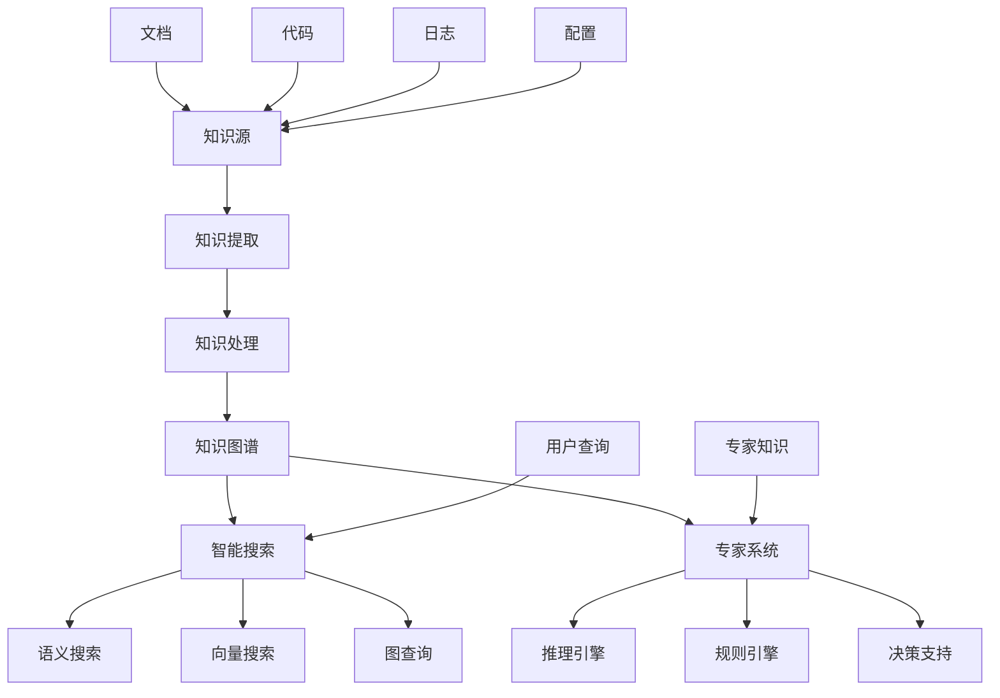

# 智能搜索与知识图谱

## 概述

本文档详细介绍了Rust微服务中的智能搜索系统和知识图谱技术，帮助构建智能化的知识管理和检索体系。

## 学习目标

- 掌握智能搜索系统的设计和实现
- 了解知识图谱构建和查询技术
- 学习专家系统的设计和应用
- 实现智能化的知识管理和检索

## 知识管理系统架构



## 核心组件

### 1. 智能搜索系统

```rust
// 智能搜索系统
use serde::{Deserialize, Serialize};
use std::collections::HashMap;
use tantivy::{Index, Searcher, Query, collector::TopDocs};
use rust_bert::pipelines::sentence_embeddings::SentenceEmbeddingsModel;

#[derive(Debug, Serialize, Deserialize)]
pub struct SearchRequest {
    pub query: String,
    pub search_type: SearchType,
    pub filters: HashMap<String, String>,
    pub limit: usize,
    pub offset: usize,
}

#[derive(Debug, Serialize, Deserialize)]
pub enum SearchType {
    FullText,
    Semantic,
    Vector,
    Graph,
    Hybrid,
}

#[derive(Debug, Serialize, Deserialize)]
pub struct SearchResult {
    pub id: String,
    pub title: String,
    pub content: String,
    pub score: f32,
    pub metadata: HashMap<String, String>,
    pub highlights: Vec<String>,
}

pub struct IntelligentSearchEngine {
    full_text_index: Index,
    vector_index: Box<dyn VectorIndex>,
    knowledge_graph: Box<dyn KnowledgeGraph>,
    embedding_model: SentenceEmbeddingsModel,
    query_processor: Box<dyn QueryProcessor>,
    result_ranker: Box<dyn ResultRanker>,
}

impl IntelligentSearchEngine {
    pub async fn search(&self, request: &SearchRequest) -> Result<Vec<SearchResult>, Box<dyn std::error::Error>> {
        // 1. 查询预处理
        let processed_query = self.query_processor.preprocess(&request.query).await?;
        
        // 2. 根据搜索类型执行搜索
        let results = match request.search_type {
            SearchType::FullText => self.full_text_search(&processed_query, request).await?,
            SearchType::Semantic => self.semantic_search(&processed_query, request).await?,
            SearchType::Vector => self.vector_search(&processed_query, request).await?,
            SearchType::Graph => self.graph_search(&processed_query, request).await?,
            SearchType::Hybrid => self.hybrid_search(&processed_query, request).await?,
        };
        
        // 3. 结果排序和过滤
        let ranked_results = self.result_ranker.rank(&results, &processed_query).await?;
        let filtered_results = self.apply_filters(&ranked_results, &request.filters).await?;
        
        // 4. 生成高亮
        let highlighted_results = self.generate_highlights(&filtered_results, &processed_query).await?;
        
        Ok(highlighted_results)
    }
    
    async fn full_text_search(&self, query: &ProcessedQuery, request: &SearchRequest) -> Result<Vec<SearchResult>, Box<dyn std::error::Error>> {
        let searcher = self.full_text_index.reader()?.searcher();
        
        // 构建查询
        let tantivy_query = self.build_tantivy_query(query)?;
        
        // 执行搜索
        let top_docs = searcher.search(&tantivy_query, &TopDocs::with_limit(request.limit))?;
        
        let mut results = Vec::new();
        for (score, doc_address) in top_docs {
            let retrieved_doc = searcher.doc(doc_address)?;
            let result = self.convert_to_search_result(retrieved_doc, score)?;
            results.push(result);
        }
        
        Ok(results)
    }
    
    async fn semantic_search(&self, query: &ProcessedQuery, request: &SearchRequest) -> Result<Vec<SearchResult>, Box<dyn std::error::Error>> {
        // 1. 生成查询向量
        let query_embedding = self.embedding_model.encode(&[&query.original])?;
        
        // 2. 向量相似度搜索
        let similar_docs = self.vector_index.search_similar(&query_embedding[0], request.limit).await?;
        
        // 3. 转换为搜索结果
        let results = self.convert_vector_results_to_search_results(similar_docs).await?;
        
        Ok(results)
    }
    
    async fn vector_search(&self, query: &ProcessedQuery, request: &SearchRequest) -> Result<Vec<SearchResult>, Box<dyn std::error::Error>> {
        // 1. 生成查询向量
        let query_embedding = self.embedding_model.encode(&[&query.original])?;
        
        // 2. 执行向量搜索
        let vector_results = self.vector_index.search(&query_embedding[0], request.limit).await?;
        
        // 3. 转换为搜索结果
        let results = self.convert_vector_results_to_search_results(vector_results).await?;
        
        Ok(results)
    }
    
    async fn graph_search(&self, query: &ProcessedQuery, request: &SearchRequest) -> Result<Vec<SearchResult>, Box<dyn std::error::Error>> {
        // 1. 解析图查询
        let graph_query = self.parse_graph_query(query)?;
        
        // 2. 执行图查询
        let graph_results = self.knowledge_graph.query(&graph_query).await?;
        
        // 3. 转换为搜索结果
        let results = self.convert_graph_results_to_search_results(graph_results).await?;
        
        Ok(results)
    }
    
    async fn hybrid_search(&self, query: &ProcessedQuery, request: &SearchRequest) -> Result<Vec<SearchResult>, Box<dyn std::error::Error>> {
        // 1. 并行执行多种搜索
        let (full_text_results, semantic_results, vector_results, graph_results) = tokio::try_join!(
            self.full_text_search(query, request),
            self.semantic_search(query, request),
            self.vector_search(query, request),
            self.graph_search(query, request)
        )?;
        
        // 2. 融合结果
        let fused_results = self.fuse_search_results(
            full_text_results,
            semantic_results,
            vector_results,
            graph_results,
        ).await?;
        
        Ok(fused_results)
    }
    
    async fn fuse_search_results(
        &self,
        full_text_results: Vec<SearchResult>,
        semantic_results: Vec<SearchResult>,
        vector_results: Vec<SearchResult>,
        graph_results: Vec<SearchResult>,
    ) -> Result<Vec<SearchResult>, Box<dyn std::error::Error>> {
        let mut all_results = HashMap::new();
        
        // 收集所有结果
        for (results, weight) in vec![
            (full_text_results, 0.3),
            (semantic_results, 0.3),
            (vector_results, 0.2),
            (graph_results, 0.2),
        ] {
            for result in results {
                let entry = all_results.entry(result.id.clone()).or_insert_with(|| {
                    SearchResult {
                        id: result.id.clone(),
                        title: result.title.clone(),
                        content: result.content.clone(),
                        score: 0.0,
                        metadata: result.metadata.clone(),
                        highlights: result.highlights.clone(),
                    }
                });
                entry.score += result.score * weight;
            }
        }
        
        // 排序并返回
        let mut results: Vec<SearchResult> = all_results.into_values().collect();
        results.sort_by(|a, b| b.score.partial_cmp(&a.score).unwrap());
        
        Ok(results)
    }
}

// 查询处理器
pub trait QueryProcessor: Send + Sync {
    async fn preprocess(&self, query: &str) -> Result<ProcessedQuery, Box<dyn std::error::Error>>;
    async fn expand(&self, query: &ProcessedQuery) -> Result<ProcessedQuery, Box<dyn std::error::Error>>;
    async fn optimize(&self, query: &ProcessedQuery) -> Result<ProcessedQuery, Box<dyn std::error::Error>>;
}

#[derive(Debug)]
pub struct ProcessedQuery {
    pub original: String,
    pub normalized: String,
    pub terms: Vec<String>,
    pub entities: Vec<Entity>,
    pub intent: QueryIntent,
    pub filters: HashMap<String, String>,
}

#[derive(Debug)]
pub enum QueryIntent {
    Search,
    Question,
    Command,
    Navigation,
}

pub struct AdvancedQueryProcessor {
    nlp_processor: Box<dyn NLPProcessor>,
    entity_extractor: Box<dyn EntityExtractor>,
    intent_classifier: Box<dyn IntentClassifier>,
    query_expander: Box<dyn QueryExpander>,
}

impl QueryProcessor for AdvancedQueryProcessor {
    async fn preprocess(&self, query: &str) -> Result<ProcessedQuery, Box<dyn std::error::Error>> {
        // 1. 文本标准化
        let normalized = self.nlp_processor.normalize(query).await?;
        
        // 2. 分词
        let terms = self.nlp_processor.tokenize(&normalized).await?;
        
        // 3. 实体提取
        let entities = self.entity_extractor.extract(&normalized).await?;
        
        // 4. 意图分类
        let intent = self.intent_classifier.classify(&normalized).await?;
        
        // 5. 查询扩展
        let expanded_query = self.query_expander.expand(&terms, &entities).await?;
        
        Ok(ProcessedQuery {
            original: query.to_string(),
            normalized,
            terms: expanded_query.terms,
            entities,
            intent,
            filters: HashMap::new(),
        })
    }
    
    async fn expand(&self, query: &ProcessedQuery) -> Result<ProcessedQuery, Box<dyn std::error::Error>> {
        let expanded_terms = self.query_expander.expand(&query.terms, &query.entities).await?;
        
        Ok(ProcessedQuery {
            original: query.original.clone(),
            normalized: query.normalized.clone(),
            terms: expanded_terms.terms,
            entities: query.entities.clone(),
            intent: query.intent.clone(),
            filters: query.filters.clone(),
        })
    }
    
    async fn optimize(&self, query: &ProcessedQuery) -> Result<ProcessedQuery, Box<dyn std::error::Error>> {
        // 查询优化逻辑
        let optimized_terms = self.optimize_terms(&query.terms).await?;
        
        Ok(ProcessedQuery {
            original: query.original.clone(),
            normalized: query.normalized.clone(),
            terms: optimized_terms,
            entities: query.entities.clone(),
            intent: query.intent.clone(),
            filters: query.filters.clone(),
        })
    }
}
```

### 2. 知识图谱系统

```rust
// 知识图谱系统
use std::collections::{HashMap, HashSet};
use petgraph::{Graph, Directed, NodeIndex};
use serde::{Deserialize, Serialize};

#[derive(Debug, Serialize, Deserialize)]
pub struct KnowledgeGraph {
    pub entities: HashMap<String, Entity>,
    pub relationships: HashMap<String, Relationship>,
    pub graph: Graph<Entity, Relationship, Directed>,
}

#[derive(Debug, Serialize, Deserialize, Clone)]
pub struct Entity {
    pub id: String,
    pub name: String,
    pub entity_type: EntityType,
    pub properties: HashMap<String, String>,
    pub embeddings: Option<Vec<f32>>,
}

#[derive(Debug, Serialize, Deserialize, Clone)]
pub enum EntityType {
    Service,
    API,
    Database,
    User,
    Document,
    Code,
    Configuration,
    Log,
    Metric,
}

#[derive(Debug, Serialize, Deserialize, Clone)]
pub struct Relationship {
    pub id: String,
    pub source_entity: String,
    pub target_entity: String,
    pub relationship_type: RelationshipType,
    pub properties: HashMap<String, String>,
    pub weight: f32,
}

#[derive(Debug, Serialize, Deserialize, Clone)]
pub enum RelationshipType {
    DependsOn,
    Calls,
    Contains,
    Implements,
    Configures,
    Monitors,
    Logs,
    RelatedTo,
    SimilarTo,
}

pub struct KnowledgeGraphEngine {
    graph: KnowledgeGraph,
    entity_extractor: Box<dyn EntityExtractor>,
    relationship_extractor: Box<dyn RelationshipExtractor>,
    graph_analyzer: Box<dyn GraphAnalyzer>,
    query_engine: Box<dyn GraphQueryEngine>,
}

impl KnowledgeGraphEngine {
    pub async fn build_from_sources(&mut self, sources: &[KnowledgeSource]) -> Result<(), Box<dyn std::error::Error>> {
        for source in sources {
            match source {
                KnowledgeSource::Code(code_source) => {
                    self.extract_from_code(code_source).await?;
                }
                KnowledgeSource::Document(doc_source) => {
                    self.extract_from_document(doc_source).await?;
                }
                KnowledgeSource::Configuration(config_source) => {
                    self.extract_from_configuration(config_source).await?;
                }
                KnowledgeSource::Logs(log_source) => {
                    self.extract_from_logs(log_source).await?;
                }
            }
        }
        
        // 构建图结构
        self.build_graph_structure().await?;
        
        // 计算实体嵌入
        self.compute_entity_embeddings().await?;
        
        // 分析图结构
        self.analyze_graph_structure().await?;
        
        Ok(())
    }
    
    async fn extract_from_code(&mut self, code_source: &CodeSource) -> Result<(), Box<dyn std::error::Error>> {
        // 1. 提取代码实体
        let entities = self.entity_extractor.extract_from_code(code_source).await?;
        
        // 2. 提取代码关系
        let relationships = self.relationship_extractor.extract_from_code(code_source).await?;
        
        // 3. 添加到知识图谱
        for entity in entities {
            self.graph.entities.insert(entity.id.clone(), entity);
        }
        
        for relationship in relationships {
            self.graph.relationships.insert(relationship.id.clone(), relationship);
        }
        
        Ok(())
    }
    
    async fn extract_from_document(&mut self, doc_source: &DocumentSource) -> Result<(), Box<dyn std::error::Error>> {
        // 1. 提取文档实体
        let entities = self.entity_extractor.extract_from_document(doc_source).await?;
        
        // 2. 提取文档关系
        let relationships = self.relationship_extractor.extract_from_document(doc_source).await?;
        
        // 3. 添加到知识图谱
        for entity in entities {
            self.graph.entities.insert(entity.id.clone(), entity);
        }
        
        for relationship in relationships {
            self.graph.relationships.insert(relationship.id.clone(), relationship);
        }
        
        Ok(())
    }
    
    async fn build_graph_structure(&mut self) -> Result<(), Box<dyn std::error::Error>> {
        // 创建实体节点
        let mut entity_indices = HashMap::new();
        for (entity_id, entity) in &self.graph.entities {
            let node_index = self.graph.graph.add_node(entity.clone());
            entity_indices.insert(entity_id.clone(), node_index);
        }
        
        // 创建关系边
        for (_, relationship) in &self.graph.relationships {
            if let (Some(source_idx), Some(target_idx)) = (
                entity_indices.get(&relationship.source_entity),
                entity_indices.get(&relationship.target_entity)
            ) {
                self.graph.graph.add_edge(*source_idx, *target_idx, relationship.clone());
            }
        }
        
        Ok(())
    }
    
    async fn compute_entity_embeddings(&mut self) -> Result<(), Box<dyn std::error::Error>> {
        let embedding_model = SentenceEmbeddingsModel::new(Default::default())?;
        
        for (entity_id, entity) in &mut self.graph.entities {
            let text = format!("{} {}", entity.name, entity.entity_type);
            let embeddings = embedding_model.encode(&[&text])?;
            entity.embeddings = Some(embeddings[0].clone());
        }
        
        Ok(())
    }
    
    pub async fn query(&self, query: &GraphQuery) -> Result<Vec<GraphQueryResult>, Box<dyn std::error::Error>> {
        match query {
            GraphQuery::EntitySearch(entity_query) => {
                self.search_entities(entity_query).await
            }
            GraphQuery::RelationshipQuery(rel_query) => {
                self.query_relationships(rel_query).await
            }
            GraphQuery::PathQuery(path_query) => {
                self.find_paths(path_query).await
            }
            GraphQuery::SimilarityQuery(sim_query) => {
                self.find_similar_entities(sim_query).await
            }
        }
    }
    
    async fn search_entities(&self, query: &EntitySearchQuery) -> Result<Vec<GraphQueryResult>, Box<dyn std::error::Error>> {
        let mut results = Vec::new();
        
        for (entity_id, entity) in &self.graph.entities {
            if self.matches_entity_query(entity, query) {
                results.push(GraphQueryResult::Entity(entity.clone()));
            }
        }
        
        Ok(results)
    }
    
    async fn query_relationships(&self, query: &RelationshipQuery) -> Result<Vec<GraphQueryResult>, Box<dyn std::error::Error>> {
        let mut results = Vec::new();
        
        for (rel_id, relationship) in &self.graph.relationships {
            if self.matches_relationship_query(relationship, query) {
                results.push(GraphQueryResult::Relationship(relationship.clone()));
            }
        }
        
        Ok(results)
    }
    
    async fn find_paths(&self, query: &PathQuery) -> Result<Vec<GraphQueryResult>, Box<dyn std::error::Error>> {
        // 使用图算法查找路径
        let paths = self.graph_analyzer.find_paths(
            &self.graph.graph,
            &query.source_entity,
            &query.target_entity,
            query.max_length,
        ).await?;
        
        let results = paths.into_iter()
            .map(|path| GraphQueryResult::Path(path))
            .collect();
        
        Ok(results)
    }
    
    async fn find_similar_entities(&self, query: &SimilarityQuery) -> Result<Vec<GraphQueryResult>, Box<dyn std::error::Error>> {
        let mut similarities = Vec::new();
        
        if let Some(query_entity) = self.graph.entities.get(&query.entity_id) {
            if let Some(query_embedding) = &query_entity.embeddings {
                for (entity_id, entity) in &self.graph.entities {
                    if entity_id != &query.entity_id {
                        if let Some(entity_embedding) = &entity.embeddings {
                            let similarity = self.calculate_cosine_similarity(query_embedding, entity_embedding);
                            if similarity > query.threshold {
                                similarities.push((entity.clone(), similarity));
                            }
                        }
                    }
                }
            }
        }
        
        // 按相似度排序
        similarities.sort_by(|a, b| b.1.partial_cmp(&a.1).unwrap());
        
        let results = similarities.into_iter()
            .take(query.limit)
            .map(|(entity, _)| GraphQueryResult::Entity(entity))
            .collect();
        
        Ok(results)
    }
    
    fn calculate_cosine_similarity(&self, a: &[f32], b: &[f32]) -> f32 {
        let dot_product: f32 = a.iter().zip(b.iter()).map(|(x, y)| x * y).sum();
        let norm_a: f32 = a.iter().map(|x| x * x).sum::<f32>().sqrt();
        let norm_b: f32 = b.iter().map(|x| x * x).sum::<f32>().sqrt();
        
        if norm_a == 0.0 || norm_b == 0.0 {
            0.0
        } else {
            dot_product / (norm_a * norm_b)
        }
    }
}
```

### 3. 专家系统

```rust
// 专家系统
use std::collections::{HashMap, HashSet};
use serde::{Deserialize, Serialize};

#[derive(Debug, Serialize, Deserialize)]
pub struct ExpertSystem {
    pub knowledge_base: KnowledgeBase,
    pub inference_engine: InferenceEngine,
    pub rule_engine: RuleEngine,
    pub explanation_system: ExplanationSystem,
}

#[derive(Debug, Serialize, Deserialize)]
pub struct KnowledgeBase {
    pub facts: HashMap<String, Fact>,
    pub rules: Vec<Rule>,
    pub concepts: HashMap<String, Concept>,
    pub relationships: HashMap<String, Relationship>,
}

#[derive(Debug, Serialize, Deserialize)]
pub struct Fact {
    pub id: String,
    pub statement: String,
    pub confidence: f32,
    pub source: String,
    pub timestamp: chrono::DateTime<chrono::Utc>,
}

#[derive(Debug, Serialize, Deserialize)]
pub struct Rule {
    pub id: String,
    pub name: String,
    pub conditions: Vec<Condition>,
    pub conclusion: Conclusion,
    pub confidence: f32,
    pub priority: u32,
}

#[derive(Debug, Serialize, Deserialize)]
pub struct Condition {
    pub fact_id: String,
    pub operator: Operator,
    pub value: String,
}

#[derive(Debug, Serialize, Deserialize)]
pub enum Operator {
    Equals,
    NotEquals,
    GreaterThan,
    LessThan,
    Contains,
    NotContains,
}

#[derive(Debug, Serialize, Deserialize)]
pub struct Conclusion {
    pub fact_id: String,
    pub value: String,
    pub confidence: f32,
}

pub struct ExpertSystemEngine {
    knowledge_base: KnowledgeBase,
    inference_engine: Box<dyn InferenceEngine>,
    rule_engine: Box<dyn RuleEngine>,
    explanation_system: Box<dyn ExplanationSystem>,
}

impl ExpertSystemEngine {
    pub async fn query(&self, query: &ExpertQuery) -> Result<ExpertResponse, Box<dyn std::error::Error>> {
        match query {
            ExpertQuery::FactQuery(fact_query) => {
                self.query_facts(fact_query).await
            }
            ExpertQuery::RuleQuery(rule_query) => {
                self.query_rules(rule_query).await
            }
            ExpertQuery::InferenceQuery(inference_query) => {
                self.perform_inference(inference_query).await
            }
            ExpertQuery::ExplanationQuery(explanation_query) => {
                self.explain_result(explanation_query).await
            }
        }
    }
    
    async fn query_facts(&self, query: &FactQuery) -> Result<ExpertResponse, Box<dyn std::error::Error>> {
        let mut matching_facts = Vec::new();
        
        for (fact_id, fact) in &self.knowledge_base.facts {
            if self.matches_fact_query(fact, query) {
                matching_facts.push(fact.clone());
            }
        }
        
        Ok(ExpertResponse::Facts(matching_facts))
    }
    
    async fn query_rules(&self, query: &RuleQuery) -> Result<ExpertResponse, Box<dyn std::error::Error>> {
        let mut matching_rules = Vec::new();
        
        for rule in &self.knowledge_base.rules {
            if self.matches_rule_query(rule, query) {
                matching_rules.push(rule.clone());
            }
        }
        
        Ok(ExpertResponse::Rules(matching_rules))
    }
    
    async fn perform_inference(&self, query: &InferenceQuery) -> Result<ExpertResponse, Box<dyn std::error::Error>> {
        // 1. 前向推理
        let forward_results = self.inference_engine.forward_chaining(&self.knowledge_base, query).await?;
        
        // 2. 后向推理
        let backward_results = self.inference_engine.backward_chaining(&self.knowledge_base, query).await?;
        
        // 3. 合并结果
        let combined_results = self.combine_inference_results(forward_results, backward_results).await?;
        
        Ok(ExpertResponse::Inference(combined_results))
    }
    
    async fn explain_result(&self, query: &ExplanationQuery) -> Result<ExpertResponse, Box<dyn std::error::Error>> {
        let explanation = self.explanation_system.explain(&self.knowledge_base, query).await?;
        Ok(ExpertResponse::Explanation(explanation))
    }
    
    fn matches_fact_query(&self, fact: &Fact, query: &FactQuery) -> bool {
        // 实现事实查询匹配逻辑
        match &query.pattern {
            FactPattern::ExactMatch(pattern) => fact.statement.contains(pattern),
            FactPattern::RegexMatch(regex) => {
                if let Ok(re) = regex::Regex::new(regex) {
                    re.is_match(&fact.statement)
                } else {
                    false
                }
            }
            FactPattern::SemanticMatch(concept) => {
                // 语义匹配逻辑
                self.semantic_match(&fact.statement, concept)
            }
        }
    }
    
    fn matches_rule_query(&self, rule: &Rule, query: &RuleQuery) -> bool {
        // 实现规则查询匹配逻辑
        match &query.pattern {
            RulePattern::NameMatch(name) => rule.name.contains(name),
            RulePattern::ConditionMatch(condition) => {
                rule.conditions.iter().any(|c| self.matches_condition(c, condition))
            }
            RulePattern::ConclusionMatch(conclusion) => {
                self.matches_conclusion(&rule.conclusion, conclusion)
            }
        }
    }
    
    async fn combine_inference_results(
        &self,
        forward_results: InferenceResults,
        backward_results: InferenceResults,
    ) -> Result<InferenceResults, Box<dyn std::error::Error>> {
        let mut combined_facts = HashMap::new();
        
        // 合并前向推理结果
        for (fact_id, fact) in forward_results.facts {
            combined_facts.insert(fact_id, fact);
        }
        
        // 合并后向推理结果
        for (fact_id, fact) in backward_results.facts {
            if let Some(existing_fact) = combined_facts.get_mut(&fact_id) {
                // 合并置信度
                existing_fact.confidence = (existing_fact.confidence + fact.confidence) / 2.0;
            } else {
                combined_facts.insert(fact_id, fact);
            }
        }
        
        Ok(InferenceResults {
            facts: combined_facts,
            rules_used: forward_results.rules_used.union(&backward_results.rules_used).cloned().collect(),
            confidence: (forward_results.confidence + backward_results.confidence) / 2.0,
        })
    }
}

// 推理引擎接口
pub trait InferenceEngine: Send + Sync {
    async fn forward_chaining(&self, knowledge_base: &KnowledgeBase, query: &InferenceQuery) -> Result<InferenceResults, Box<dyn std::error::Error>>;
    async fn backward_chaining(&self, knowledge_base: &KnowledgeBase, query: &InferenceQuery) -> Result<InferenceResults, Box<dyn std::error::Error>>;
}

pub struct AdvancedInferenceEngine {
    conflict_resolution: Box<dyn ConflictResolutionStrategy>,
    uncertainty_handling: Box<dyn UncertaintyHandling>,
}

impl InferenceEngine for AdvancedInferenceEngine {
    async fn forward_chaining(&self, knowledge_base: &KnowledgeBase, query: &InferenceQuery) -> Result<InferenceResults, Box<dyn std::error::Error>> {
        let mut working_memory = knowledge_base.facts.clone();
        let mut rules_used = HashSet::new();
        let mut new_facts = true;
        
        while new_facts {
            new_facts = false;
            
            for rule in &knowledge_base.rules {
                if self.can_apply_rule(rule, &working_memory) {
                    let new_fact = self.apply_rule(rule, &working_memory).await?;
                    
                    if !working_memory.contains_key(&new_fact.id) {
                        working_memory.insert(new_fact.id.clone(), new_fact);
                        rules_used.insert(rule.id.clone());
                        new_facts = true;
                    }
                }
            }
        }
        
        Ok(InferenceResults {
            facts: working_memory,
            rules_used,
            confidence: self.calculate_confidence(&working_memory),
        })
    }
    
    async fn backward_chaining(&self, knowledge_base: &KnowledgeBase, query: &InferenceQuery) -> Result<InferenceResults, Box<dyn std::error::Error>> {
        let mut working_memory = knowledge_base.facts.clone();
        let mut rules_used = HashSet::new();
        
        // 从目标开始，寻找支持它的规则
        for goal in &query.goals {
            if let Some(fact) = working_memory.get(goal) {
                continue; // 目标已经在工作记忆中
            }
            
            // 寻找能够推导出目标的规则
            for rule in &knowledge_base.rules {
                if rule.conclusion.fact_id == *goal {
                    if self.can_apply_rule(rule, &working_memory) {
                        let new_fact = self.apply_rule(rule, &working_memory).await?;
                        working_memory.insert(new_fact.id.clone(), new_fact);
                        rules_used.insert(rule.id.clone());
                    }
                }
            }
        }
        
        Ok(InferenceResults {
            facts: working_memory,
            rules_used,
            confidence: self.calculate_confidence(&working_memory),
        })
    }
}
```

## 最佳实践

### 1. 智能搜索优化

- **索引优化**: 合理设计索引结构，提高搜索性能
- **查询优化**: 优化查询处理流程，减少延迟
- **结果排序**: 实现智能的结果排序算法
- **缓存策略**: 使用缓存提高搜索响应速度
- **个性化**: 根据用户行为提供个性化搜索结果

### 2. 知识图谱构建

- **数据质量**: 确保知识图谱数据的准确性和完整性
- **实体识别**: 准确识别和分类实体
- **关系抽取**: 正确提取实体间的关系
- **图优化**: 优化图结构，提高查询效率
- **增量更新**: 支持知识图谱的增量更新

### 3. 专家系统设计

- **知识表示**: 选择合适的知识表示方法
- **推理策略**: 设计高效的推理算法
- **不确定性处理**: 处理知识的不确定性
- **解释能力**: 提供推理过程的解释
- **学习能力**: 支持知识的自动学习

### 4. 系统集成

- **接口设计**: 设计统一的系统接口
- **数据同步**: 确保各系统间的数据同步
- **性能优化**: 优化系统整体性能
- **可扩展性**: 设计可扩展的系统架构
- **监控告警**: 实现系统监控和告警

## 部署配置

```yaml
# 智能搜索系统配置
intelligent_search:
  full_text_index:
    path: "/var/lib/search/fulltext"
    schema:
      - name: "title"
        type: "text"
        stored: true
      - name: "content"
        type: "text"
        stored: true
      - name: "metadata"
        type: "json"
        stored: true
  
  vector_index:
    type: "faiss"
    dimension: 768
    index_type: "IVF"
    nlist: 1000
  
  embedding_model:
    name: "sentence-transformers/all-MiniLM-L6-v2"
    max_length: 512

# 知识图谱配置
knowledge_graph:
  storage:
    type: "neo4j"
    uri: "bolt://localhost:7687"
    username: "neo4j"
    password: "${NEO4J_PASSWORD}"
  
  entity_extraction:
    models:
      - name: "spacy"
        language: "en"
      - name: "bert"
        model: "bert-base-uncased"
  
  relationship_extraction:
    models:
      - name: "openie"
        confidence: 0.7
      - name: "bert"
        model: "bert-base-uncased"

# 专家系统配置
expert_system:
  knowledge_base:
    storage:
      type: "postgresql"
      uri: "postgresql://localhost:5432/knowledge"
      username: "expert"
      password: "${EXPERT_PASSWORD}"
  
  inference_engine:
    type: "forward_backward"
    max_iterations: 100
    confidence_threshold: 0.7
  
  rule_engine:
    conflict_resolution: "priority"
    uncertainty_handling: "fuzzy"
```

## 使用指南

### 1. 智能搜索

```bash
# 执行全文搜索
cargo run --bin search-engine --search --query "microservice architecture" --type "full_text"

# 执行语义搜索
cargo run --bin search-engine --search --query "how to implement service discovery" --type "semantic"

# 执行混合搜索
cargo run --bin search-engine --search --query "Rust async programming" --type "hybrid"
```

### 2. 知识图谱查询

```bash
# 搜索实体
cargo run --bin knowledge-graph --query --type "entity" --pattern "user-service"

# 查询关系
cargo run --bin knowledge-graph --query --type "relationship" --source "user-service" --target "database"

# 查找路径
cargo run --bin knowledge-graph --query --type "path" --source "user-service" --target "payment-service"
```

### 3. 专家系统1

```bash
# 查询事实
cargo run --bin expert-system --query --type "fact" --pattern "service dependencies"

# 执行推理
cargo run --bin expert-system --infer --goals "service_health" "performance_impact"

# 获取解释
cargo run --bin expert-system --explain --result-id "result-123"
```

---

**文档版本**: v1.0  
**最后更新**: 2025-01-XX  
**维护者**: 知识管理团队
