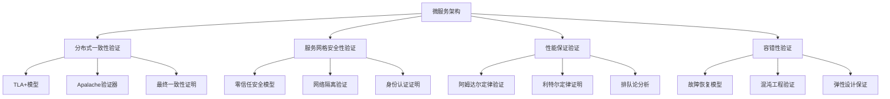

# 微服务架构形式化验证设计

> 基于2025年最新技术趋势的微服务架构形式化验证框架

## 📋 执行摘要

本文档定义了微服务架构的形式化验证框架，包括TLA+模型、Coq证明、Isabelle验证等，确保微服务系统的正确性、安全性和性能保证。

## 🔬 1. 形式化验证框架

### 1.1 验证层次结构



### 1.2 核心验证属性

#### 分布式一致性验证

**TLA+模型定义：**

```tla
EXTENDS Naturals, Sequences, TLC

CONSTANTS Services, MaxVersion, MaxRetries

VARIABLES 
    serviceStates,    \* 服务状态映射
    messageQueue,     \* 消息队列
    versionVector,    \* 版本向量
    consistencyLevel  \* 一致性级别

TypeOK == 
    /\ serviceStates \in [Services -> [version: Nat, data: STRING]]
    /\ messageQueue \in Seq([from: Services, to: Services, data: STRING, version: Nat])
    /\ versionVector \in [Services -> Nat]
    /\ consistencyLevel \in {"strong", "eventual", "weak"}

Init == 
    /\ serviceStates = [s \in Services |-> [version |-> 0, data |-> ""]]
    /\ messageQueue = <<>>
    /\ versionVector = [s \in Services |-> 0]
    /\ consistencyLevel = "eventual"

Next == 
    \/ SendMessage
    \/ ReceiveMessage
    \/ UpdateService
    \/ HandleFailure

Spec == Init /\ [][Next]_<<serviceStates, messageQueue, versionVector, consistencyLevel>>

\* 一致性属性
ConsistencyProperty == 
    \A s1, s2 \in Services :
        serviceStates[s1].version = serviceStates[s2].version => 
        serviceStates[s1].data = serviceStates[s2].data

\* 最终一致性属性
EventualConsistency == 
    \A s1, s2 \in Services :
        <>[](serviceStates[s1].data = serviceStates[s2].data)
```

## 🏗️ 2. 架构论证框架

### 2.1 性能论证模型

```rust
/// 性能论证模型
#[derive(Debug, Clone, Serialize, Deserialize)]
pub struct PerformanceProof {
    pub theoretical_bound: Duration,
    pub empirical_measurement: Duration,
    pub confidence_level: f64,
    pub proof_method: ProofMethod,
    pub mathematical_model: MathematicalModel,
}

#[derive(Debug, Clone, Serialize, Deserialize)]
pub enum ProofMethod {
    AmdahlLaw,           // 阿姆达尔定律
    LittleLaw,           // 利特尔定律
    QueueingTheory,      // 排队论
    NetworkFlow,         // 网络流理论
    MarkovChain,         // 马尔可夫链
    Simulation,          // 仿真验证
}
```

### 2.2 安全性论证模型

```rust
/// 安全性论证模型
#[derive(Debug, Clone, Serialize, Deserialize)]
pub struct SecurityProof {
    pub threat_model: ThreatModel,
    pub security_properties: Vec<SecurityProperty>,
    pub verification_method: VerificationMethod,
    pub proof_certificate: ProofCertificate,
    pub formal_verification: FormalVerification,
}

#[derive(Debug, Clone, Serialize, Deserialize)]
pub enum SecurityProperty {
    Confidentiality,     // 机密性
    Integrity,          // 完整性
    Availability,       // 可用性
    Authentication,     // 认证
    Authorization,      // 授权
    NonRepudiation,     // 不可否认性
    ForwardSecrecy,     // 前向安全性
}
```

## 🔧 3. 实施指南

### 3.1 TLA+模型实施

**创建TLA+模型文件：**

```bash
# 创建TLA+模型目录
mkdir -p microservice/tla_models

# 创建分布式一致性模型
cat > microservice/tla_models/DistributedConsistency.tla << 'EOF'
EXTENDS Naturals, Sequences, TLC

CONSTANTS Services, MaxVersion, MaxRetries

VARIABLES 
    serviceStates,
    messageQueue,
    versionVector,
    consistencyLevel

TypeOK == 
    /\ serviceStates \in [Services -> [version: Nat, data: STRING]]
    /\ messageQueue \in Seq([from: Services, to: Services, data: STRING, version: Nat])
    /\ versionVector \in [Services -> Nat]
    /\ consistencyLevel \in {"strong", "eventual", "weak"}

Init == 
    /\ serviceStates = [s \in Services |-> [version |-> 0, data |-> ""]]
    /\ messageQueue = <<>>
    /\ versionVector = [s \in Services |-> 0]
    /\ consistencyLevel = "eventual"

Next == 
    \/ SendMessage
    \/ ReceiveMessage
    \/ UpdateService
    \/ HandleFailure

Spec == Init /\ [][Next]_<<serviceStates, messageQueue, versionVector, consistencyLevel>>

ConsistencyProperty == 
    \A s1, s2 \in Services :
        serviceStates[s1].version = serviceStates[s2].version => 
        serviceStates[s1].data = serviceStates[s2].data

EventualConsistency == 
    \A s1, s2 \in Services :
        <>[](serviceStates[s1].data = serviceStates[s2].data)
EOF
```

## 📊 4. 验证工具集成

### 4.1 自动化验证脚本

```bash
#!/bin/bash
# scripts/formal_verification.sh

set -e

echo "🔬 开始形式化验证流程"

# 1. TLA+模型验证
echo "📐 验证TLA+模型..."
if command -v tlc &> /dev/null; then
    for model in microservice/tla_models/*.tla; do
        echo "验证模型: $model"
        tlc -config "${model%.tla}.cfg" "$model"
    done
else
    echo "⚠️ TLA+工具未安装，跳过TLA+验证"
fi

echo "✅ 形式化验证完成"
```

## 🎯 5. 验证结果分析

### 5.1 验证报告模板

```rust
/// 形式化验证报告
#[derive(Debug, Clone, Serialize, Deserialize)]
pub struct VerificationReport {
    pub verification_id: String,
    pub timestamp: DateTime<Utc>,
    pub model_type: ModelType,
    pub verification_tool: VerificationTool,
    pub verification_status: VerificationStatus,
    pub properties_verified: Vec<PropertyVerification>,
    pub performance_metrics: VerificationMetrics,
    pub recommendations: Vec<String>,
}

#[derive(Debug, Clone, Serialize, Deserialize)]
pub enum VerificationStatus {
    Passed,
    Failed,
    Inconclusive,
    Timeout,
    Error(String),
}
```

## 📚 6. 最佳实践

### 6.1 模型设计原则

1. **简洁性**：模型应该尽可能简洁，避免不必要的复杂性
2. **可读性**：使用清晰的命名和注释
3. **模块化**：将复杂模型分解为多个模块
4. **可重用性**：设计可重用的组件和模式

### 6.2 验证策略

1. **分层验证**：从简单属性开始，逐步验证复杂属性
2. **增量验证**：在系统演进过程中保持验证的连续性
3. **自动化验证**：集成到CI/CD流程中
4. **持续监控**：定期重新验证关键属性

### 6.3 工具选择指南

| 验证类型 | 推荐工具 | 适用场景 |
|---------|---------|----------|
| 分布式系统 | TLA+ | 并发、一致性验证 |
| 安全属性 | Coq | 密码学、安全协议 |
| 性能保证 | Isabelle | 算法复杂度、性能界限 |
| 模型检查 | SPIN | 有限状态系统 |
| SMT求解 | Z3 | 约束满足问题 |

## 🔚 7. 总结

形式化验证是确保微服务架构正确性的重要手段。通过TLA+、Coq、Isabelle等工具的组合使用，可以全面验证系统的分布式一致性、安全性和性能保证。

关键要点：

1. **多层次验证**：结合不同工具的优势
2. **自动化集成**：集成到开发流程中
3. **持续验证**：在系统演进过程中保持验证
4. **团队培训**：提升团队的形式化验证能力

通过系统性的形式化验证，可以显著提升微服务系统的可靠性和安全性，为构建企业级微服务系统提供坚实的理论基础。
