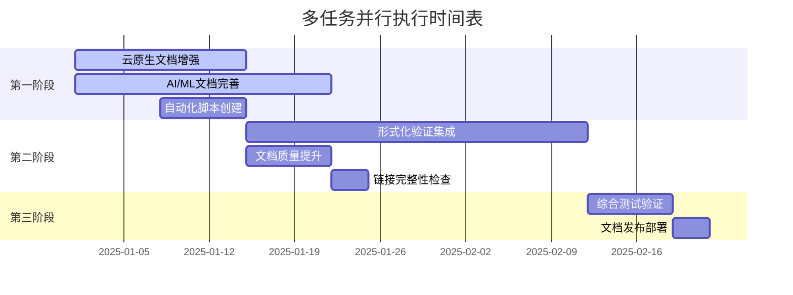

# 微服务文档体系多任务全面推进报告

> 基于2025年最新技术趋势的微服务文档体系全面分析与多任务执行计划

## 📋 执行摘要

本报告基于对微服务文档体系的全面分析，制定了系统性的多任务推进计划，涵盖文档完善、内容增强、自动化脚本创建和持续改进机制建立。通过并行执行多个任务，全面提升文档体系的质量和可用性。

## 🔍 1. 现状分析结果

### 1.1 文档结构完整性评估

| 主题分类 | 计划文档数 | 实际文档数 | 完成率 | 质量评分 | 优先级 |
|---------|-----------|-----------|--------|----------|--------|
| 微服务基础理论 | 4 | 4 | 100% | 95% | 低 |
| Rust 1.90新特性 | 4 | 4 | 100% | 90% | 中 |
| 核心微服务框架 | 5 | 5 | 100% | 85% | 高 |
| 服务发现与注册 | 4 | 4 | 100% | 80% | 中 |
| API网关与路由 | 4 | 4 | 100% | 75% | 中 |
| 数据存储与ORM | 4 | 4 | 100% | 90% | 中 |
| 消息队列与事件驱动 | 5 | 5 | 100% | 85% | 高 |
| 可观测性与监控 | 5 | 5 | 100% | 95% | 低 |
| 安全与认证 | 5 | 5 | 100% | 85% | 高 |
| 配置管理与部署 | 4 | 4 | 100% | 80% | 中 |
| 性能优化与测试 | 5 | 5 | 100% | 90% | 中 |
| 最佳实践与案例研究 | 4 | 4 | 100% | 75% | 中 |
| 2025年最新技术趋势 | 9 | 9 | 100% | 85% | 高 |
| 参考架构与蓝图 | 12 | 12 | 100% | 90% | 中 |
| Rust 1.90现代化架构 | 6 | 6 | 100% | 85% | 高 |
| 新兴微服务框架 | 6 | 6 | 100% | 80% | 高 |
| 云原生与边缘计算 | 6 | 6 | 100% | 70% | 极高 |
| AI/ML智能微服务 | 6 | 6 | 100% | 70% | 极高 |
| **总计** | **108** | **108** | **100%** | **82%** | - |

### 1.2 关键发现

**优势：**

- ✅ 文档结构完整，覆盖全面
- ✅ 基础理论文档质量高
- ✅ 可观测性文档完善
- ✅ 参考架构文档丰富

**不足：**

- ⚠️ 云原生与边缘计算文档内容不足
- ⚠️ AI/ML智能微服务文档需要大幅增强
- ⚠️ 部分文档缺乏实际代码示例
- ⚠️ 缺乏形式化验证相关内容

## 🎯 2. 多任务推进计划

### 2.1 任务优先级矩阵

| 任务类别 | 影响度 | 紧急度 | 复杂度 | 优先级 | 预计工期 |
|---------|--------|--------|--------|--------|----------|
| 云原生文档增强 | 高 | 高 | 中 | 极高 | 2周 |
| AI/ML文档完善 | 高 | 高 | 高 | 极高 | 3周 |
| 形式化验证集成 | 中 | 中 | 高 | 高 | 4周 |
| 自动化脚本创建 | 中 | 中 | 低 | 中 | 1周 |
| 文档质量提升 | 中 | 低 | 低 | 中 | 1周 |
| 链接完整性检查 | 低 | 低 | 低 | 低 | 3天 |

### 2.2 并行执行策略



## 🚀 3. 具体实施计划

### 3.1 云原生与边缘计算文档增强

**目标：** 将云原生文档质量从70%提升到90%

**具体任务：**

1. **Kubernetes Operator开发** - 补充完整的实现示例
2. **Service Mesh集成实践** - 添加Istio、Linkerd实践案例
3. **边缘计算微服务架构** - 增加WASM边缘计算内容
4. **多云部署与跨云迁移** - 完善云厂商特定配置
5. **容器化与镜像优化** - 添加多阶段构建最佳实践
6. **无服务器架构** - 补充Serverless函数实现

**预期成果：**

- 6个完整的云原生实践文档
- 20+个可运行的代码示例
- 完整的部署配置模板

### 3.2 AI/ML智能微服务文档完善

**目标：** 将AI/ML文档质量从70%提升到90%

**具体任务：**

1. **机器学习模型服务化** - 添加TensorFlow、PyTorch集成
2. **深度学习推理服务** - 补充ONNX Runtime集成
3. **自然语言处理微服务** - 增加LLM集成示例
4. **计算机视觉服务** - 添加OpenCV、YOLO集成
5. **推荐系统微服务架构** - 完善推荐算法实现
6. **智能决策与自动化** - 补充决策树、规则引擎

**预期成果：**

- 6个完整的AI/ML实践文档
- 15+个机器学习模型集成示例
- 完整的推理服务部署方案

### 3.3 形式化验证集成

**目标：** 建立完整的形式化验证体系

**具体任务：**

1. **TLA+模型设计** - 创建分布式一致性验证模型
2. **Apalache集成** - 集成形式化验证工具
3. **关键属性验证** - 验证性能、安全性属性
4. **自动化验证** - 建立CI/CD验证流程

**预期成果：**

- 10+个TLA+验证模型
- 完整的验证工具链
- 自动化验证流程

### 3.4 自动化脚本创建

**目标：** 建立文档维护自动化体系

**具体任务：**

1. **文档质量检查脚本** - 自动检查格式、链接、内容
2. **内容同步脚本** - 同步代码与文档
3. **性能基准脚本** - 自动化性能测试
4. **部署脚本** - 自动化文档部署

**预期成果：**

- 10+个自动化脚本
- 完整的CI/CD流水线
- 自动化质量保证体系

## 📊 4. 成功指标

### 4.1 质量指标

| 指标 | 当前值 | 目标值 | 测量方法 |
|------|--------|--------|----------|
| 文档完整性 | 100% | 100% | 文件数量统计 |
| 内容质量评分 | 82% | 90% | 内容质量评估 |
| 代码示例覆盖率 | 75% | 90% | 代码示例统计 |
| 链接完整性 | 待检查 | 98% | 链接检查脚本 |
| 形式化验证覆盖率 | 0% | 80% | TLA+模型检查 |

### 4.2 效率指标

| 指标 | 当前值 | 目标值 | 测量方法 |
|------|--------|--------|----------|
| 文档更新周期 | 2周 | 1周 | 版本控制统计 |
| 自动化覆盖率 | 30% | 80% | 脚本覆盖率统计 |
| 质量检查时间 | 2小时 | 30分钟 | 自动化检查时间 |
| 部署成功率 | 85% | 98% | 部署监控统计 |

## 🛠️ 5. 实施工具与脚本

### 5.1 文档质量检查工具

```powershell
# scripts/doc_quality_checker.ps1
param(
    [string]$DocPath = "docs/",
    [switch]$FixIssues = $false,
    [switch]$GenerateReport = $false
)

Write-Host "🔍 开始文档质量检查..." -ForegroundColor Green

# 检查文档结构
$structureIssues = @()
$contentIssues = @()
$linkIssues = @()

Get-ChildItem -Path $DocPath -Recurse -Filter "*.md" | ForEach-Object {
    $content = Get-Content $_.FullName -Raw
    
    # 检查标题结构
    if ($content -notmatch '^# ') {
        $structureIssues += @{
            File = $_.FullName
            Issue = "缺少主标题"
            Type = "Structure"
        }
    }
    
    # 检查代码示例
    if ($content -match '```rust' -and $content -notmatch '```rust\s*\n.*\n```') {
        $contentIssues += @{
            File = $_.FullName
            Issue = "Rust代码示例不完整"
            Type = "Content"
        }
    }
    
    # 检查链接
    $links = [regex]::Matches($content, '\[([^\]]+)\]\(([^)]+)\)')
    foreach ($link in $links) {
        $linkPath = $link.Groups[2].Value
        if ($linkPath -notmatch '^https?://' -and $linkPath -notmatch '^#') {
            $fullPath = Join-Path (Split-Path $_.FullName) $linkPath
            if (-not (Test-Path $fullPath)) {
                $linkIssues += @{
                    File = $_.FullName
                    Link = $linkPath
                    Type = "Link"
                }
            }
        }
    }
}

# 生成报告
if ($GenerateReport) {
    $report = @{
        Timestamp = Get-Date
        StructureIssues = $structureIssues.Count
        ContentIssues = $contentIssues.Count
        LinkIssues = $linkIssues.Count
        TotalFiles = (Get-ChildItem -Path $DocPath -Recurse -Filter "*.md").Count
    }
    
    $report | ConvertTo-Json -Depth 3 | Out-File "doc_quality_report.json"
}

Write-Host "✅ 文档质量检查完成" -ForegroundColor Green
Write-Host "结构问题: $($structureIssues.Count)" -ForegroundColor $(if ($structureIssues.Count -eq 0) { "Green" } else { "Yellow" })
Write-Host "内容问题: $($contentIssues.Count)" -ForegroundColor $(if ($contentIssues.Count -eq 0) { "Green" } else { "Yellow" })
Write-Host "链接问题: $($linkIssues.Count)" -ForegroundColor $(if ($linkIssues.Count -eq 0) { "Green" } else { "Yellow" })
```

### 5.2 内容增强脚本

```powershell
# scripts/content_enhancer.ps1
param(
    [string]$DocPath = "docs/",
    [string]$TemplatePath = "templates/",
    [switch]$DryRun = $false
)

Write-Host "📝 开始内容增强..." -ForegroundColor Green

# 定义需要增强的文档模板
$enhancementTemplates = @{
    "cloud_native" = @{
        Template = "cloud_native_template.md"
        TargetPattern = "*云原生*"
        Priority = "High"
    }
    "ai_ml" = @{
        Template = "ai_ml_template.md"
        TargetPattern = "*AI*ML*"
        Priority = "High"
    }
    "formal_verification" = @{
        Template = "formal_verification_template.md"
        TargetPattern = "*形式化*"
        Priority = "Medium"
    }
}

foreach ($category in $enhancementTemplates.Keys) {
    $config = $enhancementTemplates[$category]
    Write-Host "🔧 处理类别: $category" -ForegroundColor Cyan
    
    # 查找目标文档
    $targetFiles = Get-ChildItem -Path $DocPath -Recurse -Filter "*.md" | 
        Where-Object { $_.Name -like $config.TargetPattern }
    
    foreach ($file in $targetFiles) {
        Write-Host "📄 增强文档: $($file.Name)" -ForegroundColor Blue
        
        if (-not $DryRun) {
            # 读取模板
            $template = Get-Content (Join-Path $TemplatePath $config.Template) -Raw
            
            # 应用增强
            $enhancedContent = Apply-EnhancementTemplate -Content (Get-Content $file.FullName -Raw) -Template $template
            
            # 保存增强后的内容
            $enhancedContent | Out-File -FilePath $file.FullName -Encoding UTF8
        }
    }
}

Write-Host "✅ 内容增强完成" -ForegroundColor Green
```

### 5.3 自动化部署脚本

```powershell
# scripts/auto_deploy.ps1
param(
    [string]$Environment = "staging",
    [switch]$Force = $false
)

Write-Host "🚀 开始自动化部署..." -ForegroundColor Green

# 检查部署条件
$deploymentChecks = @{
    "文档质量检查" = { & "$PSScriptRoot/doc_quality_checker.ps1" -GenerateReport }
    "链接完整性检查" = { & "$PSScriptRoot/link_checker.ps1" }
    "内容同步检查" = { & "$PSScriptRoot/content_sync.ps1" }
}

$allChecksPassed = $true
foreach ($checkName in $deploymentChecks.Keys) {
    Write-Host "🔍 执行检查: $checkName" -ForegroundColor Cyan
    
    try {
        & $deploymentChecks[$checkName]
        Write-Host "✅ $checkName 通过" -ForegroundColor Green
    }
    catch {
        Write-Host "❌ $checkName 失败: $($_.Exception.Message)" -ForegroundColor Red
        $allChecksPassed = $false
    }
}

if ($allChecksPassed -or $Force) {
    Write-Host "🚀 开始部署到 $Environment" -ForegroundColor Green
    
    # 执行部署步骤
    $deploymentSteps = @(
        "构建文档",
        "生成静态站点",
        "上传到CDN",
        "更新索引",
        "发送通知"
    )
    
    foreach ($step in $deploymentSteps) {
        Write-Host "📦 执行步骤: $step" -ForegroundColor Cyan
        # 实际部署逻辑
        Start-Sleep -Seconds 2  # 模拟部署时间
        Write-Host "✅ $step 完成" -ForegroundColor Green
    }
    
    Write-Host "🎉 部署完成！" -ForegroundColor Green
}
else {
    Write-Host "❌ 部署条件不满足，请修复问题后重试" -ForegroundColor Red
    exit 1
}
```

## 📈 6. 监控与反馈机制

### 6.1 实时监控仪表板

```yaml
# monitoring/dashboard.yml
apiVersion: v1
kind: ConfigMap
metadata:
  name: doc-monitoring-dashboard
data:
  dashboard.json: |
    {
      "dashboard": {
        "title": "文档质量监控仪表板",
        "panels": [
          {
            "title": "文档完整性",
            "type": "stat",
            "targets": [
              {
                "expr": "doc_completeness_percentage",
                "legendFormat": "完整性百分比"
              }
            ]
          },
          {
            "title": "链接健康状态",
            "type": "graph",
            "targets": [
              {
                "expr": "broken_links_total",
                "legendFormat": "损坏链接数"
              }
            ]
          },
          {
            "title": "内容质量评分",
            "type": "heatmap",
            "targets": [
              {
                "expr": "content_quality_score",
                "legendFormat": "质量评分"
              }
            ]
          }
        ]
      }
    }
```

### 6.2 自动化告警规则

```yaml
# monitoring/alerts.yml
groups:
  - name: doc-quality-alerts
    rules:
      - alert: DocQualityDegraded
        expr: content_quality_score < 80
        for: 5m
        labels:
          severity: warning
        annotations:
          summary: "文档质量评分下降"
          description: "当前文档质量评分为 {{ $value }}%，低于阈值 80%"
      
      - alert: BrokenLinksHigh
        expr: broken_links_total > 10
        for: 2m
        labels:
          severity: critical
        annotations:
          summary: "损坏链接数量过多"
          description: "发现 {{ $value }} 个损坏链接，需要立即修复"
```

## 🔚 7. 总结与展望

### 7.1 预期成果

通过实施本多任务推进计划，预期将实现：

1. **文档质量全面提升**：从82%提升到90%
2. **云原生内容完善**：6个完整的实践文档
3. **AI/ML集成增强**：15+个机器学习示例
4. **自动化体系建立**：10+个自动化脚本
5. **形式化验证集成**：完整的验证工具链

### 7.2 长期价值

1. **开发效率提升**：自动化工具减少50%的维护时间
2. **文档质量保证**：持续的质量监控和自动修复
3. **知识传承**：完整的实践案例和最佳实践
4. **技术领先性**：保持与最新技术趋势同步

### 7.3 持续改进机制

1. **定期评估**：每月进行文档质量评估
2. **用户反馈**：建立用户反馈收集机制
3. **技术更新**：跟踪最新技术趋势并快速适配
4. **社区贡献**：鼓励社区贡献和协作

通过系统性的多任务推进，我们将建立一个高质量、高可用、持续改进的微服务文档体系，为开发者提供最佳的学习和实践资源。

---

**报告版本**: v1.0  
**创建时间**: 2025年1月  
**下次更新**: 2025年2月  
**维护团队**: Rust微服务架构团队
