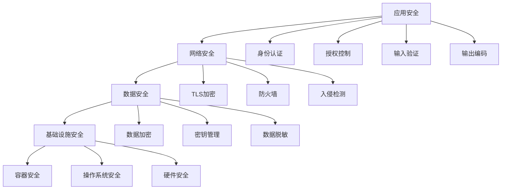

# 安全最佳实践指南

> 基于Rust 1.90和最新依赖版本的微服务安全完整解决方案

## 📋 概述

本文档提供了完整的微服务安全指南，包括身份认证、授权、数据加密、安全通信、漏洞防护等全方位安全解决方案。

## 🎯 安全目标

### 1. 安全原则

- **零信任架构**: 永不信任，始终验证
- **最小权限原则**: 只授予必要的权限
- **深度防御**: 多层安全防护
- **安全左移**: 在开发阶段集成安全

### 2. 安全层次



## 🔐 身份认证与授权

### 1. JWT认证实现

```rust
use jsonwebtoken::{decode, encode, Algorithm, DecodingKey, EncodingKey, Header, Validation};
use serde::{Deserialize, Serialize};
use std::time::{SystemTime, UNIX_EPOCH};

// JWT Claims结构
#[derive(Debug, Serialize, Deserialize)]
pub struct Claims {
    pub sub: String,        // 用户ID
    pub exp: usize,         // 过期时间
    pub iat: usize,         // 签发时间
    pub iss: String,        // 签发者
    pub aud: String,        // 受众
    pub roles: Vec<String>, // 用户角色
    pub permissions: Vec<String>, // 用户权限
}

// JWT认证服务
pub struct JwtAuthService {
    encoding_key: EncodingKey,
    decoding_key: DecodingKey,
    validation: Validation,
}

impl JwtAuthService {
    pub fn new(secret: &str) -> Self {
        let encoding_key = EncodingKey::from_secret(secret.as_ref());
        let decoding_key = DecodingKey::from_secret(secret.as_ref());
        
        let mut validation = Validation::new(Algorithm::HS256);
        validation.set_issuer(&["microservice"]);
        validation.set_audience(&["api"]);
        validation.set_required_spec_claims(&["exp", "iat", "sub"]);
        
        Self {
            encoding_key,
            decoding_key,
            validation,
        }
    }
    
    pub fn generate_token(&self, user_id: &str, roles: Vec<String>, permissions: Vec<String>) -> Result<String, Box<dyn std::error::Error>> {
        let now = SystemTime::now().duration_since(UNIX_EPOCH)?.as_secs() as usize;
        
        let claims = Claims {
            sub: user_id.to_string(),
            exp: now + 3600, // 1小时过期
            iat: now,
            iss: "microservice".to_string(),
            aud: "api".to_string(),
            roles,
            permissions,
        };
        
        let token = encode(&Header::default(), &claims, &self.encoding_key)?;
        Ok(token)
    }
    
    pub fn validate_token(&self, token: &str) -> Result<Claims, Box<dyn std::error::Error>> {
        let token_data = decode::<Claims>(token, &self.decoding_key, &self.validation)?;
        Ok(token_data.claims)
    }
    
    pub fn refresh_token(&self, token: &str) -> Result<String, Box<dyn std::error::Error>> {
        let claims = self.validate_token(token)?;
        
        // 生成新的token
        self.generate_token(&claims.sub, claims.roles, claims.permissions)
    }
}

// 用户认证中间件
pub struct AuthMiddleware {
    auth_service: JwtAuthService,
    user_service: Arc<dyn UserService>,
}

impl AuthMiddleware {
    pub fn new(auth_service: JwtAuthService, user_service: Arc<dyn UserService>) -> Self {
        Self {
            auth_service,
            user_service,
        }
    }
    
    pub async fn authenticate(&self, token: &str) -> Result<AuthenticatedUser, AuthError> {
        // 验证JWT token
        let claims = self.auth_service.validate_token(token)
            .map_err(|_| AuthError::InvalidToken)?;
        
        // 检查用户是否存在且活跃
        let user = self.user_service.get_user(&claims.sub).await
            .map_err(|_| AuthError::UserNotFound)?;
        
        if !user.is_active {
            return Err(AuthError::UserInactive);
        }
        
        Ok(AuthenticatedUser {
            id: user.id,
            username: user.username,
            roles: claims.roles,
            permissions: claims.permissions,
        })
    }
}

#[derive(Debug)]
pub struct AuthenticatedUser {
    pub id: String,
    pub username: String,
    pub roles: Vec<String>,
    pub permissions: Vec<String>,
}

#[derive(Debug)]
pub enum AuthError {
    InvalidToken,
    UserNotFound,
    UserInactive,
    InsufficientPermissions,
}
```

### 2. RBAC权限控制

```rust
use std::collections::HashMap;
use std::sync::Arc;

// 角色定义
#[derive(Debug, Clone, PartialEq)]
pub enum Role {
    Admin,
    User,
    Guest,
    Moderator,
}

// 权限定义
#[derive(Debug, Clone, PartialEq)]
pub enum Permission {
    ReadUsers,
    WriteUsers,
    DeleteUsers,
    ReadOrders,
    WriteOrders,
    DeleteOrders,
    AdminAccess,
}

// 角色权限映射
pub struct RoleBasedAccessControl {
    role_permissions: HashMap<Role, Vec<Permission>>,
}

impl RoleBasedAccessControl {
    pub fn new() -> Self {
        let mut role_permissions = HashMap::new();
        
        // 管理员权限
        role_permissions.insert(Role::Admin, vec![
            Permission::ReadUsers,
            Permission::WriteUsers,
            Permission::DeleteUsers,
            Permission::ReadOrders,
            Permission::WriteOrders,
            Permission::DeleteOrders,
            Permission::AdminAccess,
        ]);
        
        // 用户权限
        role_permissions.insert(Role::User, vec![
            Permission::ReadUsers,
            Permission::ReadOrders,
            Permission::WriteOrders,
        ]);
        
        // 访客权限
        role_permissions.insert(Role::Guest, vec![
            Permission::ReadUsers,
        ]);
        
        // 版主权限
        role_permissions.insert(Role::Moderator, vec![
            Permission::ReadUsers,
            Permission::WriteUsers,
            Permission::ReadOrders,
            Permission::WriteOrders,
        ]);
        
        Self { role_permissions }
    }
    
    pub fn has_permission(&self, role: &Role, permission: &Permission) -> bool {
        self.role_permissions
            .get(role)
            .map(|permissions| permissions.contains(permission))
            .unwrap_or(false)
    }
    
    pub fn get_permissions(&self, role: &Role) -> Vec<Permission> {
        self.role_permissions
            .get(role)
            .cloned()
            .unwrap_or_default()
    }
}

// 权限检查中间件
pub struct PermissionMiddleware {
    rbac: RoleBasedAccessControl,
}

impl PermissionMiddleware {
    pub fn new() -> Self {
        Self {
            rbac: RoleBasedAccessControl::new(),
        }
    }
    
    pub fn check_permission(&self, user: &AuthenticatedUser, required_permission: &Permission) -> Result<(), AuthError> {
        for role_str in &user.roles {
            let role = self.parse_role(role_str)?;
            if self.rbac.has_permission(&role, required_permission) {
                return Ok(());
            }
        }
        
        Err(AuthError::InsufficientPermissions)
    }
    
    fn parse_role(&self, role_str: &str) -> Result<Role, AuthError> {
        match role_str {
            "admin" => Ok(Role::Admin),
            "user" => Ok(Role::User),
            "guest" => Ok(Role::Guest),
            "moderator" => Ok(Role::Moderator),
            _ => Err(AuthError::InvalidToken),
        }
    }
}

// 使用示例
pub async fn protected_endpoint(
    user: AuthenticatedUser,
    permission_middleware: PermissionMiddleware,
) -> Result<String, AuthError> {
    // 检查权限
    permission_middleware.check_permission(&user, &Permission::WriteUsers)?;
    
    // 执行业务逻辑
    Ok("Access granted".to_string())
}
```

### 3. OAuth2集成

```rust
use oauth2::{
    AuthorizationCode, AuthUrl, ClientId, ClientSecret, CsrfToken, RedirectUrl, Scope,
    TokenResponse, TokenUrl,
};
use oauth2::basic::BasicClient;
use oauth2::reqwest::async_http_client;

// OAuth2客户端配置
pub struct OAuth2Service {
    client: BasicClient,
    redirect_url: String,
}

impl OAuth2Service {
    pub fn new(
        client_id: String,
        client_secret: String,
        auth_url: String,
        token_url: String,
        redirect_url: String,
    ) -> Self {
        let client = BasicClient::new(
            ClientId::new(client_id),
            Some(ClientSecret::new(client_secret)),
            AuthUrl::new(auth_url).unwrap(),
            Some(TokenUrl::new(token_url).unwrap()),
        )
        .set_redirect_uri(RedirectUrl::new(redirect_url.clone()).unwrap());
        
        Self {
            client,
            redirect_url,
        }
    }
    
    pub fn get_authorization_url(&self) -> (String, CsrfToken) {
        self.client
            .authorize_url(CsrfToken::new_random)
            .add_scope(Scope::new("read".to_string()))
            .add_scope(Scope::new("write".to_string()))
            .url()
    }
    
    pub async fn exchange_code(&self, code: String) -> Result<String, Box<dyn std::error::Error>> {
        let token = self.client
            .exchange_code(AuthorizationCode::new(code))
            .request_async(async_http_client)
            .await?;
        
        Ok(token.access_token().secret().clone())
    }
    
    pub async fn get_user_info(&self, access_token: &str) -> Result<UserInfo, Box<dyn std::error::Error>> {
        let client = reqwest::Client::new();
        let response = client
            .get("https://api.github.com/user")
            .bearer_auth(access_token)
            .send()
            .await?;
        
        let user_info: UserInfo = response.json().await?;
        Ok(user_info)
    }
}

#[derive(Debug, Deserialize)]
pub struct UserInfo {
    pub id: u64,
    pub login: String,
    pub email: Option<String>,
    pub name: Option<String>,
    pub avatar_url: Option<String>,
}
```

## 🔒 数据加密与保护

### 1. 数据加密服务

```rust
use aes_gcm::{Aes256Gcm, Key, Nonce};
use aes_gcm::aead::{Aead, NewAead};
use argon2::{Argon2, PasswordHash, PasswordHasher, PasswordVerifier};
use argon2::password_hash::{rand_core::OsRng, SaltString};
use rand::Rng;

// 加密服务
pub struct EncryptionService {
    cipher: Aes256Gcm,
}

impl EncryptionService {
    pub fn new(key: &[u8; 32]) -> Self {
        let key = Key::from_slice(key);
        let cipher = Aes256Gcm::new(key);
        
        Self { cipher }
    }
    
    pub fn encrypt(&self, plaintext: &[u8]) -> Result<Vec<u8>, Box<dyn std::error::Error>> {
        let nonce = self.generate_nonce();
        let ciphertext = self.cipher.encrypt(&nonce, plaintext)
            .map_err(|e| format!("Encryption failed: {}", e))?;
        
        // 将nonce和密文组合
        let mut result = nonce.to_vec();
        result.extend_from_slice(&ciphertext);
        Ok(result)
    }
    
    pub fn decrypt(&self, ciphertext: &[u8]) -> Result<Vec<u8>, Box<dyn std::error::Error>> {
        if ciphertext.len() < 12 {
            return Err("Invalid ciphertext length".into());
        }
        
        let (nonce_bytes, encrypted_data) = ciphertext.split_at(12);
        let nonce = Nonce::from_slice(nonce_bytes);
        
        let plaintext = self.cipher.decrypt(nonce, encrypted_data)
            .map_err(|e| format!("Decryption failed: {}", e))?;
        
        Ok(plaintext)
    }
    
    fn generate_nonce(&self) -> Nonce {
        let mut nonce_bytes = [0u8; 12];
        OsRng.fill(&mut nonce_bytes);
        Nonce::from_slice(&nonce_bytes)
    }
}

// 密码哈希服务
pub struct PasswordService;

impl PasswordService {
    pub fn hash_password(password: &str) -> Result<String, Box<dyn std::error::Error>> {
        let salt = SaltString::generate(&mut OsRng);
        let argon2 = Argon2::default();
        
        let password_hash = argon2
            .hash_password(password.as_bytes(), &salt)
            .map_err(|e| format!("Password hashing failed: {}", e))?;
        
        Ok(password_hash.to_string())
    }
    
    pub fn verify_password(password: &str, hash: &str) -> Result<bool, Box<dyn std::error::Error>> {
        let parsed_hash = PasswordHash::new(hash)
            .map_err(|e| format!("Invalid password hash: {}", e))?;
        
        let argon2 = Argon2::default();
        let result = argon2.verify_password(password.as_bytes(), &parsed_hash);
        
        Ok(result.is_ok())
    }
}

// 敏感数据保护
pub struct SensitiveDataProtection {
    encryption_service: EncryptionService,
}

impl SensitiveDataProtection {
    pub fn new(encryption_key: &[u8; 32]) -> Self {
        Self {
            encryption_service: EncryptionService::new(encryption_key),
        }
    }
    
    pub fn protect_pii(&self, data: &str) -> Result<String, Box<dyn std::error::Error>> {
        let encrypted = self.encryption_service.encrypt(data.as_bytes())?;
        Ok(base64::encode(encrypted))
    }
    
    pub fn unprotect_pii(&self, protected_data: &str) -> Result<String, Box<dyn std::error::Error>> {
        let encrypted = base64::decode(protected_data)?;
        let decrypted = self.encryption_service.decrypt(&encrypted)?;
        Ok(String::from_utf8(decrypted)?)
    }
    
    pub fn mask_email(&self, email: &str) -> String {
        if let Some(at_pos) = email.find('@') {
            let (username, domain) = email.split_at(at_pos);
            let masked_username = if username.len() > 2 {
                format!("{}***{}", &username[..1], &username[username.len()-1..])
            } else {
                "***".to_string()
            };
            format!("{}@{}", masked_username, domain)
        } else {
            "***".to_string()
        }
    }
    
    pub fn mask_phone(&self, phone: &str) -> String {
        if phone.len() > 4 {
            format!("***-***-{}", &phone[phone.len()-4..])
        } else {
            "***".to_string()
        }
    }
}
```

### 2. 密钥管理

```rust
use std::sync::Arc;
use tokio::sync::RwLock;
use std::time::{Duration, Instant};

// 密钥管理器
pub struct KeyManager {
    keys: Arc<RwLock<HashMap<String, KeyInfo>>>,
    rotation_interval: Duration,
}

#[derive(Debug, Clone)]
pub struct KeyInfo {
    pub key: Vec<u8>,
    pub created_at: Instant,
    pub expires_at: Instant,
    pub version: u32,
}

impl KeyManager {
    pub fn new(rotation_interval: Duration) -> Self {
        Self {
            keys: Arc::new(RwLock::new(HashMap::new())),
            rotation_interval,
        }
    }
    
    pub async fn generate_key(&self, key_id: String) -> Result<(), Box<dyn std::error::Error>> {
        let mut key_bytes = [0u8; 32];
        OsRng.fill(&mut key_bytes);
        
        let key_info = KeyInfo {
            key: key_bytes.to_vec(),
            created_at: Instant::now(),
            expires_at: Instant::now() + self.rotation_interval,
            version: 1,
        };
        
        let mut keys = self.keys.write().await;
        keys.insert(key_id, key_info);
        
        Ok(())
    }
    
    pub async fn get_key(&self, key_id: &str) -> Result<Vec<u8>, Box<dyn std::error::Error>> {
        let keys = self.keys.read().await;
        let key_info = keys.get(key_id)
            .ok_or("Key not found")?;
        
        if key_info.expires_at < Instant::now() {
            return Err("Key expired".into());
        }
        
        Ok(key_info.key.clone())
    }
    
    pub async fn rotate_key(&self, key_id: &str) -> Result<(), Box<dyn std::error::Error>> {
        let mut keys = self.keys.write().await;
        
        if let Some(key_info) = keys.get_mut(key_id) {
            let mut new_key_bytes = [0u8; 32];
            OsRng.fill(&mut new_key_bytes);
            
            key_info.key = new_key_bytes.to_vec();
            key_info.created_at = Instant::now();
            key_info.expires_at = Instant::now() + self.rotation_interval;
            key_info.version += 1;
        }
        
        Ok(())
    }
    
    pub async fn cleanup_expired_keys(&self) {
        let mut keys = self.keys.write().await;
        keys.retain(|_, key_info| key_info.expires_at > Instant::now());
    }
}

// 密钥轮换任务
pub struct KeyRotationTask {
    key_manager: Arc<KeyManager>,
    interval: Duration,
}

impl KeyRotationTask {
    pub fn new(key_manager: Arc<KeyManager>, interval: Duration) -> Self {
        Self {
            key_manager,
            interval,
        }
    }
    
    pub async fn start(&self) {
        let mut interval = tokio::time::interval(self.interval);
        
        loop {
            interval.tick().await;
            
            // 清理过期密钥
            self.key_manager.cleanup_expired_keys().await;
            
            // 轮换即将过期的密钥
            // 这里可以添加具体的轮换逻辑
        }
    }
}
```

## 🛡️ 输入验证与防护

### 1. 输入验证框架

```rust
use serde::{Deserialize, Serialize};
use validator::{Validate, ValidationError};
use regex::Regex;

// 自定义验证器
pub fn validate_strong_password(password: &str) -> Result<(), ValidationError> {
    if password.len() < 8 {
        return Err(ValidationError::new("password_too_short"));
    }
    
    if !password.chars().any(|c| c.is_uppercase()) {
        return Err(ValidationError::new("password_no_uppercase"));
    }
    
    if !password.chars().any(|c| c.is_lowercase()) {
        return Err(ValidationError::new("password_no_lowercase"));
    }
    
    if !password.chars().any(|c| c.is_numeric()) {
        return Err(ValidationError::new("password_no_number"));
    }
    
    if !password.chars().any(|c| "!@#$%^&*()_+-=[]{}|;:,.<>?".contains(c)) {
        return Err(ValidationError::new("password_no_special_char"));
    }
    
    Ok(())
}

pub fn validate_email(email: &str) -> Result<(), ValidationError> {
    let email_regex = Regex::new(r"^[a-zA-Z0-9._%+-]+@[a-zA-Z0-9.-]+\.[a-zA-Z]{2,}$")
        .map_err(|_| ValidationError::new("invalid_regex"))?;
    
    if !email_regex.is_match(email) {
        return Err(ValidationError::new("invalid_email"));
    }
    
    Ok(())
}

// 用户注册请求验证
#[derive(Debug, Deserialize, Validate)]
pub struct UserRegistrationRequest {
    #[validate(length(min = 3, max = 50, message = "用户名长度必须在3-50个字符之间"))]
    pub username: String,
    
    #[validate(custom = "validate_email")]
    pub email: String,
    
    #[validate(custom = "validate_strong_password")]
    pub password: String,
    
    #[validate(length(min = 2, max = 100, message = "姓名长度必须在2-100个字符之间"))]
    pub full_name: String,
    
    #[validate(range(min = 13, max = 120, message = "年龄必须在13-120岁之间"))]
    pub age: u8,
}

// 输入清理器
pub struct InputSanitizer;

impl InputSanitizer {
    pub fn sanitize_string(input: &str) -> String {
        input
            .trim()
            .chars()
            .filter(|c| !c.is_control())
            .collect()
    }
    
    pub fn sanitize_html(input: &str) -> String {
        // 移除HTML标签
        let html_regex = Regex::new(r"<[^>]*>").unwrap();
        html_regex.replace_all(input, "").to_string()
    }
    
    pub fn sanitize_sql(input: &str) -> String {
        // 基本的SQL注入防护
        input
            .replace("'", "''")
            .replace(";", "")
            .replace("--", "")
            .replace("/*", "")
            .replace("*/", "")
    }
    
    pub fn sanitize_path(input: &str) -> String {
        // 路径遍历攻击防护
        input
            .replace("../", "")
            .replace("..\\", "")
            .replace("/", "_")
            .replace("\\", "_")
    }
}

// 请求验证中间件
pub struct ValidationMiddleware;

impl ValidationMiddleware {
    pub async fn validate_request<T>(request: &T) -> Result<(), ValidationError>
    where
        T: Validate,
    {
        request.validate()
    }
    
    pub fn sanitize_input(input: &str, input_type: InputType) -> String {
        match input_type {
            InputType::String => InputSanitizer::sanitize_string(input),
            InputType::Html => InputSanitizer::sanitize_html(input),
            InputType::Sql => InputSanitizer::sanitize_sql(input),
            InputType::Path => InputSanitizer::sanitize_path(input),
        }
    }
}

#[derive(Debug)]
pub enum InputType {
    String,
    Html,
    Sql,
    Path,
}
```

### 2. 速率限制

```rust
use std::sync::Arc;
use std::time::{Duration, Instant};
use tokio::sync::RwLock;
use std::collections::HashMap;

// 令牌桶算法
pub struct TokenBucket {
    capacity: u32,
    tokens: u32,
    last_refill: Instant,
    refill_rate: u32, // tokens per second
}

impl TokenBucket {
    pub fn new(capacity: u32, refill_rate: u32) -> Self {
        Self {
            capacity,
            tokens: capacity,
            last_refill: Instant::now(),
            refill_rate,
        }
    }
    
    pub fn try_consume(&mut self, tokens: u32) -> bool {
        self.refill();
        
        if self.tokens >= tokens {
            self.tokens -= tokens;
            true
        } else {
            false
        }
    }
    
    fn refill(&mut self) {
        let now = Instant::now();
        let elapsed = now.duration_since(self.last_refill);
        let tokens_to_add = (elapsed.as_secs() as u32 * self.refill_rate)
            + (elapsed.subsec_millis() as u32 * self.refill_rate / 1000);
        
        self.tokens = (self.tokens + tokens_to_add).min(self.capacity);
        self.last_refill = now;
    }
}

// 速率限制器
pub struct RateLimiter {
    buckets: Arc<RwLock<HashMap<String, TokenBucket>>>,
    default_capacity: u32,
    default_refill_rate: u32,
}

impl RateLimiter {
    pub fn new(default_capacity: u32, default_refill_rate: u32) -> Self {
        Self {
            buckets: Arc::new(RwLock::new(HashMap::new())),
            default_capacity,
            default_refill_rate,
        }
    }
    
    pub async fn is_allowed(&self, key: &str, tokens: u32) -> bool {
        let mut buckets = self.buckets.write().await;
        
        let bucket = buckets.entry(key.to_string()).or_insert_with(|| {
            TokenBucket::new(self.default_capacity, self.default_refill_rate)
        });
        
        bucket.try_consume(tokens)
    }
    
    pub async fn is_allowed_with_custom_limit(
        &self,
        key: &str,
        tokens: u32,
        capacity: u32,
        refill_rate: u32,
    ) -> bool {
        let mut buckets = self.buckets.write().await;
        
        let bucket = buckets.entry(key.to_string()).or_insert_with(|| {
            TokenBucket::new(capacity, refill_rate)
        });
        
        bucket.try_consume(tokens)
    }
}

// 速率限制中间件
pub struct RateLimitMiddleware {
    rate_limiter: Arc<RateLimiter>,
}

impl RateLimitMiddleware {
    pub fn new(rate_limiter: Arc<RateLimiter>) -> Self {
        Self { rate_limiter }
    }
    
    pub async fn check_rate_limit(&self, client_ip: &str, endpoint: &str) -> Result<(), RateLimitError> {
        let key = format!("{}:{}", client_ip, endpoint);
        
        if self.rate_limiter.is_allowed(&key, 1).await {
            Ok(())
        } else {
            Err(RateLimitError::TooManyRequests)
        }
    }
}

#[derive(Debug)]
pub enum RateLimitError {
    TooManyRequests,
}
```

## 🔍 安全监控与审计

### 1. 安全事件监控

```rust
use serde::{Deserialize, Serialize};
use std::time::SystemTime;
use tokio::sync::mpsc;

// 安全事件类型
#[derive(Debug, Clone, Serialize, Deserialize)]
pub enum SecurityEvent {
    LoginAttempt {
        user_id: Option<String>,
        ip_address: String,
        success: bool,
        timestamp: SystemTime,
    },
    PermissionDenied {
        user_id: String,
        resource: String,
        action: String,
        timestamp: SystemTime,
    },
    SuspiciousActivity {
        user_id: String,
        activity_type: String,
        details: String,
        timestamp: SystemTime,
    },
    DataAccess {
        user_id: String,
        data_type: String,
        access_type: String,
        timestamp: SystemTime,
    },
}

// 安全监控器
pub struct SecurityMonitor {
    event_sender: mpsc::UnboundedSender<SecurityEvent>,
    alert_thresholds: AlertThresholds,
}

#[derive(Debug, Clone)]
pub struct AlertThresholds {
    pub max_failed_logins: u32,
    pub max_permission_denials: u32,
    pub max_suspicious_activities: u32,
    pub time_window: Duration,
}

impl SecurityMonitor {
    pub fn new() -> (Self, mpsc::UnboundedReceiver<SecurityEvent>) {
        let (sender, receiver) = mpsc::unbounded_channel();
        
        let monitor = Self {
            event_sender: sender,
            alert_thresholds: AlertThresholds {
                max_failed_logins: 5,
                max_permission_denials: 10,
                max_suspicious_activities: 3,
                time_window: Duration::from_secs(300), // 5分钟
            },
        };
        
        (monitor, receiver)
    }
    
    pub fn record_event(&self, event: SecurityEvent) -> Result<(), Box<dyn std::error::Error>> {
        self.event_sender.send(event)?;
        Ok(())
    }
    
    pub async fn start_monitoring(&self, mut receiver: mpsc::UnboundedReceiver<SecurityEvent>) {
        let mut event_counts: HashMap<String, Vec<SystemTime>> = HashMap::new();
        
        while let Some(event) = receiver.recv().await {
            self.process_event(&event, &mut event_counts).await;
        }
    }
    
    async fn process_event(
        &self,
        event: &SecurityEvent,
        event_counts: &mut HashMap<String, Vec<SystemTime>>,
    ) {
        let key = self.get_event_key(event);
        let now = SystemTime::now();
        
        // 清理过期事件
        if let Some(times) = event_counts.get_mut(&key) {
            times.retain(|&time| now.duration_since(time).unwrap_or_default() < self.alert_thresholds.time_window);
        }
        
        // 添加当前事件
        event_counts.entry(key).or_insert_with(Vec::new).push(now);
        
        // 检查是否需要告警
        if self.should_alert(event, event_counts) {
            self.send_alert(event).await;
        }
    }
    
    fn get_event_key(&self, event: &SecurityEvent) -> String {
        match event {
            SecurityEvent::LoginAttempt { user_id, ip_address, .. } => {
                format!("login:{}:{}", user_id.as_deref().unwrap_or("unknown"), ip_address)
            }
            SecurityEvent::PermissionDenied { user_id, .. } => {
                format!("permission:{}", user_id)
            }
            SecurityEvent::SuspiciousActivity { user_id, .. } => {
                format!("suspicious:{}", user_id)
            }
            SecurityEvent::DataAccess { user_id, .. } => {
                format!("data_access:{}", user_id)
            }
        }
    }
    
    fn should_alert(&self, event: &SecurityEvent, event_counts: &HashMap<String, Vec<SystemTime>>) -> bool {
        let key = self.get_event_key(event);
        let count = event_counts.get(&key).map(|v| v.len()).unwrap_or(0);
        
        match event {
            SecurityEvent::LoginAttempt { success: false, .. } => {
                count >= self.alert_thresholds.max_failed_logins as usize
            }
            SecurityEvent::PermissionDenied { .. } => {
                count >= self.alert_thresholds.max_permission_denials as usize
            }
            SecurityEvent::SuspiciousActivity { .. } => {
                count >= self.alert_thresholds.max_suspicious_activities as usize
            }
            _ => false,
        }
    }
    
    async fn send_alert(&self, event: &SecurityEvent) {
        // 发送安全告警
        tracing::warn!("Security alert: {:?}", event);
        
        // 这里可以集成邮件、短信、Slack等告警方式
    }
}
```

### 2. 审计日志

```rust
use serde::{Deserialize, Serialize};
use std::time::SystemTime;

// 审计日志条目
#[derive(Debug, Clone, Serialize, Deserialize)]
pub struct AuditLogEntry {
    pub id: String,
    pub timestamp: SystemTime,
    pub user_id: Option<String>,
    pub action: String,
    pub resource: String,
    pub result: AuditResult,
    pub ip_address: Option<String>,
    pub user_agent: Option<String>,
    pub details: serde_json::Value,
}

#[derive(Debug, Clone, Serialize, Deserialize)]
pub enum AuditResult {
    Success,
    Failure,
    Denied,
}

// 审计日志服务
pub struct AuditLogger {
    log_sender: mpsc::UnboundedSender<AuditLogEntry>,
}

impl AuditLogger {
    pub fn new() -> (Self, mpsc::UnboundedReceiver<AuditLogEntry>) {
        let (sender, receiver) = mpsc::unbounded_channel();
        
        let logger = Self {
            log_sender: sender,
        };
        
        (logger, receiver)
    }
    
    pub fn log_action(
        &self,
        user_id: Option<String>,
        action: String,
        resource: String,
        result: AuditResult,
        ip_address: Option<String>,
        user_agent: Option<String>,
        details: serde_json::Value,
    ) -> Result<(), Box<dyn std::error::Error>> {
        let entry = AuditLogEntry {
            id: uuid::Uuid::new_v4().to_string(),
            timestamp: SystemTime::now(),
            user_id,
            action,
            resource,
            result,
            ip_address,
            user_agent,
            details,
        };
        
        self.log_sender.send(entry)?;
        Ok(())
    }
    
    pub async fn start_logging(&self, mut receiver: mpsc::UnboundedReceiver<AuditLogEntry>) {
        while let Some(entry) = receiver.recv().await {
            self.write_log_entry(entry).await;
        }
    }
    
    async fn write_log_entry(&self, entry: AuditLogEntry) {
        // 写入审计日志
        let log_line = serde_json::to_string(&entry).unwrap_or_default();
        tracing::info!("AUDIT: {}", log_line);
        
        // 这里可以写入数据库、文件或其他存储系统
    }
}

// 审计中间件
pub struct AuditMiddleware {
    audit_logger: Arc<AuditLogger>,
}

impl AuditMiddleware {
    pub fn new(audit_logger: Arc<AuditLogger>) -> Self {
        Self { audit_logger }
    }
    
    pub async fn log_request(
        &self,
        user_id: Option<String>,
        method: &str,
        path: &str,
        status_code: u16,
        ip_address: Option<String>,
        user_agent: Option<String>,
    ) {
        let action = format!("{} {}", method, path);
        let result = if status_code < 400 {
            AuditResult::Success
        } else if status_code == 403 {
            AuditResult::Denied
        } else {
            AuditResult::Failure
        };
        
        let details = serde_json::json!({
            "status_code": status_code,
            "method": method,
            "path": path
        });
        
        let _ = self.audit_logger.log_action(
            user_id,
            action,
            path.to_string(),
            result,
            ip_address,
            user_agent,
            details,
        );
    }
}
```

## 🚀 部署安全

### 1. 容器安全

```dockerfile
# 安全优化的Dockerfile
FROM rust:1.90-slim as builder

# 创建非root用户
RUN groupadd -r builder && useradd -r -g builder builder
USER builder

# 设置安全的环境变量
ENV RUSTFLAGS="-C target-cpu=native -C opt-level=3"
ENV CARGO_INCREMENTAL=0
ENV CARGO_PROFILE_RELEASE_LTO=true
ENV CARGO_PROFILE_RELEASE_CODEGEN_UNITS=1

# 构建配置
WORKDIR /home/builder/app
COPY --chown=builder:builder Cargo.toml Cargo.lock ./
RUN cargo build --release --locked

COPY --chown=builder:builder src ./src
RUN touch src/main.rs && cargo build --release --locked

# 运行阶段
FROM gcr.io/distroless/cc-debian12

# 复制二进制文件
COPY --from=builder /home/builder/app/target/release/microservice-server /app/

# 使用非特权用户
USER 65534:65534

# 暴露端口
EXPOSE 8080

# 启动命令
ENTRYPOINT ["/app/microservice-server"]
```

### 2. 安全配置

```yaml
# Kubernetes安全配置
apiVersion: v1
kind: Pod
metadata:
  name: microservice
spec:
  securityContext:
    runAsNonRoot: true
    runAsUser: 65534
    runAsGroup: 65534
    fsGroup: 65534
    seccompProfile:
      type: RuntimeDefault
  containers:
  - name: microservice
    image: microservice:latest
    securityContext:
      allowPrivilegeEscalation: false
      readOnlyRootFilesystem: true
      capabilities:
        drop:
        - ALL
    resources:
      requests:
        memory: "256Mi"
        cpu: "250m"
      limits:
        memory: "512Mi"
        cpu: "500m"
    volumeMounts:
    - name: tmp
      mountPath: /tmp
    - name: var-tmp
      mountPath: /var/tmp
  volumes:
  - name: tmp
    emptyDir: {}
  - name: var-tmp
    emptyDir: {}
```

## 📚 最佳实践总结

### 1. 安全设计原则

- **零信任架构**: 永不信任，始终验证
- **最小权限原则**: 只授予必要的权限
- **深度防御**: 多层安全防护
- **安全左移**: 在开发阶段集成安全

### 2. 关键安全措施

- **身份认证**: 使用JWT和OAuth2
- **授权控制**: 实现RBAC权限模型
- **数据保护**: 加密敏感数据
- **输入验证**: 严格验证所有输入
- **安全监控**: 实时监控安全事件

### 3. 安全检查清单

- ✅ 使用HTTPS/TLS加密通信
- ✅ 实现强密码策略
- ✅ 启用多因素认证
- ✅ 定期轮换密钥
- ✅ 实施速率限制
- ✅ 记录审计日志
- ✅ 监控安全事件
- ✅ 定期安全扫描

### 4. 应急响应

- **事件检测**: 实时监控异常活动
- **事件响应**: 快速隔离和修复
- **事件分析**: 深入分析攻击模式
- **事件恢复**: 快速恢复服务
- **事件总结**: 总结经验教训

## 🔗 相关资源

- [OWASP安全指南](https://owasp.org/)
- [Rust安全最佳实践](https://doc.rust-lang.org/book/ch00-00-introduction.html)
- [JWT官方文档](https://jwt.io/)
- [OAuth2规范](https://oauth.net/2/)

---

**注意**: 本文档基于2025年9月的最新技术栈，建议定期更新以保持时效性。
