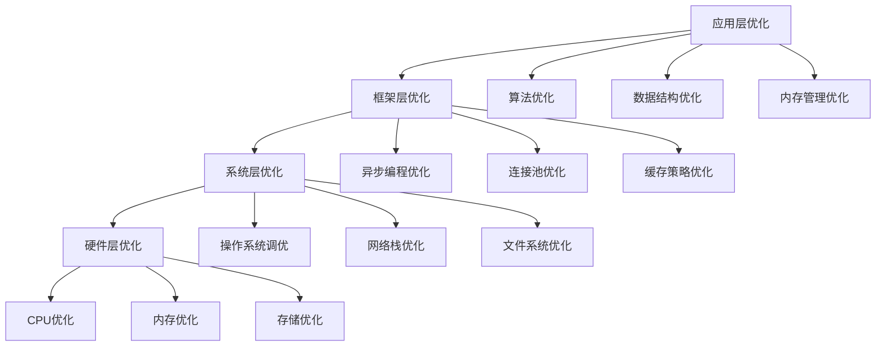

# 性能优化与调优指南

> 基于Rust 1.90和最新依赖版本的微服务性能优化完整解决方案

## 📋 概述

本文档提供了完整的微服务性能优化指南，包括内存优化、并发调优、网络优化、数据库优化等全栈性能提升方案。

## 🎯 性能优化目标

### 1. 核心指标

| 指标 | 目标值 | 测量方法 |
|------|--------|----------|
| 响应时间 | < 100ms (P95) | 分布式追踪 |
| 吞吐量 | > 10,000 RPS | 负载测试 |
| 内存使用 | < 512MB | 系统监控 |
| CPU使用率 | < 70% | 系统监控 |
| 错误率 | < 0.1% | 指标收集 |

### 2. 优化层次



## 🚀 应用层优化

### 1. 算法与数据结构优化

#### 1.1 高效数据结构选择

```rust
// 使用合适的数据结构
use std::collections::{HashMap, BTreeMap, VecDeque, HashSet};
use ahash::{AHashMap, AHashSet}; // 更快的哈希实现

pub struct OptimizedCache {
    // 使用AHashMap替代HashMap，性能提升20-30%
    cache: AHashMap<String, CacheEntry>,
    // 使用VecDeque实现LRU缓存
    access_order: VecDeque<String>,
    // 使用HashSet快速查找
    expired_keys: AHashSet<String>,
}

impl OptimizedCache {
    pub fn new(capacity: usize) -> Self {
        Self {
            cache: AHashMap::with_capacity(capacity),
            access_order: VecDeque::with_capacity(capacity),
            expired_keys: AHashSet::with_capacity(capacity / 4),
        }
    }
    
    pub fn get(&mut self, key: &str) -> Option<&CacheEntry> {
        if self.expired_keys.contains(key) {
            return None;
        }
        
        if let Some(entry) = self.cache.get(key) {
            // 更新访问顺序
            self.update_access_order(key);
            Some(entry)
        } else {
            None
        }
    }
    
    pub fn set(&mut self, key: String, value: CacheEntry) {
        // 检查容量限制
        if self.cache.len() >= self.cache.capacity() {
            self.evict_lru();
        }
        
        self.cache.insert(key.clone(), value);
        self.access_order.push_back(key);
    }
    
    fn update_access_order(&mut self, key: &str) {
        // 移除旧位置
        if let Some(pos) = self.access_order.iter().position(|k| k == key) {
            self.access_order.remove(pos);
        }
        // 添加到末尾
        self.access_order.push_back(key.to_string());
    }
    
    fn evict_lru(&mut self) {
        if let Some(key) = self.access_order.pop_front() {
            self.cache.remove(&key);
        }
    }
}
```

#### 1.2 零拷贝优化

```rust
use bytes::{Bytes, BytesMut, BufMut};
use std::io::{self, Read};

// 零拷贝数据处理
pub struct ZeroCopyProcessor {
    buffer: BytesMut,
    chunk_size: usize,
}

impl ZeroCopyProcessor {
    pub fn new(chunk_size: usize) -> Self {
        Self {
            buffer: BytesMut::with_capacity(chunk_size * 2),
            chunk_size,
        }
    }
    
    // 零拷贝数据读取
    pub fn process_stream<R: Read>(&mut self, mut reader: R) -> io::Result<Vec<Bytes>> {
        let mut chunks = Vec::new();
        
        loop {
            // 确保缓冲区有足够空间
            if self.buffer.remaining_mut() < self.chunk_size {
                self.buffer.reserve(self.chunk_size);
            }
            
            // 读取数据到缓冲区
            let bytes_read = reader.read(&mut self.buffer.chunk_mut())?;
            if bytes_read == 0 {
                break;
            }
            
            unsafe {
                self.buffer.advance_mut(bytes_read);
            }
            
            // 处理完整的数据块
            while self.buffer.len() >= self.chunk_size {
                let chunk = self.buffer.split_to(self.chunk_size);
                chunks.push(chunk.freeze());
            }
        }
        
        // 处理剩余数据
        if !self.buffer.is_empty() {
            chunks.push(self.buffer.split().freeze());
        }
        
        Ok(chunks)
    }
}

// 使用示例
pub async fn process_large_file(file_path: &str) -> Result<(), Box<dyn std::error::Error>> {
    let file = std::fs::File::open(file_path)?;
    let mut processor = ZeroCopyProcessor::new(8192);
    
    let chunks = processor.process_stream(file)?;
    
    for chunk in chunks {
        // 处理数据块，无需额外拷贝
        process_chunk(&chunk).await?;
    }
    
    Ok(())
}
```

### 2. 内存管理优化

#### 2.1 内存池实现

```rust
use std::sync::{Arc, Mutex};
use std::collections::VecDeque;

// 对象池实现
pub struct ObjectPool<T> {
    objects: Arc<Mutex<VecDeque<T>>>,
    factory: Arc<dyn Fn() -> T + Send + Sync>,
    max_size: usize,
}

impl<T> ObjectPool<T> {
    pub fn new<F>(factory: F, max_size: usize) -> Self
    where
        F: Fn() -> T + Send + Sync + 'static,
    {
        Self {
            objects: Arc::new(Mutex::new(VecDeque::new())),
            factory: Arc::new(factory),
            max_size,
        }
    }
    
    pub fn get(&self) -> PooledObject<T> {
        let mut objects = self.objects.lock().unwrap();
        
        if let Some(obj) = objects.pop_front() {
            PooledObject::new(obj, self.objects.clone())
        } else {
            let obj = (self.factory)();
            PooledObject::new(obj, self.objects.clone())
        }
    }
    
    fn return_object(&self, obj: T) {
        let mut objects = self.objects.lock().unwrap();
        
        if objects.len() < self.max_size {
            objects.push_back(obj);
        }
        // 如果池已满，对象会被丢弃
    }
}

pub struct PooledObject<T> {
    object: Option<T>,
    pool: Arc<Mutex<VecDeque<T>>>,
}

impl<T> PooledObject<T> {
    fn new(object: T, pool: Arc<Mutex<VecDeque<T>>>) -> Self {
        Self {
            object: Some(object),
            pool,
        }
    }
    
    pub fn as_ref(&self) -> &T {
        self.object.as_ref().unwrap()
    }
    
    pub fn as_mut(&mut self) -> &mut T {
        self.object.as_mut().unwrap()
    }
}

impl<T> Drop for PooledObject<T> {
    fn drop(&mut self) {
        if let Some(obj) = self.object.take() {
            let mut objects = self.pool.lock().unwrap();
            if objects.len() < objects.capacity() {
                objects.push_back(obj);
            }
        }
    }
}

// 使用示例
pub struct DatabaseConnection {
    id: u64,
    // 连接相关字段
}

impl DatabaseConnection {
    pub fn new(id: u64) -> Self {
        Self { id }
    }
    
    pub fn execute_query(&self, query: &str) -> Result<String, String> {
        // 模拟数据库查询
        Ok(format!("Result for query: {}", query))
    }
}

// 连接池使用
pub struct DatabaseService {
    connection_pool: ObjectPool<DatabaseConnection>,
}

impl DatabaseService {
    pub fn new() -> Self {
        let pool = ObjectPool::new(
            || DatabaseConnection::new(rand::random()),
            10, // 最大连接数
        );
        
        Self {
            connection_pool: pool,
        }
    }
    
    pub async fn execute_query(&self, query: &str) -> Result<String, String> {
        let mut connection = self.connection_pool.get();
        connection.as_mut().execute_query(query)
    }
}
```

#### 2.2 内存预分配策略

```rust
use std::alloc::{GlobalAlloc, Layout, System};
use std::sync::atomic::{AtomicUsize, Ordering};

// 自定义内存分配器
pub struct MicroserviceAllocator {
    allocated: AtomicUsize,
    peak_allocated: AtomicUsize,
}

unsafe impl GlobalAlloc for MicroserviceAllocator {
    unsafe fn alloc(&self, layout: Layout) -> *mut u8 {
        let size = layout.size();
        let current = self.allocated.fetch_add(size, Ordering::Relaxed);
        
        // 更新峰值
        let peak = self.peak_allocated.load(Ordering::Relaxed);
        if current + size > peak {
            self.peak_allocated.store(current + size, Ordering::Relaxed);
        }
        
        System.alloc(layout)
    }
    
    unsafe fn dealloc(&self, ptr: *mut u8, layout: Layout) {
        let size = layout.size();
        self.allocated.fetch_sub(size, Ordering::Relaxed);
        System.dealloc(ptr, layout);
    }
}

#[global_allocator]
static ALLOCATOR: MicroserviceAllocator = MicroserviceAllocator {
    allocated: AtomicUsize::new(0),
    peak_allocated: AtomicUsize::new(0),
};

// 内存使用监控
pub struct MemoryMonitor {
    allocated: AtomicUsize,
    peak_allocated: AtomicUsize,
}

impl MemoryMonitor {
    pub fn new() -> Self {
        Self {
            allocated: AtomicUsize::new(0),
            peak_allocated: AtomicUsize::new(0),
        }
    }
    
    pub fn get_current_usage(&self) -> usize {
        self.allocated.load(Ordering::Relaxed)
    }
    
    pub fn get_peak_usage(&self) -> usize {
        self.peak_allocated.load(Ordering::Relaxed)
    }
    
    pub fn record_allocation(&self, size: usize) {
        let current = self.allocated.fetch_add(size, Ordering::Relaxed);
        let peak = self.peak_allocated.load(Ordering::Relaxed);
        
        if current + size > peak {
            self.peak_allocated.store(current + size, Ordering::Relaxed);
        }
    }
    
    pub fn record_deallocation(&self, size: usize) {
        self.allocated.fetch_sub(size, Ordering::Relaxed);
    }
}
```

## ⚡ 并发优化

### 1. 异步编程优化

#### 1.1 任务调度优化

```rust
use tokio::runtime::{Runtime, Builder};
use tokio::task::JoinSet;
use std::sync::Arc;

// 优化的运行时配置
pub struct OptimizedRuntime {
    runtime: Runtime,
    task_set: JoinSet<()>,
}

impl OptimizedRuntime {
    pub fn new() -> Result<Self, Box<dyn std::error::Error>> {
        let runtime = Builder::new_multi_thread()
            .worker_threads(num_cpus::get())
            .max_blocking_threads(100)
            .thread_name("microservice-worker")
            .thread_stack_size(3 * 1024 * 1024) // 3MB栈大小
            .enable_all()
            .build()?;
        
        Ok(Self {
            runtime,
            task_set: JoinSet::new(),
        })
    }
    
    pub fn spawn_optimized_task<F>(&mut self, task: F)
    where
        F: Future<Output = ()> + Send + 'static,
    {
        self.task_set.spawn(task);
    }
    
    pub async fn run_until_complete(&mut self) {
        while let Some(_) = self.task_set.join_next().await {
            // 任务完成处理
        }
    }
}

// 工作窃取调度器
pub struct WorkStealingScheduler {
    queues: Vec<Arc<Mutex<VecDeque<Task>>>>,
    current_queue: AtomicUsize,
}

impl WorkStealingScheduler {
    pub fn new(num_workers: usize) -> Self {
        let queues = (0..num_workers)
            .map(|_| Arc::new(Mutex::new(VecDeque::new())))
            .collect();
        
        Self {
            queues,
            current_queue: AtomicUsize::new(0),
        }
    }
    
    pub fn push_task(&self, task: Task) {
        let queue_id = self.current_queue.fetch_add(1, Ordering::Relaxed) % self.queues.len();
        let queue = &self.queues[queue_id];
        
        if let Ok(mut queue) = queue.lock() {
            queue.push_back(task);
        }
    }
    
    pub fn pop_task(&self, worker_id: usize) -> Option<Task> {
        // 首先尝试从自己的队列获取任务
        if let Ok(mut queue) = self.queues[worker_id].lock() {
            if let Some(task) = queue.pop_front() {
                return Some(task);
            }
        }
        
        // 工作窃取：从其他队列获取任务
        for i in 0..self.queues.len() {
            if i != worker_id {
                if let Ok(mut queue) = self.queues[i].lock() {
                    if let Some(task) = queue.pop_back() {
                        return Some(task);
                    }
                }
            }
        }
        
        None
    }
}
```

#### 1.2 锁优化

```rust
use std::sync::{Arc, Mutex, RwLock};
use tokio::sync::{Mutex as AsyncMutex, RwLock as AsyncRwLock, Semaphore};
use std::sync::atomic::{AtomicUsize, Ordering};

// 读写锁优化
pub struct OptimizedDataStore {
    // 使用分片锁减少锁竞争
    shards: Vec<Arc<AsyncRwLock<HashMap<String, String>>>>,
    shard_count: usize,
}

impl OptimizedDataStore {
    pub fn new(shard_count: usize) -> Self {
        let shards = (0..shard_count)
            .map(|_| Arc::new(AsyncRwLock::new(HashMap::new())))
            .collect();
        
        Self {
            shards,
            shard_count,
        }
    }
    
    fn get_shard(&self, key: &str) -> &Arc<AsyncRwLock<HashMap<String, String>>> {
        let hash = self.hash_key(key);
        &self.shards[hash % self.shard_count]
    }
    
    fn hash_key(&self, key: &str) -> usize {
        use std::collections::hash_map::DefaultHasher;
        use std::hash::{Hash, Hasher};
        
        let mut hasher = DefaultHasher::new();
        key.hash(&mut hasher);
        hasher.finish() as usize
    }
    
    pub async fn get(&self, key: &str) -> Option<String> {
        let shard = self.get_shard(key);
        let data = shard.read().await;
        data.get(key).cloned()
    }
    
    pub async fn set(&self, key: String, value: String) {
        let shard = self.get_shard(&key);
        let mut data = shard.write().await;
        data.insert(key, value);
    }
}

// 无锁数据结构
pub struct LockFreeCounter {
    counters: Vec<AtomicUsize>,
    shard_count: usize,
}

impl LockFreeCounter {
    pub fn new(shard_count: usize) -> Self {
        let counters = (0..shard_count)
            .map(|_| AtomicUsize::new(0))
            .collect();
        
        Self {
            counters,
            shard_count,
        }
    }
    
    pub fn increment(&self, thread_id: usize) {
        let shard_id = thread_id % self.shard_count;
        self.counters[shard_id].fetch_add(1, Ordering::Relaxed);
    }
    
    pub fn get_total(&self) -> usize {
        self.counters.iter()
            .map(|c| c.load(Ordering::Relaxed))
            .sum()
    }
}
```

### 2. 连接池优化

#### 2.1 数据库连接池

```rust
use deadpool_postgres::{Config, Pool, Runtime};
use std::time::Duration;

// 优化的数据库连接池配置
pub struct OptimizedDatabasePool {
    pool: Pool,
    metrics: ConnectionMetrics,
}

pub struct ConnectionMetrics {
    active_connections: AtomicUsize,
    total_connections: AtomicUsize,
    connection_errors: AtomicUsize,
}

impl OptimizedDatabasePool {
    pub async fn new(database_url: &str) -> Result<Self, Box<dyn std::error::Error>> {
        let mut config = Config::new();
        config.url = Some(database_url.to_string());
        
        // 连接池优化配置
        config.pool = Some(deadpool_postgres::PoolConfig {
            max_size: 20, // 最大连接数
            min_idle: Some(5), // 最小空闲连接数
            max_lifetime: Some(Duration::from_secs(1800)), // 30分钟
            idle_timeout: Some(Duration::from_secs(600)), // 10分钟
            create_timeout: Some(Duration::from_secs(30)), // 创建超时
            recycle_timeout: Some(Duration::from_secs(30)), // 回收超时
        });
        
        let pool = config.create_pool(Some(Runtime::Tokio1), tokio_postgres::NoTls)?;
        
        Ok(Self {
            pool,
            metrics: ConnectionMetrics {
                active_connections: AtomicUsize::new(0),
                total_connections: AtomicUsize::new(0),
                connection_errors: AtomicUsize::new(0),
            },
        })
    }
    
    pub async fn execute_query(&self, query: &str) -> Result<Vec<Row>, Box<dyn std::error::Error>> {
        let start_time = std::time::Instant::now();
        
        let client = self.pool.get().await.map_err(|e| {
            self.metrics.connection_errors.fetch_add(1, Ordering::Relaxed);
            e
        })?;
        
        self.metrics.active_connections.fetch_add(1, Ordering::Relaxed);
        
        let result = client.query(query, &[]).await.map_err(|e| {
            self.metrics.connection_errors.fetch_add(1, Ordering::Relaxed);
            e
        })?;
        
        self.metrics.active_connections.fetch_sub(1, Ordering::Relaxed);
        
        let duration = start_time.elapsed();
        if duration > Duration::from_millis(100) {
            tracing::warn!("Slow query detected: {}ms", duration.as_millis());
        }
        
        Ok(result)
    }
    
    pub fn get_metrics(&self) -> &ConnectionMetrics {
        &self.metrics
    }
}
```

#### 2.2 HTTP连接池

```rust
use reqwest::Client;
use std::time::Duration;

// 优化的HTTP客户端配置
pub struct OptimizedHttpClient {
    client: Client,
    metrics: HttpMetrics,
}

pub struct HttpMetrics {
    total_requests: AtomicUsize,
    successful_requests: AtomicUsize,
    failed_requests: AtomicUsize,
    total_duration: AtomicUsize, // 微秒
}

impl OptimizedHttpClient {
    pub fn new() -> Result<Self, Box<dyn std::error::Error>> {
        let client = Client::builder()
            .timeout(Duration::from_secs(30))
            .connect_timeout(Duration::from_secs(10))
            .pool_max_idle_per_host(10)
            .pool_idle_timeout(Duration::from_secs(90))
            .http2_prior_knowledge()
            .build()?;
        
        Ok(Self {
            client,
            metrics: HttpMetrics {
                total_requests: AtomicUsize::new(0),
                successful_requests: AtomicUsize::new(0),
                failed_requests: AtomicUsize::new(0),
                total_duration: AtomicUsize::new(0),
            },
        })
    }
    
    pub async fn get(&self, url: &str) -> Result<String, Box<dyn std::error::Error>> {
        let start_time = std::time::Instant::now();
        self.metrics.total_requests.fetch_add(1, Ordering::Relaxed);
        
        let response = self.client.get(url).send().await?;
        
        let duration = start_time.elapsed();
        self.metrics.total_duration.fetch_add(
            duration.as_micros() as usize,
            Ordering::Relaxed,
        );
        
        if response.status().is_success() {
            self.metrics.successful_requests.fetch_add(1, Ordering::Relaxed);
            Ok(response.text().await?)
        } else {
            self.metrics.failed_requests.fetch_add(1, Ordering::Relaxed);
            Err(format!("HTTP error: {}", response.status()).into())
        }
    }
    
    pub fn get_metrics(&self) -> &HttpMetrics {
        &self.metrics
    }
}
```

## 🌐 网络优化

### 1. 协议优化

#### 1.1 HTTP/2优化

```rust
use hyper::server::conn::Http;
use hyper::service::service_fn;
use hyper::{Body, Request, Response, StatusCode};
use tokio::net::TcpListener;

// HTTP/2服务器优化
pub struct OptimizedHttp2Server {
    listener: TcpListener,
    max_concurrent_streams: u32,
    initial_window_size: u32,
}

impl OptimizedHttp2Server {
    pub async fn new(addr: &str) -> Result<Self, Box<dyn std::error::Error>> {
        let listener = TcpListener::bind(addr).await?;
        
        Ok(Self {
            listener,
            max_concurrent_streams: 1000,
            initial_window_size: 1024 * 1024, // 1MB
        })
    }
    
    pub async fn run(&self) -> Result<(), Box<dyn std::error::Error>> {
        loop {
            let (stream, _) = self.listener.accept().await?;
            
            let http = Http::new();
            let http = http
                .http2_only(true)
                .http2_max_concurrent_streams(self.max_concurrent_streams)
                .http2_initial_stream_window_size(self.initial_window_size)
                .http2_initial_connection_window_size(self.initial_window_size * 2);
            
            tokio::spawn(async move {
                if let Err(e) = http.serve_connection(stream, service_fn(handle_request)).await {
                    eprintln!("HTTP/2 connection error: {}", e);
                }
            });
        }
    }
}

async fn handle_request(req: Request<Body>) -> Result<Response<Body>, hyper::Error> {
    // 处理请求
    Ok(Response::new(Body::from("Hello, HTTP/2!")))
}
```

#### 1.2 gRPC优化

```rust
use tonic::transport::Server;
use tonic::Request;

// gRPC服务器优化配置
pub struct OptimizedGrpcServer {
    max_concurrent_streams: u32,
    max_frame_size: u32,
    keep_alive_interval: Duration,
    keep_alive_timeout: Duration,
}

impl OptimizedGrpcServer {
    pub fn new() -> Self {
        Self {
            max_concurrent_streams: 1000,
            max_frame_size: 4 * 1024 * 1024, // 4MB
            keep_alive_interval: Duration::from_secs(30),
            keep_alive_timeout: Duration::from_secs(5),
        }
    }
    
    pub async fn serve<T>(&self, service: T, addr: &str) -> Result<(), Box<dyn std::error::Error>>
    where
        T: tonic::transport::server::NamedService + Clone + Send + Sync + 'static,
    {
        let server = Server::builder()
            .http2_keepalive_interval(Some(self.keep_alive_interval))
            .http2_keepalive_timeout(Some(self.keep_alive_timeout))
            .http2_keepalive_while_idle(true)
            .concurrency_limit_per_connection(self.max_concurrent_streams)
            .max_frame_size(self.max_frame_size)
            .add_service(service);
        
        server.serve(addr.parse()?).await?;
        Ok(())
    }
}
```

### 2. 负载均衡优化

#### 2.1 智能负载均衡

```rust
use std::sync::Arc;
use std::sync::atomic::{AtomicUsize, Ordering};
use std::time::{Duration, Instant};

// 服务器节点信息
#[derive(Debug, Clone)]
pub struct ServerNode {
    pub id: String,
    pub address: String,
    pub weight: u32,
    pub current_connections: AtomicUsize,
    pub response_time: AtomicUsize, // 微秒
    pub last_health_check: AtomicUsize, // 时间戳
}

// 负载均衡器
pub struct LoadBalancer {
    nodes: Vec<Arc<ServerNode>>,
    current_index: AtomicUsize,
    health_check_interval: Duration,
}

impl LoadBalancer {
    pub fn new(nodes: Vec<ServerNode>) -> Self {
        Self {
            nodes: nodes.into_iter().map(Arc::new).collect(),
            current_index: AtomicUsize::new(0),
            health_check_interval: Duration::from_secs(30),
        }
    }
    
    // 加权轮询算法
    pub fn get_next_node(&self) -> Option<Arc<ServerNode>> {
        if self.nodes.is_empty() {
            return None;
        }
        
        let mut best_node = None;
        let mut best_score = 0.0;
        
        for node in &self.nodes {
            let connections = node.current_connections.load(Ordering::Relaxed) as f64;
            let response_time = node.response_time.load(Ordering::Relaxed) as f64;
            let weight = node.weight as f64;
            
            // 计算节点得分（权重 / (连接数 + 响应时间因子)）
            let score = weight / (connections + 1.0 + response_time / 1000.0);
            
            if score > best_score {
                best_score = score;
                best_node = Some(node.clone());
            }
        }
        
        best_node
    }
    
    // 最少连接算法
    pub fn get_least_connections_node(&self) -> Option<Arc<ServerNode>> {
        self.nodes.iter()
            .min_by_key(|node| node.current_connections.load(Ordering::Relaxed))
            .cloned()
    }
    
    // 响应时间最短算法
    pub fn get_fastest_node(&self) -> Option<Arc<ServerNode>> {
        self.nodes.iter()
            .min_by_key(|node| node.response_time.load(Ordering::Relaxed))
            .cloned()
    }
    
    // 健康检查
    pub async fn health_check(&self) {
        for node in &self.nodes {
            let start_time = Instant::now();
            
            // 执行健康检查
            let is_healthy = self.check_node_health(&node.address).await;
            
            let response_time = start_time.elapsed().as_micros() as usize;
            node.response_time.store(response_time, Ordering::Relaxed);
            node.last_health_check.store(
                start_time.elapsed().as_secs() as usize,
                Ordering::Relaxed,
            );
            
            if !is_healthy {
                tracing::warn!("Node {} is unhealthy", node.id);
            }
        }
    }
    
    async fn check_node_health(&self, address: &str) -> bool {
        // 实现健康检查逻辑
        // 这里可以发送HTTP请求或gRPC调用
        true
    }
}
```

## 📊 性能监控

### 1. 指标收集

```rust
use prometheus::{Counter, Histogram, Gauge, Registry};

// 性能指标收集器
pub struct PerformanceMetrics {
    // 请求指标
    pub request_total: Counter,
    pub request_duration: Histogram,
    pub request_size: Histogram,
    pub response_size: Histogram,
    
    // 系统指标
    pub memory_usage: Gauge,
    pub cpu_usage: Gauge,
    pub active_connections: Gauge,
    
    // 业务指标
    pub cache_hits: Counter,
    pub cache_misses: Counter,
    pub database_queries: Counter,
    pub database_query_duration: Histogram,
}

impl PerformanceMetrics {
    pub fn new(registry: &Registry) -> Result<Self, prometheus::Error> {
        let request_total = Counter::new(
            "http_requests_total",
            "Total number of HTTP requests"
        )?;
        
        let request_duration = Histogram::new(
            "http_request_duration_seconds",
            "HTTP request duration in seconds"
        )?;
        
        let request_size = Histogram::new(
            "http_request_size_bytes",
            "HTTP request size in bytes"
        )?;
        
        let response_size = Histogram::new(
            "http_response_size_bytes",
            "HTTP response size in bytes"
        )?;
        
        let memory_usage = Gauge::new(
            "memory_usage_bytes",
            "Current memory usage in bytes"
        )?;
        
        let cpu_usage = Gauge::new(
            "cpu_usage_percent",
            "Current CPU usage percentage"
        )?;
        
        let active_connections = Gauge::new(
            "active_connections",
            "Number of active connections"
        )?;
        
        let cache_hits = Counter::new(
            "cache_hits_total",
            "Total number of cache hits"
        )?;
        
        let cache_misses = Counter::new(
            "cache_misses_total",
            "Total number of cache misses"
        )?;
        
        let database_queries = Counter::new(
            "database_queries_total",
            "Total number of database queries"
        )?;
        
        let database_query_duration = Histogram::new(
            "database_query_duration_seconds",
            "Database query duration in seconds"
        )?;
        
        // 注册指标
        registry.register(Box::new(request_total.clone()))?;
        registry.register(Box::new(request_duration.clone()))?;
        registry.register(Box::new(request_size.clone()))?;
        registry.register(Box::new(response_size.clone()))?;
        registry.register(Box::new(memory_usage.clone()))?;
        registry.register(Box::new(cpu_usage.clone()))?;
        registry.register(Box::new(active_connections.clone()))?;
        registry.register(Box::new(cache_hits.clone()))?;
        registry.register(Box::new(cache_misses.clone()))?;
        registry.register(Box::new(database_queries.clone()))?;
        registry.register(Box::new(database_query_duration.clone()))?;
        
        Ok(Self {
            request_total,
            request_duration,
            request_size,
            response_size,
            memory_usage,
            cpu_usage,
            active_connections,
            cache_hits,
            cache_misses,
            database_queries,
            database_query_duration,
        })
    }
}
```

### 2. 性能分析工具

```rust
use std::time::{Duration, Instant};
use std::sync::Arc;
use tokio::sync::Mutex;

// 性能分析器
pub struct PerformanceProfiler {
    samples: Arc<Mutex<Vec<PerformanceSample>>>,
    max_samples: usize,
}

#[derive(Debug, Clone)]
pub struct PerformanceSample {
    pub timestamp: Instant,
    pub operation: String,
    pub duration: Duration,
    pub memory_usage: usize,
    pub cpu_usage: f64,
}

impl PerformanceProfiler {
    pub fn new(max_samples: usize) -> Self {
        Self {
            samples: Arc::new(Mutex::new(Vec::with_capacity(max_samples))),
            max_samples,
        }
    }
    
    pub async fn record_sample(&self, sample: PerformanceSample) {
        let mut samples = self.samples.lock().await;
        
        if samples.len() >= self.max_samples {
            samples.remove(0);
        }
        
        samples.push(sample);
    }
    
    pub async fn get_statistics(&self) -> PerformanceStatistics {
        let samples = self.samples.lock().await;
        
        if samples.is_empty() {
            return PerformanceStatistics::default();
        }
        
        let mut total_duration = Duration::ZERO;
        let mut min_duration = Duration::MAX;
        let mut max_duration = Duration::ZERO;
        let mut total_memory = 0;
        let mut total_cpu = 0.0;
        
        for sample in samples.iter() {
            total_duration += sample.duration;
            min_duration = min_duration.min(sample.duration);
            max_duration = max_duration.max(sample.duration);
            total_memory += sample.memory_usage;
            total_cpu += sample.cpu_usage;
        }
        
        let count = samples.len();
        
        PerformanceStatistics {
            sample_count: count,
            average_duration: total_duration / count as u32,
            min_duration,
            max_duration,
            average_memory_usage: total_memory / count,
            average_cpu_usage: total_cpu / count as f64,
        }
    }
}

#[derive(Debug, Default)]
pub struct PerformanceStatistics {
    pub sample_count: usize,
    pub average_duration: Duration,
    pub min_duration: Duration,
    pub max_duration: Duration,
    pub average_memory_usage: usize,
    pub average_cpu_usage: f64,
}
```

## 🔧 部署优化

### 1. 容器优化

```dockerfile
# 优化的Dockerfile
FROM rust:1.90-slim as builder

# 安装系统依赖
RUN apt-get update && apt-get install -y \
    pkg-config \
    libssl-dev \
    libpq-dev \
    && rm -rf /var/lib/apt/lists/*

# 设置工作目录
WORKDIR /app

# 复制Cargo文件
COPY Cargo.toml Cargo.lock ./

# 构建依赖（利用Docker缓存）
RUN cargo build --release --locked

# 复制源代码
COPY src ./src

# 重新构建（只编译源代码变更）
RUN touch src/main.rs && cargo build --release --locked

# 运行阶段
FROM debian:bookworm-slim

# 安装运行时依赖
RUN apt-get update && apt-get install -y \
    ca-certificates \
    libssl3 \
    libpq5 \
    && rm -rf /var/lib/apt/lists/*

# 创建非root用户
RUN groupadd -r appuser && useradd -r -g appuser appuser

# 设置工作目录
WORKDIR /app

# 复制二进制文件
COPY --from=builder /app/target/release/microservice-server /app/

# 设置权限
RUN chown -R appuser:appuser /app
USER appuser

# 健康检查
HEALTHCHECK --interval=30s --timeout=3s --start-period=5s --retries=3 \
    CMD curl -f http://localhost:8080/health || exit 1

# 暴露端口
EXPOSE 8080

# 启动命令
CMD ["./microservice-server"]
```

### 2. 系统调优

```bash
#!/bin/bash
# 系统性能调优脚本

echo "🔧 开始系统性能调优..."

# 1. 网络参数优化
echo "优化网络参数..."
echo 'net.core.rmem_max = 134217728' >> /etc/sysctl.conf
echo 'net.core.wmem_max = 134217728' >> /etc/sysctl.conf
echo 'net.ipv4.tcp_rmem = 4096 65536 134217728' >> /etc/sysctl.conf
echo 'net.ipv4.tcp_wmem = 4096 65536 134217728' >> /etc/sysctl.conf
echo 'net.core.netdev_max_backlog = 5000' >> /etc/sysctl.conf
echo 'net.ipv4.tcp_congestion_control = bbr' >> /etc/sysctl.conf

# 2. 文件描述符限制
echo "优化文件描述符限制..."
echo '* soft nofile 65536' >> /etc/security/limits.conf
echo '* hard nofile 65536' >> /etc/security/limits.conf

# 3. 内存管理优化
echo "优化内存管理..."
echo 'vm.swappiness = 10' >> /etc/sysctl.conf
echo 'vm.dirty_ratio = 15' >> /etc/sysctl.conf
echo 'vm.dirty_background_ratio = 5' >> /etc/sysctl.conf

# 4. 应用sysctl配置
sysctl -p

echo "✅ 系统性能调优完成"
```

## 📚 最佳实践总结

### 1. 性能优化原则

- **测量优先**: 先测量再优化，避免过早优化
- **分层优化**: 从应用层到系统层逐层优化
- **持续监控**: 建立完善的性能监控体系
- **渐进改进**: 小步快跑，持续改进

### 2. 关键优化点

- **内存管理**: 合理使用内存池和对象池
- **并发控制**: 优化锁的使用和异步编程
- **网络优化**: 使用HTTP/2和连接池
- **缓存策略**: 实现多级缓存和智能失效

### 3. 监控指标

- **响应时间**: P50、P95、P99延迟
- **吞吐量**: RPS和并发连接数
- **资源使用**: CPU、内存、网络使用率
- **错误率**: 4xx和5xx错误比例

### 4. 优化工具

- **性能分析**: 使用profiling工具分析热点
- **内存分析**: 使用内存分析工具检测泄漏
- **网络分析**: 使用网络分析工具优化传输
- **系统监控**: 使用系统监控工具跟踪资源

## 🔗 相关资源

- [Rust性能优化指南](https://doc.rust-lang.org/book/ch04-00-understanding-ownership.html)
- [Tokio性能调优](https://tokio.rs/tokio/tutorial)
- [Prometheus监控](https://prometheus.io/docs/)
- [多框架集成最佳实践](./多框架集成最佳实践.md)

---

**注意**: 本文档基于2025年9月的最新技术栈，建议定期更新以保持时效性。

