# 监控与可观测性集成指南

> 基于Rust 1.90和最新依赖版本的微服务监控与可观测性完整解决方案

## 📋 概述

本文档提供了完整的监控与可观测性集成方案，包括指标收集、日志聚合、分布式追踪、告警配置等全栈监控解决方案。

## 🎯 监控架构

### 1. 整体架构图

```mermaid
graph TB
    subgraph "应用层"
        MS1[微服务1] --> METRICS[指标]
        MS2[微服务2] --> LOGS[日志]
        MS3[微服务3] --> TRACES[追踪]
    end
    
    subgraph "收集层"
        METRICS --> PROM[Prometheus]
        LOGS --> LOKI[Loki]
        TRACES --> JAEGER[Jaeger]
    end
    
    subgraph "存储层"
        PROM --> TSDB[时序数据库]
        LOKI --> LOGSTORE[日志存储]
        JAEGER --> TRACESTORE[追踪存储]
    end
    
    subgraph "可视化层"
        TSDB --> GRAFANA[Grafana]
        LOGSTORE --> GRAFANA
        TRACESTORE --> GRAFANA
    end
    
    subgraph "告警层"
        PROM --> ALERT[AlertManager]
        ALERT --> NOTIFY[通知渠道]
    end
```



### 2. 技术栈选择

| 组件 | 技术选择 | 版本 | 用途 |
|------|----------|------|------|
| 指标收集 | Prometheus | 2.45+ | 指标存储和查询 |
| 日志聚合 | Loki | 2.9+ | 日志收集和存储 |
| 分布式追踪 | Jaeger | 1.47+ | 链路追踪 |
| 可视化 | Grafana | 10.0+ | 统一仪表板 |
| 告警管理 | AlertManager | 0.25+ | 告警路由和通知 |
| 指标导出 | OpenTelemetry | 0.30+ | 标准化指标导出 |

## 📊 指标监控

### 1. 应用指标集成

#### 1.1 基础指标配置

```rust
// src/metrics/mod.rs
use prometheus::{
    Counter, Histogram, Gauge, Registry, IntCounter, IntGauge, IntHistogram,
    Opts, HistogramOpts, CounterVec, HistogramVec, GaugeVec,
};
use std::sync::Arc;

pub struct Metrics {
    // HTTP指标
    pub http_requests_total: CounterVec,
    pub http_request_duration: HistogramVec,
    pub http_requests_in_flight: GaugeVec,
    
    // 业务指标
    pub user_registrations_total: Counter,
    pub active_users: Gauge,
    pub database_connections: Gauge,
    
    // 系统指标
    pub memory_usage_bytes: Gauge,
    pub cpu_usage_percent: Gauge,
    
    // 自定义指标
    pub custom_operations_total: CounterVec,
    pub custom_operation_duration: HistogramVec,
}

impl Metrics {
    pub fn new(registry: &Registry) -> Result<Self, prometheus::Error> {
        // HTTP指标
        let http_requests_total = CounterVec::new(
            Opts::new("http_requests_total", "Total number of HTTP requests")
                .namespace("microservice")
                .subsystem("http"),
            &["method", "endpoint", "status_code"],
        )?;
        
        let http_request_duration = HistogramVec::new(
            HistogramOpts::new("http_request_duration_seconds", "HTTP request duration in seconds")
                .namespace("microservice")
                .subsystem("http")
                .buckets(vec![0.001, 0.005, 0.01, 0.025, 0.05, 0.1, 0.25, 0.5, 1.0, 2.5, 5.0, 10.0]),
            &["method", "endpoint"],
        )?;
        
        let http_requests_in_flight = GaugeVec::new(
            Opts::new("http_requests_in_flight", "Number of HTTP requests currently being processed")
                .namespace("microservice")
                .subsystem("http"),
            &["method", "endpoint"],
        )?;
        
        // 业务指标
        let user_registrations_total = Counter::new(
            "user_registrations_total",
            "Total number of user registrations"
        )?;
        
        let active_users = Gauge::new(
            "active_users",
            "Number of currently active users"
        )?;
        
        let database_connections = Gauge::new(
            "database_connections",
            "Number of active database connections"
        )?;
        
        // 系统指标
        let memory_usage_bytes = Gauge::new(
            "memory_usage_bytes",
            "Current memory usage in bytes"
        )?;
        
        let cpu_usage_percent = Gauge::new(
            "cpu_usage_percent",
            "Current CPU usage percentage"
        )?;
        
        // 自定义指标
        let custom_operations_total = CounterVec::new(
            Opts::new("custom_operations_total", "Total number of custom operations")
                .namespace("microservice")
                .subsystem("custom"),
            &["operation_type", "status"],
        )?;
        
        let custom_operation_duration = HistogramVec::new(
            HistogramOpts::new("custom_operation_duration_seconds", "Custom operation duration in seconds")
                .namespace("microservice")
                .subsystem("custom")
                .buckets(vec![0.001, 0.005, 0.01, 0.025, 0.05, 0.1, 0.25, 0.5, 1.0, 2.5, 5.0]),
            &["operation_type"],
        )?;
        
        // 注册指标
        registry.register(Box::new(http_requests_total.clone()))?;
        registry.register(Box::new(http_request_duration.clone()))?;
        registry.register(Box::new(http_requests_in_flight.clone()))?;
        registry.register(Box::new(user_registrations_total.clone()))?;
        registry.register(Box::new(active_users.clone()))?;
        registry.register(Box::new(database_connections.clone()))?;
        registry.register(Box::new(memory_usage_bytes.clone()))?;
        registry.register(Box::new(cpu_usage_percent.clone()))?;
        registry.register(Box::new(custom_operations_total.clone()))?;
        registry.register(Box::new(custom_operation_duration.clone()))?;
        
        Ok(Metrics {
            http_requests_total,
            http_request_duration,
            http_requests_in_flight,
            user_registrations_total,
            active_users,
            database_connections,
            memory_usage_bytes,
            cpu_usage_percent,
            custom_operations_total,
            custom_operation_duration,
        })
    }
}
```

#### 1.2 Axum中间件集成

```rust
// src/middleware/metrics.rs
use axum::{
    extract::Request,
    http::{Method, StatusCode},
    middleware::Next,
    response::Response,
};
use prometheus::{CounterVec, HistogramVec, GaugeVec};
use std::time::Instant;

pub struct MetricsMiddleware {
    requests_total: CounterVec,
    request_duration: HistogramVec,
    requests_in_flight: GaugeVec,
}

impl MetricsMiddleware {
    pub fn new(
        requests_total: CounterVec,
        request_duration: HistogramVec,
        requests_in_flight: GaugeVec,
    ) -> Self {
        Self {
            requests_total,
            request_duration,
            requests_in_flight,
        }
    }
    
    pub async fn middleware(
        &self,
        request: Request,
        next: Next,
    ) -> Result<Response, StatusCode> {
        let start = Instant::now();
        let method = request.method().clone();
        let uri = request.uri().path().to_string();
        
        // 增加正在处理的请求数
        self.requests_in_flight
            .with_label_values(&[method.as_str(), &uri])
            .inc();
        
        // 处理请求
        let response = next.run(request).await;
        let status = response.status();
        
        // 记录请求完成
        self.requests_in_flight
            .with_label_values(&[method.as_str(), &uri])
            .dec();
        
        // 记录指标
        self.requests_total
            .with_label_values(&[
                method.as_str(),
                &uri,
                &status.as_str(),
            ])
            .inc();
        
        self.request_duration
            .with_label_values(&[method.as_str(), &uri])
            .observe(start.elapsed().as_secs_f64());
        
        Ok(response)
    }
}

// 使用示例
pub fn create_router_with_metrics(metrics: Arc<Metrics>) -> axum::Router {
    let metrics_middleware = MetricsMiddleware::new(
        metrics.http_requests_total.clone(),
        metrics.http_request_duration.clone(),
        metrics.http_requests_in_flight.clone(),
    );
    
    axum::Router::new()
        .route("/health", get(health_check))
        .route("/metrics", get(metrics_handler))
        .layer(axum::middleware::from_fn_with_state(
            metrics_middleware,
            |state, request, next| async move {
                state.middleware(request, next).await
            },
        ))
}
```

#### 1.3 Poem中间件集成

```rust
// src/middleware/poem_metrics.rs
use poem::{
    middleware::Middleware,
    Endpoint, MiddlewareResult, Request, Response,
};
use prometheus::{CounterVec, HistogramVec, GaugeVec};
use std::time::Instant;

pub struct PoemMetricsMiddleware {
    requests_total: CounterVec,
    request_duration: HistogramVec,
    requests_in_flight: GaugeVec,
}

impl PoemMetricsMiddleware {
    pub fn new(
        requests_total: CounterVec,
        request_duration: HistogramVec,
        requests_in_flight: GaugeVec,
    ) -> Self {
        Self {
            requests_total,
            request_duration,
            requests_in_flight,
        }
    }
}

impl<E: Endpoint> Middleware<E> for PoemMetricsMiddleware {
    type Output = PoemMetricsEndpoint<E>;
    
    fn transform(&self, ep: E) -> Self::Output {
        PoemMetricsEndpoint {
            ep,
            requests_total: self.requests_total.clone(),
            request_duration: self.request_duration.clone(),
            requests_in_flight: self.requests_in_flight.clone(),
        }
    }
}

pub struct PoemMetricsEndpoint<E> {
    ep: E,
    requests_total: CounterVec,
    request_duration: HistogramVec,
    requests_in_flight: GaugeVec,
}

#[poem::async_trait]
impl<E: Endpoint> Endpoint for PoemMetricsEndpoint<E> {
    type Output = Response;
    
    async fn call(&self, mut request: Request) -> MiddlewareResult<Self::Output> {
        let start = Instant::now();
        let method = request.method().as_str();
        let uri = request.uri().path().to_string();
        
        // 增加正在处理的请求数
        self.requests_in_flight
            .with_label_values(&[method, &uri])
            .inc();
        
        // 处理请求
        let response = self.ep.call(request).await?;
        let status = response.status().as_str();
        
        // 记录请求完成
        self.requests_in_flight
            .with_label_values(&[method, &uri])
            .dec();
        
        // 记录指标
        self.requests_total
            .with_label_values(&[method, &uri, status])
            .inc();
        
        self.request_duration
            .with_label_values(&[method, &uri])
            .observe(start.elapsed().as_secs_f64());
        
        Ok(response)
    }
}
```

### 2. 自定义指标

```rust
// src/metrics/custom.rs
use prometheus::{Counter, Histogram, Gauge, CounterVec, HistogramVec};
use std::sync::Arc;

pub struct BusinessMetrics {
    // 用户相关指标
    pub user_registrations: Counter,
    pub user_logins: Counter,
    pub user_logouts: Counter,
    pub active_sessions: Gauge,
    
    // 订单相关指标
    pub orders_created: Counter,
    pub orders_completed: Counter,
    pub orders_cancelled: Counter,
    pub order_value: Histogram,
    
    // 支付相关指标
    pub payments_initiated: Counter,
    pub payments_completed: Counter,
    pub payments_failed: Counter,
    pub payment_amount: Histogram,
    
    // 错误指标
    pub errors_total: CounterVec,
    pub error_rate: Gauge,
}

impl BusinessMetrics {
    pub fn new() -> Result<Self, prometheus::Error> {
        let user_registrations = Counter::new(
            "user_registrations_total",
            "Total number of user registrations"
        )?;
        
        let user_logins = Counter::new(
            "user_logins_total",
            "Total number of user logins"
        )?;
        
        let user_logouts = Counter::new(
            "user_logouts_total",
            "Total number of user logouts"
        )?;
        
        let active_sessions = Gauge::new(
            "active_sessions",
            "Number of currently active user sessions"
        )?;
        
        let orders_created = Counter::new(
            "orders_created_total",
            "Total number of orders created"
        )?;
        
        let orders_completed = Counter::new(
            "orders_completed_total",
            "Total number of orders completed"
        )?;
        
        let orders_cancelled = Counter::new(
            "orders_cancelled_total",
            "Total number of orders cancelled"
        )?;
        
        let order_value = Histogram::new(
            "order_value",
            "Order value distribution"
        )?;
        
        let payments_initiated = Counter::new(
            "payments_initiated_total",
            "Total number of payments initiated"
        )?;
        
        let payments_completed = Counter::new(
            "payments_completed_total",
            "Total number of payments completed"
        )?;
        
        let payments_failed = Counter::new(
            "payments_failed_total",
            "Total number of payments failed"
        )?;
        
        let payment_amount = Histogram::new(
            "payment_amount",
            "Payment amount distribution"
        )?;
        
        let errors_total = CounterVec::new(
            "errors_total",
            "Total number of errors by type",
            &["error_type", "service"]
        )?;
        
        let error_rate = Gauge::new(
            "error_rate",
            "Current error rate percentage"
        )?;
        
        Ok(BusinessMetrics {
            user_registrations,
            user_logins,
            user_logouts,
            active_sessions,
            orders_created,
            orders_completed,
            orders_cancelled,
            order_value,
            payments_initiated,
            payments_completed,
            payments_failed,
            payment_amount,
            errors_total,
            error_rate,
        })
    }
}
```

## 📝 日志聚合

### 1. 结构化日志配置

```rust
// src/logging/mod.rs
use tracing::{info, warn, error, debug};
use tracing_subscriber::{
    fmt, layer::SubscriberExt, util::SubscriberInitExt, EnvFilter, Registry,
};
use tracing_opentelemetry::OpenTelemetrySpanExt;

pub fn setup_logging() -> Result<(), Box<dyn std::error::Error>> {
    // 环境过滤器
    let env_filter = EnvFilter::try_from_default_env()
        .unwrap_or_else(|_| EnvFilter::new("info"));
    
    // JSON格式化器
    let json_layer = fmt::layer()
        .json()
        .with_current_span(true)
        .with_span_list(true)
        .with_target(true)
        .with_thread_ids(true)
        .with_thread_names(true)
        .with_file(true)
        .with_line_number(true);
    
    // 控制台格式化器（开发环境）
    let console_layer = fmt::layer()
        .pretty()
        .with_target(false)
        .with_thread_ids(true)
        .with_thread_names(true);
    
    // 根据环境选择格式化器
    let format_layer = if std::env::var("RUST_LOG_FORMAT").unwrap_or_default() == "json" {
        json_layer.boxed()
    } else {
        console_layer.boxed()
    };
    
    // 初始化订阅者
    Registry::default()
        .with(env_filter)
        .with(format_layer)
        .init();
    
    Ok(())
}

// 业务日志宏
#[macro_export]
macro_rules! business_log {
    ($level:ident, $event:expr, $($field:tt)*) => {
        tracing::$level!(
            event = $event,
            $($field)*
        );
    };
}

// 使用示例
pub fn log_user_registration(user_id: u64, email: &str) {
    business_log!(
        info,
        "user_registered",
        user_id = user_id,
        email = email,
        timestamp = chrono::Utc::now().to_rfc3339()
    );
}

pub fn log_order_created(order_id: u64, user_id: u64, amount: f64) {
    business_log!(
        info,
        "order_created",
        order_id = order_id,
        user_id = user_id,
        amount = amount,
        currency = "USD"
    );
}

pub fn log_payment_failed(payment_id: u64, error: &str) {
    business_log!(
        error,
        "payment_failed",
        payment_id = payment_id,
        error = error,
        retry_count = 0
    );
}
```

### 2. Loki集成

```yaml
# k8s/loki.yaml
apiVersion: v1
kind: ConfigMap
metadata:
  name: loki-config
  namespace: monitoring
data:
  loki.yml: |
    auth_enabled: false
    
    server:
      http_listen_port: 3100
      grpc_listen_port: 9096
    
    common:
      path_prefix: /loki
      storage:
        filesystem:
          chunks_directory: /loki/chunks
          rules_directory: /loki/rules
      replication_factor: 1
      ring:
        instance_addr: 127.0.0.1
        kvstore:
          store: inmemory
    
    query_scheduler:
      max_outstanding_requests_per_tenant: 2048
    
    schema_config:
      configs:
        - from: 2020-10-24
          store: boltdb-shipper
          object_store: filesystem
          schema: v11
          index:
            prefix: index_
            period: 24h
    
    ruler:
      alertmanager_url: http://localhost:9093
    
    limits_config:
      enforce_metric_name: false
      reject_old_samples: true
      reject_old_samples_max_age: 168h
      max_cache_freshness_per_query: 10m
      split_queries_by_interval: 15m
      max_query_parallelism: 32
      max_streams_per_user: 0
      max_line_size: 256000
    
    chunk_store_config:
      max_look_back_period: 0s
    
    table_manager:
      retention_deletes_enabled: false
      retention_period: 0s
    
    compactor:
      working_directory: /loki
      shared_store: filesystem
      compaction_interval: 10m
      retention_enabled: true
      retention_delete_delay: 2h
      retention_delete_worker_count: 150
---
apiVersion: apps/v1
kind: Deployment
metadata:
  name: loki
  namespace: monitoring
spec:
  replicas: 1
  selector:
    matchLabels:
      app: loki
  template:
    metadata:
      labels:
        app: loki
    spec:
      containers:
      - name: loki
        image: grafana/loki:2.9.0
        ports:
        - containerPort: 3100
        volumeMounts:
        - name: config
          mountPath: /etc/loki
        - name: storage
          mountPath: /loki
        resources:
          requests:
            memory: "256Mi"
            cpu: "100m"
          limits:
            memory: "512Mi"
            cpu: "200m"
      volumes:
      - name: config
        configMap:
          name: loki-config
      - name: storage
        persistentVolumeClaim:
          claimName: loki-pvc
---
apiVersion: v1
kind: Service
metadata:
  name: loki
  namespace: monitoring
spec:
  selector:
    app: loki
  ports:
  - port: 3100
    targetPort: 3100
```

### 3. Promtail配置

```yaml
# k8s/promtail.yaml
apiVersion: v1
kind: ConfigMap
metadata:
  name: promtail-config
  namespace: monitoring
data:
  promtail.yml: |
    server:
      http_listen_port: 9080
      grpc_listen_port: 0
    
    positions:
      filename: /tmp/positions.yaml
    
    clients:
      - url: http://loki:3100/loki/api/v1/push
    
    scrape_configs:
    - job_name: kubernetes-pods
      kubernetes_sd_configs:
      - role: pod
      relabel_configs:
      - source_labels: [__meta_kubernetes_pod_controller_name]
        regex: ([0-9a-z-.]+?)(-[0-9a-f]{8,10})?
        action: replace
        target_label: __tmp_controller_name
      - source_labels: [__meta_kubernetes_pod_label_app_kubernetes_io_name, __meta_kubernetes_pod_label_app, __meta_kubernetes_pod_label_name, __tmp_controller_name, __meta_kubernetes_pod_node_name]
        action: replace
        regex: ^;*([^;]+)(;.*)?$
        replacement: $1
        target_label: app
      - source_labels: [__meta_kubernetes_pod_label_app_kubernetes_io_instance, __meta_kubernetes_pod_label_instance]
        action: replace
        regex: ^;*([^;]+)(;.*)?$
        replacement: $1
        target_label: instance
      - source_labels: [__meta_kubernetes_pod_label_app_kubernetes_io_component, __meta_kubernetes_pod_label_component]
        action: replace
        regex: ^;*([^;]+)(;.*)?$
        replacement: $1
        target_label: component
      - action: replace
        source_labels: [__meta_kubernetes_pod_node_name]
        target_label: node_name
      - action: replace
        source_labels: [__meta_kubernetes_namespace]
        target_label: namespace
      - action: replace
        source_labels: [__meta_kubernetes_pod_name]
        target_label: pod
      - action: replace
        source_labels: [__meta_kubernetes_pod_container_name]
        target_label: container
      - replacement: /var/log/pods/*$1/*.log
        separator: /
        source_labels: [__meta_kubernetes_pod_uid, __meta_kubernetes_pod_container_name]
        target_label: __path__
      - action: replace
        replacement: $1
        source_labels: [__meta_kubernetes_pod_label_app_kubernetes_io_name]
        target_label: job
      - action: replace
        source_labels: [__meta_kubernetes_pod_annotation_prometheus_io_scrape]
        regex: "true"
        action: keep
      - action: replace
        source_labels: [__meta_kubernetes_pod_annotation_prometheus_io_path]
        regex: (.+)
        target_label: __metrics_path__
        action: replace
      - action: replace
        source_labels: [__address__, __meta_kubernetes_pod_annotation_prometheus_io_port]
        regex: ([^:]+)(?::\d+)?;(\d+)
        replacement: $1:$2
        target_label: __address__
---
apiVersion: apps/v1
kind: DaemonSet
metadata:
  name: promtail
  namespace: monitoring
spec:
  selector:
    matchLabels:
      app: promtail
  template:
    metadata:
      labels:
        app: promtail
    spec:
      containers:
      - name: promtail
        image: grafana/promtail:2.9.0
        ports:
        - containerPort: 9080
        volumeMounts:
        - name: config
          mountPath: /etc/promtail
        - name: varlog
          mountPath: /var/log
        - name: varlibdockercontainers
          mountPath: /var/lib/docker/containers
          readOnly: true
        resources:
          requests:
            memory: "128Mi"
            cpu: "50m"
          limits:
            memory: "256Mi"
            cpu: "100m"
      volumes:
      - name: config
        configMap:
          name: promtail-config
      - name: varlog
        hostPath:
          path: /var/log
      - name: varlibdockercontainers
        hostPath:
          path: /var/lib/docker/containers
```

## 🔍 分布式追踪

### 1. OpenTelemetry集成

```rust
// src/tracing/opentelemetry.rs
use opentelemetry::{
    global,
    sdk::{
        trace::{self, RandomIdGenerator, Sampler},
        Resource,
    },
    trace::{TraceError, Tracer},
    KeyValue,
};
use opentelemetry_jaeger::new_agent_pipeline;
use opentelemetry_otlp::new_pipeline;
use tracing_opentelemetry::OpenTelemetrySpanExt;
use tracing_subscriber::{layer::SubscriberExt, util::SubscriberInitExt, Registry};

pub fn setup_tracing() -> Result<(), TraceError> {
    // 创建资源
    let resource = Resource::new(vec![
        KeyValue::new("service.name", "microservice"),
        KeyValue::new("service.version", env!("CARGO_PKG_VERSION")),
        KeyValue::new("service.namespace", "production"),
    ]);
    
    // 配置采样器
    let sampler = Sampler::TraceIdRatioBased(0.1); // 10%采样率
    
    // 创建追踪器
    let tracer = new_agent_pipeline()
        .with_service_name("microservice")
        .with_agent_endpoint("http://jaeger:14268/api/traces")
        .with_trace_config(
            trace::config()
                .with_sampler(sampler)
                .with_id_generator(RandomIdGenerator::default())
                .with_resource(resource),
        )
        .install_simple()?;
    
    // 设置全局追踪器
    global::set_tracer_provider(tracer.provider().unwrap());
    
    // 初始化追踪订阅者
    Registry::default()
        .with(tracing_opentelemetry::layer().with_tracer(tracer))
        .init();
    
    Ok(())
}

// 追踪宏
#[macro_export]
macro_rules! trace_operation {
    ($name:expr, $($field:tt)*) => {
        tracing::info_span!($name, $($field)*)
    };
}

// 使用示例
pub async fn process_user_registration(user_data: UserData) -> Result<User, ServiceError> {
    let span = trace_operation!(
        "user_registration",
        user_id = user_data.id,
        email = user_data.email.as_str()
    );
    
    let _enter = span.enter();
    
    // 业务逻辑
    let user = create_user(user_data).await?;
    
    tracing::info!("User registered successfully");
    Ok(user)
}
```

### 2. Jaeger配置

```yaml
# k8s/jaeger.yaml
apiVersion: apps/v1
kind: Deployment
metadata:
  name: jaeger
  namespace: monitoring
spec:
  replicas: 1
  selector:
    matchLabels:
      app: jaeger
  template:
    metadata:
      labels:
        app: jaeger
    spec:
      containers:
      - name: jaeger
        image: jaegertracing/all-in-one:1.47
        ports:
        - containerPort: 16686
          name: ui
        - containerPort: 14268
          name: http
        - containerPort: 14250
          name: grpc
        env:
        - name: COLLECTOR_OTLP_ENABLED
          value: "true"
        - name: SPAN_STORAGE_TYPE
          value: "memory"
        resources:
          requests:
            memory: "256Mi"
            cpu: "100m"
          limits:
            memory: "512Mi"
            cpu: "200m"
---
apiVersion: v1
kind: Service
metadata:
  name: jaeger
  namespace: monitoring
spec:
  selector:
    app: jaeger
  ports:
  - name: ui
    port: 16686
    targetPort: 16686
  - name: http
    port: 14268
    targetPort: 14268
  - name: grpc
    port: 14250
    targetPort: 14250
```

## 🚨 告警配置

### 1. AlertManager配置

```yaml
# k8s/alertmanager.yaml
apiVersion: v1
kind: ConfigMap
metadata:
  name: alertmanager-config
  namespace: monitoring
data:
  alertmanager.yml: |
    global:
      smtp_smarthost: 'localhost:587'
      smtp_from: 'alerts@microservice.com'
    
    route:
      group_by: ['alertname']
      group_wait: 10s
      group_interval: 10s
      repeat_interval: 1h
      receiver: 'web.hook'
      routes:
      - match:
          severity: critical
        receiver: 'critical-alerts'
      - match:
          severity: warning
        receiver: 'warning-alerts'
    
    receivers:
    - name: 'web.hook'
      webhook_configs:
      - url: 'http://webhook:5001/'
    
    - name: 'critical-alerts'
      email_configs:
      - to: 'admin@microservice.com'
        subject: 'CRITICAL: {{ .GroupLabels.alertname }}'
        body: |
          {{ range .Alerts }}
          Alert: {{ .Annotations.summary }}
          Description: {{ .Annotations.description }}
          {{ end }}
      slack_configs:
      - api_url: 'YOUR_SLACK_WEBHOOK_URL'
        channel: '#alerts'
        title: 'Critical Alert'
        text: '{{ range .Alerts }}{{ .Annotations.description }}{{ end }}'
    
    - name: 'warning-alerts'
      email_configs:
      - to: 'team@microservice.com'
        subject: 'WARNING: {{ .GroupLabels.alertname }}'
        body: |
          {{ range .Alerts }}
          Alert: {{ .Annotations.summary }}
          Description: {{ .Annotations.description }}
          {{ end }}
---
apiVersion: apps/v1
kind: Deployment
metadata:
  name: alertmanager
  namespace: monitoring
spec:
  replicas: 1
  selector:
    matchLabels:
      app: alertmanager
  template:
    metadata:
      labels:
        app: alertmanager
    spec:
      containers:
      - name: alertmanager
        image: prom/alertmanager:latest
        ports:
        - containerPort: 9093
        volumeMounts:
        - name: config
          mountPath: /etc/alertmanager
        resources:
          requests:
            memory: "128Mi"
            cpu: "50m"
          limits:
            memory: "256Mi"
            cpu: "100m"
      volumes:
      - name: config
        configMap:
          name: alertmanager-config
---
apiVersion: v1
kind: Service
metadata:
  name: alertmanager
  namespace: monitoring
spec:
  selector:
    app: alertmanager
  ports:
  - port: 9093
    targetPort: 9093
```

### 2. 告警规则

```yaml
# k8s/alert-rules.yaml
apiVersion: v1
kind: ConfigMap
metadata:
  name: alert-rules
  namespace: monitoring
data:
  microservice-alerts.yml: |
    groups:
    - name: microservice.rules
      rules:
      # 高错误率告警
      - alert: HighErrorRate
        expr: rate(http_requests_total{status=~"5.."}[5m]) > 0.1
        for: 5m
        labels:
          severity: critical
          service: microservice
        annotations:
          summary: "High error rate detected"
          description: "Error rate is {{ $value }} errors per second for service {{ $labels.service }}"
          runbook_url: "https://wiki.company.com/runbooks/high-error-rate"
      
      # 高延迟告警
      - alert: HighLatency
        expr: histogram_quantile(0.95, rate(http_request_duration_seconds_bucket[5m])) > 1
        for: 5m
        labels:
          severity: warning
          service: microservice
        annotations:
          summary: "High latency detected"
          description: "95th percentile latency is {{ $value }} seconds for service {{ $labels.service }}"
      
      # Pod崩溃告警
      - alert: PodCrashLooping
        expr: rate(kube_pod_container_status_restarts_total[15m]) > 0
        for: 5m
        labels:
          severity: critical
          service: microservice
        annotations:
          summary: "Pod is crash looping"
          description: "Pod {{ $labels.pod }} in namespace {{ $labels.namespace }} is restarting frequently"
      
      # 内存使用率告警
      - alert: HighMemoryUsage
        expr: (container_memory_usage_bytes / container_spec_memory_limit_bytes) > 0.8
        for: 5m
        labels:
          severity: warning
          service: microservice
        annotations:
          summary: "High memory usage"
          description: "Memory usage is {{ $value | humanizePercentage }} for pod {{ $labels.pod }}"
      
      # CPU使用率告警
      - alert: HighCPUUsage
        expr: rate(container_cpu_usage_seconds_total[5m]) > 0.8
        for: 5m
        labels:
          severity: warning
          service: microservice
        annotations:
          summary: "High CPU usage"
          description: "CPU usage is {{ $value | humanizePercentage }} for pod {{ $labels.pod }}"
      
      # 数据库连接数告警
      - alert: HighDatabaseConnections
        expr: database_connections > 80
        for: 5m
        labels:
          severity: warning
          service: microservice
        annotations:
          summary: "High database connections"
          description: "Database connections are {{ $value }} for service {{ $labels.service }}"
      
      # 业务指标告警
      - alert: LowUserRegistrations
        expr: rate(user_registrations_total[1h]) < 1
        for: 30m
        labels:
          severity: warning
          service: microservice
        annotations:
          summary: "Low user registration rate"
          description: "User registration rate is {{ $value }} per hour"
      
      - alert: HighPaymentFailureRate
        expr: rate(payments_failed_total[5m]) / rate(payments_initiated_total[5m]) > 0.1
        for: 5m
        labels:
          severity: critical
          service: microservice
        annotations:
          summary: "High payment failure rate"
          description: "Payment failure rate is {{ $value | humanizePercentage }}"
```

## 📊 Grafana仪表板

### 1. 基础仪表板配置

```json
{
  "dashboard": {
    "id": null,
    "title": "Microservice Overview",
    "tags": ["microservice", "overview"],
    "timezone": "browser",
    "panels": [
      {
        "id": 1,
        "title": "Request Rate",
        "type": "graph",
        "targets": [
          {
            "expr": "rate(http_requests_total[5m])",
            "legendFormat": "{{method}} {{endpoint}}"
          }
        ],
        "yAxes": [
          {
            "label": "requests/sec",
            "min": 0
          }
        ]
      },
      {
        "id": 2,
        "title": "Response Time",
        "type": "graph",
        "targets": [
          {
            "expr": "histogram_quantile(0.95, rate(http_request_duration_seconds_bucket[5m]))",
            "legendFormat": "95th percentile"
          },
          {
            "expr": "histogram_quantile(0.50, rate(http_request_duration_seconds_bucket[5m]))",
            "legendFormat": "50th percentile"
          }
        ],
        "yAxes": [
          {
            "label": "seconds",
            "min": 0
          }
        ]
      },
      {
        "id": 3,
        "title": "Error Rate",
        "type": "graph",
        "targets": [
          {
            "expr": "rate(http_requests_total{status=~\"5..\"}[5m]) / rate(http_requests_total[5m])",
            "legendFormat": "Error Rate"
          }
        ],
        "yAxes": [
          {
            "label": "percentage",
            "min": 0,
            "max": 1
          }
        ]
      },
      {
        "id": 4,
        "title": "Active Users",
        "type": "singlestat",
        "targets": [
          {
            "expr": "active_users",
            "legendFormat": "Active Users"
          }
        ],
        "valueName": "current"
      }
    ],
    "time": {
      "from": "now-1h",
      "to": "now"
    },
    "refresh": "30s"
  }
}
```

### 2. 业务指标仪表板

```json
{
  "dashboard": {
    "id": null,
    "title": "Business Metrics",
    "tags": ["microservice", "business"],
    "panels": [
      {
        "id": 1,
        "title": "User Registrations",
        "type": "graph",
        "targets": [
          {
            "expr": "rate(user_registrations_total[1h])",
            "legendFormat": "Registrations/hour"
          }
        ]
      },
      {
        "id": 2,
        "title": "Order Value Distribution",
        "type": "histogram",
        "targets": [
          {
            "expr": "order_value",
            "legendFormat": "Order Value"
          }
        ]
      },
      {
        "id": 3,
        "title": "Payment Success Rate",
        "type": "singlestat",
        "targets": [
          {
            "expr": "rate(payments_completed_total[5m]) / rate(payments_initiated_total[5m])",
            "legendFormat": "Success Rate"
          }
        ],
        "valueName": "current",
        "format": "percentunit"
      }
    ]
  }
}
```

## 🔧 部署脚本

### 1. 监控栈部署

```bash
#!/bin/bash
# scripts/deploy_monitoring.sh

set -e

NAMESPACE="monitoring"

echo "📊 开始部署监控栈..."

# 1. 创建命名空间
kubectl create namespace $NAMESPACE --dry-run=client -o yaml | kubectl apply -f -

# 2. 部署Prometheus
kubectl apply -f k8s/prometheus.yaml

# 3. 部署AlertManager
kubectl apply -f k8s/alertmanager.yaml

# 4. 部署Loki
kubectl apply -f k8s/loki.yaml

# 5. 部署Promtail
kubectl apply -f k8s/promtail.yaml

# 6. 部署Jaeger
kubectl apply -f k8s/jaeger.yaml

# 7. 部署Grafana
kubectl apply -f k8s/grafana.yaml

# 8. 等待部署完成
kubectl wait --for=condition=ready pod -l app=prometheus -n $NAMESPACE --timeout=300s
kubectl wait --for=condition=ready pod -l app=grafana -n $NAMESPACE --timeout=300s

echo "✅ 监控栈部署完成"
echo "📊 Grafana: http://localhost:3000 (admin/admin)"
echo "🔍 Jaeger: http://localhost:16686"
echo "📈 Prometheus: http://localhost:9090"
```

### 2. 健康检查脚本

```bash
#!/bin/bash
# scripts/health_check.sh

set -e

echo "🔍 执行健康检查..."

# 1. 检查Prometheus
echo "检查Prometheus..."
if curl -f http://localhost:9090/-/healthy > /dev/null 2>&1; then
    echo "✅ Prometheus健康"
else
    echo "❌ Prometheus不健康"
    exit 1
fi

# 2. 检查Grafana
echo "检查Grafana..."
if curl -f http://localhost:3000/api/health > /dev/null 2>&1; then
    echo "✅ Grafana健康"
else
    echo "❌ Grafana不健康"
    exit 1
fi

# 3. 检查Jaeger
echo "检查Jaeger..."
if curl -f http://localhost:16686/api/services > /dev/null 2>&1; then
    echo "✅ Jaeger健康"
else
    echo "❌ Jaeger不健康"
    exit 1
fi

# 4. 检查应用指标
echo "检查应用指标..."
if curl -f http://localhost:8080/metrics > /dev/null 2>&1; then
    echo "✅ 应用指标正常"
else
    echo "❌ 应用指标异常"
    exit 1
fi

echo "🎉 所有健康检查通过"
```

## 📚 最佳实践总结

### 1. 监控设计原则

- **四个黄金信号**: 延迟、流量、错误、饱和度
- **SLI/SLO定义**: 明确定义服务级别指标和目标
- **分层监控**: 基础设施、应用、业务三层监控
- **自动化告警**: 减少误报，提高告警质量

### 2. 指标设计

- **命名规范**: 使用统一的命名约定
- **标签设计**: 合理使用标签，避免高基数
- **指标类型**: 正确选择Counter、Gauge、Histogram
- **业务指标**: 关注业务关键指标

### 3. 日志管理

- **结构化日志**: 使用JSON格式，便于解析
- **日志级别**: 合理使用不同日志级别
- **敏感信息**: 避免记录敏感信息
- **日志轮转**: 配置合理的日志轮转策略

### 4. 追踪策略

- **采样率**: 根据系统负载调整采样率
- **上下文传播**: 确保追踪上下文正确传播
- **性能影响**: 监控追踪对性能的影响
- **存储优化**: 合理配置追踪数据存储

## 🔗 相关资源

- [Prometheus官方文档](https://prometheus.io/docs/)
- [Grafana官方文档](https://grafana.com/docs/)
- [Jaeger官方文档](https://www.jaegertracing.io/docs/)
- [OpenTelemetry官方文档](https://opentelemetry.io/docs/)
- [云原生部署完整流程](./云原生部署完整流程.md)

---

**注意**: 本文档基于2025年9月的最新技术栈，建议定期更新以保持时效性。
